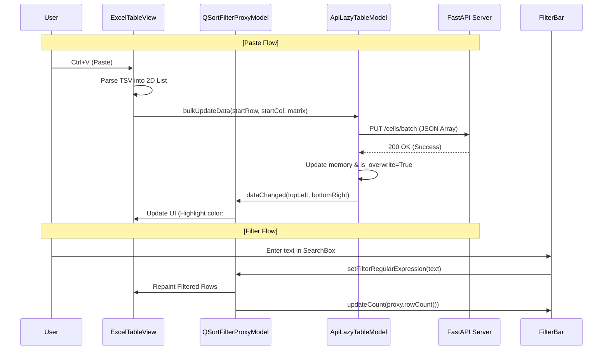

# 📝 Analysis Report: Agent C — Excel Interconnect & Core Table Logic

## 1. 개요 (Overview)
본 보고서는 `assyManager` 클라이언트의 핵심 인터랙션인 **엑셀 스타일 조작(Copy/Paste)**, **실시간 필터링**, 그리고 **UI 이벤트 흐름**에 대한 기술 분석 결과를 담고 있습니다.

---

## 2. 핵심 기능 분석

### 2.1 Excel Interaction (복사 및 붙여넣기)
`ExcelTableView` 클래스는 표준 `QTableView`를 확장하여 엑셀과의 강력한 호환성을 제공합니다.

- **Copy (`copy_selection`)**:
  - 선택된 `QModelIndex`들을 행(`row`), 열(`col`) 순서로 정렬.
  - 각 셀의 `DisplayRole` 데이터를 읽어 탭(`\t`)과 줄바꿈(`\n`)이 포함된 TSV 문자열로 변환.
  - 시스템 클립보드(`QGuiApplication.clipboard()`)에 저장.
- **Paste (`paste_selection`)**:
  - 클립보드에서 TSV 텍스트를 읽어 2차원 리스트(`rows`)로 파싱.
  - 현재 선택된 첫 번째 셀(`start_index`)을 기준으로 좌표 산출.
  - **대량 전송 최적화**: 개별 `setData`를 호출하지 않고, 소스 모델의 `bulkUpdateData`를 단 1회 호출하여 서버에 **Batch Update (PUT)** 요청을 수행.

### 2.2 Filtering Logic (실시간 검색 및 카운팅)
`FilterToolBar`와 `QSortFilterProxyModel`을 통해 원본 데이터를 보존하며 유연한 검색을 지원합니다.

- **Proxy Structure**:
  - `FilterToolBar.create_proxy(model)`: `ApiLazyTableModel`을 `QSortFilterProxyModel`로 래핑.
  - `setFilterKeyColumn(-1)`을 설정하여 모든 컬럼에 대해 정규식 검색 수행.
- **Dynamic Count**:
  - 필터 텍스트가 변경될 때마다 `proxy.rowCount()`를 호출하여 필터링된 결과 수를 계산.
  - `총 N 행` 또는 `M / N 행` 형태로 상태 레이블(`_count_label`)을 갱신.

### 2.3 UI Interaction (행 삭제 및 계보 조회)
컨텍스트 메뉴를 통한 비즈니스 로직 연동 구조입니다.

- **Row Deletion**:
  - `QMessageBox`로 사용자 확인 후, 선택된 행들의 `row_id`를 추출하여 서버에 `DELETE` 요청.
  - 삭제 후 로컬 모델의 즉각적인 반영은 WebSocket 이벤트(`row_delete`)를 수신하여 처리함(단일 진실 공급원 원칙).
- **Data Lineage**:
  - `_request_lineage()`가 호출되면 메인 윈도우의 `history_panel`에 접근하여 특정 셀의 변경 이력을 비동기로 요청.

---

## 3. 데이터 흐름도 (Data Flow)

---

## 4. 주요 클래스 및 메서드 역할 (Core Roles)

| 클래스 | 주요 메서드 | 역할 |
|---|---|---|
| **ExcelTableView** | `keyPressEvent()` | 복사/붙여넣기/삭제 단축키 가로채기 |
| | `copy_selection()` | 선택 영역을 TSV 문자열로 변환 후 시스템 클립보드 저장 |
| | `delete_selected_rows()`| 선택 행 삭제 확인 및 서버 API 요청 |
| **ApiLazyTableModel**| `bulkUpdateData()` | 파싱된 행렬 데이터를 Batch API 형식으로 서버에 비동기 위임 |
| | `rowCount()` | `total_count` 기반의 Lazy Loading 행 수 반환 |
| **FilterToolBar** | `create_proxy()` | 원본 모델을 프록시로 래핑 및 카운트 시그널 연결 |
| | `_on_text_changed()` | 입력된 검색어를 모든 활성 테이블 프록시에 즉시 전송 |

---

## 5. 세부 함수 구성 설명 (Detailed Function Descriptions)

### 5.1 ExcelTableView (client/main.py)
`QTableView`를 상속받아 사용자 인터랙션을 제어하는 핵심 클래스입니다.

- **`contextMenuEvent(event)`**
  - **역할**: 마우스 우클릭 시 컨텍스트 메뉴(계보 조회, 행 삭제)를 생성합니다.
- **`keyPressEvent(event)`**
  - **역할**: `Ctrl+C`, `Ctrl+V`, `Del` 키 입력을 감지하여 전용 핸들러로 라우팅합니다.
- **`copy_selection()`**
  - **역할**: 선택 영역을 TSV 문자열로 변환하여 클립보드에 저장합니다.
- **`paste_selection()`**
  - **역할**: 클립보드의 TSV 데이터를 파싱하여 `bulkUpdateData()`를 호출합니다.
- **`delete_selected_rows()`**
  - **역할**: 선택 행의 `row_id`를 추출하여 서버에 `DELETE` 요청을 보냅니다.

### 5.2 ApiLazyTableModel (client/models/table_model.py)
데이터 관리 및 서버 동기화를 담당하는 모델 클래스입니다.

- **`data(index, role)`**
  - **역할**: 뷰에 데이터 값을 제공하거나 수동 수정 셀에 하이라이트(#FF8C00)를 적용합니다.
- **`setData(index, value, role)`**
  - **역할**: 단일 셀 수정 시 `ApiUpdateWorker`를 통해 서버에 반영합니다.
- **`bulkUpdateData(row, col, matrix)`**
  - **역할**: 대량 수정 데이터를 `BatchApiUpdateWorker`를 통해 일괄 전송합니다.
- **`_on_websocket_broadcast(data)`**
  - **역할**: 실시간 이벤트를 수신하여 로컬 버퍼를 즉시 갱신하고 UI를 리프레시합니다.

### 5.3 FilterToolBar (client/ui/panel_filter.py)
사용자 검색 기반의 필터링을 제어합니다.

- **`create_proxy(model)`**
  - **역할**: 원본 모델을 `QSortFilterProxyModel`로 래핑합니다.
- **`_on_text_changed(text)`**
  - **역할**: 검색창 입력 시 등록된 프록시의 정규식 필터를 갱신합니다.

---
*담당 분석관: Antigravity*
