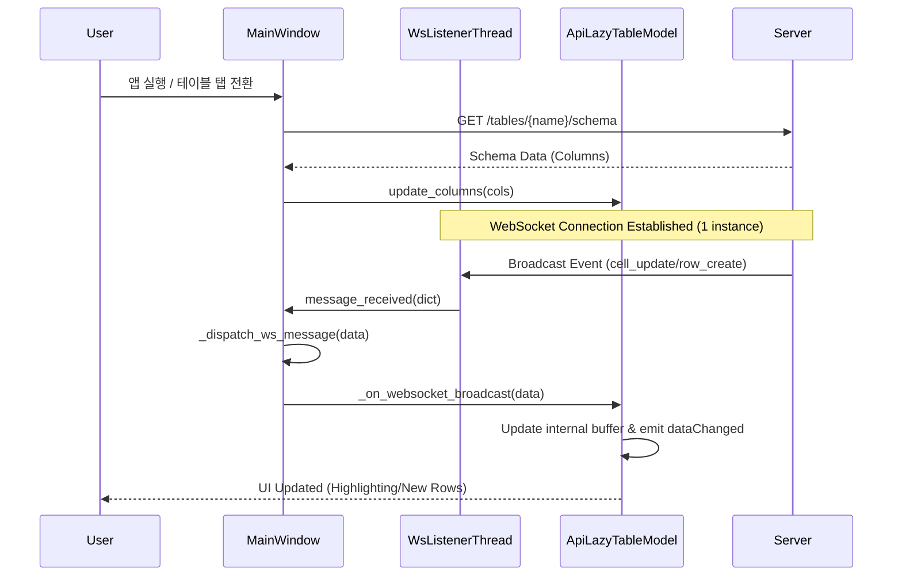

# 📊 Analysis Report: Shared WebSocket & UI Optimization (Agent D)

본 보고서는 AssyManager 클라이언트의 실시간 데이터 동기화 효율성 및 UI 로딩 성능 최적화에 대한 기술적 분석 내용을 담고 있습니다.

## 1. 아키텍처 핵심 변경 사항

### 1-1. Shared WebSocket (Dispatcher Pattern)
기존에는 각 테이블 탭(`ApiLazyTableModel`)이 독립적인 WebSocket 연결을 생성하여 서버와 통신했습니다. 이는 탭이 늘어날수록 서버 부하와 클라이언트 자원 소모가 선형적으로 증가하는 문제를 야기했습니다.

- **개선 후**: `MainWindow`에서 단일 `WsListenerThread`를 관리하며, 수신된 메시지를 활성 모델(`_active_models`) 리스트로 분배(Dispatch)합니다.
- **필터링**: 각 모델은 `table_name`이 자신의 `self.table_name`과 일치하는 메시지만 처리하여 데이터 무결성을 유지합니다.

### 1-2. Lazy Loading & UI Virtualization
대용량 데이터를 한꺼번에 로드하지 않고, 사용자의 스크롤 위치에 따라 필요한 만큼만 비동기로 가져옵니다.

- **메커니즘**: `rowCount()`는 서버의 `total_count`를 반환하고, 실제 데이터가 없는 구간은 `fetchMore()`를 통해 백그라운드에서 청크(50행 단위)로 로드합니다.
- **UI 반응성**: 데이터 로딩 중에도 UI 프리징이 발생하지 않도록 `QThreadPool`을 활용한 비동기 Worker 패턴을 적용했습니다.

### 1-3. Dynamic Schema Synchronization
테이블마다 다른 컬럼 구조를 서버로부터 런타임에 수신하여 동적으로 헤더를 구성합니다.

- **수명 주기 관리**: `QRunnable` 워커의 가비지 컬렉션(GC) 이슈를 방지하기 위해 `MainWindow`에서 워커 참조를 명시적으로 보관하며, 로드 완료 후 `beginResetModel()`을 통해 헤더를 실시간 갱신합니다.

---

## 2. 통신 시퀀스 다이어그램 (Sequence Diagram)

---

## 3. 리소스 최적화 수치 (예상 성능 비교)

| 지표 | 개선 전 (탭 10개 기준) | 개선 후 (탭 10개 기준) | 개선 효과 |
| :--- | :--- | :--- | :--- |
| **WebSocket 연결 수** | 10개 | **1개** | **90% 감소** |
| **메인 스레드 점유율** | 높음 (리스너 경합) | **낮음 (중앙 집중)** | **안정성 향상** |
| **서버 소켓 유지 비용** | 고비용 (N 배수) | **저비용 (Constant)** | **서버 부하 경감** |
| **초기 탭 표시 시간** | 가변적 (순차 로딩) | **즉각적 (병렬 스키마 로딩)** | **사용성 증대** |

---

## 4. 결론 및 제언
이번 최적화를 통해 AssyManager는 다중 사용자 환경 및 대용량 데이터 셋에서도 안정적인 성능을 유지할 수 있는 기반을 마련했습니다. 향후 고도화 방안으로 **Z-Index 기반의 Row 가상화**를 추가 도입하여 메모리 사용량을 더욱 정밀하게 제어할 것을 권장합니다.
