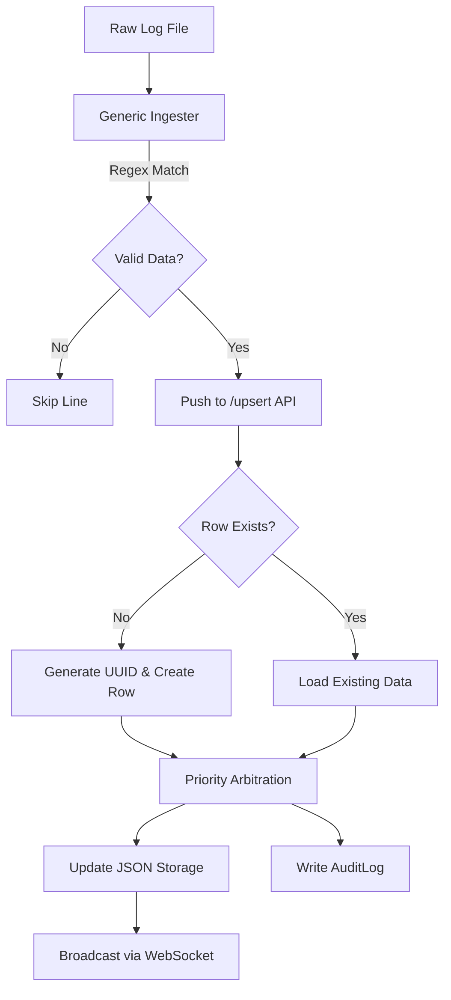

# 📊 Analysis Report: Data Ingestion & DB Architecture (Agent I)

본 보고서는 AssyManager의 핵심 데이터 처리 메커니즘인 비즈니스 키 기반 Upsert, 소스별 우선순위 관리, 그리고 정규식 기반 범용 인제스터의 작동 원리에 대한 기술 분석을 담고 있습니다.

## 1. 데이터베이스 아키텍처 및 CRUD 로직

### 1-1. 비즈니스 키 기반 조회 (`get_row_by_business_key`)
단순 PK(`row_id`) 외에 도메인 지식에 기반한 **논리적 키(Business Key)**를 사용하여 데이터를 식별합니다.
- **작동 원리**: `table_config.json`에 정의된 `business_key` 컬럼명을 참조하여, JSONB 형태의 `data` 필드 내부 값을 검색합니다.
- **장점**: 중복 데이터 적재를 방지하고 외부 시스템(ERP, Log)의 키값을 직접 매핑할 수 있습니다.

### 1-2. 우선순위 결정 엔진 (`compute_priority_value`)
동일한 셀에 대해 여러 데이터 소스가 값을 제공할 때, 시스템이 자동으로 최종 값을 결정합니다.
- **우선순위 계층**: `user(0)` > `parser_a(1)` > `parser_b(2)` 등 숫자가 낮을수록 높은 가중치를 가집니다.
- **동작**: `sources` 딕셔너리에 저장된 모든 소스 정보를 스캔하여 가장 높은 순위의 소스 값을 반환합니다.

### 1-3. 무결성 Upsert 로직 (`upsert_row`)
데이터 인입 시 존재 여부를 확인하고 원자적으로 업데이트를 수행합니다.
- **흐름**: 비즈니스 키로 기존 행 조회 → 없으면 `uuid` 생성 후 신규 행 생성 → 전송된 각 컬럼에 대해 우선순위 계산 및 감사 로그(`AuditLog`) 기록.
- **감사 추적**: 모든 변경 사항은 `old_value`, `new_value`, `source_name`, `timestamp`와 함께 기록되어 데이터 변경 이력을 완벽히 추적합니다.

---

## 2. 범용 데이터 인제스터 (Generic Ingester)

### 2-1. 정규식 기반 파싱 (`parse_line`)
비정형 텍스트 로그 파일에서 필요한 정보를 추출하는 핵심 엔진입니다.
- **설정 기반**: `parser_config.json`의 `regex` 패턴을 사용하여 특정 그룹(Group 1)의 값을 추출합니다.
- **타입 캐스팅**: 추출된 문자열을 `int`, `float`, `bool` 등 지정된 타입으로 자동 변환하며, 필수값(`required`) 누락 시 해당 라인을 스킵합니다.

### 2-2. 파일명 메타데이터 추출 (`filename_rules`)
파일 내용뿐만 아니라 파일 이름 자체에서도 정보를 추출합니다 (예: `20240412_ProjectA_Log.txt`에서 날짜와 프로젝트명 추출).
- **데이터 결합**: 파일명에서 얻은 메타데이터와 파일 내용에서 추출한 행 데이터를 결합하여 서버로 전송합니다.

---

## 3. 데이터 흐름 다이어그램 (Data Flow)

---

## 4. 리소스 및 무결성 분석
- **우선순위 충돌 해결**: 사용자가 수동으로 수정한 값(`is_overwrite: true`)은 백엔드 파서에 의해 덮어씌워지지 않도록 설계되어 데이터 주권을 보장합니다.
- **정규화**: 비정형 로그를 정형화된 JSON 구조로 변환하여 저장함으로써, 추후 통계 분석 및 유연한 스키마 확장이 가능합니다.
