# 히스토리 인메모리 캐싱 시스템 아키텍처

본 문서는 최근 구현된 **서버 측 히스토리 그룹화 및 인메모리 캐시(`AuditLogCache`)**의 함수 간 실행 관계 구조도와 핵심 변수 리스트를 명세합니다.

## 🔄 함수 실행 관계 구조도 (Execution Flow)

아래 다이어그램은 클라이언트의 조회 요청과 데이터 변경 요청 시 캐시가 어떻게 상호작용하는지 보여줍니다.

```mermaid
sequenceDiagram
    participant Client as Client (history_logic.py)
    participant API as FastAPI (main.py)
    participant CRUD as Database (crud.py)
    participant Cache as AuditLogCache (audit_cache.py)
    participant DB as SQLite/PostgreSQL

    %% 1. 조회 시퀀스 (Read Flow)
    rect rgb(30, 40, 50)
    Note over Client, DB: [A] 히스토리 패널 새로고침 (Read)
    Client->>API: GET /audit_logs/recent?limit=5000
    API->>Cache: audit_cache.load_initial(db, limit_groups=100)
    
    alt is_loaded == False (최초 1회)
        Cache->>DB: 5000건 Chunk 단위 무거운 쿼리 (while 루프)
        DB-->>Cache: raw logs
        Cache->>Cache: transaction_id 기준 100그룹핑 및 self.groups 저장
        Cache->>Cache: is_loaded = True
    end
    
    Cache-->>API: self.groups (100 Transaction Groups)
    API-->>Client: JSON List[AuditLogGroupResponse]
    Client->>Client: HistoryItemData(logs) 단순 매핑 및 UI 렌더링
    end

    %% 2. 생성/수정 시퀀스 (Create/Update Flow)
    rect rgb(40, 50, 40)
    Note over Client, DB: [B] 데이터 추가/수정 (Create / Update)
    Client->>API: POST / PUT / batch_upsert 등
    API->>CRUD: apply_batch_updates() 등
    CRUD->>CRUD: 데이터 로직 처리
    CRUD->>CRUD: create_audit_log(...) 호출
    CRUD->>DB: db.add(AuditLog)
    CRUD->>Cache: audit_cache.add_log(log_dict)
    
    Note over Cache: _lock 획득
    Cache->>Cache: 기존 그룹 맨 앞 삽입 OR 새 그룹(transaction_id) 생성
    Cache->>Cache: 최상단 5개 항목 timestamp 내림차순 재정렬 (순서 보장)
    Cache->>Cache: 100그룹 초과 시 pop()
    
    API->>DB: db.commit()
    API-->>Client: 200 OK
    end

    %% 3. 삭제 시퀀스 (Delete Flow)
    rect rgb(60, 30, 30)
    Note over Client, DB: [C] 데이터 삭제 (Delete)
    Client->>API: DELETE (단건) / POST (일괄 삭제)
    API->>CRUD: delete_row() / delete_rows_batch()
    CRUD->>DB: DELETE FROM data_rows ...
    CRUD->>CRUD: create_audit_log(row_id="_BATCH_", ...) -> Cache 추가됨
    CRUD->>Cache: audit_cache.remove_deleted_rows(row_ids)
    
    Note over Cache: _lock 획득
    Cache->>Cache: _BATCH_ 제외, 삭제된 row_ids의 과거 이력(log) 순회 제거
    Cache->>Cache: 빈 그룹(Empty Group) 제거
    
    API->>DB: db.commit()
    API-->>Client: 200 OK
    end
```

---

## 📝 관련 핵심 변수 리스트 (Variables & State)

### 1. `AuditLogCache` 내부 상태 변수 (`server/audit_cache.py`)
- **`self.groups`** (`List[Dict]`): 
  캐시의 본체입니다. `{"transaction_id": str, "logs": List[AuditLogResponse]}` 형태의 딕셔너리 100개가 담긴 리스트입니다.
- **`self.is_loaded`** (`bool`): 
  초기 DB 청크 조회가 수행되었는지 여부를 판단하는 플래그입니다. `True`가 되면 더 이상 무거운 쿼리를 수행하지 않습니다.
- **`self._lock`** (`threading.Lock`): 
  멀티스레드 환경(다중 클라이언트 요청)에서 `self.groups` 리스트에 동시다발적인 Read/Write가 발생할 때 경합 조건(Race Condition)을 막기 위한 뮤텍스입니다.

### 2. 함수 매개변수 및 로컬 변수
- **`limit_groups`** (`int`): 
  가져올 최대 트랜잭션 그룹의 수 (기본값: `100`). 클라이언트의 `limit=5000` 파라미터는 무시되며, 오직 서버에서 정의된 이 변수로 통제됩니다.
- **`chunk_size`** (`int` = 5000): 
  최초 기동 시 DB 쿼리 부하를 방지하기 위해 한 번에 가져오는 Row의 수입니다. 100그룹이 채워질 때까지 반복(Offset) 조회를 수행합니다.
- **`log_dict`** (`dict`): 
  `crud.py`에서 `AuditLog` 객체를 DB에 `add()` 한 직후, 아직 Commit 전이라 `ID` 등이 불완전한 상태일 때 이를 강제로 딕셔너리화하여 캐시에 안전하게 넘기기 위한 변수입니다. (타임스탬프가 파이썬 레벨에서 강제 주입됨)
- **`recent_subset`** (`List[Dict]`): 
  `add_log()` 수행 시, 멀티스레드 경합으로 인해 삽입 순서가 1~2밀리초 차이로 어긋나는 현상을 방지하기 위해 캐시의 최상단 5개 항목만 잘라내어 `timestamp` 기준으로 강제 정렬할 때 사용되는 임시 리스트입니다.
- **`row_ids`** (`List[str]`): 
  삭제 요청 시 들어오는 고유 식별자 배열입니다. 이 식별자와 일치하는 과거 로그들을 `self.groups` 내부에서 필터링(제거)할 때 기준값으로 사용됩니다. (단, `row_id`가 `_BATCH_`인 로그는 제거하지 않습니다.)

### 3. 클라이언트 측 변수 (`client/ui/history_logic.py`)
- **`grouped_logs`** (`List[dict]`): 
  서버의 `/audit_logs/recent` 엔드포인트에서 리턴받은 JSON 덩어리입니다. 이미 트랜잭션 단위로 묶여있습니다.
- **`grouped_results`** (`List[HistoryItemData]`): 
  UI(PyQt)에 직접 연결될 수 있도록, `grouped_logs`를 `HistoryItemData` 클래스로 단순히 래핑한 결과 리스트입니다. 과거의 복잡한 While 루프 로직이 이 단순한 For-loop 하나로 대체되었습니다.
