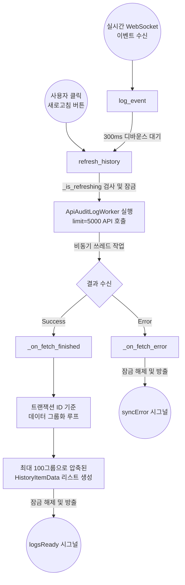

# HistoryDataManager 구조 및 상태 분석

`HistoryDataManager`는 서버로부터 **감사 로그(Audit Log)를 비동기로 가져오고, 트랜잭션 단위로 묶어(Grouping) 가공한 뒤 UI에 전달하는 데이터 파이프라인 매니저**입니다.

---

## 1. 📊 상태 변수 (State Variables)

| 변수명 | 타입 | 역할 및 특징 | 주요 관련 함수 |
|---|---|---|---|
| `_is_refreshing` | `bool` | **동시성 제어 (Lock) 플래그.** 현재 네트워크를 통해 로그를 가져오고 있는지 여부를 저장합니다. 켜져 있는 동안 중복된 새로고침 요청을 무시하여 API 호출 폭주를 막습니다. | `refresh_history`, `_on_fetch_finished`, `_on_fetch_error` |
| `_refresh_debounce_timer` | `QTimer` | **실시간 이벤트(WebSocket) 디바운스 타이머.** 셀 업데이트 시 쏟아지는 수많은 실시간 이벤트를 하나하나 반응하지 않고, 300ms 동안 모았다가 한 번만 새로고침을 실행하도록 지연시킵니다. | `__init__`, `log_event` |

---

## 2. 📡 시그널 (Signals)

| 시그널명 | 전달 데이터 | 역할 및 특징 |
|---|---|---|
| `logsReady` | `list[HistoryItemData]` | 가공이 완료된 히스토리 데이터 리스트를 UI(`PanelHistory`)로 전달합니다. |
| `syncError` | `str` | 네트워크 연결 실패나 데이터 포맷 오류 발생 시 에러 메시지를 UI로 전달합니다. |

---

## 3. ⚙️ 핵심 함수 구조도 (Function Flow)

### 🔍 주요 함수 상세 설명

#### `refresh_history(self)`
* **역할**: 실제 서버 API(`get_audit_log_recent_url`)를 호출하여 로그 데이터를 가져오는 워커(`ApiAuditLogWorker`)를 실행합니다.
* **특징**: 무조건 1번만 실행되도록 `_is_refreshing` 락을 겁니다. 트랜잭션 그룹핑 시 100개의 그룹을 온전히 채우기 위해, 넉넉하게 **5,000건**의 원본 로그를 가져옵니다.

#### `log_event(self, data: dict)`
* **역할**: 누군가 데이터를 수정하여 웹소켓에서 브로드캐스트가 날아왔을 때 호출됩니다.
* **특징**: `_refresh_debounce_timer`를 300ms로 리셋시킵니다. 즉, 0.1초 간격으로 10개의 데이터가 쏟아져 들어오면 타이머가 계속 연장되다가 모두 멈춘 뒤 0.3초 후에 **단 1번만** `refresh_history`를 실행합니다.

#### `_on_fetch_finished(self, logs)`
* **역할**: 서버에서 받아온 5,000건의 평면적(Flat)인 단일 셀 수정 로그들을 **"하나의 작업 단위(트랜잭션)"** 로 병합합니다.
* **그룹화 로직**: 
  1. `transaction_id`를 검사합니다.
  2. ID가 이전과 똑같으면 같은 그룹 배열에 계속 추가합니다. (예: "엑셀에서 100칸 복붙" = 1개의 그룹)
  3. ID가 달라지거나 없는 단건이라면 새로운 그룹 배열을 시작합니다.
  4. 묶인 그룹이 100개가 되면 루프를 조기 종료하고 `logsReady`를 통해 UI로 쏴줍니다.
