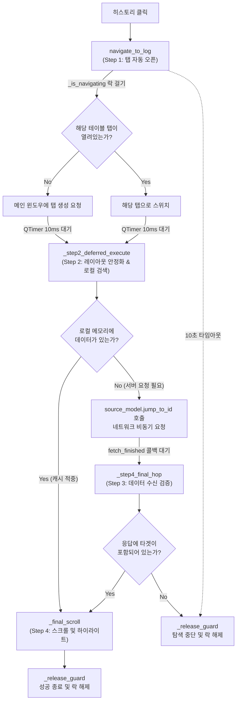

# HistoryNavigator 구조 및 상태 분석

`HistoryNavigator`는 사용자가 히스토리 패널에서 특정 내역을 클릭했을 때, **해당 테이블 탭을 열고 -> 데이터를 로드하고 -> 정확한 셀 위치로 스크롤하여 포커스를 맞추기까지의 "4단계 점프 시퀀스"를 관리하는 클래스**입니다.

---

## 1. 📊 상태 변수 (State Variables)

| 변수명 | 타입 | 역할 및 특징 | 주요 관련 함수 |
|---|---|---|---|
| `_is_navigating` | `bool` | **동시성 제어 (Lock) 플래그.** 사용자가 여러 로그를 다다닥 눌렀을 때, 이전 탐색이 끝나기 전까지 새로운 탐색이 끼어들지 못하게 막아줍니다. | `navigate_to_log`, `_release_guard`, `_step4_final_hop` |
| `_ctx` | `dict` | **탐색 컨텍스트 (메모장).** 한 번 탐색을 시작하면 1단계부터 4단계까지 비동기로 진행되는데, 각 단계로 넘어갈 때 잃어버리면 안 되는 정보들(`row_id`, `table_name`, `table_view`, 시간 등)을 담아두는 바구니입니다. | 전 함수에서 공통 사용 |
| `_guard_timer` | `QTimer` | **무한 대기 방지용 타이머 (Watchdog).** 탐색 중 네트워크 에러나 알 수 없는 이유로 무한 대기 상태에 빠질 경우, 10초가 지나면 락을 강제로 풀고 시퀀스를 종료합니다. | `navigate_to_log`, `_release_guard` |

---

## 2. 📡 시그널 (Signals)

| 시그널명 | 전달 데이터 | 역할 및 특징 |
|---|---|---|
| `statusRequested` | `str, int` | 상태바 메시지와 표시 시간(ms)을 전달. "🔍 데이터 위치를 탐색 중...", "🎯 이동 완료", "❌ 데이터를 찾을 수 없습니다" 등의 진행 상황을 UI에 피드백합니다. |

---

## 3. ⚙️ 핵심 함수 구조도 (Function Flow)

### 🔍 주요 함수 상세 설명

#### `navigate_to_log(self, data, parent_widget)`
* **역할 (Step 1)**: 탐색 시퀀스의 진입점입니다. 컨텍스트(`_ctx`)를 초기화하고 필요한 탭을 만들거나 포커스를 맞춥니다.
* **특징**: 탭을 만든 직후에 바로 데이터를 찾으려고 하면 Qt UI가 아직 뷰(View)를 채 그리지 못해 크러시가 날 수 있으므로, **`QTimer.singleShot(10)`** 을 써서 Qt 이벤트 루프에게 숨 돌릴 틈을 준 뒤 Step 2로 넘어가는 아주 정교한 테크닉이 사용되었습니다.

#### `_step2_deferred_execute(self)`
* **역할 (Step 2)**: 뷰(View)가 안정화된 후, 우리가 찾으려는 행(`row_id`)이 이미 메모리(`_row_id_map`)에 있는지 뒤져봅니다.
* **특징**: 있으면 곧바로 최종 스크롤을 시전하고, 없으면 테이블 모델의 `jump_to_id`를 호출하여 **"서버야 이 아이디 찾아줘!"** 하고 네트워크 요청을 던집니다. 이때 콜백 함수(`_step4_final_hop`)를 시그널에 미리 연결해둡니다.

#### `_step4_final_hop(self)`
* **역할 (Step 3)**: 네트워크 요청이 끝나면(`fetch_finished`) 호출됩니다.
* **특징**: 혹시 타이밍이 겹쳐서 '점프' 응답이 아니라 '일반 스크롤' 응답이 온 거라면 무시(`return`)하고 찐 점프 데이터가 올 때까지 기다리는 방어 로직이 있습니다. 데이터를 찾으면 스크롤로 넘어가고, 그래도 없으면 락을 풀고 종료합니다.

#### `_final_scroll(self, row_idx)`
* **역할 (Step 4)**: 찾은 데이터의 절대 인덱스(`row_idx`)를, 정렬/필터가 적용된 현재 화면용 인덱스(Proxy Index)로 변환한 뒤 해당 위치로 스크롤을 팍 내려줍니다. 이후 부가적으로 이력(Lineage) 패널을 갱신하는 역할까지 수행합니다.
