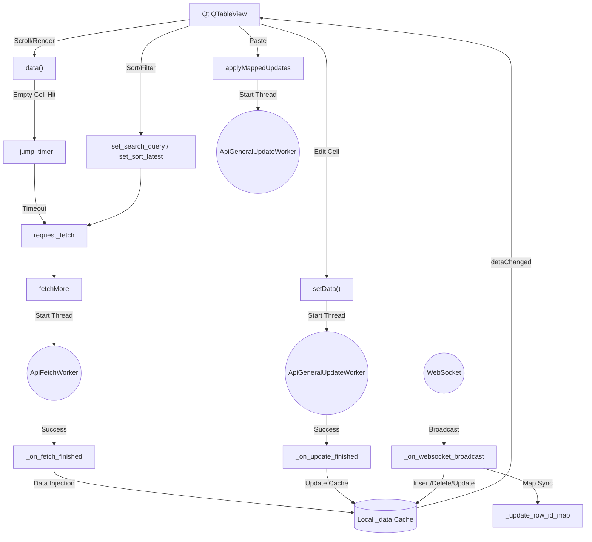
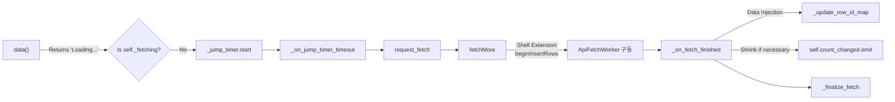
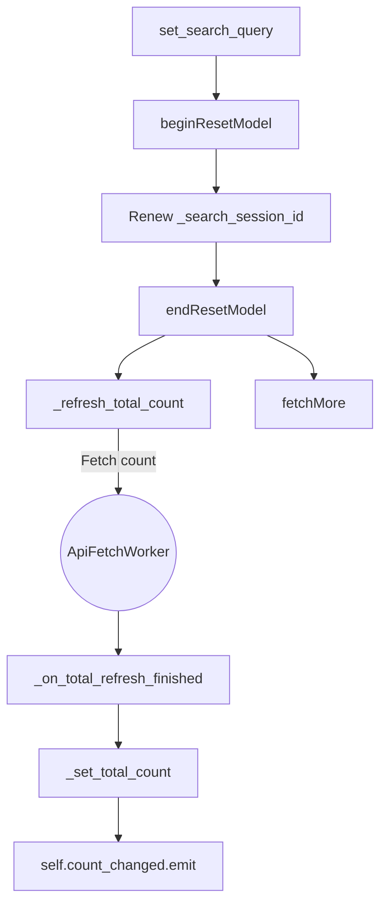
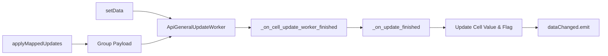
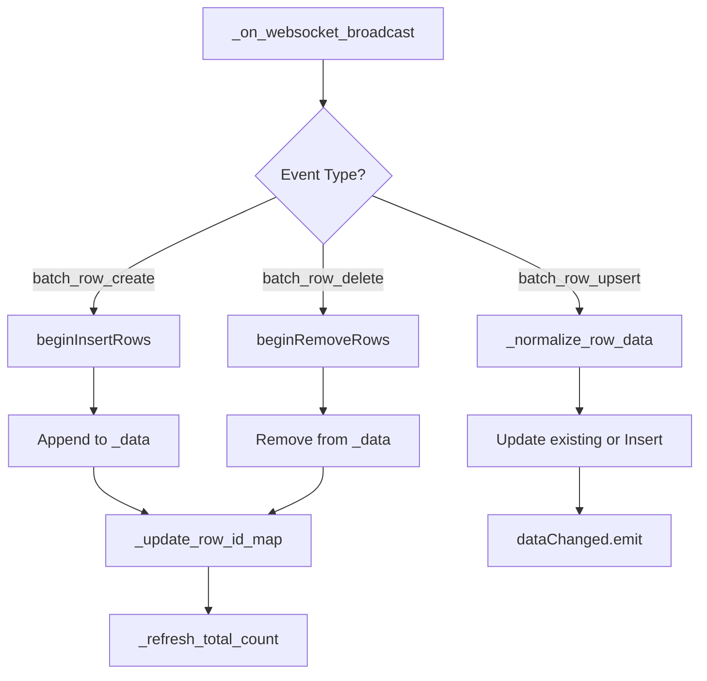

# Table Model 아키텍처 및 함수 연결 관계도 (ApiLazyTableModel)

`ApiLazyTableModel`은 클라이언트에서 서버와의 통신, 가상 스크롤, 실시간 데이터 동기화, 사용자 편집 등을 모두 관장하는 핵심 컴포넌트입니다.

## 1. 전역 시스템 아키텍처 (Global Data Flow)

전반적인 데이터 흐름과 주요 모듈 간의 상호작용은 다음과 같습니다.

---

## 2. 세부 기능별 함수 호출 관계도 (Function Call Graphs)

### A. Viewport 렌더링 및 동적 데이터 페칭 (Dynamic Fetch Pipeline)
사용자가 화면을 스크롤하여 빈 영역에 도달했을 때, 데이터가 로드되는 과정입니다.

### B. 검색, 정렬 및 메타데이터 갱신 (Search & Total Count Sync)
필터가 변경되면 기존 캐시를 비우고 서버에 전체 개수와 데이터를 재요청합니다.

### C. 데이터 수정 및 일괄 적용 (Cell Edit & Bulk Update)
사용자가 셀을 직접 수정하거나 엑셀에서 복사/붙여넣기 할 때의 처리 흐름입니다.

### D. 실시간 웹소켓 동기화 (Real-time WS Synchronization)
다른 클라이언트가 데이터를 변경했을 때 화면에 실시간으로 반영되는 구조입니다.

---

## 3. 함수 역할 사전 (Function Dictionary)

### 📌 Core Qt Methods
* `rowCount`, `columnCount`: 화면에 노출할 테이블의 크기를 반환 (`_exposed_rows` 기반).
* `headerData`: 컬럼명 반환 (내부 접근용 `UserRole` 지원).
* `data`: 특정 셀의 데이터 반환. 아직 로드되지 않은 행(`None`)이면 `FetchContext`를 예약하여 자동 페치 트리거.
* `setData`, `flags`: 셀을 수정 가능하게 만들고, 변경분을 서버로 전송.
* `canFetchMore`, `fetchMore`: Qt 뷰포트의 남은 공간을 감지하여 추가 데이터를 로드.

### 📌 Fetch Pipeline Control
* `request_fetch(ctx)`: 단일 Fetch Context를 등록하고 `fetchMore`를 수동 호출.
* `_on_jump_timer_timeout`: `data()`가 여러 번 호출될 때의 부하를 줄이기 위해 1ms Debounce 후 단일 Fetch 실행.
* `_on_fetch_finished`: 서버 데이터 수신 후 캐시에 삽입, 가짜 쉘 공간(`None`) 정리, UI 업데이트.
* `_finalize_fetch`: `_fetching` 락을 해제하고, 대기열에 쌓인 `_pending_fetch_ctx`가 있다면 이어서 실행.

### 📌 Data Sync & Meta
* `_refresh_total_count`, `_on_total_refresh_finished`, `_set_total_count`: 서버로부터 최신 행 개수를 동기화하고 화면 스크롤바 크기를 조정.
* `_normalize_row_data`: 서버 JSON 데이터를 `table_model` 전용 딕셔너리로 규격화.
* `_build_row_id_map`, `_update_row_id_map`: `row_id`로 캐시 배열(`_data`)의 인덱스를 O(1)로 찾기 위한 해시맵 갱신.
