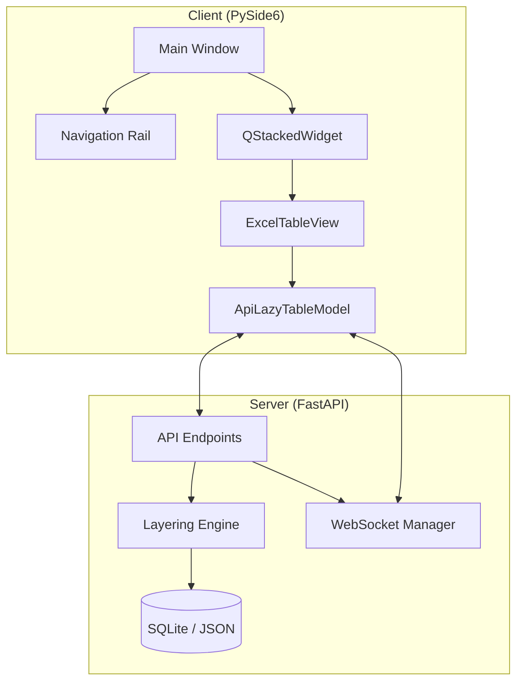

# AssyManager: 시스템 아키텍처 및 제어 로직 상세 분석

본 문서는 AssyManager Enterprise Edition의 전체 구조와 핵심 UI 제어 메커니즘을 기술합니다. 시스템의 유지보수 및 화면 전환 관련 디버깅 시 최우선 참조 가이드입니다.

---

## 🏛️ 1. 하이레벨 아키텍처 (Layered Design)

AssyManager는 **Thin Client - Thick Server** 아키텍처를 채택하여 데이터 정합성은 서버가, 시각적 반응성은 클라이언트가 책임집니다.

---

## 🧭 2. 프론트엔드 제어 흐름 (Navigation Control)

### 2.1 수직 내비게이션 및 스택 전환
- **주요 파일**: `client/main.py`, `client/ui/navigation_rail.py`
- **구동 원리**:
  1. `NavigationRail` 버튼 클릭 시 `itemSelected(int)` 시그널 발생.
  2. `MainWindow._on_nav_item_selected`에서 이를 수신.
  3. `self.container.setCurrentIndex(index)`를 통해 중앙 화면을 즉시 전환.
- **디버깅 포인트**: 화면 전환이 일어나지 않거나 잘못된 페이지가 보일 경우, `self.tabs_map`과 사이드바 버튼 인덱스의 동기화 여부를 확인하십시오.

### 2.2 동적 테이블 탭 생성 (`_init_table_tab`)
- 각 테이블은 독립적인 [View - Model - Proxy - Panel] 세트를 가집니다.
- **메모리 최적화**: 테이블 종료 시 `self.container.removeWidget(widget)` 및 `widget.deleteLater()`를 호출하여 자원을 반환합니다.

---

## 🧩 3. 컴포넌트별 주요 함수 및 역할

### 3.1 `MainWindow` (The Orchestrator)
- `_setup_ui()`: 기본 레이아웃 구성.
- `_on_tables_fetched()`: 서버로부터 전체 테이블 목록 수신 후 사이드바 버튼 동적 생성.
- `_init_table_tab(table_name)`: 특정 테이블 전용 UI 스택 초기화 및 시그널 연결.

### 3.2 `NavigationRail` (The Spine)
- `add_item(label, icon_char)`: 사이드바에 새 메뉴/테이블 추가.
- `_format_text(text)`: 긴 테이블 명칭을 위한 언더바(_) 제거 및 자동 줄바꿈 처리.
- **도메인 엔진**: 반도체/패키징 키워드(`wafer`, `strip`, `inventory` 등)를 감지하여 적절한 이모지 아이콘을 자동 할당합니다.

---

## 🛠️ 4. 디버깅 가이드 (Architecture Domain)

### Q: 새로운 탭을 추가했는데 사이드바에 나타나지 않습니다.
- **확인 1**: `server/config/table_config.json`에 테이블이 정의되어 있는지 확인하십시오 (서버 `/tables` 응답 기준).
- **확인 2**: `client/main.py`의 `_on_tables_fetched` 함수에서 에러가 발생했는지 로그를 확인하십시오.

### Q: 사이드바 아이콘에서 텍스트가 잘리거나 삐져나옵니다.
- **해결**: `navigation_rail.py`의 `SIDEBAR_WIDTH` 조정 및 `_format_text`의 줄바꿈 로직을 수정하십시오. 현재 기준 너비는 `100px` 내외로 최적화되어 있습니다.

---
*AssyManager System Architecture Guide v2.0*
