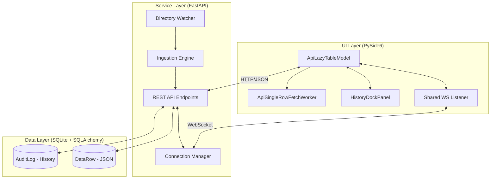

# 🏗️ assyManager 심층 아키텍처 분석 (Architectural Analysis)

본 문서는 `assyManager`의 설계 철학과 구성 요소 간의 상호작용, 그리고 데이터 무결성을 유지하기 위한 특수 패턴들을 기술합니다.

---

## 1. 계층형 서비스 아키텍처 (3-Layer Architecture)

### 1.1 Data Layer: 유연성과 무결성의 공존
- **Schema-less JSON Storage**: 각 로우의 실시간 데이터를 JSON으로 저장하여 테이블마다 다른 스키마를 유연하게 수용합니다.
- **Immutable Audit Trail**: 모든 변경 사항은 별도의 `AuditLog` 테이블에 기록되어 데이터 계보(Lineage)를 영구 보증합니다.

### 1.2 Service Layer: 지능형 중재자
- **Priority Conflict Resolution**: 동일 셀에 대해 여러 소스(수동 입력, 파서 A, 파서 B)가 경합할 때 미리 정의된 우선순위에 따라 최종 표출값을 결정합니다.
- **Universal Decorator**: `inject_system_columns`와 `to_local_str`을 통해 DB-to-API 변환 시점에 시스템 컬럼 주입과 KST 현지화를 강제합니다.

---

## 2. 핵심 설계 패턴 (Core Patterns)

### 🚀 2.1 Universal Real-Time Visibility (Float-to-top)
대규모 데이터 환경(Lazy Loading)에서 화면 밖에 있는(Off-screen) 데이터가 수정될 때 UI의 반응성을 보장하는 핵심 기술입니다.

1. **Detection**: WebSocket을 통해 현재 로컬 메모리에 없는 `row_id`의 수정 이벤트를 수신합니다.
2. **Fetch**: `ApiSingleRowFetchWorker`가 백그라운드에서 해당 행의 최신 데이터를 즉시 호출합니다.
3. **Float**: 페칭된 데이터를 모델의 최상단(`Index 0`)에 삽입하여 사용자가 즉시 인지하도록 합니다.

### 🧵 2.2 Shared WebSocket Listener
수십 개의 테이블 탭이 독립적으로 존재하더라도 단 하나의 WebSocket 연결만을 사용하여 시스템 리소스를 최적화하고 메시지 누락을 방지합니다.

- **Centralized Dispatching**: `WsListenerThread`가 메시지를 수신하면, 메인 스레드의 `MainWS`가 이를 활성화된 모든 테이블 모델에 브로드캐스트합니다.
- **GC Protection**: 비동기 워커와 스레드의 생명주기를 주 애플리케이션에 바인딩하여 가비지 컬렉션(GC)에 의한 연결 끊김을 차단합니다.

---

## 3. 데이터 흐름 및 보안 정책

### 🌍 3.1 Timezone Normalization (KST+9)
- **Ingestion**: 모든 데이터는 표준 UTC로 저장됩니다.
- **Serialization**: Pydantic Validator와 Server Decorator가 나이브 UTC 객체를 감지하여 강제로 KST로 변환 후 UI에 제공합니다.

### 🔒 3.2 System Integrity Guard
- **Read-Only Enforcement**: 시스템에 의해 관리되는 `created_at`, `updated_at`, `row_id`는 UI 편집이 원천 차단됩니다.
- **Dual Layer Defense**: 클라이언트(flags 제어)와 서버(CRUD 필터링) 양측에서 수정을 거부합니다.

---
**기록자: Antigravity (Agent D v13)**
