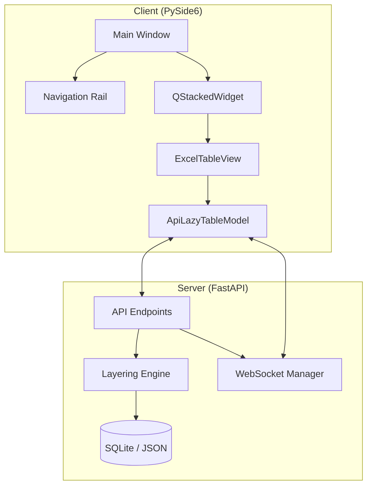

# 📖 AssyManager: The Ultimate Technical Bible (Enterprise Revision)

본 문서는 AssyManager 프로젝트의 모든 기술적 지식, 아키텍처, 비즈니스 로직, 그리고 디버깅 가이드를 집대성한 **'시스템 전수 백서'**입니다. 프로젝트의 유지보수, 확장, 그리고 문제 해결을 위한 가장 권위 있는 단일 참조 문서로 기능합니다.

---

## 📑 목차 (Table of Contents)

1. [**전체 시스템 개요 (System Overview)**](#-전체-시스템-개요-system-overview)
2. [**Ch 1. 제어 아키텍처 (Control Center)**](#-ch-1-제어-아키텍처-control-center)
3. [**Ch 2. 데이터 엔지니어링 및 동기화 (Data & Sync)**](#-ch-2-데이터-엔지니어링-및-동기화-data--sync)
4. [**Ch 3. 비즈니스 로직 및 레이어링 (Logic & Layering)**](#-ch-3-비즈니스-로직 및-레이어링-logic--layering)
5. [**Ch 4. 실시간 인제션 및 배치 (Automation)**](#-ch-4-실시간-인제션-및-배치-automation)
6. [**Ch 5. 트러블슈팅 및 디버깅 가이드 (Debugging Bible)**](#-ch-5-트러블슈팅-및-디버깅-가이드-debugging-bible)
7. [**Appx. API 및 스키마 레퍼런스 (Appendix)**](#-appx-api-및-스키마-레퍼런스-appendix)

---

## 🌐 전체 시스템 개요 (System Overview)

AssyManager는 반도체 및 패키징 산업의 복합 데이터를 관리하기 위해 설계된 실시간 데이터 플랫폼입니다. **Thin Client - Thick Server** 아키텍처를 채택하여 데이터 정합성은 서버가, 시각적 반응성은 클라이언트가 책임집니다.

- **Frontend**: PySide6 기반의 가상 로딩 테이블 및 사이드 패널 시스템.
- **Backend**: FastAPI 기반의 비동기 API 서버 및 가중치 우선순위 엔진.
- **Data**: SQLite 상의 동적 JSON 스토리지 및 전구간 Audit Log.

---

## 🧭 Ch 1. 제어 아키텍처 (Control Center)

본 챕터에서는 AssyManager Enterprise Edition의 전체 구조와 핵심 UI 제어 메커니즘을 기술합니다.

### 1.1 하이레벨 아키텍처 (Layered Design)

### 1.2 프론트엔드 제어 흐름 (Navigation Control)
- **수직 내비게이션 및 스택 전환**: `NavigationRail` 버튼 클릭 시 `itemSelected(int)` 시그널이 발생하며, `MainWindow`는 `QStackedWidget`의 인덱스를 전환하여 즉각적인 화면 구성을 변경합니다.
- **동적 테이블 탭 생성**: 각 테이블은 독립적인 [View - Model - Proxy - Panel] 세트를 가지며, 종료 시 `deleteLater()`를 통해 메모리를 최적화합니다.

---

## 🛰️ Ch 2. 데이터 엔지니어링 및 동기화 (Data & Sync)

실시간 데이터 동기화, 가상 로딩, 그리고 클라이언트 사이드 데이터 무결성 보호 메커니즘을 기술합니다.

### 2.1 실시간 동기화 (WebSocket)
- **WsListenerThread**: 백그라운드 스레드에서 단일 WebSocket 리스너를 공유하여 모든 테이블의 변경사항을 수신합니다. 
- **연결 복구**: 장애 시 3초 간격 자동 재시도 로직이 내장되어 있습니다.

### 2.2 가상 로딩 (Lazy Loading)
- **청킹 전략**: 데이터 로딩 부하를 줄이기 위해 `_chunk_size = 50` 단위로 데이터를 요청하며, 스크롤이 하단에 도달할 때만 추가 데이터를 페칭합니다.

### 2.3 데이터 무결성 가이드
- **Strict Deduplication**: `_build_row_id_map()`을 통해 캐시된 데이터와 수신된 데이터 간의 ID 중복을 전수 조사하여 행이 중복 보이는 현상을 차단합니다.
- **Merge Architecture (v1.1)**: 실시간 업데이트 시 기존 행을 삭제하지 않고, 수신된 데이터를 기존 행 객체에 병합(`update`)합니다. 이를 통해 서버에서 일부 메타데이터가 누락되더라도 클라이언트 메모리의 `created_at` 정보 등 시스템 메타데이터 유실을 원천 방지합니다.
- **Floating (v1.1 Toggle)**: 변경된 데이터는 인덱스에 관계없이 리스트 최상단으로 자동 부상(Prepend)하여 실시간 가시성을 확보합니다. 이는 사용자의 선택에 따라 토글(On/Off) 가능합니다.
- **Row ID Direct Targeting (v1.2)**: 붙여넣기 및 일괄 업데이트 시 Index가 아닌 **Row ID를 절대 좌표로 사용하여 타겟팅**합니다. 이를 통해 실시간으로 행 순서가 변하는 환경(Sorting ON)에서도 데이터가 엉뚱한 행에 입력되는 'Index Drift' 현상을 원천 차단합니다.
- **Order Preservation**: 배치 업데이트 시 데이터를 역순(`reversed`)으로 처리하여, 다수의 행이 동시에 부상하더라도 사용자가 선택했던 원래의 상하 순서가 유지되도록 보장합니다.

---

## ⚖️ Ch 3. 비즈니스 로직 및 레이어링 (Logic & Layering)

데이터 원천(Sources) 간의 우선순위 결정 및 중첩 레이어링 메커니즘을 기술합니다.

### 3.1 데이터 레이어링 엔진
- 하나의 셀에 여러 원천 데이터를 저장하는 중첩형(Nested) JSON 구조를 사용합니다.
- `compute_priority_value` 로직은 [수동 고정(Pin) > 가중치(user=100, etc) > 최신성] 순으로 표시 값을 결정합니다.

### 3.2 감사 로그 및 계보 (Audit & Lineage)
- 실제 값이 변경된 경우에만 `AuditLog`를 생성하여 DB를 최적화하며, UI에서 특정 셀의 모든 변경 역사를 추적할 수 있는 계보 조회 기능을 제공합니다.

---

## ⚡ Ch 4. 실시간 인제션 및 배치 (Automation)

대량의 자동화 로그를 지연 없이 처리하기 위한 배치 처리 엔진을 기술합니다.

### 4.1 인제션 파이프라인
- **DirectoryWatcher**: `raws/` 폴더의 신규 파일을 감시하고, 인제스터를 통해 데이터를 파싱하여 통합 API(`PUT /data/updates`)에 50개 단위 청크로 전송합니다.
- **AdvancedIngester**: 정규표현식 기반의 고속 행 추출 및 파일 헤더 메타데이터 결합 기능을 수행합니다.

### 4.2 통합 통신 및 동기화 규격
- **Unified Update API**: 데이터 변경(인제션, 수동 수정, 원천 관리)은 `/tables/{t}/data/updates` 하나로 처리되며, 개별 컬럼의 실제 변경 여부를 자동 감지합니다.
- **Unified Delete API**: 다수의 행을 안전하게 일괄 삭제하기 위해 `POST /tables/{t}/rows/batch_delete`를 사용합니다.
- **Efficient Sync (Delta Only)**: 
  - `batch_row_upsert` 이벤트는 실제 값이 변한 셀의 개수(`change_count`)를 포함합니다. 
  - 클라이언트는 이를 활용해 수만 건의 업데이트 중 실제 유의미한 변경사항만 히스토리에 요약(Summary) 표시하여 노이즈를 획기적으로 줄입니다.

---

## 🛑 Ch 5. 트러블슈팅 및 디버깅 가이드 (Debugging Bible)

시스템 장애 발생 시 즉시 대응할 수 있는 전문적인 체크리스트입니다.

- **DLL 로드 실패**: `sys.path` 조작 로직 및 Conda 라이브러리 경로를 확인하십시오.
- **WebSocket 지연**: 서버의 `active_connections` 리스트 유실 여부를 서버 로그에서 확인하십시오.
- **고스트 행 현상**: `row_id` 데이터 타입(str) 정규화 여부 및 `_normalize_row_data` 동작을 확인하십시오.
- **타임존 에러**: 서버 UTC 저장 및 클라이언트 Local 변환 로직(`astimezone()`)을 점검하십시오.

---

## 🚀 Appx. API 및 스키마 레퍼런스 (Appendix)

### 주요 API 엔드포인트
- `GET /tables`: 사용 가능한 테이블 목록 조회
- `GET /tables/{t}/data`: 페이징 기반 데이터 조회
- `PUT /tables/{t}/data/updates`: **[통합 업서트]** PK/BK 기반 단건 및 배치 업데이트
- `POST /tables/{t}/rows/batch_delete`: **[통합 삭제]** 여러 행의 일괄 물리 삭제
- `GET /tables/{t}/rows/{id}/history`: 특정 행의 변경 이력 조회
- `GET /tables/{t}/rows/{id}/cells/{col}/history`: 특정 셀의 상세 계보 조회

### 데이터베이스 스키마 (`models.DataRow`)
- `row_id`: PK (String)
- `table_name`: Index (String)
- `business_key_val`: **[High-perf Sorting]** 비즈니스 키 값 보관용 인덱스 컬럼 (String, Indexed)
- `data`: JSON Blob (Cell Data + Meta)
- `updated_at`: Server-side Timestamp

---
*AssyManager Ultimate Technical Bible v1.1 | 2026.04.17 (Data Integrity Revision)*
