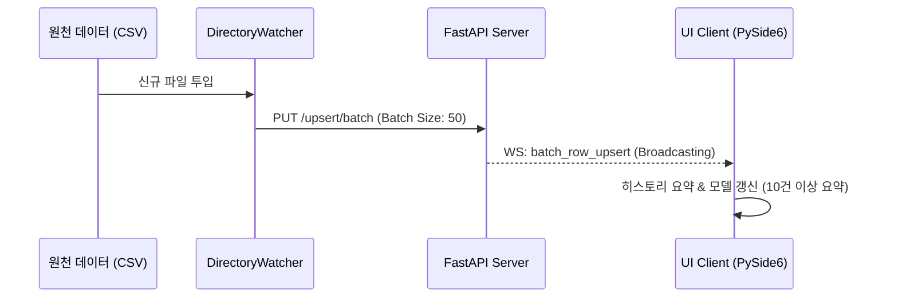

# AssyManager: 고성능 배치 인제션 기술 명세서 (Batch Ingestion Spec)

본 문서는 `assyManager` 프로젝트의 핵심 데이터 적재 및 동기화 메커니즘을 설명합니다.

---

## 🏗️ 1. 아키텍처 개요
데이터 주입은 **Batch-First** 원칙을 따르며, `DirectoryWatcher`와 `AdvancedIngester`가 협업하여 고성능 전송을 수행합니다.

### 1) 통합 파싱 엔진 (`AdvancedIngester`)
- **수행**: CSV/Excel 데이터를 정규화된 List-Dict 구조로 변환.
- **특징**: Regex 기반 및 헤더 매핑 기반 파싱 통합 지원.

### 2) 디렉토리 와처 (`DirectoryWatcher`)
- **동작**: 파일 감지 시 파서를 구동하고 결과를 **50행 단위**로 묶어 송신.
- **엔드포인트**: `PUT /tables/{table_name}/upsert/batch`

---

## 📡 2. API 명세

### 2.1 배치 업서트 (PUT)
**URL**: `/tables/{table_name}/upsert/batch`

**Payload:**
```json
{
  "items": [
    {
      "business_key_val": "UNIQUE_KEY",
      "updates": { "field1": "value1", ... },
      "source_name": "worker",
      "updated_by": "system"
    }
  ]
}
```

---

## 🌊 3. 시스템 흐름도 (System Flow)



| 구분 | 서버 API | WebSocket 이벤트 | 비고 |
| :--- | :--- | :--- | :--- |
| **인제션** | `PUT /upsert/batch` | `batch_row_upsert` | 50행 단위 배치 |
| **붙여넣기** | `PUT /cells/batch` | `batch_cell_update` | 다중 셀 배치 |
| **삭제** | `DELETE /rows/{id}` | `row_delete` | 즉시 동기화 |

---

## 💡 성능 가이드
- **요약 로깅**: 대량 업데이트(10건 초과) 시 UI 프리징 방지를 위해 요약 메시지만 표시합니다.
- **좀비 방지**: 업데이트 시 반드시 기존 `python.exe` 프로세스가 점유 중인지 확인하십시오.
