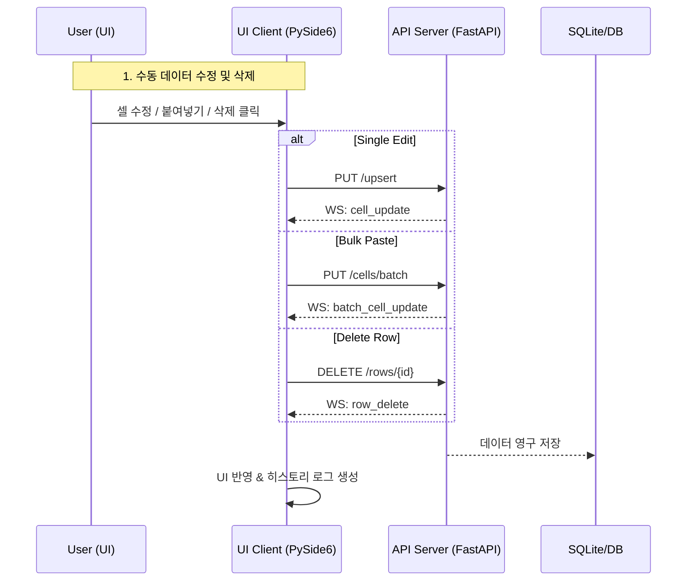

# AssyManager: 고성능 데이터 핸들링 및 인제션 기술 명세서

본 문서는 `assyManager` 프로젝트의 모든 데이터 변경 이벤트(인제션, 수동 수정, 삭제 등)에 대한 아키텍처와 API 호출 흐름을 설명합니다.

---

## 🏗️ 1. 아키텍처 개요
데이터 주입 및 수정은 **Batch-First** 및 **Real-time Sync** 원칙을 따릅니다.

1. **자동화 로직**: `DirectoryWatcher`가 파일을 감지하여 배치 호출.
2. **수동 편집**: UI에서 사용자가 직접 데이터를 수정하거나 붙여넣기 시 API 호출.
3. **실시간 전파**: 모든 DB 변경은 WebSocket을 통해 접속된 모든 클라이언트에게 즉시 브로드캐스트됩니다.

---

## 📡 2. 이벤트별 API 및 통신 명세

### 2.1 자동 인제션 (Automated Ingestion)
- **트리거**: `raws/` 폴더에 CSV 파일 투입.
- **흐름**: Watcher → `/upsert/batch` API → `batch_row_upsert` 이벤트.

### 2.2 수동 데이터 교정 (Manual Correction)
사용자가 UI에서 셀을 직접 수정하거나 대량으로 붙여넣는 시나리오입니다.

#### 시나리오 A: 단일 셀 수정
- **API**: `PUT /cells` (단건)
- **WebSocket**: `cell_update`
- **UI 반응**: 
  - 해당 셀에 주황색(Amber) 하이라이트 적용 (`is_overwrite=True`).
  - **UX**: 더블 클릭 시 기존 값 유지, 변경 없을 경우 전송 중단.

#### 시나리오 B: 다중 셀 붙여넣기 (Paste)
- **API**: `PUT /tables/{t}/cells/batch` (배치)
- **WebSocket**: `batch_cell_update`
- **UI 반응**: 변경된 모든 셀 동기화 및 10건 이상 시 로그 요약.

### 2.3 데이터 생성 및 삭제 (Lifecycle)

#### 행 추가 (Row Creation)
- **API**: `POST /tables/{t}/rows`
- **WebSocket**: `row_create`
- **UI 반응**: 최상단에 새 행 삽입 및 자동 스크롤.

#### 행 삭제 (Row Deletion)
- **API**: `DELETE /tables/{t}/rows/{id}`
- **WebSocket**: `row_delete`
- **UI 반응**: 즉각적인 행 제거 및 히스토리 기록.

---

## 🌊 3. 시스템 흐름 시각화 (User Interaction Flow)

## 📊 상세 매핑 테이블

| 이벤트 | API 엔드포인트 | WebSocket 이벤트 | 비고 |
| :--- | :--- | :--- | :--- |
| **벌크 인제션** | `PUT /upsert/batch` | `batch_row_upsert` | 파일 감시 기반 (50단위) |
| **다중 셀 수정** | `PUT /cells/batch` | `batch_cell_update` | UI 붙여넣기 기반 |
| **단건 수정** | `PUT /upsert` | `cell_update` | 개별 셀 편집기 사용 |
| **새 행 추가** | `POST /rows` | `row_create` | 신규 데이터 생성 |
| **행 삭제** | `DELETE /rows/{id}` | `row_delete` | 데이터 영구 제거 |

---

## 🏁 4. 성능 및 안정성 최적화 (Summary)
- **로그 스로틀링**: 10건 초과 데이터 변경 시 요약 로그로 전환하여 UI 가독성 확보.
- **동기화 가드**: `_is_processing_remote` 플래그를 통해 원격 동기화와 로컬 수정 간의 시그널 충돌 및 무한 루프 방지.
