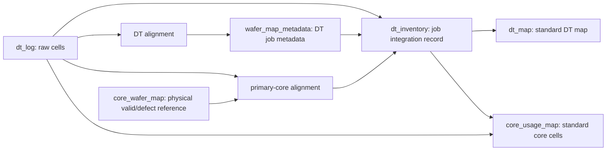

# DT/Core frame derivation chains

> **Status:** active implementation | **Owner:** Lead / Backend | **Last verified:** 2026-08-13
>
> **2026-08-13 (`4d5198c`)** — `dt_map` moved off the acquisition unit onto the physical
> one, and its removal strategy moved with it.  Four statements in this file were made
> false by that move and are corrected below with what they used to say: the authority
> table's key column, active chain 3, "Both standard-map outputs use `replace_map`", and
> the job-column derivation bullet.

## Purpose

`dt_log` is the immutable measurement source.  A DT job contains two independent
coordinate spaces: DT coordinates (`b_wx`, `b_wy`) and the coordinates of the
source core (`c_wx`, `c_wy`).  This design resolves both frames once, records
them on the job inventory, and derives replaceable standard-coordinate maps.



`dt_core_view` is only a Map Editor review namespace.  It is not part of the
production automatic chain.  The retired `frame_confirmation` history is not
an authority and must not be reintroduced.

## Authority and outputs

| Data | Authority | Key / scope | Role |
|---|---|---|---|
| `dt_log` | ingest | `dt_job` raw cells | source coordinates, bin, core identity |
| `wafer_map_metadata` | DT alignment | `target_table=dt_log`, `map_id=dt_job` | DT grid metadata only |
| `dt_inventory` | chain integration record | `dt_job` | `dt_frame`, `core_frame`, equations, enriched core list |
| `dt_map` | derived, **source-retracted** map | **`(dt_lot, dt_slot)`** — the physical unit | DT cells in standard coordinates.  `dt_job` is **not** key material: it rides on every cell as its source |
| `core_wafer_map` | physical reference | configured lot/slot map id | core valid-die and defect/bin reference |
| `core_usage_map` | derived replace-map | `core_wafer` | cells used by DT jobs after core standardization |

The standard-map target metadata is always `front`, rotation `0`, and
`grid_start_x=grid_start_y=1`.  `dt_map` retains the DT valid-die reference
selected for the source job.  `core_frame.valid_die_ref` is copied from the
selected physical `core_wafer_map` metadata, never from the map table name.

## Frame equations

An accepted frame is persisted as JSON and as six scalar fields for each
coordinate space.  The generic equation is:

```text
standard_x = IF(x_base = 'X', source_x, source_y) * x_sign + x_offset
standard_y = IF(y_base = 'X', source_x, source_y) * y_sign + y_offset
```

DT uses `dt_x_base`, `dt_x_sign`, `dt_x_offset`, `dt_y_base`, `dt_y_sign`, and
`dt_y_offset` against `b_wx`/`b_wy`.  Core uses the identically shaped
`core_*` fields against `c_wx`/`c_wy`.  A mapper writes neither frame nor its
equations if the selected alignment cannot be represented by this equation.

## Active chains

1. `dt_log_to_alignment_metadata` aligns the DT grid and writes the DT job's
   `wafer_map_metadata` record.
2. `wafer_map_metadata_to_dt_inventory` copies that DT metadata into
   `dt_inventory.dt_frame`, derives DT equations, and records the job's core
   wafer list.
3. `dt_inventory_to_standard_dt_map` writes this job's cells into the `(dt_lot,
   dt_slot)` map from raw `dt_log` cells and the DT equations, then **retracts**
   what this job still owns there and no longer derives.  (Until 2026-08-13 this
   line read "replaces the complete `dt_map` scope for the job" — the scope was
   the job, and it no longer is.)
4. `dt_log_to_primary_core_frame` selects the first configured core identity
   for the job (ordered by `dt_index`, then core identity), aligns its raw
   `c_wx`/`c_wy` cells to a configured `core_wafer_map`, and writes
   `dt_inventory.core_frame` plus core equations.
5. `dt_inventory_to_core_usage_map` replaces the usage cells for an enriched
   `core_wafer` after core equations change.  `dt_log_to_core_usage_map` also
   runs for raw ingest/enrichment changes so a later `core_wafer` attribution
   is reflected without manual reconstruction.

🔴 **The two standard-map outputs no longer share a removal strategy.**  Until
2026-08-13 this paragraph read *"Both standard-map outputs use `replace_map`"*,
and that sentence was true only while one map had one producer.

| Output | Producers per map | Removal |
|---|---|---|
| `core_usage_map` | one enriched `core_wafer` | `replace_map` — purge the map scope, rewrite it |
| `dt_map` | **several `dt_job`s converge on one wafer** | `retract` — remove only what *this* source owns and no longer derives |

Neither appends a second version of the same map.  The ingestion worker permits
the inventory-to-map dependency explicitly, while cycle validation continues to
reject unapproved chain loops.

### The retraction is a prerequisite of the key, not an enhancement

`plan_retraction` in `server/dt_map_derivation.py` was present but had **zero
production callers** before this move; it is now wired through
`chain_ingestion_worker` and `chain_replay`.  Two facts about that wiring must
survive any future edit:

- 🔴 **The retraction has to stay in front of any scoped `replace_map` on a
  converged map.**  This is not "eventually a rerun would hurt" — with
  `replace_map` scoped to `(dt_lot, dt_slot)`, the second job to derive kills the
  first job's cells on the **first** derivation, inside one transaction group
  (measured on `assy_qa`, 2026-08-13: `In Scope: 3 | Claimed: 2 | Removed: 3`).
  Both engines therefore **refuse a batch that carries `replace_map` and
  `retract` together**: the purge would run first and delete the sibling's cells
  before the narrow strategy could spare them.
- 🔴 **`dt_job` on a converged cell is last-writer-wins.**  A job whose cells were
  overwritten by a sibling can never retract its own stale contribution, because
  the retraction selects positively by the source column and that cell no longer
  names it.  The direction is conservative — it **under-deletes** — but the
  property is new with this key and did not exist while the map was per-job.
  (The development fixture's 100% overlap is degenerate and is not a production
  rate.)

Two further properties of the retraction, both structural: cells carrying a human
overwrite are never retracted (`_human_touched_row_ids`), and a plan that would
remove more than the configured fraction of what a source owns is **declined by
name** rather than reported as zero — a wrong frame or a wrong confirmation looks
exactly like "almost everything is stale".  Operator-facing detail lives in
[guide/chain_ingestion_guide](../guide/chain_ingestion_guide.md).

### A job with no confirmed lot and slot produces no map, and that is the rule working

The map is created only once `(dt_lot, dt_slot)` is filled.  This needed no new
code: `chain_key_gate` already refuses a row whose declared key columns are
unfilled, and naming `dt_lot`/`dt_slot` in `composite_key_source` covers them for
free.  On the development fixture 141 of 150 jobs produced no map — that is
rollout progress, not a defect, and the refusal names the blank column.

`composite_key_source` is `["dt_lot", "dt_slot", "dt_x", "dt_y"]` and
`coordinate_columns` stays derived rather than declared.  Three constraints force
that shape: the row key must be unique per physical die, `derive_cells`
transforms a 2-tuple only, and keeping `dt_job` in the key would prevent the
convergence that is the point of the move.  Keeping the map key inside the
composite source is also what [SCHEMA_CANON R3](./SCHEMA_CANON.md) requires.

## Core selection and evidence

One DT job can consume multiple core wafers.  The automatic core-frame rule is
intentionally configured to resolve one primary core: a job does not change
its coordinate frame during execution, so one unambiguous reference is enough
to establish the equation for all its rows.  The rule's `primary_selector`,
`reference`, `columns`, accepted `metrics`, and thresholds live in
`server/config/chain_rules.json`.

Core alignment must read raw `dt_log` while ignoring that row's DT map metadata:
the latter describes the DT frame and is not evidence about the core frame.
`source_filters` constrain the selected identity to the configured core group.
Value and occupancy matching search an unrestricted shift; TL/TR is meaningful
only to index matching and does not constrain those modes.

`core_usage_map` is deliberately keyed solely by enriched `core_wafer`.  Some
logs arrive with only lot/slot while others arrive with wafer ID; adding lot/slot
to the replace-map identity would split one physical wafer into two maps.  Rows
without `core_wafer` safely produce no usage output until enrichment supplies it.

⚠️ **The two maps spell the physical unit differently on purpose.**  `dt_map` keys
on `(dt_lot, dt_slot)` and `core_usage_map` on a single `core_wafer` — both are
"one map per physical wafer", and the difference is which spelling of that wafer
the upstream log actually carries.  Do not normalise one onto the other.

## Operational invariants

- Never edit `dt_map` or `core_usage_map` as source data; rerun their owner
  chain after changing the frame or source rows.
- A missing core physical reference or unresolved `core_wafer` is a legitimate
  no-output state, not an invitation to synthesize a frame.
- Candidate thresholds are quality gates.  Lowering a margin to force a winner
  hides ambiguity; fix the reference, coordinates, or configuration instead.
- Load table declarations before map metadata, then chain rules, then
  enrichment rules.  A process restart is required after a signature/config
  surface change so all workers share the same configuration snapshot.
- 🔴 **The job column is spelled nowhere in these mappers (2026-08-11).** Every
  table in the authority table above states its own job-column name, and the four
  mappers read each name from `table_config` (a single-column `map_key_columns`,
  or a single-column `business_key` where there is no `composite_key_source`) or
  from an explicit `chain_rules.json` override. **There is no `dt_job` default.**
  - 🔴 **For `dt_map` the derivation branch is now structurally unavailable
    (2026-08-13).**  It declares **two** `map_key_columns` and neither of them is
    the job, so `chain_bindings` cannot pick one and refuses by name.  The rule
    `dt_inventory_to_standard_dt_map` therefore **must declare
    `target_job_column`**; it does.  This is the derivation working as designed —
    a `ColumnBindingRefused` here means the declaration is missing, not that the
    resolver is broken.
  A name that can be resolved from neither is refused by name — the chain aborts
  and says which rule, which key and which table — instead of assuming a spelling
  that is only correct on the development box. Rename the column in
  `table_config.json` and all four chains follow; nothing in mapper code has to
  change. Resolver: `server/chain_bindings.py`.
- ⚠️ **One mapper spans three tables and they are three separate names.**
  `dt_standard_map_mapper` reads a `dt_inventory` payload, queries `dt_log`, and
  writes `dt_map`; `core_usage_mapper` reads its trigger (`dt_inventory` on one
  rule, `dt_log` on the other), queries `dt_log`, and reads `dt_inventory`.
  Renaming the column on only one of them is a legitimate configuration that the
  code now expresses; a single literal could not.

## Related implementation

- `server/chain_bindings.py` (job-column resolution: declaration > derivation > refusal)
- `server/dt_map_derivation.py` (the gate, the identity, the frame — and `plan_retraction` / `apply_retraction` / `normalize_retraction_request`)
- `server/mappers/dt_inventory_metadata_mapper.py`
- `server/mappers/dt_standard_map_mapper.py`
- `server/mappers/core_alignment_mapper.py`
- `server/mappers/core_usage_mapper.py`
- `server/dt_frame_transform.py`
- `docs/guide/DT_CORE_FRAME_CHAINS_GUIDE.md`
