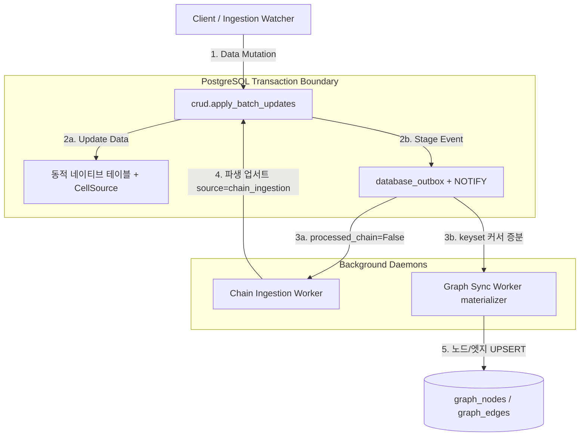

# 🔗 이벤트 기반 백엔드: Outbox · 체인 인제션 · 온톨로지 그래프 승격

> **Status:** 🟢 Living | **Last-verified:** 2026-08-06 (**[`2fc4f00`] §3.6에 「삭제 id 목록도 `BROADCAST_ITEM_LIMIT`을 받고, 잘렸다는 사실이 같이 나간다」 신설** — `batch_refresh_required`의 `deleted_row_ids_omitted`. 이 팔에는 상한이 아예 없었는데 `deleted_row_ids`가 collision-merge 껍데기 몇 건만 나르던 동안은 도달 불가능한 결함이었다. 직전 [`25de4ae`] **§2.3에 「NOTIFY는 트랜잭션당 1회」**(그 레인이 직접 기입). 직전 2026-08-04 **[`2aab7e2`] 브로드캐스트 복구 두 갈래** — ① **스윕의 재발사 집합이 넓어졌다**: `refresh_targets = affected_targets | source_tables`. 종전에는 체인 규칙에 걸리지 않는 미전달 행(규칙 비활성·트리거 아님·워처 마커)이 **아무것도 발사되지 않은 채 확정만** 찍혀 조용히 소각됐다 — 「무한 스윕을 막는 것은 발사 안 함이 아니라 확정을 찍는 것」. ② **워처의 실패한 통지가 durable 마커를 남긴다**(`record_undelivered_notification` → `EVENT_BROADCAST_RECOVERY`): 예전엔 로그하고 버려서 허브가 몇 초 깜박이는 것만으로 통지가 영구 유실됐다. **새 큐가 아니라 기존 스윕이 이미 줍는 모양**으로 쓴다. 함께: `/health` 도달성 판정이 상태코드에서 **응답 BODY**로 바뀌었다(`own_health_payload`). 직전 2026-07-30: **[F8] 통지 전송 계층 항목 신설** — loopback 통지가 사내 프록시로 나가 403으로 거절된 운영 장애의 근본 수리. `internal_event_client.internal_event_session()`(`trust_env=False`) 단일 팩토리, 발신자 자체 클라이언트 생성 금지를 테스트로 강제, 실패 줄에 `admin-gate=yes|no` 판정 + 조치 명시. 직전: 2026-07-25) | **Owner:** Backend / Sync | **Source-of-truth:** `server/database/database.py`, `chain_ingestion_worker.py`, `graph_sync_worker.py`, `graph_materializer.py`, `ontology_config.py`, **`server/internal_event_client.py`**
> 상위: [SYSTEM_OVERVIEW](../overview/SYSTEM_OVERVIEW.md) · 개괄 [backend.md](./backend.md)
> 관련: [chain_ingestion_guide](../guide/chain_ingestion_guide.md)(맵퍼 개발) · [ONTOLOGY_GRAPH_SPEC](../spec/ONTOLOGY_GRAPH_SPEC.md)(그래프 트랙 스펙)
>
> ⚠️ **검증 주의:** §2.1의 `DataRow` 리스너 서술은 JSONB blob 시대 기준입니다. 현재는 동적 네이티브 테이블([data_model.md](./data_model.md))이 주 저장소이므로, Outbox staging 대상의 정확한 범위는 코드 재확인이 필요합니다. 패턴(Transactional Outbox + LISTEN/NOTIFY)은 유효합니다.

이 문서는 `assyManager` 백엔드 서버에 구축된 **Database Outbox**, **체인 인제션(Chained Ingestion)**, 그리고 **온톨로지 그래프 승격(materializer)** 시스템의 아키텍처, 설정 방법, 신규 연동 규칙 개발 가이드를 종합적으로 제공합니다.

---

## 1. 전체 시스템 아키텍처 개요

본 시스템은 데이터베이스의 변경 사항을 100% 신뢰성 있게 추적하고 연쇄 반응을 일으키기 위해 **이벤트 기반 아키텍처(EDA)**와 **Transactional Outbox 패턴**을 채택하고 있습니다. outbox는 두 독립 소비자를 가지며, 각자 자기 진도 표식을 씁니다 — 체인 워커는 행별 `processed_chain` 플래그, graph materializer는 keyset 커서(`graph_sync_state.last_outbox_id`).



---

## 2. Database Outbox 시스템

### 2.1 자동 Staging 동작 원리
개발자가 CRUD 코드를 추가할 때 Outbox 적재 로직을 실수로 빠뜨리는 인적 오류(Human Error)를 방지하기 위해 **SQLAlchemy Event Listener**를 통해 데이터베이스 세션 레벨에서 이벤트를 가로챕니다.

* **동작 위치**: `server/database/database.py` 내 `@event.listens_for(Session, "before_flush")`
* **동작 방식**: 
  * `session.new`에 `DataRow` 감지 시 ➡️ `CREATE` 이벤트 적재.
  * `session.dirty`에 `DataRow` 감지 시 ➡️ `EDIT` 이벤트 적재.
  * `session.deleted`에 `DataRow` 감지 시 ➡️ `DELETE` 이벤트 적재.
* ⚠️ **단일 import 경로 불변식 (C-2, 2026-07-25)**: 이 리스너는 **Session 클래스 전역**에 등록되므로, `database.database` 모듈이 서로 다른 이름(`database.database` vs `server.database.database`)으로 이중 import되면 리스너가 2회 등록되어 **모든 outbox 이벤트가 ×2 중복 발행**된다(라이브 실측: 중복 그룹 1,259,076개). 모든 프로세스·스크립트는 반드시 `server/` 디렉토리를 sys.path에 두고 최상위 `database.*` 경로로만 import한다(`server.*` 접두 import 금지). 회귀 가드: `tests/test_contention_fixes.py`(리스너 1개·flush당 이벤트 1건 검증).

### 2.2 비동기 사용자 컨텍스트 전달 (`ContextVars`)
비동기 API 요청 루프와 완전히 디커플링된 ORM 이벤트 리스너 내부에서 "수정을 실행한 유저명"과 "요청의 성격(Source)" 등을 파악하기 위해 파이썬의 `ContextVars`를 사용합니다.

* **ContextVars 정의**: `server/database/context.py`
  * `request_user`: 수정자 ID (기본값: `"system"`)
  * `request_transaction_id`: 논리적 트랜잭션 그룹 ID
  * `request_source`: 호출 근원 (예: `"user"`, `"pipeline_parser"`, `"chain_ingestion"`)
* **미들웨어 바인딩**: `server/main.py` 내 `db_context_middleware`가 매 API 요청 시 헤더 또는 쿼리 파라미터를 읽어 ContextVars에 값을 격리 주입하며, 요청 종료 시 안전하게 리셋(reset)합니다.

### 2.3 Outbox 보관 정책 (7일) · 주기 Purge · 인덱스 구성 (C-3, 2026-07-25)

outbox는 이벤트당 행 버전 3개(INSERT → 처리 UPDATE → broadcast_at UPDATE)를 만드는 고쓰기 테이블이며, 무한 보존 시 DB의 최대 비중을 차지한다(실측 2.7M행/4.9GB). 다음 보관 정책이 적용된다.

* **보관 기간**: **7일** (사용자 확정). `processed_chain = true`이고 `created_at`이 7일 경과한 행을 삭제한다. **미처리(`processed_chain = false`) 행은 나이와 무관하게 절대 삭제하지 않는다.**
* **실행 주체**: 체인 워커의 저빈도 주기 태스크 — `chain_ingestion_worker.purge_expired_outbox_sync` (기동 직후 1회 + 1시간 주기, `asyncio.to_thread` 백그라운드 발사로 폴링 루프 비블로킹, 별도 짧은 세션, **1000행 청킹** + 사이클당 50청크 상한).
* **탐색 인덱스**: 부분 인덱스 `idx_outbox_purge` — `(created_at) WHERE processed_chain = true`. 보관 정책이 유지되는 정상 상태에선 테이블 자체가 약 7일치로 소규모 유지된다.
* **FAILED 격리 행 주의**: 3회 실패로 격리된(`status='FAILED'`, `processed_chain=true`) 행도 7일 후 삭제된다 → **수동 재시도(`/admin/outbox/retry-failed`)는 7일 이내에 수행**해야 한다. 관리 API 조회용 부분 인덱스: `idx_outbox_failed` — `(status, id) WHERE status = 'FAILED'`.
* **레거시 인덱스 정리**: 비부분 인덱스 4종(`ix_database_outbox_id`(pkey 중복)·`ix_database_outbox_event_uuid`(미사용)·`ix_database_outbox_status`(부분 인덱스로 대체)·`ix_database_outbox_processed_chain`(부분 인덱스로 대체), 실측 합계 429MB)은 models.py 선언에서 제거되었고 기존 운영 DB는 `scripts/setup_db_performance.py`의 멱등 DROP으로 정리한다.
* **기존 백로그 정리**: 라이브 프로세스가 건드리지 않는 수동 스크립트 `scripts/purge_outbox_backlog.py`(dry-run 지원, 청킹 DELETE) — 실행 순서는 스크립트 docstring 참조.

---

## 3. 체인 인제션 (Chained Ingestion) 가이드

한 테이블의 데이터 변화(인제션)에 대한 결과물로 다른 연관 테이블의 데이터를 연쇄적으로 자동 가공/반영하는 비동기 데몬입니다.

### 3.1 체인 규칙 설정 (`server/config/chain_rules.json`)
체인 실행 규칙을 선언적으로 JSON 파일에 선언합니다.

```json
{
  "rules": [
    {
      "name": "production_to_inventory_reservation",
      "trigger_table": "production_plan",
      "target_table": "inventory_master",
      "mapper_module": "mappers.production_mapper",
      "mapper_function": "reserve_materials_from_plan",
      "enabled": true
    }
  ]
}
```
* `trigger_table`: 이벤트를 감지할 원천 테이블.
* `target_table`: 연쇄 업데이트를 적용할 대상 테이블.
* `mapper_module`: 매퍼 모듈 경로 (패키지 구조 `mappers.모듈명`).
* `mapper_function`: 실행할 매퍼 함수의 이름.

### 3.2 커스텀 콜백 매퍼 개발 방법
새로운 연쇄 로직을 추가하고 싶다면, `server/mappers/` 패키지 하위에 파이썬 파일을 생성하고 규칙에 맞춰 함수를 정의하기만 하면 됩니다. (백엔드 코어 수정 불필요)

* **매퍼 함수 작성 규격**:
  ```python
  from sqlalchemy.orm import Session
  from typing import Dict, Any

  def reserve_materials_from_plan(db: Session, payload: Dict[str, Any]) -> Dict[str, Any]:
      """
      - db: SQLAlchemy 세션 객체 (BOM 테이블 조회 등 필요한 경우 사용)
      - payload: Outbox에서 넘어온 원천 데이터 정보 (row_id, business_key, data 등 포함)
      - 반환값: 타겟 테이블에 인제션할 GeneralUpdateBatch 규격의 딕셔너리 페이로드
      """
      row_data = payload.get("data", {})
      planned_qty = int(row_data.get("PLANNED_QTY", {}).get("value") or 0)
      
      # 원하는 비즈니스 연산 수행
      computed_value = planned_qty * 5
      
      # GeneralUpdateBatch 포맷으로 반환
      return {
          "updates": [
              {
                  "row_id": "INV_MAT_STEEL_01",
                  "updates": {
                      "RESERVED_QTY": computed_value
                  },
                  "source_name": "chain_ingestion",
                  "updated_by": "chain_worker"
              }
          ]
      }
  ```

### 3.3 매퍼 반환 페이로드 스펙 (GeneralUpdateBatch)
매퍼 함수는 최종적으로 FastAPI 백엔드의 데이터 업데이트 규격인 `GeneralUpdateBatch` 형태의 딕셔너리를 반환해야 합니다.

#### 필드 상세 스펙
1. **`updates`** (List[Dict], 필수): 업데이트를 수행할 대상 행들의 목록입니다.
   * `row_id` (String, 선택): 수정할 대상 행의 고유 ID (`row_id`)입니다.
   * `business_key_val` (Any, 선택): 대상 행의 ID를 모를 때, 테이블 설정에 정의된 비즈니스 키 값을 기준으로 대상을 매칭하여 업서트할 때 사용합니다. (`row_id`와 `business_key_val` 중 최소 하나는 명시해야 합니다.)
   * `updates` (Dict[String, Any], 필수): 업데이트할 컬럼명과 값의 쌍입니다. (예: `{"STOCK_QTY": 150}`)
   * `source_name` (String, 필수): **반드시 `"chain_ingestion"`으로 고정**해야 합니다. (순환 체인 무한 루프 감지 밸브의 핵심 차단 키입니다.)
   * `updated_by` (String, 선택): 데이터 변경 이력(Audit Log)에 남을 수정 주체명입니다. `"chain_worker"` 지정을 권장합니다.
2. **`transaction_id`** (String, 선택): 연쇄 수정 트랜잭션의 ID입니다. 생략 시 기본적으로 원천 트랜잭션 ID를 고스란히 물려받아 추적합니다.
3. **`silent`** (Boolean, 선택): `True`로 지정 시, 웹 프론트엔드로 실시간 변경사항 알림(WebSocket)을 전송하지 않고 조용히 DB만 업데이트합니다.

#### 구성 양식 예제

##### 패턴 A: row_id 기반 특정 데이터 수정
```json
{
  "updates": [
    {
      "row_id": "INV_MAT_STEEL_01",
      "updates": {
        "RESERVED_QTY": 50,
        "STATUS": "RESERVED"
      },
      "source_name": "chain_ingestion",
      "updated_by": "chain_worker"
    }
  ],
  "silent": false
}
```

##### 패턴 B: 비즈니스 키 기반 업서트 (Row ID를 모를 때)
```json
{
  "updates": [
    {
      "business_key_val": "PART-999-XYZ",
      "updates": {
        "STOCK_QTY": 120,
        "UNIT_PRICE": 5400
      },
      "source_name": "chain_ingestion",
      "updated_by": "chain_worker"
    }
  ]
}
```

### 3.4 순환 루프 방지 장치
체인 워커는 무한 재트리거(A 테이블 ➡️ B 테이블 ➡️ A 테이블...)를 막기 위해, 이벤트 페이로드 내 `source_name`이 `"chain_ingestion"`으로 설정된 건에 대해서는 **체인 규칙을 발동시키지 않고 즉시 패스**하도록 설계되어 있습니다.

### 3.5 폴링·브로드캐스트 지연 최적화 (Latency Model)
간헐적 반응 지연을 없애기 위해 다음 두 축이 적용되어 있습니다.

* **커밋 우선 → 통지 후행·인라인 (Commit-before-Broadcast, Inline Dispatch)**: 트랜잭션 그룹은 `apply_batch_updates` 성공 후 **먼저 `processed_chain=True` + `commit`** 을 확정하고, 그다음에 WebSocket 통지(`/internal/events/broadcast`)를 발사합니다. 통지는 배치의 모든 그룹 커밋 직후 **인라인 `await`** 로 발사합니다(`chain_ingestion_worker.py`, `_dispatch_broadcasts`). 한때 `asyncio.create_task` 배경 예약으로 구현했으나, 워커 이벤트 루프가 동기 DB 쿼리·매퍼에 블로킹되는 동안 태스크가 **기아(starvation)** 상태로 통지가 수 초 지연되고 스윕 오발동을 유발해 인라인으로 전환했습니다(커밋은 이미 완료된 뒤라 데이터 경로 지연 없음). 통지의 성공/실패는 처리 성공 여부·재시도 판정에 **절대 반영되지 않으며**, 재시도는 오직 실제 데이터 처리 실패로만 트리거됩니다(이미 커밋된 그룹의 재처리/중복 방지). 통지 HTTP 타임아웃은 3초입니다. **경계 계약(이벤트명 `batch_row_upsert`/`batch_row_delete`/`batch_refresh_required` 및 페이로드 형식)은 불변이며 타이밍만 커밋 이후로 이동**했습니다.
* **[`F8` 2026-07-30] 통지 전송 계층은 단일 팩토리 소유 (`server/internal_event_client.py`)**: 워커→웹서버 통지는 **같은 기계 안의 loopback 호출**이므로 **프록시 설정을 절대 참조하지 않습니다**(`internal_event_session()` → `trust_env=False`, 스레드-로컬 keep-alive). 이 규칙이 없던 동안 `requests`의 기본값(`trust_env=True`)이 `HTTP_PROXY`와 Windows 프록시 레지스트리를 읽었고, `ProxyOverride`의 `<local>`이 **점 있는 주소(`127.0.0.1`)를 우회 대상으로 치지 않아** 자기 자신에게 보내는 통지가 사내 프록시로 나가 **403**으로 거절됐습니다(운영 장애 — `/health`까지 403이라 FastAPI에 도달조차 못 했음이 증거). 발신자 3종은 세션을 직접 만들지 않으며, **만들면 테스트가 실패**합니다(동일 결함이 발신자별로 3번 재발한 이력 — 규칙이 아니라 구조로 막습니다). 통지 실패 줄에는 **누가 거절했는지**가 함께 남습니다: 게이트가 자기 거부에만 붙이는 `WWW-Authenticate: X-Admin-Token`이 있으면 `admin-gate=yes`(토큰 문제 — 401/403별 조치 명시), 없으면 `admin-gate=no`(**앞단이 거절 — 토큰을 만져도 안 고쳐진다**, 응답의 `Server`/`Via`로 상대를 지목). 데몬 3종은 기동 시 토큰 지문 + 프록시 환경 + `/health` 도달성을 함께 찍어, **첫 교정이 일어나기 전에** 이 상태를 드러냅니다. 🔴 **`/health` 판정의 판별자는 상태코드가 아니라 응답 BODY입니다** (2026-08-04) — `own_health_payload()`가 `status` 키와 **dict인 `checks`**를 함께 요구하는 지문이고, 그것이 있으면 `WARNING`(앱이 살아 있고 스스로 unhealthy라고 말한다), 없으면 `ERROR`(앞단). 종전의 「200이 아니면 앞단」 규칙은 **`/health`가 체크 실패 시 설계상 503**이라는 사실을 빼먹은 것이라 아픈 스택을 매번 프록시로 고발했습니다.
* **🔴 [`2aab7e2` 2026-08-04] 통지가 실패하면 워처도 durable 마커를 남긴다**: `run_watcher.post_event`는 예전에 실패를 **로그하고 버렸습니다** — 마커도 재시도도 없어서, 허브가 닿지 않는 동안 워처가 낸 `batch-refresh`·`file-processed`·`ingestion-state` 통지가 **영구 유실**됐습니다(행은 DB에 앉고 화면은 끝내 모릅니다). 재시작만의 이야기가 아니라 **허브가 몇 초 깜박여도** 그렇게 됩니다. 수리는 새 큐가 아니라 **이미 있는 모양**입니다(체인 워커의 미확정 브로드캐스트 스윕이 정확히 이것을 합니다 — [PRIMITIVES §6](./PRIMITIVES.md)): `internal_event_client.record_undelivered_notification()`이 `database_outbox`에 스윕이 이미 줍는 모양으로 한 줄을 씁니다 — `processed_chain=True`(데이터 트랜잭션으로 재실행되지 않음, 매퍼 없음) · `status='SUCCESS'`(**데이터는 성공했고 통지만 실패했다**) · `broadcast_at=NULL`(마커 본체) · `event_type=EVENT_BROADCAST_RECOVERY`(`"BROADCAST_RECOVERY"`, `CONTROL_EVENT_TYPES` 소속이라 체인 큐도 그래프 승격도 건너뜁니다).
  - 🔴 **페이로드는 작은 스칼라만 싣습니다** — 실패한 통지의 페이로드를 복사해 넣지 **않습니다**(`{endpoint, reason(500자 절단), marker}`뿐). batch-refresh 페이로드는 감사 로그 500건까지 실을 수 있고, 그만한 마커가 **복구 경로를 다음 인시던트로 만드는** 방법입니다(2026-07-25, 약 50 MB 페이로드).
  - **절대 raise하지 않습니다.** 마커를 못 쓰는 것이 인제션을 죽여서는 안 됩니다 — 못 쓰면 ERROR 한 줄("그 통지는 이제 복구 불가")을 남기고 `False`를 돌려줍니다.
* **지연 SLO + 구간 계측**: 체인 경로의 목표는 **"값 변경 commit → 클라이언트 통지 도착 100ms 이내"** 입니다(`task/chain_outbox_latency.md` §SLO). 검증을 위해 워커는 통지가 있는 tx당 1줄의 INFO 계측 로그를 남깁니다 — `[Latency] tx=<id> wake=Xms mapper=Yms commit=Zms notify=Wms total=Tms ok=<bool>` (wake: outbox 감지→매퍼 시작, mapper: 매퍼+`apply_batch_updates`, commit, notify: 커밋→POST 응답+스탬프, total: 감지→통지 완료). 병목 구간은 로그만으로 특정 가능합니다.
* **Outbox 폴링 부분 인덱스**: `database_outbox` 스캔 비용을 상수화하기 위해 부분/표현식 인덱스를 사용합니다(`models.py` `DatabaseOutbox.__table_args__`, 기존 운영 DB는 `scripts/setup_db_performance.py`로 멱등 반영).
  * `idx_outbox_reload` — `(event_type, id) WHERE event_type='SYSTEM_RELOAD'`: SYSTEM_RELOAD 트리거 조회용. 조회 자체도 매 루프가 아니라 최소 1초 간격으로 스로틀됩니다.
  * `idx_outbox_unprocessed` — `(processed_chain, id) WHERE processed_chain=false`: 미처리 이벤트 큐 스캔용.
  * `idx_outbox_txid` — `(payload->>'transaction_id')` 표현식 인덱스(**PostgreSQL 전용**, SQLite는 dialect 가드로 미생성): tx 보완(dynamic fetch guard) 조회용.
* **NOTIFY는 트랜잭션당 1회 (`stage_event`, 2026-08-06 P5)**: `stage_event`는 `before_flush`에서 **생성·변경·삭제된 동적 행마다** 호출되므로, 예전에는 `NOTIFY outbox_event;`를 **행마다 한 번씩** 실행했다(200셀 Push = NOTIFY 200회, 쓰기 크기에 선형). 이제 `session.info`의 래치(`_OUTBOX_NOTIFY_SENT`)로 **트랜잭션당 1회**만 발행한다.
  * **전달되는 신호는 바뀌지 않는다.** 근거는 우리 코드 해석이 아니라 **PostgreSQL 자신의 규칙**이다 — 한 트랜잭션 안에서 같은 채널·같은 페이로드로 중복 발행된 통지는 **하나로 접혀서** 전달된다. 즉 종전의 200회도 이미 1회로 전달되고 있었다. 수신부(`OutboxListener._wait_blocking`)는 `connection.notifies`를 비울 때까지 pop하고 bare `True`를 돌려주므로 1회와 200회를 **구별할 수단이 없다**. 워커가 깨어나는 데 필요한 것은 「아웃박스 행을 적재한 트랜잭션마다 **최소 1회**」이고, 그것이 래치가 보장하는 불변식이다.
  * 🔴 **래치 해제는 `SUBTRANSACTION`을 제외한다.** SQLAlchemy는 **모든 `flush()`마다** 내부 서브트랜잭션을 열고 닫으므로(`after_transaction_end`가 flush마다 발화), 그것까지 해제하면 래치가 **트랜잭션당이 아니라 flush당**으로 조용히 퇴화한다(`replace_map`은 purge를 먼저 flush한다). 판별자는 `SessionTransactionOrigin.SUBTRANSACTION`.
  * 🔴 **그 외에는 전부 해제한다 — 커밋·롤백, 그리고 SAVEPOINT(`BEGIN_NESTED`) 종료까지.** 실패 방향이 대칭이 아니다: 여분의 NOTIFY는 왕복 1회지만, 누락된 NOTIFY는 **체인 워커가 안 깨어나** 뒤의 모든 쓰기가 2초 폴백 폴링을 기다린다. SAVEPOINT는 정합성 문제이기도 하다 — PostgreSQL은 **롤백된 서브트랜잭션 안에서 발행한 NOTIFY를 폐기**하므로, 래치가 그 롤백을 넘겨 살아남으면 이후 적재된 행의 깨우기가 통째로 사라진다(`enrichment_config._isolated_execute`가 SAVEPOINT를 쓴다).
  * 그물 `server/tests/test_outbox_notify_budget.py`. ⚠️ **PostgreSQL 실기 검증은 하지 않았다** — 문장 수 계측은 dialect 이름만 postgresql로 위장한 SQLite에서 측정했고, 「접혀서 전달된다」는 위 문서 규칙에 의존한다. 그 규칙이 틀렸다면 증상은 데이터 유실이 아니라 **저지연 wake 대신 2초 폴링**이다.
* **LISTEN 전용 커넥션 상시 유지 (`OutboxListener`)**: 빈 폴링 후 `LISTEN/NOTIFY` 대기 시, 예전에는 **대기마다 새 커넥션으로 `LISTEN outbox_event`를 재등록**하여 빈 폴링과 등록 사이 발행된 NOTIFY가 유실(최대 2초 tail latency)됐습니다. 이제 워커 시작 시 LISTEN 커넥션을 **1회만** 등록·재사용합니다(`chain_ingestion_worker.py`, `OutboxListener`). LISTEN이 항상 폴링보다 선행 등록되므로 폴링 이후 NOTIFY는 소켓에 버퍼링되고, 대기 진입 직후 버퍼된 통지를 먼저 소비(drain)해 즉시 재폴링을 유도합니다. 커넥션 끊김/예외 시 안전 재생성(누수 방지), blocking `select`는 `asyncio.to_thread`로 오프로딩, SYSTEM_RELOAD 통지도 같은 채널로 공존합니다.
* **실패 head-of-line 블로킹 제거 (`process_pending_groups`)**: 예전에는 한 그룹 실패 시 `break`로 **배치 전체를 중단**(+`sleep(1)`)하여, 큐 선두(id asc)의 실패 그룹이 3회 재시도 동안 뒤의 정상 이벤트를 전부 정체시켰습니다. 이제 실패 그룹은 rollback되어 미처리(`processed_chain=False`)로 남고 `retry_count`만 증가(3회 후 격리 유지), 나머지 그룹은 계속 처리합니다. **순서 보존**을 위해 실패 그룹이 기록하려던 `target_table`을 건드리는 **후속 그룹만** 이번 배치에서 보류하고(동일 target에 대해 나중 그룹이 먼저 적용되어 순서가 뒤집히는 것을 방지), 서로 다른 target_table 그룹은 계속 처리합니다. target_table은 규칙 설정에서 결정되므로 매퍼 실행 없이 정적으로 판정(`_group_target_tables`)합니다. 실패 그룹의 매퍼 쓰기는 rollback되어 커밋되지 않으므로 유실/중복이 없습니다.

### 3.6 브로드캐스트 전달 신뢰성 (Reliability Model) — 핵심가치 #3(실시간 신뢰 전파)

커밋 우선(§3.5) 설계는 지연을 없애는 대가로 통지 신뢰성을 약화시킬 수 있어, 다음 세 축으로 **"결국엔 반드시 반영된다(eventual delivery)"** 를 보장합니다. 세 축 모두 **경계 계약(이벤트명·페이로드 형식)은 불변**이며 신규 이벤트를 추가하지 않습니다.

* **전달 확정 추적 (`broadcast_at` 컬럼) + 미전달 안전망 스윕 (F1)**: `database_outbox.broadcast_at`(nullable timestamptz)이 각 행의 브로드캐스트 전달 확정 시각을 기록합니다. 커밋 직후엔 통지할 메시지가 있는 그룹은 `NULL`(=미확정)로 두고, 통지할 것이 없는 no-op 그룹(순환 필터로 걸러진 그룹 등)은 즉시 스탬프합니다. 인라인 통지(`_dispatch_broadcasts`)가 그룹의 **모든** 메시지를 성공 전송하면 별도 짧은 세션으로 `broadcast_at`을 스탬프합니다. 웹서버 재시작·타임아웃(3s)·HTTP 실패로 통지가 유실되면 `broadcast_at`은 `NULL`로 남고, 워커 메인 루프의 주기 스윕(`sweep_undelivered_broadcasts`, 최소 5초 간격)이 이를 감지해 `batch_refresh_required`를 **재발사**하고 확정합니다. 🔴 **재발사 대상은 체인 규칙의 `target_table`만이 아닙니다** (2026-08-04 `2aab7e2`): `refresh_targets = affected_targets | source_tables` — **미전달 행이 기록된 테이블 자신**(`stale`의 `table_name`)이 항상 포함됩니다. 종전에는 규칙에 걸리지 않는 행(규칙 비활성 · 트리거 아님 · 아래 워처 마커)이 `affected_targets`를 비게 만들어 스윕이 **아무것도 발사하지 않은 채 `broadcast_at`만 찍고** 반환했고, 그래서 "복구 스윕"이 정확히 복구가 필요한 행들을 **조용히 소각**했습니다. 무한 재스윕을 막는 것은 「발사 안 함」이 아니라 **「확정을 찍는 것」**입니다 — 빈 집합 분기는 이제 `table_name`이 아예 없는 병적 행에만 남아 있습니다. 통지·스탬프가 배치 처리와 **같은 코루틴 반복 안에서 인라인 완료**되므로 스윕은 정상 경로("커밋됐지만 아직 미발사")를 구조적으로 볼 수 없고, **진짜 유실만** 잡습니다(정상 경로 오발동 제로, grace 5s 유지). `broadcast_at IS NULL` 마커는 DB에 durable하므로 **워커가 재시작돼도 복구**됩니다. 확장성: 부분 인덱스 `idx_outbox_undelivered`(`WHERE processed_chain=true AND status='SUCCESS' AND broadcast_at IS NULL`, 정상 상태에선 거의 빈 인덱스) + `LIMIT 500` + grace(`created_at < now()-5s`, in-flight 정상 통지 제외)로 **1000만행 누적에도 스윕이 O(미전달)** 로 동작합니다. **마이그레이션 필수**: 컬럼 최초 추가 시 기존 처리완료 행을 `COALESCE(processed_at, created_at)`로 **1회 청킹 백필**(`main.py` 기동 마이그레이션 + `scripts/setup_db_performance.py`)하여, 기존 outbox 전량이 미확정으로 오인되어 스윕이 대량 오발사(refresh storm)하는 것을 방지합니다.
* **그룹 간 브로드캐스트 순서 보존 (F2)**: 예전에는 성공 그룹마다 독립 배경 태스크를 발사하여 동일 `target_table`에 대한 두 그룹의 통지가 병렬 도착·역전(늦게 커밋된 최종값이 먼저 도착)될 수 있었습니다. 이제 한 배치의 모든 성공 그룹 통지를 `group_order` 순서의 `(event_ids, messages, timing)` 리스트로 모아, 배치 종료 시 **단일 순차 인라인 발사**합니다(그룹 간·그룹 내(삭제→upsert) 모두 직렬화). commit은 이미 완료된 뒤이므로 §3.5의 지연 이득은 유지됩니다.
* 🔴 **삭제 id 목록도 `BROADCAST_ITEM_LIMIT`을 받는다 — 그리고 잘렸다는 사실이 같이 나간다** (2026-08-06 `2fc4f00`). `PUT /data/updates`의 `deleted_row_ids`가 그 임계를 넘으면 `batch_row_delete` 대신 **`batch_refresh_required`에 `deleted_row_ids_omitted: <n>`을 실어** 보낸다(HTTP 응답의 `scope.delete_ids_omitted`가 같은 수를 나른다 — [backend §3](./backend.md)). 종전 이 팔에는 상한이 아예 없었는데, `deleted_row_ids`가 collision-merge 껍데기 몇 건만 나르던 동안은 **도달 불가능한 결함**이었다. 데려온 행(`adopted`)은 페이로드 크기에만 묶이므로 20,000셀 Push가 id 20,000개를 **한 JSON 프레임**에 실을 수 있고, 그것이 2026-07-25 이벤트 루프 동결을 만든 바로 그 페이로드 모양이다. ⚠️ **꼬리를 말없이 버리는 상한이었다면 이 변경이 없애려는 침묵을 한 층 위에서 다시 만드는 것**이므로, 수는 반드시 동봉된다.
  * 🔴 **[2026-08-06 `87a944e`] 그 상한의 근거가 바뀌었다 — 물려받지 말고 다시 유도하라.** `2fc4f00` 시점의 논증은 「데려온 행은 **페이로드 크기로 유계**」였다(항목 하나가 행 하나를 붙잡는다). 스코프 diff가 착지하면서 이 리스트에 **진짜 사라진 행**도 실리는데, 그쪽은 **스코프 크기로 유계**이고 스코프는 페이로드와 무관하다. **전량 소거가 옛 논증을 정면으로 깬다**: 빈 페이로드 + 명시 `scope`로 2만 셀 맵을 지우면 delete id는 2만 개인데 `results`는 **0**이다. ⚠️ **그래서 캡을 `len(results)`에 걸면 안 된다** — 상한이 필요한 바로 그 순간에 `results`가 가장 작다. 캡은 `len(deleted_row_ids)` 자신에 건다. (같은 `len(results)` 지름길은 **다른 이유로 한 번 더** 틀린다: N개 항목이 collision-merge로 한 행에 합쳐지면 `deleted_row_ids`는 N인데 `results`는 1이다.)
  * ⚠️ **`batch_row_delete`가 나르는 부류가 이제 셋이다** — 사라진 행 · 데려온 행 · collision-merge 껍데기. 「사라짐」과 「옮겨 감」을 가르는 자리는 여전히 `replace_report["adopted_row_ids"]` 하나뿐이고, 그 out-param을 받지 않는 소비자는 구별할 수 없다([backend §3](./backend.md)의 같은 경고와 **한 이야기**다 — 두 곳이 서로 다른 설명을 하게 두지 말 것).
* **tx 보완 쿼리 인덱스 정렬 (F3)**: 동적 fetch 가드의 tx 보완 쿼리를 `type_coerce(payload, JSONB)['transaction_id'].astext`(→ `payload ->> 'transaction_id'`로 컴파일)로 정렬하여 표현식 인덱스 `idx_outbox_txid`(`(payload->>'transaction_id')`)를 **실제로 사용**하게 했습니다. (기존 `.as_string()`은 `CAST(payload -> 'transaction_id' AS VARCHAR)`로 컴파일되어 인덱스식과 불일치했습니다. 인덱스·마이그레이션 변경 없음.)

> **⚠️ 순서 보존의 한계 (F4/F5) — 알려진 사각지대**
> * **순서 보존은 "동일 `target_table`" 정적 추정 기반**입니다(§3.5 HOL 가드 + §3.6 F2). 즉 **매퍼가 자신의 `target_table`이 아닌 다른 테이블을 read하여 계산하는 교차 테이블 의존(cross-table read dependency)** 은 이 가드가 보호하지 못합니다. 선행 그룹이 테이블 X를 쓰고 후행 그룹의 매퍼가 X를 읽어 테이블 Y를 쓰는 경우, 두 그룹의 `target_table`(Y vs X)이 달라 보류 대상이 아니므로 **순서가 보장되지 않습니다**. 이런 의존이 있는 규칙은 현재 선언적으로 표현할 수 없으며, 필요 시 규칙 스키마에 `depends_on`(교차 테이블 선행 조건) 도입을 검토해야 합니다.
> * **격리(3회 실패)의 순서 함의 (F5)**: 한 그룹이 3회 재시도 후 격리(`RETRYING` 유지)되면, **그 그룹이 기록하려던 값이 적용되지 않은 상태**에서 후속 그룹이 처리를 이어갑니다. 후속 그룹의 매퍼가 격리된 선행 그룹의 산출물에 (교차 테이블로) 의존하면 "적용된 적 없는 선행" 위에서 계산하게 됩니다. HOL 가드는 동일 `target_table` 후속만 보류하므로, 교차 테이블 의존이 없는 한 데이터 유실/중복은 없으나(실패 그룹 쓰기는 rollback), 교차 의존이 있으면 후속 산출물이 부정확할 수 있습니다.

---

## 4. 온톨로지 그래프 승격 (Graph Materializer)

인제션·교정되는 모든 로우를 매핑 config에 따라 **PG 엣지 스토어(`graph_nodes`/`graph_edges`)의 속성 그래프로 자동 승격**하는 데몬입니다(`graph_sync_worker.py` + `graph_materializer.py`, :8090). 설계 배경·킬러 쿼리·로드맵은 [ONTOLOGY_GRAPH_SPEC](../spec/ONTOLOGY_GRAPH_SPEC.md)이 정본이며, 여기서는 소비 흐름만 요약합니다.

### 4.1 소비 흐름 (outbox 증분 → 자동 승격)

1. **커서**: `graph_sync_state.last_outbox_id`(단일 행)가 소비 진도. 체인 워커의 `processed_chain`과 독립 — 같은 outbox를 두 소비자가 각자 진도로 읽는다. 최초 기동 시 커서는 현재 최대 id로 초기화(과거 백로그는 전체 재동기화가 담당).
2. **루프**(`run_graph_materializer_loop`): LISTEN/NOTIFY 대기 → 커서 이후 이벤트를 배치로 읽어 `materialize_events` — 1000행 청킹, 배치 본체는 `asyncio.to_thread`로 격리(이벤트 루프 기아 방지, /sync HTTP 서빙 유지). `[GraphLatency] batch= rows= nodes= edges= lag_ms=` 계측(SLO 10s, 라이브 실측 lag 162ms).
3. **identity 조립**(`compose_identity`): 복합 식별 컬럼을 `"|"` 조인 + 이스케이프(`\`→`\\`, `|`→`\|`) + float 정수 안정화(`3.0`≡`"3"`). `(label, identity_key)` UNIQUE MERGE.
4. **엣지 provenance = 레이어링의 그래프 확장**: 엣지 `source_name`은 이벤트 발화자가 아니라 **식별 컬럼들의 CellSource winner 중 최저 서열(보수적)**(`attach_col_sources` — 증분·재동기화 공용 단일 지점, 서열은 `crud.resolve_priority_map` 단일 원천). 식별 컬럼 전부가 user winner일 때만 user 날인.
5. **재교정 retarget**: 같은 원본 로우(`source_row_ref`)가 과거에 주장했으나 이번 산출에 없는 `(from_node, type)` 엣지는 삭제 후 UPSERT(`_retarget_stale_edges`) — 모순 엣지 병존 제거. 교정 값을 비우면 잔존 엣지도 정리(H2-b).
6. **핫리로드(이슈 #8)**: 배치 내 `SYSTEM_RELOAD` 감지 시 매핑·테이블 config 리로드 — 신규 테이블·매핑이 재기동 없이 그래프까지 이어진다. **행 DELETE 이벤트는 스킵**(그래프 정리 정책은 스펙 §8 미결).

### 4.2 매핑 config v2 (`server/config/ontology_mapping.json`)

로더/검증은 `ontology_config.py`. `description`은 **필수**(LLM이 스키마를 읽고 질의를 구성하는 근거)이며, enrichment rule의 `decision_key → target`은 `RESOLVED_AS(source_override="user")` 엣지 매핑으로 **자동 승격**됩니다(`synthesize_enrichment_mappings`).

```jsonc
{
  "bonding_log": {
    "node": { "label": "Chip", "identity": "log_id", "props": ["bx","by"] },
    "description": "본딩 설비가 chip 1개를 base에 실장한 이벤트",
    "edges": [
      { "type": "BONDED_FROM", "target_label": "Wafer",
        "target_identity_from": ["core_lot","core_slot"],
        "description": "이 chip이 잘려 나온 원판 wafer" }
    ]
  }
}
```

### 4.3 수동 동기화 = 백필/복구 도구

`POST /api/graph/sync {"table_name": "..." | "all"}`(웹서버가 :8090으로 프록시)은 이제 주 경로가 아니라 **백필·복구 도구**입니다 — 키셋 청킹 재동기화(C-7 무제한 로드 해소) + 테이블당 `batch_refresh_required` 1건, 멱등. 운영 수칙: outbox 7일 purge보다 materializer가 오래 정지했다면 증분이 유실되므로 `"all"` 재동기화로 복구합니다.

### 4.4 Neo4j 병행 (G3)

Neo4j 반영 경로는 청크 훅 인터페이스(`_neo4j_chunk_hook_factory`)로 보존되어 있습니다(`NEO4J_ENABLED` 시). PG 엣지 스토어가 본체이고 Neo4j는 G3의 병행 타깃입니다.

### 4.5 조회 계층

읽기는 워커가 아니라 **웹서버(main.py)의 read-only API**(`/graph/stats`·`neighbors`·`nodes/search`·`trace`·`mapping-summary` — **목록 옆에 수를 적지 않는다**)이 담당합니다 — [backend.md §2](./backend.md) 참조. 클라이언트는 `graph.html`(서브그래프 뷰어)·`trace.html`(추적 리포트)이 소비합니다([frontend.md §6](./frontend.md)).

---

## 5. 모니터링 및 문제 해결 (Troubleshooting)

Outbox 테이블(`database_outbox`)과 `graph_sync_state`를 조회하여 동기화 상태를 모니터링할 수 있습니다.

* **그래프 소비 진도**: `graph_sync_state.last_outbox_id` vs `max(database_outbox.id)` — 격차가 크면 materializer 정지/지연([GraphLatency] 로그 확인). (구 `status` 필드의 PENDING/DISPATCHED 의미는 레거시 그래프 워커 시대의 것으로, materializer는 사용하지 않습니다.)
* **체인 처리 필드 (`processed_chain`)**:
  * `False`: 체인 인제션 워커가 아직 검토하지 않은 상태.
  * `True`: 체인 인제션 규칙 매칭 및 연쇄 실행이 완결된 상태.
* **장애 처리 흐름**:
  * 특정 이벤트 처리 중 오류 발생 시, 2초 간격 지수 백오프 기반으로 **최대 3회 재시도**를 수행합니다.
  * 3회를 초과해 실패한 레코드는 `FAILED` 상태로 변환되며 경고 로그가 남습니다. 문제 원인(예: 스키마 제약조건 위반, 잘못된 매퍼 리턴 스키마 등)을 해결한 뒤, 해당 행의 `status = 'PENDING'`, `retry_count = 0`으로 수동 업데이트하여 재실행할 수 있습니다.
