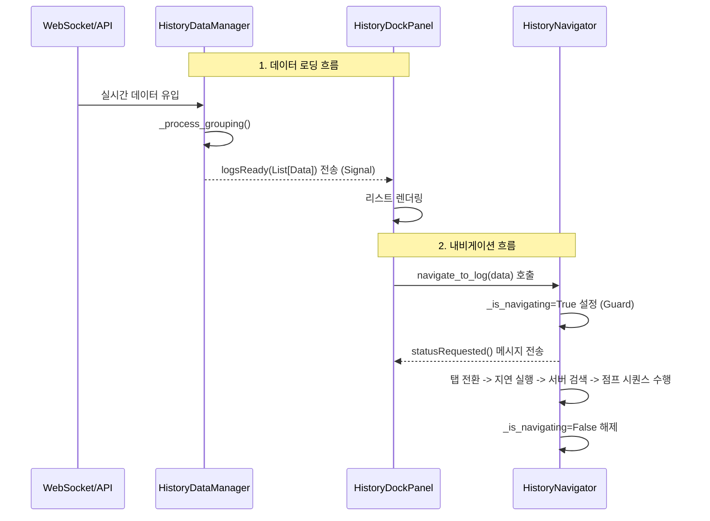

# 기술 이력: History 패널 대규모 리포맷팅 및 관심사 분리(SoC)

## 1. 문제 현상 (Phenomenon)
- `panel_history.py` 파일이 550라인을 상쇄하며 단일 클래스 내에 UI 렌더링, API 데이터 가공, 복잡한 내비게이션 시퀀스가 혼재되어 분석 및 유지보수가 극도로 어려워짐.
- 비동기 콜백 관리 로직이 UI 클래스에 강결합되어 아키텍처적 유연성이 떨어짐.

## 2. 기술적 원인 분석 (Root Cause)
- **Monolithic Class**: `HistoryDockPanel`이 데이터 관리자, 내비게이션 엔진, UI 뷰 역할을 모두 수행하는 거대 객체(God Object)가 됨.
- **Complexity Sprawl**: 4단계 위치 탐색(Jump) 로직이 메서드 간 체인으로 얽혀 있어 상태 추적이 어려움.

## 3. 해결 방안 및 코드 변경 (Solution & Code Changes)

### A. 전용 로직 파일 생성 (`history_logic.py`)
- **HistoryItemData**: 감사 로그 데이터를 객체화하여 UI 독립적인 가공 로직(색상, 텍스트)을 내재화함.
- **HistoryDataManager**: `QThreadPool`을 이용한 데이터 페칭 및 트랜잭션 그룹화 로직을 UI와 분리. 시그널(`logsReady`)을 통해 통신.
- **HistoryNavigator**: 탭 전환부터 뷰포트 스크롤까지의 4단계 시퀀스를 상태 기계(State Machine) 방식으로 캡슐화하여 관리.

### B. UI 클래스 슬림화 (`panel_history.py`)
- 기존 560라인의 코드를 **160라인**으로 대폭 축소.
- 로직 담당 객체(`_data_manager`, `_navigator`)를 멤버로 보유하고 시그널을 연결하는 중계 역할로 변경.
- 더블 클릭을 통한 상세 내역 확장(Summary Expand) 로직만 UI 특화 기능으로 유지.

## 4. 클래스 간 상호작용 구조 (Interaction Map)

## 5. 특이사항 및 조치 (Special Notes)
- **PySide6 호환성**: `QDockWidget.AllDockWidgetFeatures` 속성 부재로 인한 AttributeError 발생 시, 개별 플래그(`Closable | Movable | Floatable`)의 비트 연산 조합으로 대체하여 해결함.
- **가독성 향상**: 기존 560라인의 Monolithic 코드를 160라인(UI) + 200라인(Logic)으로 분산하여 유지보수 포인트 명확화.

## 6. 검증 결과 (Validation)
- 리모트 감사 로그 수신 및 실시간 WebSocket 이벤트 반영 정상 작동 확인.
- 4단계 위치 탐색(Navigator) 시퀀스가 탭 전환 및 서버 검색을 포함하여 안정적으로 동작함.
- `HistoryItemData` 활용으로 코드 가독성이 비약적으로 향상됨.

