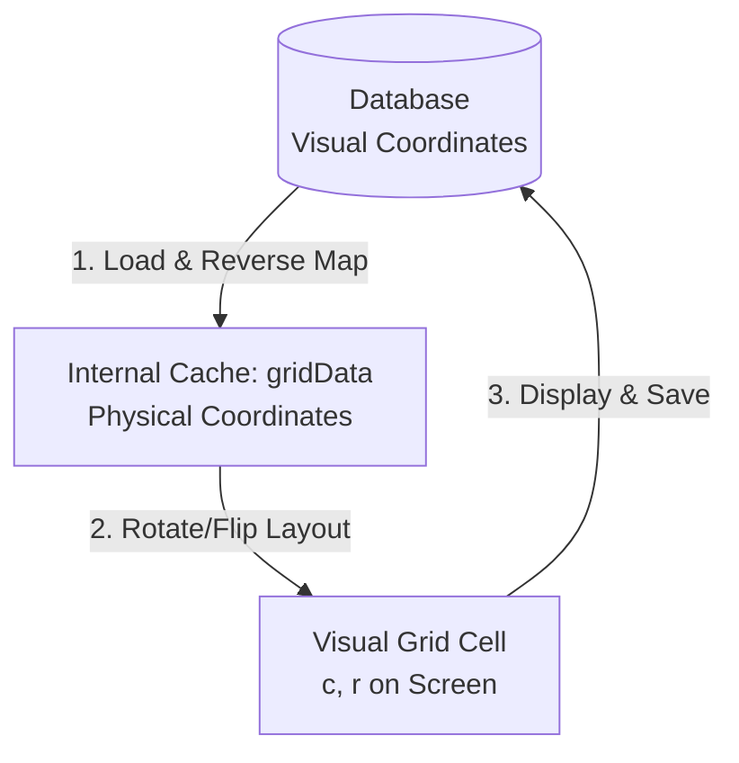

# 🗺️ Wafer Map Coordinate System Philosophy (`philosophy.md`)

> **Status:** 🟢 Living | **Last-verified:** 2026-07-30 (**§2.3의 결론 정정 — `box`가 언제나 원이라는 전제가 깨졌다** (`da8f390`). `getWaferBoundingBox`는 유효 다이 근거가 `ref`면 **마스크의 최소 사각형**을 원점 상자로 쓰므로, 저장 좌표는 치수 변경뿐 아니라 **근거 변경에도** 민감하다. 그래서 이 절에서 나오는 결론이 하루에 두 번 뒤집혔다 — F6 「참조 크기로 열고 재배치」 → F8 「아무것도 채택 말고 **칸을 그대로 두라**」 → 지금 「**칸을 그대로 두는 것으로는 좌표가 보존되지 않는다**, 각 셀을 자기 저장 좌표가 가리키는 칸에 다시 앉힌다」. 「프레임 채택 거절 규율의 근거」라는 종전 문장은 **채택 자체가 폐기**(`61440e6`+`94b9baa`)돼 가리킬 대상이 없다. 직전 **§2.2의 "완전히 고정된" 주장 정정 + §2.3 신설** — `client2/src/map_editor.js` 실측: `getVisualCoords`의 식은 `xv = colVisual − box.minC + startX`이고 `box`는 `getWaferBoundingBox(rotation, side)`가 낸다. 즉 **방향은 화면에 고정되지만 원점(anchor)은 아니다.** 함께 원점 마커 판정(`isOriginCell` = `visual.x === 0 && visual.y === 0`, 폴백 `startX/startY`)을 대조 — 마커는 **다이가 아니라 화면 자리**를 표시한다. 배지 신설 — 이 파일에는 헤더 배지가 없었다) | **Owner:** UI/Map | **Source-of-truth:** `client2/src/map_editor.js`(`getPhysicalCoords`/`getVisualCoords`/`getWaferBoundingBox`)
> 상위: [map_editor/README](./README.md) · 개발자용 계약은 [spec/MAP_EDITOR_SPEC §1](../spec/MAP_EDITOR_SPEC.md)(기하 변환 수식 = **저장 좌표 규약의 정본**)

본 문서는 `assyManager` 프로젝트에 구축된 격자 맵 에디터(Grid Map Editor)의 **물리적 공간 표현(Physical Layout)**과 **화면 기준 좌표 매핑(Screen Visual Coordinates)** 설계 철학을 기록합니다. 

이 설계 방식은 웨이퍼 기판의 공간적 방향성과 공정 도메인 상의 데이터 관리 기준을 조화롭게 일치시키기 위해 고안되었습니다.

---

## 1. 핵심 철학 (Core Principles)

### 1) 눈에 보이는 대로 저장한다 (WYSIWYG: What You See Is What You Get)
* **원칙**: 회전 상태(0°, 90°, 180°, 270°) 및 앞/뒷면(FRONT, BACK) 상태에 관계없이, 사용자가 모니터 화면에서 보고 있는 격자 눈금의 X, Y 좌표는 **항상 화면 기준 좌표계**로 저장 및 기입됩니다.
* **이유**:
  * 설비 분석자 및 에디터 사용자는 물리적인 칩 내부의 기하학적 각도 회전과 별개로, **현재 눈에 보이는 좌표(예: 화면상의 좌상단이 0,0인지 아닌지)**를 보고 의사결정을 합니다.
  * 회전각 변경 시 X 좌표가 역방향으로 진행되거나 거꾸로 저장된다면, 사용자가 화면 눈금을 보고 인지한 값과 데이터베이스에 들어간 실제 값 사이에 불일치가 생겨 공정 사고(Wrong Coordinates)를 초래할 수 있습니다.
  * 따라서 화면 상에서 **가로는 항상 왼쪽에서 오른쪽으로 증가**하고, **세로는 위에서 아래(Y반전 시 아래에서 위)로 증가**하는 화면 직교 좌표계를 엄격하게 준수합니다.

### 2) 기판의 물리적 정렬 상태(Physical Alignment)는 유지되어 회전한다
* **원칙**: 맵을 90도 회전하거나 뒷면(BACK)으로 뒤집으면, 그려진 칩들의 상대적 배치 형태(Layout)는 3차원 기판의 공간적 변화 법칙에 따라 완벽하게 화면 상에서 회전 및 좌우/상하 대칭 미러링됩니다.
* **이유**:
  * Notch(노치)의 위치가 바뀔 때, 또는 웨이퍼를 뒤집었을 때 칩들의 형태적 분포(Pattern)도 당연히 그 각도만큼 따라서 회전해야 직관적인 기판 형상 분석이 가능합니다.
  * 만약 맵 회전 버튼을 눌렀는데 노치 아이콘만 움직이고 칩들의 패턴이 회전하지 않는다면 그것은 회전 맵이 아닙니다.

---

## 2. 좌표 관리의 이원화 구조 (Dual Coordinate Mapping)

위 두 가지 상충되는 듯한 요구사항(보이는 대로 저장하는 시각 좌표 vs 실제 형상이 회전하는 물리 좌표)을 완벽하게 만족시키기 위해 **이원화된 좌표 매핑 구조**를 도입했습니다.



### 2.1 물리 좌표계 (Physical Coordinates)
* **정의**: 기판(Wafer)의 물리적 기준면에 고정된 절대 좌표계입니다. (Rotation 0, Side FRONT 상태의 좌표와 1:1 대응)
* **용도**: 자바스크립트 내부 캐시인 `gridData`의 Key(`"${xp}_${yp}"`)로 활용됩니다.
* **변환 함수**: `getPhysicalCoords(c, r, cols, rows, rotation, side)`
  * 화면 상의 셀 인덱스 `(c, r)`를 현재 회전각과 앞뒷면 상태를 반영하여 Wafer 기준의 고정 물리 위치 `(xp, yp)`로 변환합니다.
  * 이로 인해 `currentRotation` 등이 변경되어 캔버스가 다시 그려질 때(`renderGridCanvas`), 각 셀이 캔버스의 다른 위치(`c_new, r_new`)로 움직이더라도 고유한 물리 데이터 키를 그대로 들고 이동하므로 **화면상에서 칩 패턴이 자연스럽게 회전**하게 됩니다.

### 2.2 시각 좌표계 (Visual Coordinates)
* **정의**: **증가 방향이 화면에 고정된** 직교 좌표계입니다 — 가로는 항상 화면 왼쪽에서 오른쪽으로, 세로는 `invertY` 설정 방향으로 1씩 단조 증가합니다(§1의 1번 원칙).
  > ⚠️ **"뷰포트에 완전히 고정"은 아닙니다.** 고정된 것은 **방향**이고 **원점(anchor)은 고정되지 않습니다** — 자세한 경계는 **아래 §2.3**에 있습니다. 이 문단의 종전 서술("브라우저 화면의 뷰포트에 완전히 고정된")은 코드와 대조되지 않는 주장이었습니다.
* **용도**: 셀 내부의 텍스트 라벨 표시, 마우스 호버 가이드 문자열 표시, 그리고 **최종 데이터베이스 적재 페이로드**의 X, Y 좌표로 기입됩니다.
* **변환 함수**: `getVisualCoords(c, r, cols, rows, rotation, side, invertY, startX, startY)`
  * 기판의 회전과 뒤집힘으로 인해 발생하는 CSS 2D 반사(`flipped`, `flipped-vertical`)를 수학적으로 역계산하여, **화면 상에 비춰지는 순수한 공간적 컬럼/로우 위치**로 보정합니다.
  * 따라서 BACK(뒷면)이나 90°/270° 상태여도, 화면 기준의 X 좌표는 항상 왼쪽에서 오른쪽으로 1씩 단조 증가하고 Y 좌표 역시 반전 방향에 맞추어 완벽하게 갱신됩니다.

### 2.3 시각 좌표계가 화면에 고정하는 것과 하지 않는 것 (2026-07-30 정정)

이 절이 있는 이유는 §2.2의 종전 한 줄("뷰포트에 **완전히** 고정된")이 **코드보다 강한 주장**이었기 때문입니다. 무엇이 참이고 무엇이 참이 아닌지를 나눠 적습니다 — 그 구분이 저장 좌표의 안전성 논증에 직접 쓰입니다.

**① 고정되는 것 — 축의 방향.** §1의 1번 원칙 그대로입니다. 회전·면·`invertY`가 어떻든 `x`는 화면 왼쪽→오른쪽으로, `y`는 선택된 방향으로 단조 증가합니다. 이것은 변환식의 부호가 보장하며 예외가 없습니다.

**② 고정되지 않는 것 — 원점(anchor).** 변환식은

```
xv = colVisual − box.minC + startX
box = getWaferBoundingBox(rotation, side)
```

> 🟠 위 식은 `getVisualCoords`(`client2/src/map_editor.js:1892-1905`) **실측 그대로**입니다 — X에 **미러 분기가 없고** Y는 `invertY`만 봅니다. [MAP_EDITOR_SPEC §1](../spec/MAP_EDITOR_SPEC.md)은 back 면의 미러 갈래(`box.maxC − c + startX`)와 `isYMirrored` 행을 문서화하고 있으나 **코드에 대응물이 없습니다**(총괄 판단 대기 — 그 절의 🟠 블록 참조). 아래 결론(**원점은 `box`의 함수이고 `box`는 회전·면·치수의 함수**)은 어느 쪽으로 판정되어도 유지됩니다.

이고, `box`는 **회전·면의 함수**입니다. 즉 `xv = 0`이 화면의 몇 번째 칸인지는 `box.minC`가 정하며, 그 값은 회전에 따라 달라질 수 있습니다.

- **기계적 근거**: `getWaferBoundingBox`는 `getTransformedPhysicalConfig(rotation, side)`를 태우고 `visualCols/visualRows`를 90/270에서 스왑합니다. **칩이 비등방(`chip_x ≠ chip_y`)이면 bbox의 종횡비가 90/270에서 뒤집히므로** 유효 셀 집합의 최소 사각형 위치가 바뀌고, 원점이 실제로 이동합니다(총괄 실측: **3칸 이동**).
- **모집단 실측(map-pm, 2026-07-30)**: 선언된 맵 **179개 중 회전 의존 bbox 원점을 갖는 것은 0개**입니다. 비등방은 17개인데 그 **17개 전부가 네 회전에서 bbox `(2,2)`**입니다. 즉 **라이브에서는 원점이 사실상 고정돼 있고, 코드가 그것을 보장하지는 않습니다.** 이 두 문장을 함께 읽어야 합니다 — 한쪽만 읽으면 "이미 깨져 있다"거나 "구조적으로 안전하다"로 각각 과장됩니다.

**③ 등방 맵까지 포함해 보편적으로 참인 것 — 원점 마커는 다이가 아니라 화면 자리를 표시합니다.**
마커 판정은 `isOriginCell = (visual.x === 0 && visual.y === 0)`이고 (0,0)이 격자 밖이면 `startX/startY` 칸으로 폴백합니다. 판정 대상이 **시각 좌표**이므로 마커는 회전과 무관하게 **같은 화면 칸**에 머무르고, 그 아래에서 웨이퍼(=물리 키)가 돌아갑니다. 따라서 **한 마커가 네 회전에서 서로 다른 네 개의 물리 다이 위에 앉습니다.** bbox가 회전에 불변인 등방 맵에서도 그렇습니다 — 마커는 "이 다이가 원점"이 아니라 "여기가 좌표 0,0으로 읽히는 자리"라는 뜻입니다.

> 🔴 **그래서 저장 좌표는 격자 치수에도, 유효 다이 근거에도 민감합니다.** `box`는 격자 치수(`cols`/`rows`)로 **유효 셀**을 훑어 만들므로, ① **치수를 바꾸면** 물리 키가 그대로여도 저장될 `xv/yv`가 함께 움직이고, ② **유효 다이 근거가 `ref`로 해석되면 `box` 자체가 마스크의 최소 사각형이 됩니다**(`da8f390` — 종전 이 문단은 `box`가 언제나 원이라고 전제했습니다). 회전은 물리 키에 불변이지만 **치수 변경도 근거 변경도 불변이 아닙니다.**
>
> ⚠️ **여기서 나오는 결론이 2026-07-30에 두 번 뒤집혔습니다.** 한때는 「그러니 참조 크기로 격자를 열고(채택) 좌표를 재배치한다」였고(F6), 다음엔 「그러니 아무것도 채택하지 않고 **칸을 그대로 둔다**」였습니다(F8). **지금은 셋째입니다** — 근거가 바뀌면 `box`가 움직이므로 칸을 그대로 두는 것으로는 좌표가 보존되지 않고, **각 셀을 자기 저장 좌표가 가리키는 칸으로 다시 앉힙니다.** 붙드는 것은 번호이고 칸은 파생입니다. 계약은 [MAP_EDITOR_SPEC §5.7/§5.7-bis](../spec/MAP_EDITOR_SPEC.md), 좌표 규약 자체는 같은 문서 **§1의 0)**입니다. 🔴 프레임 채택 기계장치는 **삭제됐습니다**(`61440e6`+`94b9baa`) — 이름을 찾아도 소스에 없습니다.

---

## 3. 공정 데이터 통합성 (Data Integrity)

> 🗄️ **아래 "각 데이터 행에 스냅샷" 서술은 초기 설계이며 현재 유효하지 않습니다.** 셀(행) 레벨 `grid_metadata` 컬럼은 **폐기 스킴**입니다 — 일부 셀만 수정해 Push하면 같은 맵 안에서 메타가 꼬이는 문제 때문에 **맵 헤더 전용 테이블 `wafer_map_metadata`**로 이관됐습니다([architecture_and_management §2](./architecture_and_management.md)). 나아가 사용자 확정 규칙(2026-07-26)에 따라 **정렬의 유일한 기준은 `wafer_map_metadata`**이며, 셀 레벨 컬럼은 정렬 근거로 쓰지 않습니다([MAP_EDITOR_SPEC §5.0](../spec/MAP_EDITOR_SPEC.md)). `loadExistingMap`에 셀 레벨 폴백 코드가 남아 있으나 어떤 맵 테이블도 그 컬럼을 스키마에 노출하지 않아 라이브에서는 사문입니다.
> 아래 문단은 **스냅샷되는 필드 목록과 역복원(inverse restore)의 원리**를 설명하는 부분만 유효하며, 그 저장 위치는 `wafer_map_metadata` 행의 `grid_metadata` payload 컬럼입니다.

* **메타데이터 동기화 (`grid_metadata`)**:
  * 맵을 저장할 때, 저장 당시의 격자 설정 스냅샷(`grid_cols`, `grid_rows`, `grid_start_x`, `grid_start_y`, `grid_y_invert`, `rotation`, `side`)이 JSON 형태로 함께 영속화됩니다. *(초기 설계에서는 각 데이터 행의 컬럼이었고, 현재는 `wafer_map_metadata` 테이블의 맵 단위 행입니다.)*
* **무결한 복원 (Inverse Restore)**:
  * 저장된 데이터를 다시 로드할 때, 우선적으로 `grid_metadata`를 읽어 캔버스의 형상과 회전 슬롯을 세팅합니다.
  * 그리고 데이터베이스에 시각 좌표로 기록되어 있던 `(x, y)` 값들을 저장 당시의 회전/반전 메타데이터를 역으로 적용하여 **물리 좌표 `(xp, yp)`로 디코딩**한 뒤 `gridData`에 안전하게 배치합니다.
  * 이 방식 덕분에 맵이 어떤 각도로 저장되었더라도, 로드되는 순간 기판의 오리지널 물리 형상과 화면의 시각 눈금이 언제나 조화롭게 동기화되어 깨끗한 화면을 보증합니다.
