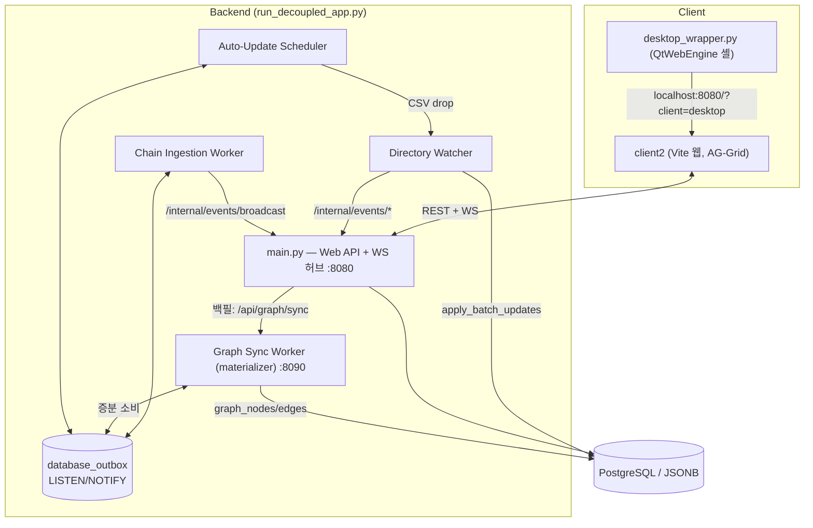

# 🌐 AssyManager System Overview (Single Source of Truth)

> **Status:** 🟢 Living | **Last-verified:** 2026-07-25 | **Owner:** Lead / Architecture
> **Source-of-truth:** `server/`, `client2/`, `client/desktop_wrapper.py`, `run_decoupled_app.py`
> 본 문서는 AssyManager의 **현재 아키텍처에 대한 유일한 권위(SSOT)**입니다. 다른 모든 문서는 이 문서를 기준으로 하며, 여기와 상충하면 이 문서가 우선합니다. 세부는 하위 문서로 링크합니다.

---

## 1. 시스템이 하는 일 — 그리고 무엇을 위해

AssyManager는 **전산 인프라가 취약한 R&D 현장**을 위한 데이터 관리 플랫폼입니다. 궁극 목적은 **불완전한 현장 데이터를 사람이 최소 공수로 교정하여, 신뢰할 수 있는 온톨로지/지식 그래프로 축적하는 것**입니다. 그리드·테이블은 최종 산출물이 아니라 **교정 표면(Correction Surface)**입니다.

**가치 사슬:**

```
다양한 로그 → 파서(정규화) → 체인(파생·연결) → 레이어드 저장(자동값)
  → 사람의 최소공수 교정(우선순위로 승리) → 실시간 신뢰 전파
  → 온톨로지 반영 → 객체 중심 추적(예: 불량 WF 선택 → 연관 공정 이력 전부 소환)
```

**5대 핵심 가치 (우선순위순):**

1. **최소 공수 교정** — 불완전 데이터를 사람이 가장 적은 손으로 진실로 바꾼다. Human-in-the-loop이 설계의 중심.
2. **온톨로지/지식 그래프 기반** — 최종 목적지. 교정된 진실이 그래프에 반영되어, 객체(예: 불량 WF) 선택 시 연관 공정 이력이 전부 추적된다.
3. **실시간 신뢰 전파** — 교정→그래프 신뢰의 **척추**. 반영이 안 믿기면 교정이 멈추고 온톨로지가 틀린 채 굳는다.
4. **다중 소스 레이어링** — 위 1·2를 떠받치는 메커니즘. 한 셀에 여러 출처를 겹쳐 보관, 수동 값이 자동 값을 이긴다.
5. **변경 이력 추적** — 모든 교정의 계보이자 그래프 신뢰의 근거.

**두 축의 특수성:**
- **파서 관리** — 현장 로그 형태가 매우 다양 → 파서의 유연한 추가·관리가 시스템 수명을 좌우.
- **체인 관리** — 데이터 종류가 방대 → 파생·연결 규칙(chain)의 정합성이 온톨로지 품질을 좌우.

> 두 데이터 유입 경로: ① **자동 업데이트**(장비/외부 로그를 워처·스케줄러·체인 워커가 파싱·적재) ② **인간의 수동 교정**(웹 그리드·맵 에디터, 수동 값이 자동 값보다 우선).

---

## 2. 프로세스 토폴로지 (멀티프로세스)

`run_decoupled_app.py`가 아래 5개 프로세스를 통합 기동합니다. 프로세스 간 조정은 PostgreSQL **Transactional Outbox** 패턴(`database_outbox` + `LISTEN/NOTIFY` 채널 `outbox_event`)으로 이루어지며, 워커→웹서버 콜백은 HTTP `POST /internal/events/*`를 사용합니다.



| 프로세스 | 진입점 | 역할 | 상세 |
|---|---|---|---|
| **Web API + WS 허브** | `server/main.py` (~3,650줄) | REST/WebSocket, `127.0.0.1:8080`. 그래프 조회 API(`/graph/*`)는 여기서 직접 서빙 | [architecture/backend.md](../architecture/backend.md) |
| **File Ingestion Watcher** | `run_watcher.py` → `parsers/directory_watcher.py` | `ingestion_workspace/*/raws/` 감시·파싱·적재·아카이빙. 커스텀 스크립트 없으면 **std parser 폴백**(헤더 검증 기반 CSV/TSV/TXT) | [INGESTION_GUIDE](../guide/INGESTION_GUIDE.md) |
| **Auto-Update Scheduler** | `run_auto_update.py` | `auto_update/*.py` 주석기반 크론 실행 → `raws/`에 CSV 드롭 | [AUTO_UPDATE_GUIDE](../guide/AUTO_UPDATE_GUIDE.md) |
| **Chain Ingestion Worker** | `run_chain_worker.py` → `chain_ingestion_worker.py` | outbox 소비(LISTEN/NOTIFY), 규칙별 맵퍼로 파생 데이터 생성. SLO 100ms | [chain_ingestion_guide](../guide/chain_ingestion_guide.md) |
| **Graph Sync Worker (materializer)** | `run_graph_sync.py` → `graph_sync_worker.py` | 독립 FastAPI(:8090). **outbox 증분 소비 → 매핑 config에 따라 PG 엣지 스토어(`graph_nodes/edges`)로 자동 승격**(자체 keyset 커서, SYSTEM_RELOAD 구독). `/api/graph/sync`(수동)는 백필/복구 도구. Neo4j는 청크 훅으로 병행 가능(G3) | [spec/ONTOLOGY_GRAPH_SPEC](../spec/ONTOLOGY_GRAPH_SPEC.md) · [event_driven_backend §4](../architecture/event_driven_backend.md) |

> `DECOUPLED=True` 환경변수는 `main.py`가 워처·체인 워커를 인라인으로 띄우지 않게 하여, 위 5개 프로세스를 완전히 분리 실행합니다(운영 기본값).

---

## 3. 클라이언트 (웹이 메인)

- **`client2/`** — Vite 멀티페이지 앱(Vanilla ESM, 프레임워크 없음, JS ~13,000줄). 진입점 **6개**:
  | 엔트리 | 모듈 | 페이지 |
  |---|---|---|
  | `index.html` | `main.js` | 데이터 그리드(메인, AG-Grid) — 「🕸️ 추적」 진입점 포함 |
  | `admin.html` | `admin.js` | 어드민 — **파이프라인 생애주기 5탭**(Overview/File/Chain/AutoUpdate/Enrichment) + 코드 에디터 공용 뷰(Monaco CDN, `#editor=<path>` 딥링크) |
  | `map_editor.html` | `map_editor.js` | 웨이퍼 맵 에디터(커스텀 캔버스) |
  | `enrichment.html` | `enrichment.js` | Enrichment Queue 컨베이어(결손 보정 워크리스트) |
  | `graph.html` | `graph_viewer.js` | 지식그래프 서브그래프 뷰어(stats·검색·k-hop 캔버스) |
  | `trace.html` | `trace.js` | 객체 중심 추적 리포트(멀티 시드 BFS — 그리드 선택→시드) |
- **그리드:** AG-Grid Community `^35.3.0` (유일한 런타임 의존성). 맵 에디터·그래프 뷰어는 AG-Grid 미사용 — 커스텀 캔버스 렌더링.
- **테마:** 듀얼 테마(기본 라이트 + 다크 토글). 토큰 SSOT는 `src/tokens.css`, 전환은 `src/theme.js`.
- **상태 관리:** `state.js`의 단일 싱글턴 객체를 직접 변조하고 명시적 UI 리프레셔를 호출하는 **수동 반응성**(리액티브 프레임워크 아님).
- **데스크톱 셸:** `client/desktop_wrapper.py`(259줄)는 `http://localhost:8080/?client=desktop`를 로드하는 **QtWebEngine 래퍼**. OS 드래그앤드롭 업로드, 네이티브 다운로드 다이얼로그, `assymanager://` URI 스킴을 제공.
- ⚠️ **구 PySide6 데스크톱 클라이언트(`client/main.py`, `ui/`, `models/table_model.py`)는 제거되었습니다.** 이를 참조하는 문서는 `_archive/`에 있습니다.

상세: [architecture/frontend.md](../architecture/frontend.md)

---

## 4. 데이터 모델 & 레이어링

정적 ORM 모델 + `table_config.json` 기반 **동적 네이티브 테이블**(런타임 `ALTER TABLE` 핫스왑)로 구성됩니다.

| 모델 | 용도 |
|---|---|
| `CellSource` | **다중 소스 레이어링** — (table,row,col,source)당 1행 |
| `CellOverwrite` | 셀 오버라이트/핀 상태(`is_overwrite`, `manual_priority_source`) |
| `AuditLog` | 셀 단위 변경 이력(old/new, source, tx_id) |
| `DatabaseOutbox` | 프로세스 간 이벤트(event_uuid, status, processed_chain) |
| `FileIngestionLog` | 파일 적재 로그(FAILED/SUCCESS/PENDING_RETRY) |
| `GraphNode` / `GraphEdge` / `GraphSyncState` | **온톨로지 그래프 스토어** — 속성 그래프 노드/엣지(provenance 포함) + materializer의 outbox 소비 커서 |
| `DataRow` | 레거시 JSON blob 저장(동적 테이블로 대체됨) |

**우선순위 결정** (`crud.compute_priority_value`): 수동 핀 우선 → `SOURCE_PRIORITY {user:0, collision_merge:1, pipeline_parser:2, custom_script:3, chain_ingestion:4}`(낮을수록 우선) → 표시값 확정. 테이블별 `source_priority` 오버라이드 지원. 서열의 단일 원천은 `crud.resolve_priority_map`(그래프 엣지 provenance도 동일 서열 사용).

상세: [architecture/data_model.md](../architecture/data_model.md) · [architecture/layering_and_priority.md](../architecture/layering_and_priority.md)

---

## 5. 설정 주도 (`server/config/`)

| 파일 | 역할 |
|---|---|
| `table_config.json` | **스키마 구동 핵심** — 테이블별 컬럼/타입/비즈니스키/복합키/`map_key_columns` |
| `chain_rules.json` | 체인 인제션 규칙(trigger→target, mapper) |
| `enrichment_rules.json` | Enrichment Queue 규칙(결손 보정 워크리스트 + dedup 체인 룰 자동 파생) |
| `ontology_mapping.json` | **그래프 승격 매핑 v2**(테이블→node/edges, `description` 필수, enrichment 규칙은 `RESOLVED_AS` 엣지로 자동 승격) — 로더 `ontology_config.py` |
| `maps.json` | 맵 에디터 지오메트리 프리셋 |
| `scheduler_status.json` | Auto-Update 스케줄러 실시간 상태(쓰기 전용) |
| `auto_update_control.json` | Auto-Update 수집기별 active 토글(어드민이 쓰고 스케줄러가 매 틱 읽음 — 핫 반영, 부재 시 전부 active) — IO `utils/auto_update_control.py` |

변경은 `config_watcher.py` + `SYSTEM_RELOAD` outbox 이벤트로 무중단 반영됩니다. 신규 테이블은 리로드 시 물리 CREATE까지 자동 수행(`refresh_dynamic_models`, 이슈 #7)되고 워크스페이스 폴더도 자동 보충되므로, **온보딩은 "config 추가 → 리로드 → 즉시 사용"으로 완결**됩니다(파서 스크립트 없이도 std parser 폴백으로 적재 가능).

---

## 6. 주요 서브시스템 지도

> **구조 탐색은 [CODE_MAP](../architecture/CODE_MAP.md) 우선** — 함수·라인 위치를 코드맵에서 찾은 뒤 소스는 필요한 부분만 읽는다.

| 서브시스템 | 리빙 문서 | 코드 |
|---|---|---|
| 인제션 파이프라인(파일 파서) | [INGESTION_GUIDE](../guide/INGESTION_GUIDE.md) | `parsers/directory_watcher.py`, `parsers/pipeline_base.py` |
| 체인 인제션(DB세션 맵퍼) | [chain_ingestion_guide](../guide/chain_ingestion_guide.md) | `chain_ingestion_worker.py`, `mappers/` |
| Auto-Update 스케줄러 | [AUTO_UPDATE_GUIDE](../guide/AUTO_UPDATE_GUIDE.md) | `run_auto_update.py` |
| 웨이퍼 맵 에디터 | [map_editor/](../map_editor/README.md) · [MAP_EDITOR_SPEC](../spec/MAP_EDITOR_SPEC.md) | `client2/src/map_editor.js`, `utils/physical_wafer_engine.py`, `utils/coordinate_transformer.py` |
| 실시간 동기화 | [DATA_SYNC_SPEC](../spec/DATA_SYNC_SPEC.md) | `client2/src/websocket.js`, `main.py` ConnectionManager |
| 배치 업서트 | [batch_update_technical_specification](../spec/batch_update_technical_specification.md) | `crud.apply_batch_updates` |
| 실패 관리/재시도 | [FAILURE_MANAGEMENT_SPEC](../spec/FAILURE_MANAGEMENT_SPEC.md) | `FileIngestionLog`, outbox retry |
| 이벤트 기반(Outbox/EDA) | [architecture/event_driven_backend](../architecture/event_driven_backend.md) | `database/database.py`, `chain_ingestion_worker.py` |
| **온톨로지 그래프(엣지 스토어 + materializer)** | [spec/ONTOLOGY_GRAPH_SPEC](../spec/ONTOLOGY_GRAPH_SPEC.md) · [event_driven_backend §4](../architecture/event_driven_backend.md) | `graph_sync_worker.py`, `graph_materializer.py`, `ontology_config.py`, `config/ontology_mapping.json` |
| **그래프 뷰어·추적 리포트** | [architecture/frontend §6](../architecture/frontend.md) | `main.py /graph/*`(조회 API 5종), `client2/src/graph_viewer.js`, `trace.js`/`trace_core.js`/`trace_launch.js` |
| **Enrichment Queue(결손 보정 워크리스트)** | [spec/ENRICHMENT_QUEUE_SPEC.md](../spec/ENRICHMENT_QUEUE_SPEC.md) | `enrichment_config.py`, `enrichment_mapper.py`, `client2/src/enrichment.js`, `config/enrichment_rules.json` |
| 어드민(파이프라인 5탭 + 코드 에디터) | [architecture/frontend §5](../architecture/frontend.md) | `client2/src/admin.js`, `main.py /admin/*` |
| HTML 토폴로지 파서 | [HTML_TOPOLOGY_PARSER_GUIDE](../guide/HTML_TOPOLOGY_PARSER_GUIDE.md) | `parsers/html_topology_parser.py` |

> **정정:** 맵 에디터는 WebSocket이 아니라 REST(`loadExistingMap`/`pushMapData`) + `localStorage`(레전드)로 동기화합니다. 실시간 WS는 메인 그리드 페이지에만 있습니다.

---

## 7. 실행 방법

```bash
# 전체 스택(웹서버 + 워커 4종 + 데스크톱 셸)
python run_decoupled_app.py

# 서버만(데스크톱 셸 없이)
python run_decoupled_app.py --server-only

# 프론트엔드 개발(핫리로드, 백엔드는 별도 기동)
cd client2 && npm run dev    # :5173 → API/WS는 127.0.0.1:8080로 자동 타겟팅
```

환경 설정: [operations 가이드](../guide/CONDA_SETUP_GUIDE.md) · [Postgres 셋업](../guide/NATIVE_POSTGRES_SETUP_GUIDE.md)

---

## 8. API 엔드포인트 요약

전체 목록·시그니처는 [architecture/backend.md](../architecture/backend.md)와 [spec/api_documentation.md](../spec/api_documentation.md) 참조. 핵심만:

- `GET /tables`, `GET /tables/{t}/data`, `GET /tables/{t}/schema` — 조회
- `PUT /tables/{t}/data/updates` — **통합 배치 업서트**(수동편집·인제션·맵저장 공용)
- `POST /tables/{t}/rows/batch_delete` — 통합 삭제
- `GET /tables/{t}/rows/{id}/history`, `.../cells/{col}/history` — 계보
- `GET|PUT .../{col}/sources`, `.../priority` — 소스 레이어링/핀
- `POST /tables/{t}/upload` — 파일 업로드 인제션
- `WS /ws` — 실시간 브로드캐스트
- `GET /graph/{stats,neighbors,nodes/search,mapping-summary}` + `POST /graph/trace` — 그래프 조회 5종(read-only, 웹서버가 엣지 스토어 직접 조회)
- `POST /api/graph/sync` — 그래프 백필/복구(워커 :8090으로 프록시)
- `GET /enrichment/rules`, `.../references/{i}` — Enrichment 규칙·참조뷰
- `/admin/*`, `/internal/events/*`, `/map-presets` — 어드민·프로세스간·맵프리셋

---

*이 문서는 코드 변경 시 함께 갱신되어야 합니다 → [process/CONTRIBUTING.md](../process/CONTRIBUTING.md) (docs-as-code 규율).*
