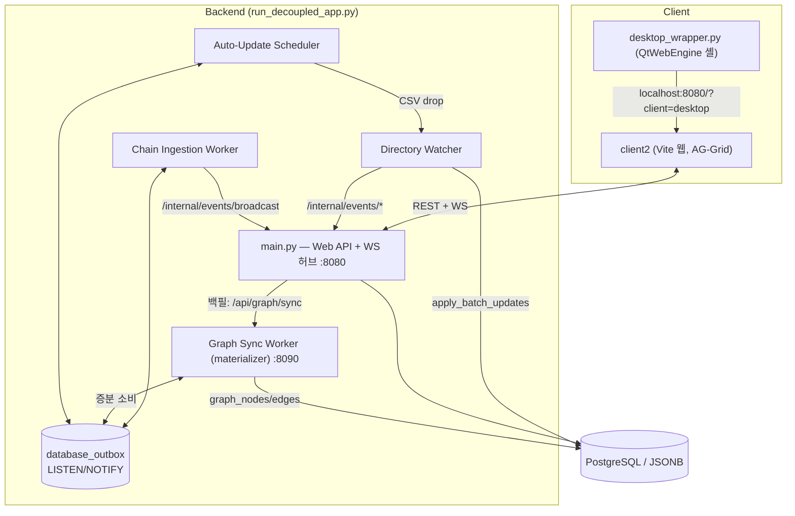

# 🌐 AssyManager System Overview (Single Source of Truth)

> **Status:** 🟢 Living | **Last-verified:** 2026-08-11 (제품 소유자 승인 — §4 「우선순위 결정」이 서열을 **두 층**으로만 적고 있었는데 `347de78`이 세 번째 층(동점 규칙)을 코드에 심었다. 서열만 적고 동점을 안 적은 문장이 정확히 그 결함의 유래였다 — `sorted()`의 안정성이 동점을 dict 삽입 순서로 갈랐고 200/200 동점 셀이 항상 기존 값을 표시했다. 세 층 + 「2·3층은 계층을 못 넘는다」로 정정. 직전 2026-08-06: 🔴 **정합 감사가 이 문서 하나 때문에 코퍼스를 「신뢰 불가」로 판정했고, 그 판정은 옳았습니다.** §3의 「진입점 **6개**」가 `map_editor2.html`을 빠뜨린 채 6행 표를 들고 있었는데, **이 문서는 「상충하면 이 문서가 우선한다」고 스스로 적는 문서**라 그 규칙이 독자에게 **틀린 사본을 믿으라고 지시하고** 있었습니다. 함께: §2의 `main.py (~3,650줄)` 삭제(실측 6,128 — **산문 속 줄 수는 이 결함의 가장 순수한 형태**라 고치지 않고 지웠습니다) · §3의 「PySide6 참조 문서는 전부 `_archive/`에 있다」 정정(**[CONDA_SETUP_GUIDE](../guide/CONDA_SETUP_GUIDE.md)가 아니었고 §7이 거기로 보내고 있었습니다**) + **「PySide6가 제거됐다」로 읽히지 않도록** 못박음(`desktop_wrapper.py`가 여전히 import합니다) · §8 라우트 기수 삭제. 직전 2026-08-04: §8 라우트 수 재실측 + fail-closed 3종. 직전 2026-07-27: §8 `/admin/*` + `/internal/events/*` 공유 토큰 게이트) | **Owner:** Lead / Architecture
> **Source-of-truth:** `server/`, `client2/`, `client/desktop_wrapper.py`, `run_decoupled_app.py`
> 본 문서는 AssyManager의 **현재 아키텍처에 대한 유일한 권위(SSOT)**입니다. 다른 모든 문서는 이 문서를 기준으로 하며, 여기와 상충하면 이 문서가 우선합니다. 세부는 하위 문서로 링크합니다.

---

## 1. 시스템이 하는 일 — 그리고 무엇을 위해

AssyManager는 **전산 인프라가 취약한 R&D 현장**을 위한 데이터 관리 플랫폼입니다. 궁극 목적은 **불완전한 현장 데이터를 사람이 최소 공수로 교정하여, 신뢰할 수 있는 온톨로지/지식 그래프로 축적하는 것**입니다. 그리드·테이블은 최종 산출물이 아니라 **교정 표면(Correction Surface)**입니다.

**가치 사슬:**

```
다양한 로그 → 파서(정규화) → 체인(파생·연결) → 레이어드 저장(자동값)
  → 사람의 최소공수 교정(우선순위로 승리) → 실시간 신뢰 전파
  → 온톨로지 반영 → 객체 중심 추적(예: 불량 WF 선택 → 연관 공정 이력 전부 소환)
```

**5대 핵심 가치 (우선순위순):**

1. **최소 공수 교정** — 불완전 데이터를 사람이 가장 적은 손으로 진실로 바꾼다. Human-in-the-loop이 설계의 중심.
   - **계기(정본, 사용자 2026-07-29 교체): 완료까지의 상호작용 점수** — **마지막 성공 저장 이후 누적된** 사람의 키입력·클릭·화면 이동을 배점(**키 1 · 마우스 3 · 화면이동 5**, [설정](../guide/config/effort_metric.md))으로 합산한 값. "최소 공수"를 에두르지 않고 직접 재는 유일한 값이므로 낮을수록 좋다. 집계는 **세션별 평균 → 세션 간 평균**. ✅ **서버 계측 착지(2026-07-29)** — `PUT /tables/{t}/data/updates`의 **선택 필드** `effort:{session_id,key,mouse,nav,nav_preserved}` 수집 → `interaction_effort_logs`(tx당 1행, 원시 카운트만) → `/dashboard/summary` → `effort`. 컨텍스트 유지 전이도 **버리지 않고 따로 센다**(`nav_preserved`, 배점 0) — 소급 재수집이 불가능하므로 버린 값은 영영 못 되살린다. ⚠️ **단, 되돌릴 수 있는 것은 배점뿐이다**(QA 실측 정정): 개별 전이가 어느 버킷에 들어갈지는 **수집 시점에 확정**되므로, 허용목록 자체를 사후에 재해석할 수는 없다. 그래서 **기본은 "센다"**이고 예외만 선언한다 — 빠뜨린 예외는 점수를 나쁘게 만들 뿐이지만 잘못 넣은 예외는 지표를 조용히 미화한다. ⚠️ **무변경(no-op) 저장은 `effort_recorded:false`를 돌려주고 클라는 리셋하지 않는다** — 그 시도에 쓴 공수는 **다음 성공 저장에 합산**된다. 이 게이트가 없으면 두 번 시도한 교정이 **가장 낮은 점수**를 받아 계기가 목적과 정반대로 작동한다(2026-07-29 QA 실측). 정의·결정은 [data_model §2.4](../architecture/data_model.md), 계약은 [backend](../architecture/backend.md#상호작용-점수-dashboardsummary--effort). ⚠️ 이 값은 **소급 산출이 불가능**하므로(과거 세션에 클릭 로그가 없음) **교정 표면을 고치기 전 기간이 유일한 "before"다.** **비율은 반드시 커버리지(`measured_ratio`)와 함께 읽는다** — 자동 경로(워커·인제션)는 계측 대상이 아니며 **미계측은 0이 아니다.**
   - **보조 계기: 재교정률**(`/dashboard/summary` → `recorrection`, 어드민 Overview 한 줄) — 사람이 **같은 셀을 두 번 이상 고친 비율**. 첫 시도가 먹히지 않았다는 간접 증거다. 2026-07-29 정본에서 보조로 강등(원인이 UI 공수인지 데이터 품질인지 분리되지 않고, 대량 트랜잭션 포함 여부로 2.01%↔13.13% **6.5배 희석**되어 단독 판단 근거가 못 된다). 정의·함정은 [data_model §2.3](../architecture/data_model.md), 계약은 [backend](../architecture/backend.md#재교정률-dashboardsummary--recorrection). **비율은 반드시 분모와 함께 읽는다.**
2. **온톨로지/지식 그래프 기반** — 최종 목적지. 교정된 진실이 그래프에 반영되어, 객체(예: 불량 WF) 선택 시 연관 공정 이력이 전부 추적된다.
3. **실시간 신뢰 전파** — 교정→그래프 신뢰의 **척추**. 반영이 안 믿기면 교정이 멈추고 온톨로지가 틀린 채 굳는다.
4. **다중 소스 레이어링** — 위 1·2를 떠받치는 메커니즘. 한 셀에 여러 출처를 겹쳐 보관, 수동 값이 자동 값을 이긴다.
5. **변경 이력 추적** — 모든 교정의 계보이자 그래프 신뢰의 근거.

**두 축의 특수성:**
- **파서 관리** — 현장 로그 형태가 매우 다양 → 파서의 유연한 추가·관리가 시스템 수명을 좌우.
- **체인 관리** — 데이터 종류가 방대 → 파생·연결 규칙(chain)의 정합성이 온톨로지 품질을 좌우.

> 두 데이터 유입 경로: ① **자동 업데이트**(장비/외부 로그를 워처·스케줄러·체인 워커가 파싱·적재) ② **인간의 수동 교정**(웹 그리드·맵 에디터, 수동 값이 자동 값보다 우선).

---

## 2. 프로세스 토폴로지 (멀티프로세스)

`run_decoupled_app.py`가 아래 5개 프로세스를 통합 기동합니다. 프로세스 간 조정은 PostgreSQL **Transactional Outbox** 패턴(`database_outbox` + `LISTEN/NOTIFY` 채널 `outbox_event`)으로 이루어지며, 워커→웹서버 콜백은 HTTP `POST /internal/events/*`를 사용합니다.



| 프로세스 | 진입점 | 역할 | 상세 |
|---|---|---|---|
| **Web API + WS 허브** | `server/main.py` | REST/WebSocket, `127.0.0.1:8080`. 그래프 조회 API(`/graph/*`)는 여기서 직접 서빙 | [architecture/backend.md](../architecture/backend.md) |
| **File Ingestion Watcher** | `run_watcher.py` → `parsers/directory_watcher.py` | `ingestion_workspace/*/raws/` 감시·파싱·적재·아카이빙. 커스텀 스크립트 없으면 **std parser 폴백**(헤더 검증 기반 CSV/TSV/TXT). 크기 임계(기본 10MB) 초과 파일은 **heavy 레인**(전용 큐/워커)으로 격리해 타 테이블 비차단 — 워크스페이스 내 순서는 보존, 진행 상태는 웹서버 push로 admin에 가시화(P1). 파일 전체 sha256 시그니처로 **동일 파일 재투입 skip**과 **오프셋 체크포인트 재개**(재기동 시 전량 재처리 제거) 수행(P2) | [INGESTION_GUIDE](../guide/INGESTION_GUIDE.md) |
| **Auto-Update Scheduler** | `run_auto_update.py` | `auto_update/*.py` 주석기반 크론 실행 → `raws/`에 CSV 드롭 | [AUTO_UPDATE_GUIDE](../guide/AUTO_UPDATE_GUIDE.md) |
| **Chain Ingestion Worker** | `run_chain_worker.py` → `chain_ingestion_worker.py` | outbox 소비(LISTEN/NOTIFY), 규칙별 맵퍼로 파생 데이터 생성. SLO 100ms | [chain_ingestion_guide](../guide/chain_ingestion_guide.md) |
| **Graph Sync Worker (materializer)** | `run_graph_sync.py` → `graph_sync_worker.py` | 독립 FastAPI(:8090). **outbox 증분 소비 → 매핑 config에 따라 PG 엣지 스토어(`graph_nodes/edges`)로 자동 승격**(자체 keyset 커서, SYSTEM_RELOAD 구독). `/api/graph/sync`(수동)는 백필/복구 도구. Neo4j는 청크 훅으로 병행 가능(G3) | [spec/ONTOLOGY_GRAPH_SPEC](../spec/ONTOLOGY_GRAPH_SPEC.md) · [event_driven_backend §4](../architecture/event_driven_backend.md) |

> `DECOUPLED=True` 환경변수는 `main.py`가 워처·체인 워커를 인라인으로 띄우지 않게 하여, **위 표의 프로세스를 완전히 분리 실행**합니다(운영 기본값). **수를 적지 않습니다 — 표가 목록이고 정본은 `run_decoupled_app.py`의 `specs`입니다**(`--server-only`가 아니면 데스크톱 셸이 자식으로 하나 더 붙습니다).

---

## 3. 클라이언트 (웹이 메인)

- **`client2/`** — Vite 멀티페이지 앱(Vanilla ESM, 프레임워크 없음). 진입점은 **아래 표가 정본이고 그 옆에 수를 적지 않습니다** — 정본 중의 정본은 `client2/vite.config.js`의 `rollupOptions.input`입니다:
  | 엔트리 | 모듈 | 페이지 |
  |---|---|---|
  | `index.html` | `main.js` | 데이터 그리드(메인, AG-Grid) — 「🕸️ 추적」 진입점 포함 |
  | `admin.html` | `admin.js` | 어드민 — **파이프라인 생애주기 5탭**(Overview/File/Chain/AutoUpdate/Enrichment) + 코드 에디터 공용 뷰(Monaco CDN, `#editor=<path>` 딥링크) |
  | `map_editor.html` | `map_editor.js` (+ `transfer_plan.js`) | 웨이퍼 맵 에디터(커스텀 캔버스) + **오버레이 레이어** + **전사 계획 사이드바**(계획 = 지금 열어 편집 중인 그 맵) |
  | `map_editor2.html` | `map_editor2.js` (+ `src/map2/*`) | **맵 정렬 화면(좌표계 확정) — 개발 중.** 🔴 **레거시 에디터를 대체하지 않고 *옆에 섭니다***(`vite.config.js`가 그렇게 적고 있습니다). 켜는 데 필요한 선언은 [CONFIG_GUIDE §3 S9](../guide/CONFIG_GUIDE.md), 층 경계는 [frontend §4.2](../architecture/frontend.md) |
  | ~~`enrichment.html`~~ | ~~`enrichment.js`~~ | 🗄️ **[2026-08-11] 삭제됨** — 결손 보정 워크리스트 조회는 지금 메인 그리드 History 패널의 사이드바 **참조뷰** 탭(`enrichment_reference_view.js`). 결손 target을 순차 입력하던 컨베이어 자체는 대체 없이 소멸(그리드 직접 편집으로 흡수) → [architecture/frontend](../architecture/frontend.md) |
  | `graph.html` | `graph_viewer.js` | 지식그래프 서브그래프 뷰어(stats·검색·k-hop 캔버스) |
  | `trace.html` | `trace.js` | 객체 중심 추적 리포트(멀티 시드 BFS — 그리드 선택→시드) |

  > 🔴 **[2026-08-06 정정] 종전 이 자리는 「진입점 **6개**」였고 표에는 `map_editor2.html`이 **없었습니다.** 그 페이지는 2026-08-05에 출하됐습니다.** 그리고 이 문서가 SSOT라 「상충하면 이 문서가 우선한다」는 규칙이 **틀린 사본을 믿으라고 지시하고 있었습니다** — 정합 감사가 이 한 줄로 문서 전체를 **신뢰 불가**로 판정한 이유입니다. **수는 다시 적지 않았습니다**([frontend §1](../architecture/frontend.md)이 같은 처방을 이미 갖고 있습니다).
- **그리드:** AG-Grid Community `^35.3.0` (유일한 런타임 의존성). 맵 에디터·그래프 뷰어는 AG-Grid 미사용 — 커스텀 캔버스 렌더링.
- **테마:** 듀얼 테마(기본 라이트 + 다크 토글). 토큰 SSOT는 `src/tokens.css`, 전환은 `src/theme.js`.
- **상태 관리:** `state.js`의 단일 싱글턴 객체를 직접 변조하고 명시적 UI 리프레셔를 호출하는 **수동 반응성**(리액티브 프레임워크 아님).
- **데스크톱 셸:** `client/desktop_wrapper.py`(514줄)는 `{해석된 서버}/?client=desktop`를 로드하는 **QtWebEngine 래퍼**. OS 드래그앤드롭 업로드, 네이티브 다운로드 다이얼로그, `assymanager://` URI 스킴을 제공. 서버 주소는 하드코딩이 아니라 `--server` > `ASSY_SERVER` > `client/client_settings.json` > `127.0.0.1:8080` 순으로 해석된다([frontend §1.1](../architecture/frontend.md)).
- ⚠️ **구 PySide6 데스크톱 클라이언트 *애플리케이션*(`client/main.py`, `ui/`, `models/table_model.py`)은 제거되었습니다.**
- 🔴 **[2026-08-06 정정] 「PySide6가 제거됐다」로 읽지 마십시오 — PySide6는 살아 있는 런타임 의존성입니다.** 바로 위의 `client/desktop_wrapper.py`가 `PySide6.QtWebEngineWidgets`·`QtWidgets`·`QtNetwork`·`QtGui`를 import합니다. 없어진 것은 **Qt 위젯으로 그리던 클라이언트 앱**이고, 남은 것은 **웹앱을 감싸는 QtWebEngine 셸**입니다. 두 문장을 섞으면 `environment.yml`에서 PySide6를 빼는 순간 데스크톱 셸이 죽습니다.
- 🔴 **[2026-08-06 정정] 종전 이 자리는 「이를 참조하는 문서는 `_archive/`에 있습니다」로 끝났고 그것은 거짓입니다.** [guide/CONDA_SETUP_GUIDE](../guide/CONDA_SETUP_GUIDE.md)가 `_archive/` 밖에서 `client/main.py` 실행을 지시하고 있었고, **아래 §7이 운영자를 바로 그 문서로 보내고 있었습니다.** 이 라운드에 그 가이드를 현행 스택으로 다시 썼습니다.

상세: [architecture/frontend.md](../architecture/frontend.md)

---

## 4. 데이터 모델 & 레이어링

정적 ORM 모델 + `table_config.json` 기반 **동적 네이티브 테이블**(런타임 `ALTER TABLE` 핫스왑)로 구성됩니다.

| 모델 | 용도 |
|---|---|
| `CellSource` | **다중 소스 레이어링** — (table,row,col,source)당 1행 |
| `CellOverwrite` | 셀 오버라이트/핀 상태(`is_overwrite`, `manual_priority_source`) |
| `AuditLog` | 셀 단위 변경 이력(old/new, source, tx_id) |
| `DatabaseOutbox` | 프로세스 간 이벤트(event_uuid, status, processed_chain) |
| `FileIngestionLog` | 파일 적재 로그(FAILED/SUCCESS/PENDING_RETRY) |
| `GraphNode` / `GraphEdge` / `GraphSyncState` | **온톨로지 그래프 스토어** — 속성 그래프 노드/엣지(provenance 포함) + materializer의 outbox 소비 커서 |
| `FileIngestionCheckpoint` | 파일 인제션 오프셋 체크포인트 + 해시 dedup(`file_ingestion_checkpoints`, `UNIQUE(table_name, file_signature)`) |
| `InteractionEffortLog` | **핵심가치 #1 정본 계기** — 교정 tx당 사람의 상호작용 원시 카운트(`interaction_effort_logs`, `UNIQUE(transaction_id)`) |
| `DataRow` | 레거시 JSON blob 저장(동적 테이블로 대체됨) |

**우선순위 결정** (`crud.compute_priority_value`): 수동 핀 우선 → `SOURCE_PRIORITY {user:0, collision_merge:1, pipeline_parser:2, custom_script:3, chain_ingestion:4}`(낮을수록 우선) → 같은 우선순위 안에서는 `ingested_at` 내림차순 → `source_name` 오름차순의 전순서. **2·3층은 계층을 넘지 못한다**(동점만 가르고, 낮은 서열을 승격시키지 않는다). 테이블별 `source_priority` 오버라이드 지원. 서열의 단일 원천은 `crud.resolve_priority_map`(그래프 엣지 provenance도 동일 서열 사용).

🔴 **동점 규칙 없이 서열만 적힌 문장은 다음 구현자가 규칙을 지어내게 만든다.** `347de78`이 고친 결함이 정확히 이것이었다 — 코드가 `sorted(sources.keys(), key=priority_map.get)`뿐이던 시절 미등재 소스(파일명 유래는 전부 그렇다)는 모두 99로 동점이었고, `sorted()`가 안정 정렬이라 승자는 **호출부가 조립한 dict의 삽입 순서**로 갈렸다 — 그 순서는 기존 값을 먼저, 새 값을 나중에 넣으므로 **동점은 언제나 기존 값이 이겼다**(운영 실측 200/200). 같은 계급의 실패가 [`spec/MAP_ALIGNMENT_SPEC.md` §5](../spec/MAP_ALIGNMENT_SPEC.md)의 하드코딩에도 있었다(한 룰의 선언값을 스키마로 인용한 문장 — `2fb1c44`가 정정).

상세: [architecture/data_model.md](../architecture/data_model.md)

---

## 5. 설정 주도 (`server/config/`)

| 파일 | 역할 |
|---|---|
| `table_config.json` | **스키마 구동 핵심** — 테이블별 컬럼/타입/비즈니스키/복합키/`map_key_columns` |
| `chain_rules.json` | 체인 인제션 규칙(trigger→target, mapper) |
| `enrichment_rules.json` | Enrichment Queue 규칙(결손 보정 워크리스트 + dedup 체인 룰 자동 파생) |
| `ontology_mapping.json` | **그래프 승격 매핑 v2**(테이블→node/edges, `description` 필수, enrichment 규칙은 `RESOLVED_AS` 엣지로 자동 승격) — 로더 `ontology_config.py` |
| `maps.json` | 맵 에디터 지오메트리 프리셋 |
| `scheduler_status.json` | Auto-Update 스케줄러 실시간 상태(쓰기 전용) |
| `auto_update_control.json` | Auto-Update 수집기별 active 토글(어드민이 쓰고 스케줄러가 매 틱 읽음 — 핫 반영, 부재 시 전부 active) — IO `utils/auto_update_control.py` |
| `ingestion_settings.json` | 인제션 런타임 노브 — `heavy_file_mb`(P1 레인 임계)·`dedup_by_signature`·`resume_from_checkpoint`(P2)·**`dedup_by_path_stat`**(tier-1 경로+stat 스킵)·**`archive_processed_files`**(처리 후 파일을 옮길지 — `false`면 원장이 재처리를 막는다, 마이그레이션 선행). 파일 경계 핫리로드 |
| `map_overlay_config.json` | **범용 맵 오버레이** — `table_bindings`(맵 좌표 컬럼)·`paint_lock`(페인트 잠금 정본). **`align_overrides`는 2026-07-27 폐지** — 정렬의 근거는 `wafer_map_metadata` 하나뿐이다 |
| `bonding_plan_config.json` / `transfer_plan_config.json` | 계획 엔진 역할 바인딩 — 역할(role)→실테이블·컬럼, stage 선언(`target_map`), `plan_store` |

**설정 파일 전수 지도와 시나리오별 온보딩 절차(무엇을 어떤 순서로 넣고 어떻게 검증하는가)는 [guide/CONFIG_GUIDE](../guide/CONFIG_GUIDE.md)를 참조하세요.**

변경은 `config_watcher.py` + `SYSTEM_RELOAD` outbox 이벤트로 무중단 반영됩니다. 신규 테이블은 리로드 시 물리 CREATE까지 자동 수행(`refresh_dynamic_models`, 이슈 #7)되고 워크스페이스 폴더도 자동 보충되므로, **온보딩은 "config 추가 → 리로드 → 즉시 사용"으로 완결**됩니다(파서 스크립트 없이도 std parser 폴백으로 적재 가능).

---

## 6. 주요 서브시스템 지도

> **구조 탐색은 [CODE_MAP](../architecture/CODE_MAP.md) 우선** — 함수·라인 위치를 코드맵에서 찾은 뒤 소스는 필요한 부분만 읽는다.

| 서브시스템 | 리빙 문서 | 코드 |
|---|---|---|
| 인제션 파이프라인(파일 파서) | [INGESTION_GUIDE](../guide/INGESTION_GUIDE.md) | `parsers/directory_watcher.py`, `parsers/pipeline_base.py` |
| 체인 인제션(DB세션 맵퍼) | [chain_ingestion_guide](../guide/chain_ingestion_guide.md) | `chain_ingestion_worker.py`, `mappers/` |
| Auto-Update 스케줄러 | [AUTO_UPDATE_GUIDE](../guide/AUTO_UPDATE_GUIDE.md) | `run_auto_update.py` |
| 웨이퍼 맵 에디터 | [map_editor/](../map_editor/README.md) · [MAP_EDITOR_SPEC](../spec/MAP_EDITOR_SPEC.md) | `client2/src/map_editor.js`, `utils/physical_wafer_engine.py`, `utils/coordinate_transformer.py` |
| **범용 맵 오버레이(맵 인프라)** | [MAP_EDITOR_SPEC §5](../spec/MAP_EDITOR_SPEC.md) | `server/map_overlay.py`, `client2/src/map_editor.js`(오버레이 레이어) |
| **전사 계획(본딩/DT — 계획 = 그 맵 자체)** | [MAP_EDITOR_SPEC §6](../spec/MAP_EDITOR_SPEC.md) · [CONFIG_GUIDE §3-S6](../guide/CONFIG_GUIDE.md) | `server/transfer_plan.py`, `server/bonding_plan.py`, `client2/src/transfer_plan.js` |
| 실시간 동기화 | [architecture/frontend §3.1](../architecture/frontend.md) | `client2/src/websocket.js`, `main.py` ConnectionManager |
| 배치 업서트 | [batch_update_technical_specification](../spec/batch_update_technical_specification.md) | `crud.apply_batch_updates` |
| 실패 관리/재시도 | [FAILURE_MANAGEMENT_SPEC](../spec/FAILURE_MANAGEMENT_SPEC.md) | `FileIngestionLog`, outbox retry |
| 이벤트 기반(Outbox/EDA) | [architecture/event_driven_backend](../architecture/event_driven_backend.md) | `database/database.py`, `chain_ingestion_worker.py` |
| **온톨로지 그래프(엣지 스토어 + materializer)** | [spec/ONTOLOGY_GRAPH_SPEC](../spec/ONTOLOGY_GRAPH_SPEC.md) · [event_driven_backend §4](../architecture/event_driven_backend.md) | `graph_sync_worker.py`, `graph_materializer.py`, `ontology_config.py`, `config/ontology_mapping.json` |
| **그래프 뷰어·추적 리포트** | [architecture/frontend §6](../architecture/frontend.md) | `main.py /graph/*`(조회 API 5종), `client2/src/graph_viewer.js`, `trace.js`/`trace_core.js`/`trace_launch.js` |
| **Enrichment Queue(결손 보정 워크리스트)** | [spec/ENRICHMENT_QUEUE_SPEC.md](../spec/ENRICHMENT_QUEUE_SPEC.md) | `enrichment_config.py`, `enrichment_mapper.py`, `client2/src/enrichment.js`, `config/enrichment_rules.json` |
| 어드민(파이프라인 5탭 + 코드 에디터) | [architecture/frontend §5](../architecture/frontend.md) | `client2/src/admin.js`, `main.py /admin/*` |
| HTML 토폴로지 파서 | [HTML_TOPOLOGY_PARSER_GUIDE](../guide/HTML_TOPOLOGY_PARSER_GUIDE.md) | `parsers/html_topology_parser.py` |

> **정정:** 맵 에디터는 WebSocket이 아니라 REST(`loadExistingMap`/`pushMapData`) + `localStorage`(레전드)로 동기화합니다. 실시간 WS는 메인 그리드 페이지에만 있습니다.

---

## 7. 실행 방법

```bash
# 전체 스택(웹서버 + 워커 4종 + 데스크톱 셸)
python run_decoupled_app.py

# 서버만(데스크톱 셸 없이)
python run_decoupled_app.py --server-only

# 프론트엔드 개발(핫리로드, 백엔드는 별도 기동)
cd client2 && npm run dev    # :5173 → API/WS는 127.0.0.1:8080로 자동 타겟팅
```

환경 설정: [operations 가이드](../guide/CONDA_SETUP_GUIDE.md) · [Postgres 셋업](../guide/NATIVE_POSTGRES_SETUP_GUIDE.md)

---

## 8. API 엔드포인트 요약

전체 목록·시그니처는 [architecture/backend.md](../architecture/backend.md)와 [spec/api_documentation.md](../spec/api_documentation.md) 참조. 핵심만:

- `GET /tables`, `GET /tables/{t}/data`, `GET /tables/{t}/schema` — 조회
- `PUT /tables/{t}/data/updates` — **통합 배치 업서트**(수동편집·인제션·맵저장 공용)
- `POST /tables/{t}/rows/batch_delete` — 통합 삭제
- `GET /tables/{t}/rows/{id}/history`, `.../cells/{col}/history` — 계보
- `GET|PUT .../{col}/sources`, `.../priority` — 소스 레이어링/핀
- `POST /tables/{t}/upload` — 파일 업로드 인제션
- `WS /ws` — 실시간 브로드캐스트
- `GET /graph/{stats,neighbors,nodes/search,mapping-summary}` + `POST /graph/trace` — 그래프 조회 5종(read-only, 웹서버가 엣지 스토어 직접 조회)
- `POST /api/graph/sync` — 그래프 백필/복구(워커 :8090으로 프록시)
- `GET /enrichment/rules`, `.../references/{i}` — Enrichment 규칙·참조뷰
- `GET /api/maps/overlay`, `/api/maps/paint-rules` — **범용 맵 오버레이**(임의 맵을 타깃 맵 프레임으로 정렬) · 페인트 잠금 선언 정본
- `GET /api/transfer-plan/{stages,source-summary,validate}`, `/api/bonding-plan/core-summary` — 전사 계획 stage·가용 집계·검증(계획 정체성 = `(ref_table, map_key)`). 🔒 저장 전 반영 확인은 **`GET /admin/transfer-plan/dry-run`**(파라미터 없음 · 행 조회 없음 · 어느 철자가 이겼는지까지 답한다)
- `/admin/*`, `/internal/events/*`, `/map-presets` — 어드민·프로세스간·맵프리셋
  - 🔒 **`/admin/*` 전체 + `/internal/events/*` 전체가 공유 토큰 게이트 뒤에 있다**(🔴 **[2026-08-06] 수를 적지 않는다** — 종전 「24개」·「4개」였고 라우트가 늘 때마다 낡는다. 세는 술어는 `grep -cE '^@app\.(get|post|put|delete|patch)\("/admin' server/main.py`이고, **`^` 앵커를 빼면 함수 안에 조건부로 등록되는 둘까지 세어 다른 답이 나온다**)(2026-07-27, `server/admin_auth.py`) — `ASSY_ADMIN_TOKEN` 환경변수 + `X-Admin-Token` 헤더(**ASCII 전용** — 헤더가 latin-1이라 비-ASCII는 인증 불가, 거부되며 기동 배너가 `ERROR`). 로그인 화면·사용자 관리는 **의도적으로 없다**(2~5명 사내 공유). ⚠️ **이 수는 라우트가 늘 때마다 낡는다** — 커버리지의 정본은 수가 아니라 `test_admin_auth.py`가 **FastAPI 라우트 테이블을 열거**해 내는 단언이다. 토큰 미설정 시 **fail closed 3개**(`POST /admin/scripts/code` · `POST /admin/auto-update/run-now` · **`POST /admin/retroactive/{op}/run`** — 정본은 `test_admin_auth.STRICT_ADMIN_ROUTES`)는 **503**, 나머지는 열린다(첫 재기동에 운영자가 어드민 전체에서 잠기지 않게 — 사용자 확정). 소급 실행이 셋째로 들어간 이유는 코드 실행이라서가 아니라 **같은 아웃박스로 같은 스케줄러 프로세스에 닿고 피해 계급이 같기** 때문이다(테이블 전체 재작성 · 소스 주장 회수 · 노드 삭제). `GET /health`는 무인증 유지. 워커는 런처 환경에서 토큰을 상속하므로 별도 설정이 없다. ⚠️ **토큰을 켜기 전에 `client2/dist` 번들 재빌드가 선행되어야 한다**(옛 번들엔 토큰을 묻는 코드가 없어 어드민이 잠긴다). 설정 → [DEPLOY_SETUP §1-4](../guide/DEPLOY_SETUP.md)

---

*이 문서는 코드 변경 시 함께 갱신되어야 합니다 → [process/CONTRIBUTING.md](../process/CONTRIBUTING.md) (docs-as-code 규율).*
