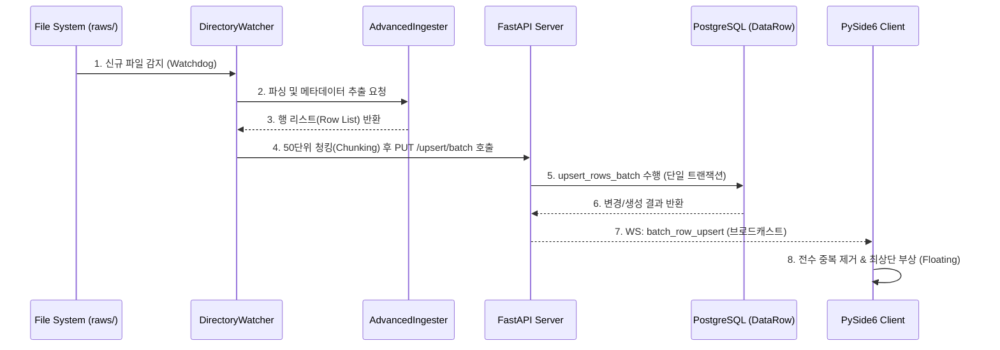

# AssyManager: 고성능 배치 처리 및 인제션 기술 명세서 (Enterprise Rev.)

본 문서는 `assyManager` 프로젝트의 핵심 엔진인 **배치 처리(Batch Processing)** 및 **실시간 인제션(Real-time Ingestion)** 아키텍처를 상세히 기술합니다.

---

## 🏗️ 1. 엔드투엔드 배치 인제션 흐름

로그 파일이 투입되어 모든 접속자의 UI에 실시간으로 반영될 때까지의 전체 시퀀스입니다.



---

## 📂 2. 파일별 배치 처리 로직 분석

| 레이어 | 파일명 | 핵심 프로세스 및 함수 |
| :--- | :--- | :--- |
| **Ingestion** | `server/parsers/directory_watcher.py` | `_send_to_upsert()`: 파싱된 데이터를 **50개 단위 청크(Chunk)**로 나누어 서버에 전송하여 네트워크 부하 최적화. |
| **Ingestion** | `server/parsers/advanced_ingester.py`| `process_file()`: 정규표현식 기반의 고속 행 추출 및 파일 헤더 메타데이터 결합. |
| **Server API** | `server/main.py` | `/tables/{t}/upsert/batch`: 다량의 업서트 결과를 취합하여 하나의 **JSON WebSocket 이벤트**로 압축 브로드캐스트. |
| **Server DB** | `server/database/crud.py` | `upsert_rows_batch()`: 비즈니스 키 기반 행 매핑, `flag_modified`를 통한 JSON 내부 동시 수정 보장, 단일 Commit 전술 사용. |
| **Client UI** | `client/models/table_model.py` | `_on_websocket_broadcast()`: 수신된 대량의 데이터를 로컬 캐시와 비교하여 **Strict Deduplication** 수행 후 상단 Prepend 처리. |

---

## 🛡️ 3. 데이터 무결성 및 성능 최적화 전략

### 3.1 비즈니스 키 기반 업서트 (Upsert)
- 단순 DB ID가 아닌 `part_no`, `plan_id` 등 실무 도메인 키를 기준으로 행을 식별합니다.
- `get_row_by_business_key` 함수는 타입 차이(int/str) 및 공백 오류를 정밀 보정하여 중복 생성을 원천 방지합니다.

### 3.2 중첩 데이터 레이어링 (Layering)
- 배치 업데이트 시에도 기존 데이터는 사라지지 않고 `sources` 딕셔너리에 누적됩니다.
- `compute_priority_value` 로직에 의해 `user` 수정본이 최우선이며, 그 다음은 사전 정의된 각 파서별 가중치(`SOURCE_PRIORITY`)에 따라 표시 값이 결정됩니다.

### 3.3 클라이언트 가상 잔상 제거 (Ghost Row Prevention)
- **부상(Floating)**: 수정된 행이 실시간으로 최상단에 나타날 때, 모델 하단에 기존 버전이 남아있는 '고스트 행' 현상을 방지하기 위해 `beginResetModel`과 `_build_row_id_map`을 이용한 전수 필터링을 수행합니다.
- **Normalize**: WebSocket으로 유입되는 불규칙한 데이터 구조를 `_normalize_row_data`를 통해 페칭 데이터와 동일하게 정규화합니다.

---

## 📊 4. 배치 통신 프로토콜 (WebSocket Payload)

### 이벤트: `batch_row_upsert`
```json
{
  "event": "batch_row_upsert",
  "table_name": "inventory_master",
  "items": [
    {
      "row_id": "uuid-...",
      "is_new": false,
      "data": { "part_no": {"value": "P123", ...}, "updated_at": {"value": "2026-..."} }
    },
    ...
  ]
}
```

> [!TIP]
> 배치 크기(`batch_size=50`)는 서버의 PostgreSQL 동시성 제어 성능과 클라이언트 UI 렌더링 응답성 사이의 최적 지점으로 설정되었습니다.

---
*AssyManager Enterprise Edition 문서 표준 준수.*
