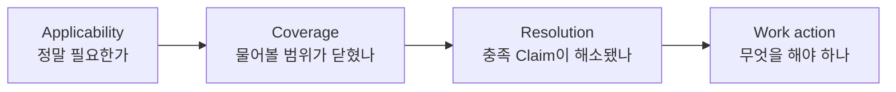

# Claim Requirement & Worklist Specification

> **Status:** Partial implementation · **Last verified:** 2026-08-15
> **관련 정본:** `ledger_events`, 선언(`server/config/ontology/ledger_config.json`),
> `server/config/enrichment_rules.json`, `server/enrichment_config.py`,
> `server/enrichment_actions.py`, `server/ledger_subgraph.py`,
> `server/enrichment_candidates.py`, `server/enrichment_analysis.py`,
> [RND Ontology Referent Model](./RND_ONTOLOGY_REFERENT_MODEL.md),
> [Ledger Evidence Subgraph](./LEDGER_EVIDENCE_SUBGRAPH_SPEC.md)
> **목적:** 객체의 정체·좌표 프레임·귀속을 Claim으로 보존하고, 필요한 Claim이 아직 없거나
> 해소되지 않았을 때 하나의 온톨로지 워크리스트로 투영한다.

## 0. 핵심 판정

**새 Requirement/Queue 엔진을 병렬로 만들지 않는다. 기존 Enrichment가 구현 기반이다.**
Enrichment Rule이 Requirement 선언, `decision_key`별 derived row가 Obligation projection,
`target_fields` 결손이 미충족 slot, `reference_views`와 `candidate_for`가 근거·후보 탐색을 이미 담당한다.
이 문서의 새 부분은 Enrichment Rule에 선택적 `claim_contract`를 더해 column 보강을 온톨로지 Claim
충족으로 확장하는 것이다.

DT/Bonding frame, DT output LOT·SLOT, Map→Wafer 대응, 사람이 계획한 bonding leg처럼
**“이 기록/맵/자재가 무엇인가”에 대한 정보는 Entity key가 아니라 Claim**이다.

```text
Source Event / 최소 Anchor
  → Identity·Frame·Assignment Claims
  → Resolver
  → resolved / candidate / contested / absent Projection
```

필요한 Claim이 없다는 사실은 Claim을 발명해서 채우지 않는다. Enrichment가 이미 만드는
decision-key row를 `Claim Obligation`으로 해석하고, 미충족 row만 `Work Item`으로 보여 준다.

```text
Enrichment Rule + claim_contract (설계 선언)
  × 적용 대상 Anchor
  = Claim Obligation (요구 인스턴스)
  → 평가
  → fulfilled면 숨김 / 미충족이면 Work Item
```

## 1. 네 층

| 층 | 저장/계산 | 의미 |
|---|---|---|
| **Anchor** | Source Event 또는 최소 Entity | 아직 정체가 덜 풀려도 참조할 수 있는 안정 시작점 |
| **Claim** | append-only `ledger_events` | 출처가 “이 대상은 이것이다/이 frame이다”라고 발화한 원자 |
| **Resolution** | 재계산 가능한 projection | 경쟁 Claim을 해소한 현재 답과 상태 |
| **Obligation/Work Item** | Enrichment derived row + 선언 기반 상태 | 필요한 Claim이 없거나 경합/차단되어 남은 행동 |

Resolution과 Work Item을 원장 사실처럼 쓰지 않는다. 원장과 선언에서 다시 만들 수 있어야 한다.
사람의 확정은 projection UPDATE가 아니라 새 `pin`/confirmation Claim이다.

## 2. 객체 정체 Claim 관리

### 2.1 최소 Anchor 원칙

정체가 풀리기 전 원천 기록을 가짜 Domain Entity로 만들지 않는다.

- 원천 row/job/run은 Source Event ID로 항상 참조 가능하다.
- 최소한의 물리 신원이 확정된 Wafer/Lot/Equipment만 Entity가 된다.
- DT output LOT·SLOT이 비어 있으면 `DT("unknown")` 같은 placeholder Entity를 만들지 않는다.
- 후보 값은 Claim payload에 남고 resolver가 `candidate`로 표시한다.

### 2.2 Claim 종류

| 범주 | 질문 | 예 |
|---|---|---|
| Existence | 이 Entity가 발급됐는가 | `register` |
| Identity equivalence | 두 표기가 같은 Entity인가 | `same_as`, 사람 `pin` |
| Assignment | 이 기록/영역이 어느 Entity·실험 단위에 속하는가 | `has_wafer`, `assigned_to_experiment` |
| Frame | 좌표를 어떤 물리 좌표계로 읽는가 | `frame_confirmed` |
| Lifecycle | 어디에서 와서 어디로 이동했는가 | `derived_from`, `transferred` |
| Disposition | 요구된 Claim이 왜 없거나 적용되지 않는가 | 제안 `requirement_disposition` |

### 2.3 Frame은 Claim bundle이다

Frame은 독립 물질 Entity가 아니라 좌표 해석 주장이다. 참인 문장이 되려면 필요한 필드를 한
Claim payload에 원자적으로 묶는다.

```json
{
  "predicate": "frame_confirmed",
  "object_payload": {
    "map_ref": {"table": "dt_map", "map_id": "DT-L01-S03"},
    "subject_ref": {"type": "Wafer", "keys": {"wafer": "WF-101"}},
    "coordinate_system": "die_grid",
    "start_x": 1,
    "start_y": 1,
    "y_invert": false,
    "width": 120,
    "height": 120,
    "basis": "operator_confirmed"
  }
}
```

`start_x`만 새 Claim, `y_invert`만 다른 Claim으로 흩어 놓으면 서로 다른 시점/출처의 필드를 합쳐
존재하지 않았던 frame을 만들 수 있다. 하나로서 참이어야 하는 frame은 한 원자 payload다.

### 2.4 해소 상태

| 상태 | 의미 |
|---|---|
| `resolved` | 허용 가능한 live Claim이 정확히 하나이거나 명시적 pin으로 승자가 정해짐 |
| `candidate` | 가능한 Claim은 있으나 확정 근거 부족 |
| `contested` | 동시에 살아 있는 Claim이 서로 다른 값을 주장 |
| `absent` | 적용/coverage가 확정됐지만 Claim이 없음 |
| `unknown` | source coverage 또는 의존 Claim 부족으로 존재 여부를 판정할 수 없음 |
| `not_applicable` | 이 대상에는 요구 자체가 적용되지 않는다는 명시적 disposition |

`absent`와 `unknown`을 합치지 않는다. 아직 파일을 읽지 않은 상태는 “Claim 없음”의 증거가 아니다.

## 3. Enrichment Claim Contract

개념적으로 Requirement는 “어떤 대상에 어떤 Claim이 언제까지 필요하며, 무엇이면 충족인가”를
선언한다. 물리 선언은 별도 파일이 아니라 기존 Enrichment Rule의 선택적 `claim_contract`다.
기존 rule은 수정 없이 legacy column enrichment로 계속 작동한다.

```json
{
  "dt_job_lot_slot_attribution": {
    "source_table": "dt_log",
    "derived_table": "dt_job_attribution",
    "decision_key": ["dt_job"],
    "target_fields": ["dt_lot_confirmed", "dt_slot_confirmed"],
    "claim_contract": {
      "version": 1,
      "label_ko": "DT 결과물 신원",
      "anchor": {
        "predicate": "transferred",
        "payload_path": "to",
        "object_type": "dt_job",
        "decision_key_map": {"dt_job": "dt_job"}
      },
      "slots": [
        {
          "target_field": "dt_lot_confirmed",
          "predicate": "transferred",
          "payload_path": "to.keys.dt_lot"
        },
        {
          "target_field": "dt_slot_confirmed",
          "predicate": "transferred",
          "payload_path": "to.keys.dt_slot"
        }
      ],
      "sources": [
        {"kind": "reference_view", "view_index": 3, "authority": "candidate", "targets": ["dt_lot_confirmed"]},
        {"kind": "reference_view", "view_index": 4, "authority": "candidate", "targets": ["dt_slot_confirmed"]}
      ]
    }
  }
}
```

### 3.1 Requirement 불변식

1. rule name과 `claim_contract.version` 조합은 불변이다. 의미 변경은 새 version이다.
2. `anchor`가 없으면 모든 원장에 요구를 뿌릴 수 있으므로 거절한다.
3. `anchor.decision_key_map`은 기존 `decision_key`를 정확히 한 번씩 모두 덮는다.
4. anchor/slot predicate는 canonical ledger vocabulary에 있어야 하고, 각 slot은 기존
   `target_field`와 predicate/payload_path를 명시하며 slots가 target 전부를 정확히 덮는다.
5. `sources`는 `reference_view|human|translator`, 대상 slot, `candidate|observe|confirm` 권한을 선언한다.
6. `reference_view` source는 실제 view index와 그 view의 `candidate_for` 선언에 맞아야 한다.
7. requirement가 새 Claim을 자동 생성하지 않는다.

현재 validator는 이 최소 실행 계약만 소유한다. due/coverage/dependency/cardinality/owner 같은 다음 단계
필드는 아직 받지 않는다. 선언하지 않은 필드를 코드가 추측하지 않는다. 잘못된 `claim_contract`는
그 계약만 버리고 rejection을 남기며, 기존 column Enrichment rule까지 죽이지 않는다.

## 4. Claim Obligation

Obligation은 Enrichment Rule이 특정 `decision_key`/Anchor/context에 적용된 인스턴스다. 별도 원장
Entity가 아니며, 기존 derived row를 유지한 채 상태를 가산한다.

```text
obligation_id = hash(enrichment_rule_name, claim_contract_version,
                     anchor_id, normalized_context)
```

동일 요구가 재평가돼도 같은 ID가 된다. 원장 Claim이 들어오면 새 Work Item을 만드는 것이 아니라
같은 Obligation 상태가 재계산된다.

### 4.1 평가 관문



1. **Applicability:** 공정/제품/소스/event 상태상 요구가 적용되는가.
2. **Coverage:** 필요한 source/window/job이 수집 완료됐는가.
3. **Resolution:** slot별 Claim이 exactly-one/at-least-one 등 cardinality를 만족하는가.
4. **Action:** 미충족 원인에 맞는 행동을 선택한다.

Coverage 전에는 `unknown`이지 `missing`이 아니다. 이 구분이 없으면 아직 도착하지 않은 데이터가
사람 워크리스트를 폭주시킨다.

## 5. Work Item 상태와 행동

| 상태 | 원인 | 기본 행동 |
|---|---|---|
| `missing_claim` | coverage 완료 후 slot Claim 0개 | 원천 확보 또는 Claim 입력 |
| `candidate_unconfirmed` | 후보는 있으나 pin/확정 부족 | 후보 비교·확정 |
| `contested_claims` | 서로 다른 live Claim 2개 이상 | 근거 대조·하나를 pin 또는 반박 |
| `blocked_dependency` | upstream identity/frame 없음 | 먼저 막은 Obligation 처리 |
| `source_not_covered` | 파일/run/window 수집 미완 | 수집/재처리. 사람 값 입력 금지 |
| `invalid_claim` | Claim은 있으나 signature/범위 위반 | translator/config 수정 |
| `missing_record` | source가 기록 누락을 명시 | 재수집/현장 확인 |
| `not_performed` | 공정/검사가 안 됐다는 명시 Claim | 값 채우기 금지. 필요 시 재수행 요청 |
| `unknown` | source도 값을 알 수 없다고 명시 | 새 source/계측 확보 |
| `waived` | 승인자가 요구 면제를 Claim으로 남김 | 닫힘, 근거 감사 가능 |

`not_performed`, `unknown`, `waived`는 빈 문자열이 아니라 disposition Claim이다. 단
`missing_record`와 `unknown`은 정보를 얻지 못했으므로 downstream path가 필요하면 Work Item을 닫지 않는다.

### 5.1 현재 구현된 Enrich Action 노드

통합 worklist API보다 먼저, 현재 결손이 그래프 걷기에서 실제로 보이도록 최소 slice를 구현했다.

```text
Claim --needs_enrichment--> Enrich Action
```

- `claim_resolution`: 선언된 공급 source가 있는 target이 비었을 때 decision key당 하나다.
- `source_contract`: target의 공급 source가 없거나 rule의 table 계약이 배포되지 않았을 때 rule당 하나다.
- 둘 다 Ledger Entity/Claim이 아니라 재계산 projection이다. target이 채워지면 사라진다.
- 자동 BFS는 Action에서 멈춘다. 그러나 opaque Action ID를 `/api/ledger/subgraph?id=...`에 다시 넣으면
  같은 노드를 seed로 열 수 있다.
- Evidence Graph에서는 후보 SQL을 실행하지 않는다. `resolve_claim`은 공급 경로만 보여 주며 실제 후보
  조회·확정은 명시적 다음 행동이다.
- table 계약 검증에 실패한 rule은 derived row를 읽지 않고 `repair_enrichment_contract` Action으로 보인다.

이 slice는 `missing_claim`, `undeclared_claim_source`, `enrichment_contract_not_deployed`만 구분한다.
`candidate_unconfirmed`, `contested`, coverage/disposition, 통합 우선순위는 아래 API 단계에서 가산한다.

## 6. 단일 Enrichment Worklist API

모든 결손 유형은 Enrichment가 소유하는 한 API의 같은 행 계약을 쓴다. 새 route는 별도 판단
엔진이 아니라 기존 rule loader, queue predicate, candidate resolver, classifier의 집계 facade다.

```http
GET /enrichment/worklist
  ?intent=identity_resolution
  &rule=dt_job_lot_slot_attribution
  &subject_type=Wafer
  &state=missing_claim,contested_claims,blocked_dependency
  &owner_role=DT_ENGINEER
  &as_of=2026-08-15T12:00:00Z
  &limit=100
  &cursor=<opaque>
```

| 파라미터 | 의미 |
|---|---|
| `intent` | identity resolution, missing observation, comparison completeness 등 소비 문맥 |
| `rule` | 특정 Enrichment Rule과 claim-contract version 필터 |
| `subject_type`/`subject_id` | 대상 범위 |
| `state` | 미충족 상태 CSV |
| `owner_role` | 담당 역할 |
| `as_of` | 재현 가능한 평가 시각 |
| `limit/cursor` | keyset pagination. 큰 OFFSET 금지 |

응답 행:

```json
{
  "work_item_id": "...",
  "obligation_id": "...",
  "requirement": {"id": "dt_output_identity.v1", "version": 1},
  "anchor": {"kind": "source_event", "id": "ledger-event:v1:..."},
  "subject": null,
  "state": "missing_claim",
  "missing_slots": ["output_slot"],
  "candidate_claims": [],
  "blocked_by": [],
  "why_required": "DT output을 Bonding map과 연결하려면 LOT·SLOT이 필요함",
  "downstream": {"blocked_paths": 3, "blocked_subjects": 128},
  "coverage": {"state": "complete", "evidence_ids": ["..."]},
  "suggested_action": {
    "kind": "collect_claim",
    "predicate": "assigned_output_identity"
  },
  "evidence_ids": ["..."],
  "priority": {
    "information_gain": 0.82,
    "downstream_impact": 128,
    "age": 2.4,
    "effort": 1.0
  }
}
```

Client, R&D Console, Admin, 참조뷰, Spotfire가 같은 응답을 소비한다. use case마다 별도
`/missing-frame`, `/missing-slot` API를 만들지 않는다.

기존 `GET /tables/{derived}/data?enrichment_queue=<rule>&enrichment_queue_scope=...`는 하위 호환을
유지한다. 두 API 모두 `enrichment_config.queue_predicate_condition`과 같은 evaluator를 써야 하며,
결손 정의를 각각 구현하면 안 된다.

## 7. 우선순위

단일 불투명 퍼센트를 쓰지 않고 구성요소를 함께 보여 준다.

```text
priority = information_gain
         × log1p(downstream_blocked_subjects)
         × urgency
         ÷ estimated_effort
```

- `information_gain`: Claim이 채워졌을 때 후보 경로가 얼마나 줄어드는가.
- `downstream impact`: 이 결손 때문에 막힌 map/trace/comparison 수.
- `urgency`: due/age/현재 R&D selection 연관성.
- `effort`: 자동 재수집, 후보 확인, 사람 조사 등 예상 공수.

화면은 최종 점수뿐 아니라 네 항을 같이 보여 줘야 한다.

## 8. 쓰기 흐름

```text
Work Item 선택
  → 참조 Evidence/Candidate 확인
  → Claim 초안
  → 동일 vocabulary gate + ledger store
  → 새 append-only Claim
  → 기존 target cell은 호환 projection으로 갱신
  → 해당 Obligation 재평가
  → fulfilled면 Work Item projection에서 사라짐
```

`claim_contract` rule의 Work Item 행을 `done=true`로 직접 수정하지 않는다. Claim이 요구를 충족하는
것이 완료의 유일한 근거다. 전환 기간의 기존 target-cell 수정도 동일 translator를 통해 Claim을
발행한 뒤 cell을 projection한다. legacy rule은 기존 쓰기 동작을 유지한다.
동일 signature의 열린 collect request가 있으면 재발행하지 않고 기존 요청을 링크한다.

## 9. 성능

10M+ 원장에서 API 요청마다 모든 Requirement×모든 Entity를 곱하지 않는다.

1. 기존 Enrichment mapper/outbox가 영향받은 decision key만 enqueue한다.
2. evaluator는 rule/claim-contract applicability로 해당 Requirement만 고른다.
3. `(subject_type, subject_keys, predicate, occurred_at)` exact/bounded lookup을 쓴다.
4. 기존 derived table을 Obligation projection으로 쓰고 Claim 상태 컬럼/조회 projection만 가산한다.
5. 야간 reconciliation은 keyset batch로 drift만 교정한다.
6. Worklist는 `(state, priority desc, obligation_id)` 전순서 cursor를 쓴다.

Projection table은 캐시이며 원장 정본이 아니다. 삭제 후 ledger+requirements에서 재생성 가능해야 한다.

## 10. 예시

### 10.1 Bonding frame

```text
Bond map source event 있음
  + bonding_frame.v1 적용
  + frame_confirmed Claim 없음
  + source ingestion complete
  = missing_claim
  → action: frame 기준 선택/확정
```

후보 frame 둘이 있으면 `contested_claims`, frame meta 자체가 없으면 `blocked_dependency` 또는
`source_not_covered`다. 세 상태를 “frame 없음” 한 줄로 합치지 않는다.

### 10.2 DT output LOT·SLOT

```text
DT job complete
  + output LOT Claim resolved
  + output SLOT Claim absent
  = missing_claim(output_slot)
  → blocked: DT map → Bonding map → Final Wafer path
```

Job이 아직 끝나지 않았으면 `source_not_covered`라 사람에게 SLOT을 묻지 않는다. source가 “SLOT을
기록하지 않았다”고 명시하면 `missing_record`이며, 후보가 transfer evidence에서 하나면
`candidate_unconfirmed`로 바뀐다.

### 10.3 미검사 Wafer

검사 요구도 같은 모델이다. `inspection_required.v1` Requirement가 applicable하고 due가 지났는데
inspection completion/observed Claim이 없으면 Work Item이 된다. `not_performed` Claim이 있으면
“값 누락”이 아니라 “검사 재수행 여부 결정” 액션이다.

## 11. Context-sensitive Traversal과 결합

그래프가 필요한 엣지를 만나지 못했을 때 조용히 끝내지 않는다.

```text
Traversal policy wants: DT output → Bonding map
Required Claim: output_slot
Resolution: absent
Result:
  graph.truncated = false
  graph.gaps += obligation_id
  Claim --needs_enrichment--> Enrich Action
```

따라서 “관계 없음”과 “필수 Claim 결손 때문에 못 걸음”을 분리한다. R&D 화면의 Next Best Action은
별도 규칙으로 질문을 다시 만들지 않고 이 Work Item을 그대로 소비한다.

## 12. 기존 Enrichment를 그대로 쓰는 범위와 확장 범위

| 필요한 개념 | 현재 Enrichment 정본 | 판정 |
|---|---|---|
| Requirement | `enrichment_rules.json`의 rule | 그대로 사용 |
| Anchor/applicability | `source_table` + `decision_key` | 그대로 사용 |
| Obligation materialization | decision key당 derived row | 그대로 사용 |
| Required slots | `target_fields` | 그대로 사용, claim slot mapping만 가산 |
| Missing 판정 | target 중 **ANY blank**인 named queue predicate | legacy 정본으로 유지 |
| Evidence | `reference_views` | 그대로 사용 |
| Candidate | `candidate_for` + `resolve_target_candidate` | 그대로 사용 |
| 자동 확정 동의 | strict opt-in `auto_confirm` | 그대로 사용 |
| 상태/원인 분류 | `classify_queue` | Claim 상태를 가산 |
| Ontology truth | 없음; 현재 target cell이 답 | `claim_contract` rule만 Ledger Claim을 정본으로 승격 |
| 그래프 도달 Action | 없음 | `Claim --needs_enrichment--> Enrich Action` 구현됨 |
| 통합 워크리스트 | rule별 table query와 그래프 Action projection | 얇은 `/enrichment/worklist` 집계 route는 미구현 |

`frame_confirmation`은 이미 사람 확인과 provenance를 저장하는 Claim 유사 구현이다. 이것을 다시
만들지 말고 같은 transaction/outbox에서 canonical `frame_confirmed` Claim을 발행하도록 연결한다.
현재 vocabulary의 `frame_confirmed`가 reserved인 동안에는 발행하지 않으며, translator와 gate가
준비된 시점에 함께 활성화한다.

현재 `dt_frame_confrimation`은 안정 rule ID의 오탈자까지 포함해 호환 이름으로 취급한다. 조용히
rename하지 않는다. 이 rule과 `core_frame_review`는 queue는 만들지만 `reference_views`가 없어 근거를
설명하거나 후보를 제안하지 못하므로 첫 reference slice에서 보강한다.

## 13. 구현 순서

1. **완료:** Enrichment loader에 선택적 `claim_contract` schema/signature validator를 가산한다.
2. **완료:** 기존 세 rule에 anchor/slot/source 계약을 선언한다.
3. **완료(최소 slice):** 결손 target과 공급/배포 계약을 `Enrich Action`으로 재계산하고 Evidence Graph 걷기에 연결한다.
4. Claim resolver 결과를 기존 queue/classifier에 합치는 full evaluator를 만든다.
5. 기존 mapper/outbox와 derived row를 유지한 채 Claim projection/reconciliation을 가산한다.
6. `GET /enrichment/worklist` 집계 API를 같은 evaluator 위에 만든다.
7. `frame_confirmation` → `frame_confirmed` Claim outbox bridge를 만든 뒤 vocabulary를 활성화한다.
8. DT/Core frame rule에 reference evidence를 보강하고 Bonding frame rule을 Enrichment에 추가한다.
9. 기존 target edit/auto-confirm이 Claim을 발행하도록 전환하고 감사 호환을 검증한다.
10. 참조 sidebar와 R&D Console의 missing path/Next Best Action을 단일 worklist에 연결한다.
