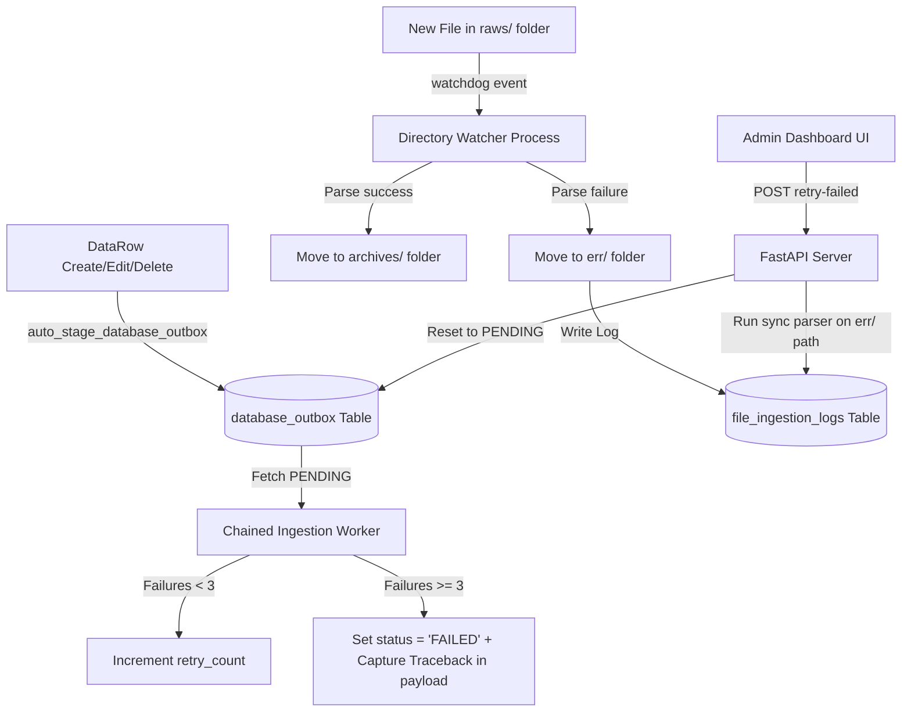

# Ingestion & Update Failure Management Specification

This specification documents the architecture, data models, file movements, APIs, and dashboard interface of the **Ingestion & Update Failure Management System** in AssyManager.

---

## 1. System Architecture Overview

The system isolates, logs, and manages recovery workflows for two types of failures:
1. **Outbox Ingestion Failures**: Quarantines failed database outbox events that fail to propagate downstream in the Chained Ingestion pipeline after multiple retries.
2. **File Ingestion Failures**: Quarantines raw files that fail parsing or pipeline match checks, preventing them from clogging the watchdog watcher directory.



---

## 2. Outbox Ingestion Failures

### 2.1 Failure Detection & Quarantine
When a database update occurs, an outbox record is automatically staged in the `database_outbox` table. The `chain_ingestion_worker` daemon continuously polls for unprocessed outbox events.
- **Retry Logic**: If the mapper or downstream chain application fails, the transaction is rolled back, and `retry_count` is incremented.
- **Quarantine**: If `retry_count` reaches **3**, the event status is set to `"FAILED"` and `processed_chain` is set to `True` (excluding it from normal worker cycles).
- **Diagnostics Capture**: An `error_log` object containing `failed_at` and `reason` (stack trace) is injected into the event's `payload` JSON field.

### 2.2 Transaction-Level Grouping
To maintain database consistency and clear UI representation:
- Individual outbox events are grouped by their logical `transaction_id`.
- The Admin dashboard groups individual failed records into unified transaction listings.
- Selecting a transaction shows a list of individual events in the sidebar, allowing granular stacktrace and payload investigation.

---

## 3. File Ingestion Failures

### 3.1 Failure Detection & Isolation
Files dropped into the table `raws/` folders are processed by the directory watcher. If parsing or parser plugin evaluation throws an unhandled exception:
- **Error Folder Migration**: The watcher catches the exception and immediately moves the file to a dedicated `err/` folder adjacent to `raws/` and `archives/`. This keeps the active watch folder clean and avoids infinite loop parsing.
- **File Directory Layout**:
  ```bash
  ingestion_workspace/
  └── [table_name]/
      ├── raws/       # Active watchdog ingestion directory
      ├── archives/   # Successfully processed files
      └── err/        # Isolated failure files
  ```

### 3.2 Database Logging
A log record is written to the `file_ingestion_logs` table containing:
- `filename`: Unique filename in the workspace.
- `filepath`: Absolute path of the isolated file in the `err/` directory.
- `table_name`: Target table.
- `status`: `"FAILED"` (updated to `"SUCCESS"` upon successful replay).
- `error_message`: Full traceback/reason of the parser pipeline failure.
- `retry_count`: Total number of manual replay attempts.

---

## 4. API Specification

### 4.1 Outbox Failed APIs
* **`GET /admin/outbox/failed`**:
  * **Parameters**: `page` (default: 1), `limit` (default: 10)
  * **Behavior**: Fetches failed outbox records, groups them in-memory by `transaction_id`, sorts them by the newest event ID descending, and returns paginated transaction details.
  * **Response**:
    ```json
    {
      "status": "success",
      "total": 5,
      "page": 1,
      "limit": 10,
      "data": [
        {
          "transaction_id": "tx_uuid_1234",
          "table_names": ["production_plan"],
          "event_types": ["CREATE"],
          "retry_count": 3,
          "failed_at": "2026-06-09T06:23:47",
          "events": [
            { "id": 42, "event_type": "CREATE", "payload": { "error_log": { "reason": "Traceback..." } } }
          ]
        }
      ]
    }
    ```
* **`POST /admin/outbox/retry-failed`**:
  * **Parameters**: `event_id` (optional), `transaction_id` (optional)
  * **Behavior**: Resets status of matched quarantined outbox records to `"PENDING"`, resetting `retry_count` to 0 and `processed_chain` to `False`, forcing the background worker to re-process the batch.

### 4.2 File Ingestion Failed APIs
* **`GET /admin/file-ingestion/failed`**:
  * **Parameters**: `page` (default: 1), `limit` (default: 10)
  * **Behavior**: Returns a paginated list of failed file logs from `file_ingestion_logs` ordered by ID descending.
* **`POST /admin/file-ingestion/retry-failed`**:
  * **Parameters**: `log_id` (optional)
  * **Behavior**: Executes ingestion replay synchronously inside a non-blocking thread (`asyncio.to_thread`) using the `IngestionHandler` parser pipeline directly on the archived path in the `err/` directory. If it succeeds, the database log is updated to `"SUCCESS"`, and a WebSocket push updates client views.

---

## 5. Admin Dashboard UI (`admin.html` / `admin.js`)

The dedicated Admin interface utilizes a sleek dark Glassmorphism dashboard split into two sections:
1. **Left Panel (Master Tab List)**:
   - Contains a toggle tab bar separating **Outbox Failures** and **File Ingestion Failures**.
   - Outbox failures show grouped transaction details (Transaction ID, Target Tables, Actions).
   - File failures show isolated log details (Log ID, Filename, Actions).
   - Bottom area displays custom, unified **Pagination Footer Controls** (Prev, Page indicator, Next).
2. **Right Panel (Diagnostics Sidebar)**:
   - When an Outbox Transaction is selected, shows a list of badged event pills. Selecting a pill loads its specific error traceback and raw JSON payload.
   - When a File Ingestion log is selected, displays the parsed python traceback error message and raw file metadata.
   - Provides individual "Retry" and global "Retry All Failed" action buttons.
