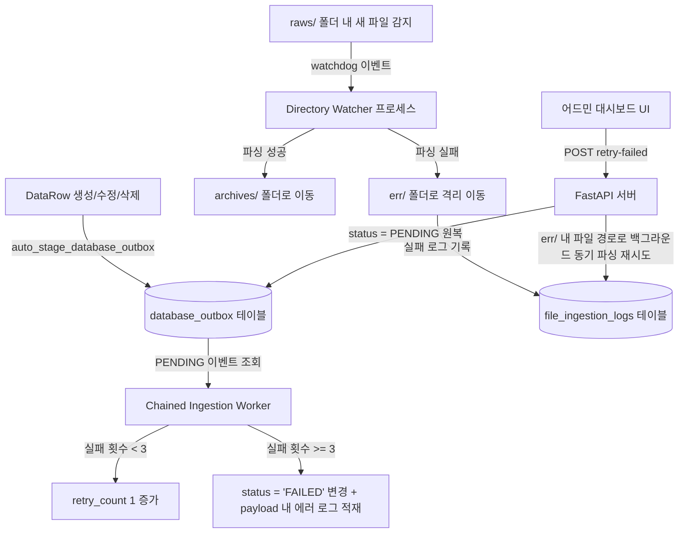

# Ingestion & Update Failure Management Specification (인제션 및 업데이트 실패 관리 상세 정의서)

> **Status:** 🟢 Living | **Last-verified:** 2026-08-06 | **Owner:** Backend / Ops
> ⚠️ **[2026-08-06 상태 헤더 신설]** README가 이 문서를 🟢로 배지하는데 **파일 자신에는 상태 표시가 없었습니다** — README를 거치지 않고 파일을 연 독자는 이 문서가 현행인지 알 수 없었습니다. 🔴 **라인 앵커를 인용하지 마십시오** — 이 저장소의 문서 앵커는 2026-08-06 감사에서 대부분 낡아 있었고, 그 뒤 규율은 **심볼을 인용하고 라인 번호를 들지 않는 것**입니다(예외는 `CODE_MAP.md` 하나).

AssyManager에서 오류가 발생한 데이터를 격리하고 로깅 및 복구 작업을 수행하는 **업데이트 실패 이력 관리 구조**에 대한 상세 명세서입니다.

---

## 1. 시스템 아키텍처 개요 (System Architecture)

본 시스템은 두 가지 주요 오류 유형에 대한 격리 및 복구 워크플로우를 처리합니다:
1. **아웃박스 인제션 실패 (Outbox Ingestion Failures)**: DB 데이터를 다른 downstream 시스템(예: Neo4j)으로 동기화하거나 Chained Ingestion 규칙에 따라 연쇄 업데이트할 때 실패가 지속되면, 해당 아웃박스 이벤트를 격리 상태로 설정하고 오류 메시지를 로깅합니다.
2. **파일 인제션 실패 (File Ingestion Failures)**: 디렉토리 감지기(Directory Watcher)가 수신한 파일을 파싱하거나 파서 파이프라인을 실행하는 과정에서 에러가 날 경우, 해당 파일을 격리하고 DB 로그에 기록합니다.



---

## 2. 아웃박스 인제션 실패 관리 (Outbox Ingestion Failures)

### 2.1 실패 감지 및 격리 (Failure Detection & Quarantine)
DB 데이터 생성, 변경, 삭제 발생 시 데이터 변경분이 `database_outbox` 테이블에 PENDING 상태로 적재됩니다. 백그라운드 데몬인 `chain_ingestion_worker`가 이를 감지하여 처리합니다.
- **재시도 로직**: 매퍼 실행이나 Target 테이블 벌크 업데이트 중 오류 발생 시 DB 트랜잭션이 Rollback되며 `retry_count`가 1 증가합니다.
- **격리 (Quarantine)**: `retry_count`가 **3회**에 도달하면, 해당 이벤트들의 `status`를 `"FAILED"`로 설정하고 `processed_chain` 플래그를 `True`로 처리하여 일반 워커 탐색 쿼리 대상에서 제외(격리)합니다.
- **실패 사유 기록**: 실패 원인이 된 **실제 파이썬 예외 스택 트레이스(Exception Traceback)** 정보가 `error_log` 객체의 `reason` 필드에 기록되어 해당 아웃박스 이벤트의 `payload`에 최종 저장됩니다.

### 2.2 트랜잭션 단위 그룹화 (Transaction-Level Grouping)
DB의 일관성을 유지하고 직관적인 UI 화면을 구성하기 위해:
- 실패한 개별 아웃박스 레코드들은 동일한 `transaction_id` 단위로 묶여 관리됩니다.
- 어드민 대시보드 UI 리스트에서는 개별 레코드가 아닌 하나의 트랜잭션 그룹 단위로 표현됩니다.
- 특정 트랜잭션을 선택하면 우측 진단 뷰어에 트랜잭션에 속한 개별 이벤트 목록이 배지로 표시되며, 클릭 시 각 이벤트의 상세 페이로드와 에러 스택 트레이스를 조회할 수 있습니다.

---

## 3. 파일 인제션 실패 관리 (File Ingestion Failures)

### 3.1 실패 감지 및 파일 격리 (Failure Detection & Isolation)
업로드되거나 감지 폴더에 들어온 로그 파일이 파서 파이프라인 실행 중 예외를 발생시키면:
- **오류 폴더 격리**: Watcher가 에러를 캐치한 즉시 해당 파일을 `raws/` 폴더에서 동일 워크스페이스 내의 전용 **`err/`** 폴더로 강제 이동시킵니다. 이를 통해 Watcher가 동일 파일을 무한 반복하여 파싱 감지하는 현상을 방지하고 입력 폴더를 깨끗하게 유지합니다.
- **워크스페이스 폴더 구조**:
  ```bash
  ingestion_workspace/
  └── [table_name]/
      ├── raws/       # Watchdog 감지 대상 파일 업로드 폴더
      ├── archives/   # 정상적으로 파싱이 완료되어 보관된 파일 폴더
      └── err/        # 파싱 실패로 격리 보관된 파일 폴더
  ```

### 3.2 데이터베이스 로깅 (Database Logging)
실패한 인제션에 대한 세부 사항은 `file_ingestion_logs` 테이블에 다음과 같이 저장됩니다:
- `filename`: 워크스페이스 내 유일하게 인코딩된 파일명.
- `filepath`: 격리 보관된 `err/` 폴더 내의 절대 경로.
- `table_name`: 대상 테이블 명칭.
- `status`: `"FAILED"` (재시도 성공 시 `"SUCCESS"`로 업데이트).
- `error_message`: 발생한 **파이썬 예외 스택 트레이스 (Exception Traceback)**.
- `retry_count`: 사용자가 수동으로 재시도를 호출한 누적 횟수.

---

## 4. API 사양 (API Specification)

### 4.1 아웃박스 실패 관리 API
* **`GET /admin/outbox/failed`**:
  * **파라미터**: `page` (기본값: 1), `limit` (기본값: 10)
  * **동작**: 실패 상태의 아웃박스 이벤트를 불러와 `transaction_id` 단위로 인메모리 그룹화 후, 최신 트랜잭션 순으로 정렬하여 페이지네이션된 결과를 반환합니다.
  * **응답 예시**:
    ```json
    {
      "status": "success",
      "total": 5,
      "page": 1,
      "limit": 10,
      "data": [
        {
          "transaction_id": "tx_uuid_1234",
          "table_names": ["production_plan"],
          "event_types": ["CREATE"],
          "retry_count": 3,
          "failed_at": "2026-06-09T06:23:47",
          "events": [
            { "id": 42, "event_type": "CREATE", "payload": { "error_log": { "reason": "Traceback..." } } }
          ]
        }
      ]
    }
    ```
* **`POST /admin/outbox/retry-failed`**:
  * **파라미터**: `event_id` (선택), `transaction_id` (선택)
  * **동작**: 대상 격리 아웃박스 이벤트를 다시 `"PENDING"` 상태로 원복하고 `retry_count`를 0, `processed_chain`을 `False`로 변경하여 워커가 즉시 재처리하도록 유도합니다.

### 4.2 파일 인제션 실패 관리 API
* **`GET /admin/file-ingestion/failed`**:
  * **파라미터**: `page` (기본값: 1), `limit` (기본값: 10)
  * **동작**: `file_ingestion_logs` 테이블에서 status가 FAILED인 로그 목록을 최신 ID 순으로 페이지네이션하여 반환합니다.
* **`POST /admin/file-ingestion/retry-failed`**:
  * **파라미터**: `log_id` (선택)
  * **동작**: 백그라운드 스레드(`asyncio.to_thread`)를 기동하여 `err/` 폴더 내 보관 중인 격리 파일을 읽어 파서 파이프라인을 재수행합니다. 성공 시 로그의 status를 `"SUCCESS"`로 수정하고 에러 필드를 초기화하며, 실시간 WebSocket 리프레시 이벤트를 UI 클라이언트에 전송합니다.

---

## 5. 어드민 대시보드 화면 명세 (Admin Dashboard UI)

어드민 화면(`admin.html`)은 세련된 어두운 Glassmorphism 스타일을 지닌 2단 화면으로 나뉩니다:
1. **좌측 패널 (실패 목록 탭 및 페이지네이션)**:
   - 상단 탭 전환 버튼을 통해 **아웃박스 실패 이력**과 **파일 인제션 실패 이력** 목록을 토글합니다.
   - 아웃박스는 트랜잭션 그룹 단위, 파일 인제션은 로그 ID 단위로 그리드에 바인딩됩니다.
   - 하단 공통 **페이지네이션 푸터 컨트롤**을 통해 이전/현재 페이지 수/다음 버튼 조작 및 텍스트(`Showing 1-10 of 25 items`)를 동적으로 업데이트합니다.
2. **우측 패널 (오류 진단 뷰어)**:
   - 아웃박스 트랜잭션을 선택하면 상단에 **이벤트 선택 영역(배지 목록)**이 나타납니다. 여러 이벤트 중 특정 배지를 클릭하여 각 데이터의 에러 트레이스와 상세 Payload JSON을 개별적으로 조회합니다.
   - 파일 인제션 실패 로그를 선택하면 파싱 중 발생한 Traceback 에러 원문과 파일 절대경로 등의 메타데이터를 즉시 출력합니다.
   - 단건 수동 재시도("Retry") 및 대량 일괄 재실행("Retry All Failed") 기능을 지원합니다.
