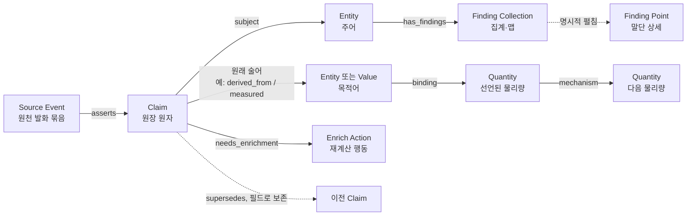

# Ledger Evidence Subgraph — 증거 노드와 문맥별 탐색

> **Status:** Living · **Last verified:** 2026-08-15
> **정본 코드:** `server/ledger_subgraph.py`, `server/enrichment_actions.py`, `server/ledger/envelope.py`,
> `server/ledger/schema.py`, `server/ledger/store.py`, `client2/src/ledger_graph/`
> **라우트 정본:** `docs/architecture/backend.md` §2
> **범위:** 원장 증거를 보는 읽기 모델. `/trace`의 해소 결과나 R&D 원인 후보를 대체하지 않는다.
> **Finding 정본:** Collection 집계, Point 상세, 방향별 탐색과 일반화 정책은
> [RND_ONTOLOGY_REFERENT_MODEL](./RND_ONTOLOGY_REFERENT_MODEL.md)이 소유한다.

## 0. 한 문장

`GET /api/ledger/subgraph`는 원장 사본을 만들지 않고 `ledger_events`를 직접 읽어,
**Entity·Source Event·Claim·Finding Collection·Finding Point·Enrich Action 중 어느 노드든
시작점으로 삼는 유계 증거 그래프**를 반환한다. Finding은 seed의 질문 방향에 따라
집계·말단·차단 동작이 달라지고, Action은 현재 결손에서 다시 계산되는 말단 투영이다.

## 1. 왜 세 노드인가

종전 인스턴스 그래프는 개체 관계를 직접 선으로 합치고, 값 주장은 같은 모양끼리 한 노드로 접었다.
그 화면은 혈통의 큰 모양을 보기는 좋았지만 다음 질문에 답하지 못했다.

1. 이 관계를 만든 **원장 원자 한 건**은 무엇인가?
2. 공정·계측·이동 주장 여러 건이 **같은 원천 사건에서 함께 발화**했는가?
3. 같은 값이 여러 번 관측됐을 때 각각의 시각·출처·원문 참조는 무엇인가?
4. 개체가 아닌 주장이나 사건을 선택해 **그 자리에서 다시 서브그래프를 열 수 있는가?**

그래서 세 신원을 분리한다.

| 노드 | 뜻 | 지속성 | 예 |
|---|---|---|---|
| **Entity** | 공정 세계에서 계속 같은 것으로 추적할 개체 | 여러 사건을 가로질러 지속 | Lot, Wafer, Equipment, Recipe |
| **Source Event** | 한 소스가 한 번에 발화한 원천 사건/분자 | 한 `source + occurrence` 경계 | split 한 건, DT job run 한 건, inspection row 한 건 |
| **Claim** | 사건이 낸 불변 주장 원자 한 건 | append-only 행 한 건 | `processed_with`, `measured`, `derived_from` |
| **Finding Collection** | observed Claim의 집계 읽기 투영 | 조회 snapshot | void·SAT·map A의 count/mean/bbox |
| **Finding Point** | 개별 맵 좌표 상세 투영 | observed Claim 한 건 | void @ (7,9). 일반 Entity처럼 자동 순회하지 않음 |
| **Enrich Action** | 아직 필요한 Claim을 얻기 위한 행동 투영 | 조회 snapshot | 후보 확인, Claim 공급 경로 선언, Enrichment 배포 계약 복구 |
| **Quantity** | 기전 모델이 선언한 물리량 | `mechanism_models.json` 선언 | `bond_pressure`, `interface_unfill`, `void` |

### 1.1 Event가 아닌 것

여기서 Event는 서로 다른 소스의 기록을 “같은 물리 사건”이라고 합친 도메인 사건이 아니다.
그 판정은 별도 온톨로지 주장(`same_as` 계열을 향후 선언할 경우)의 책임이다. 현재 Event는 오직
**같은 소스 발화 묶음에 속했다는 구조적 사실**만 말한다. 이 선을 넘으면 동시각이라는 이유로
서로 다른 장비·잡·검사를 하나로 합치는 거짓이 생긴다.

## 2. 그래프 문법



반환 엣지는 방향을 보존한다. 탐색은 사용자가 어느 노드에서 시작해도 되도록 연결을 양방향으로
따라가지만, 응답의 화살표를 뒤집지 않는다.

| 엣지 `predicate` | source → target | 뜻 |
|---|---|---|
| `asserts` | Event → Claim | 이 원천 사건이 이 주장 원자를 발화했다 |
| `subject` | Claim → Entity | 이 주장이 이 개체에 대한 말이다 |
| 원래 원장 술어 | Claim → Entity/Value | 이 주장의 목적어다. `qualifiers`는 엣지에 보존 |
| `needs_enrichment` | Claim → Enrich Action | 이 Claim 문맥에서 부족한 다음 Claim 또는 공급 계약이 있다 |
| `binding` | Value → Quantity | 이 payload 필드가 이 물리량을 잰다. `qualifiers`에 `binding_key`·`model` |
| `mechanism` | Quantity → Quantity | 선언된 인과 엣지. `qualifiers.dir`은 선언의 `dir` 그대로(`+`/`-`/`u`) |

Quantity는 원장 원자가 아니라 `server/config/mechanism_models.json`에서 **합성**된다. 선언에
노드·엣지를 더하면 코드 변경 없이 화면에 나타나고, 선언이 없거나 읽히지 않으면 Quantity 노드가
하나도 나오지 않는다(예외가 아니라 상태 — `mechanism_gate.load()`의 규칙 그대로). 🔴 **같은 이름의
물리량이라도 모델이 다르면 다른 노드다** — `bond_pressure`는 `void_formation`과 `delam_formation`
양쪽의 노드이고, 하나로 합치면 두 모델러의 단언이 아무도 하지 않은 제3의 단언으로 이어 붙는다.
`mechanism` 걷기는 프론티어 물리량이 속한 모델을 벗어나지 않는다.

Enrich Action은 `ledger_events`에 쓰지 않는다. 검증된 `claim_contract`와 현재 derived row를
합성한 projection이고, target이 채워지면 같은 조회에서 사라진다. 반대로 source/table 계약 자체가
빠졌으면 decision key마다 복제하지 않고 rule당 `source_contract` Meta Action 하나로 접는다.

Claim 노드에는 `predicate`, `object_kind`, `object_payload`, `occurred_at`, `source_who`,
`source_translator_ver`, `source_raw_ref`, `supersedes`가 그대로 있다. 이것은 요약 문자열을 다시
파싱하지 않고도 좌측 상세 패널이 원문 근거를 보여 주게 한다.

## 3. 저장 계약

### 3.1 새 컬럼

`ledger_events`의 기존 11개 주장 컬럼 뒤에 구조 상관 컬럼 둘을 더한다.

| 컬럼 | 타입 | 새 적재 | 뜻 |
|---|---|---|---|
| `source_event_id` | UUID | 필수 | 한 소스 발화 묶음의 불투명 안정 신원 |
| `source_event_state` | TEXT | 필수 | `source_molecule` \| `source_record` \| `legacy_atom` |

둘은 주장 의미나 해결 우선순위에 참여하지 않는다. 따라서 `uq_ledger_atom`의 dedupe 키에도 넣지
않는다. 번역기 버전이 바뀌거나 묶음 구현이 정정됐다는 이유로 동일 주장이 중복 착지하면 안 되기
때문이다.

### 3.2 신원 계산

공식 쓰기 경로는 INSERT 직전에 `Atom.ensure_source_event_identity()`를 부른다.

```text
source_molecule = UUIDv5(namespace,
  canonical[source_who, "source_molecule", molecule_ref, occurred_at_utc])

source_record = UUIDv5(namespace,
  canonical[source_who, "source_record", source_raw_ref, occurred_at_utc])
```

- 분자 번역기는 `molecule_ref`를 사용한다. 한 원천 사건이 여러 Claim을 만들면 UUID가 같다.
- 단일 행이 곧 사건인 생산자는 필수 `source_raw_ref`를 사용한다.
- UTC 발생시각을 포함하므로 소스가 나중에 같은 트랜잭션 표지를 재사용해도 사건이 합쳐지지 않는다.
- 원시 `molecule_ref` 문자열은 여전히 저장하지 않는다. 소비자가 읽는 것은 비가역 UUID뿐이다.
- 네임스페이스 UUID는 저장 계약이다. 바꾸면 재적재 시 같은 사건이 둘이 된다.

### 3.3 과거 데이터

과거 원장에는 `molecule_ref`가 없으므로 원래 묶음을 복원할 방법이 없다. 운영자가 기존 원장을
유지해야 할 때만 `add_ledger_source_events.py --apply`를 쓰며, 이 경우 각 과거 Claim은 자기 자신을
이벤트로 갖는 `legacy_atom`이 된다. 여러 과거 Claim을 시각·출처 유사성으로 합치지 않는다.

이 프로젝트의 기본 운영 방향은 **새 번역으로 다시 적재해 `source_molecule`/`source_record`를 얻는
것**이다. `legacy_atom` 호환은 과거 데이터 보존이 필요한 환경을 위한 선택지이지 분석 정본이 아니다.

## 4. 노드 ID 계약

모든 ID는 클라이언트가 내용을 조립하거나 수정하지 않는 불투명 문자열이다. 서버는 디코드한 뒤
같은 규칙으로 재인코딩해 철자가 정확히 같을 때만 받는다.

| 노드 | 접두 | 내부 앵커 |
|---|---|---|
| Entity | `ledger-entity:v1:` | `[entity_type, structured_keys]` |
| Event | `ledger-event:v1:` | `[source_event_id, occurred_at, state]` |
| Claim | `ledger-claim-atom:v1:` | `[claim_id, occurred_at]` |
| Finding Collection | `ledger-finding-collection:v1:` | `[subject_type, keys, finding_kind, method, map_id]` |
| Finding Point | `ledger-finding-point:v1:` | `[observed_claim_id, occurred_at]` |
| Value | `ledger-value:v1:` | `[parent_claim_id, occurred_at]` |
| Enrich Action | `ledger-enrich-action:v1:` | `[rule_name, contract_version, scope, decision_key 또는 null]` |
| Quantity | `ledger-quantity:v1:` | `[model_name, quantity_name]` — 모델 이름이 신원의 일부다 |

Claim과 Event ID에 `occurred_at`을 함께 넣은 이유는 월 파티션을 정확히 가지치기하기 위해서다.
Claim의 물리 PK도 `(id, occurred_at)`이다. UUID만 넘겨 모든 파티션을 뒤지는 API를 만들지 않는다.

## 5. API

### 5.1 요청

```http
GET /api/ledger/subgraph
  ?id=<opaque-node-id>
  &hops=12
  &direction=both
  &include_values=true
  &observations=summary
  &enrich_actions=true
  &node_limit=400
  &edge_limit=1200
  &shape=graph
  &property_limit=10000
```

| 파라미터 | 필수 | 기본 | 허용 범위 | 의미 |
|---|---:|---:|---|---|
| `id` | 예 | — | 위 ID 중 하나 | 탐색 시작 노드. 응답의 어떤 노드 ID든 그대로 재사용 |
| `hops` | 아니오 | 12 | 1..40 | 구조 홉. Entity→Claim→Entity는 2홉임을 감안한 상한 |
| `direction` | 아니오 | `both` | `outgoing`, `incoming`, `both` | Entity에서 주어 주장/목적어 주장을 어느 쪽으로 인출할지. Claim의 구조 별은 항상 보존 |
| `include_values` | 아니오 | `true` | bool | value/event_ref/objectless 목적어를 Value 노드로 펼칠지. false여도 Claim payload는 남음 |
| `observations` | 아니오 | `summary` | `summary`, `claims` | Wafer finding을 Collection으로 접거나 원시 observed Claim을 감사용으로 펼침 |
| `enrich_actions` | 아니오 | `true` | bool | Claim에서 현재 Enrich Action을 투영. false면 원장 증거만 반환 |
| `node_limit` | 아니오 | 400 | 10..1000 | 응답 노드 하드캡 |
| `edge_limit` | 아니오 | 1200 | 20..3000 | 응답 엣지 하드캡 |
| `shape` | 아니오 | `graph` | `graph`, `tables` | 캔버스 그래프 또는 외부도구용 3장표 |
| `property_limit` | 아니오 | 10000 | 100..20000 | `shape=tables`의 동적 property long-table 행 상한 |

내부 Claim scan 상한은 `min(5000, max(200, edge_limit × 2))`다. 요청자가 직접 늘릴 수 없다.

### 5.1-bis 부호 있는 씨앗과 `collect` — 함수 계약

⚠️ **오늘 라우트가 이 둘을 실어 나르지 않는다.** `ledger_subgraph.subgraph()` 는 받고,
`/api/ledger/subgraph` 에는 아직 쿼리 파라미터가 없다. 둘을 붙이는 자리는
`ledger_trace_router.py` 이고 그것은 이번 라운드의 얼음 목록에 있다.

```python
subgraph({"positive": [id, ...], "negative": [id, ...]}, lookup, collect="quantity")
subgraph(id, lookup)                      # 오늘과 같다 — positive 씨앗 하나
```

| 인자 | 필수 | 기본 | 의미 |
|---|---:|---:|---|
| `seed_id` | 예 | — | 불투명 id 하나, 또는 `{"positive": [...], "negative": [...]}` |
| `collect` | 아니오 | `None` | 산출을 노드 종류 하나로 좁힌다. 없으면 순위를 내지 않는다 |

🔴 **부호는 셋이고 셋이다.**

    +          관측됐다
    −          «봤는데 안 났다» — 대조군
    목록에 없음  미검사. − 와 같은 사실이 아니고, 목록에 없다는 이유로 대조군이 되지 않는다

`negative` 가 비었으면 대조 축은 «재지 않은 것»이지 «모두 깨끗했던 것»이 아니다 —
응답의 `propagation.contrast` 가 `unexamined` 로 그것을 이름 대어 말한다.

**전파 규칙은 둘이고 셋째는 없다.**

    첫 홉(씨앗 -> 요인)   차수로 나누지 않는다 — 나누면 한 주어가 단지 Claim 을
                            적게 가졌다는 이유로 그 요인이 이긴다
    그다음                내보내는 노드의 차수로 나눈다
    감쇠 상수             없다. 기본값으로도 들여오지 않는다

**산출은 순위와 최상위 집합뿐이다.** 도달량은 순위를 정하고 응답을 나가지 않는다 —
판정은 소유자가 한다. 최상위는 «지배당하지 않는 것 전부»이고, 한 쪽은 표시에서
더 많고 다른 쪽은 대조군에서 더 많으면 둘은 «정도가 아니라 종류가 다르다»고
`incomparable` 로 표시된다.

🔴 **`collect` 는 «모집단»만 고르고 걷기를 바꾸지 않는다.** 같은 씨앗으로
`collect: quantity` 는 원인 후보를, `collect: entity` 는 혈통 공통 조상을 낸다 —
둘을 가르는 분기가 코드에 «하나도» 없고, 그래서 문서가 아니라 구조가 그것을
지킨다. 새 응용은 새 코드가 아니라 이 인자의 새 값이다. ⚠️ 반대로 `collect` 는
그래프를 줄이지도 «않는다»: 근거 경로가 다른 종류의 노드를 관통하므로
모집 종류만 남기면 근거가 사라진다. 그래프 상한은 여전히 `node_limit` 이다.

### 5.2 응답 골격

```json
{
  "schema_version": 3,
  "state": "ready",
  "seed": {"id": "...", "node_kind": "entity"},
  "seeds": [{"id": "...", "sign": "+", "node_kind": "entity"}],
  "nodes": [],
  "edges": [],
  "propagation": {
    "collect": "quantity",
    "state": "ranked",
    "contrast": "contrasted",
    "complete": true,
    "ranked": [{"id": "...", "type": "Quantity", "label": "bond_pressure · void_formation",
                "rank": 1, "top": true, "tied": true, "incomparable": false,
                "evidence": [{"seed": "...", "sign": "+", "hops": []}]}],
    "top_set": ["..."],
    "message": null
  },
  "walk": {
    "mode": "evidence_graph",
    "direction": "both",
    "observation_mode": "summary",
    "collect": "quantity",
    "start": {"positive": 3, "negative": 0},
    "hops_requested": 12,
    "hops_reached": 5,
    "claims_scanned": 60,
    "actions_scanned": 2,
    "enrich_actions": true,
    "raw_claims": true,
    "resolver_applied": false
  },
  "limits": {"nodes": 400, "edges": 1200, "claims": 2400, "actions": 1200, "max_hops": 40},
  "truncated": {
    "depth": false, "nodes": false, "edges": false, "claims": false, "actions": false,
    "reason": null
  },
  "message": null
}
```

비-finding Claim은 정정 전 원자를 그대로 보존한다. finding은 기본적으로 Collection 집계를 쓰며,
`observations=claims`에서만 observed Claim을 직접 펼친다. 어느 경로도 `live_claims()`나 4계급
resolver로 승자만 남기지 않는다. 해결된 혈통 답은 `/trace`,
R&D 비교·놀라움 답은 `/selection/resolve`가 소유한다.

### 5.2-bis Spotfire/Excel 표 투영

`shape=tables`는 같은 BFS 결과를 별도 데이터 세계로 복제하지 않고 세 장표로 접는다.

| 장표 | grain | 안정 join key | 용도 |
|---|---|---|---|
| `nodes` | 그래프 노드 1개/행 | `node_id` | 노드 종류·라벨·깊이·시각·출처 필터 |
| `edges` | 그래프 엣지 1개/행 | `source_id`, `target_id` → `nodes.node_id` | 관계 네트워크·path 분석 |
| `properties` | 동적 속성 scalar 1개/행 | `node_id` | 새 metric/payload를 코드 변경 없이 pivot |

`properties`는 `property_scope`, `property_path`, `value_type`, `value_text`, `value_number`,
`value_boolean`, `is_null`을 분리한다. 숫자를 문자열 하나에 넣지 않으므로 Spotfire 연속축·Excel 수식이
동작하고, 새 속성 이름은 새 컬럼이 아니라 새 행으로 나타난다.

한 장표만 필요한 도구는 다음을 직접 읽는다.

```http
GET /api/ledger/subgraph/table
  ?id=<opaque-node-id>
  &table=nodes|edges|properties
  &format=json|csv
  &hops=12&direction=both&include_values=true
```

- JSON은 `{columns[], rows[]}`와 walk/limits/truncated/provenance를 함께 준다.
- CSV는 UTF-8 BOM + CRLF라 한국어 Excel에서 바로 열린다.
- 문자열이 `=`, `+`, `-`, `@`로 시작하면 CSV formula 실행을 막기 위해 `'`를 앞에 붙인다.
  실제 `value_number` 수치는 문자열로 바꾸지 않는다.
- 세 장표를 한 snapshot으로 받아야 하면 `shape=tables` 한 요청을 사용한다. 장표별 CSV 세 요청은
  append-only 원장에 새 원자가 들어오는 사이 서로 다른 `generated_at`을 가질 수 있다.

### 5.3 실패와 빈 결과

| HTTP/상태 | `reason` 또는 뜻 | 처리 |
|---|---|---|
| 200 `ready` | 연결 증거 있음 | 그래프 렌더 |
| 200 `empty` | seed는 유효하지만 연결 증거 없음 | seed 1개와 설명을 렌더 |
| 422 | `subgraph_request_invalid` | ID 철자, 방향, 범위 오류를 이름 대어 표시 |
| 503 | `source_event_projection_not_deployed` | 컬럼/필수 인덱스 중 빠진 이름을 `missing[]`에 반환 |
| 503 | 원장 relation absent | 기존 `/coverage`와 같은 배포 부재 처리 |

## 6. 탐색 알고리즘

유계 BFS이며 홉마다 노드 종류를 묶어 한 번씩 질의한다. 노드별 N+1 질의를 하지 않는다.

1. `id`를 엄격 디코드하고 seed 노드를 깊이 0에 둔다.
2. 같은 깊이의 frontier를 Entity/Event/Claim/Collection/Point/Action으로 나눈다.
3. Entity frontier는 구조화 신원 배열을 `jsonb_to_recordset`으로 한 번 조인한다.
4. Event frontier는 `(source_event_id, occurred_at)` 배열을 한 번 조인한다.
5. Claim frontier는 물리 PK `(id, occurred_at)` 배열을 한 번 조인한다.
6. Wafer Entity의 observed는 기본 Collection으로 집계하고 개별 Claim을 자동으로 인출하지 않는다.
7. Collection seed는 정확히 일치하는 observed Claim을 Point로 투영하되 Point를 다음 frontier에 넣지 않는다.
8. Point seed는 근거 Claim의 subject Wafer와 그 Wafer의 Collection까지만 열고 일반 Claim/Event로 자동 확장하지 않는다.
9. 새로 읽은 Claim 묶음을 `claim_contract.anchor`에 정확 매칭하고, target이 비었을 때만
   `needs_enrichment`로 Action을 붙인다. 자동 walk는 Action에서 멈춘다.
10. Action ID를 직접 seed로 다시 주면 현재 rule/row를 재평가해 Action 상세를 돌려준다.
11. 이미 본 Claim과 노드는 ID로 dedupe한다. 깊이는 최초 최소값을 유지한다.
12. 어느 예산이든 닿으면 즉시 `truncated.<budget>=true`와 사유를 남긴다.

Action 투영은 reference-view candidate SQL을 실행하지 않는다. 검증된 rule과 이미 materialize된
derived row만 bounded/indexed로 읽는다. table 배포 검증에 실패한 rule은 row를 읽지 않고
`repair_enrichment_contract` Meta Action 하나로 바뀐다.

Entity의 reverse object 탐색은 payload 전체를 문자열로 훑지 않는다. 다음 exact expression index를 쓴다.

| 인덱스 | 소비 질의 |
|---|---|
| `idx_ledger_source_event (source_event_id, occurred_at, id)` partial | Event → Claims |
| `idx_ledger_object_entity ((object_payload->>'type'), (object_payload->'keys'))` partial | Entity ← object Claim |
| `idx_ledger_subject_entity (subject_type, subject_keys)` | Entity ← subject Claim |
| PK `(id, occurred_at)` | Claim seed |

기존 파티션이 있는 환경의 두 신규 인덱스는 parent에서 동기 전체 빌드하지 않는다. 마이그레이션이
`ON ONLY parent` 메타 인덱스 → 자식별 `CREATE INDEX CONCURRENTLY` → `ATTACH PARTITION` 순서로 만든다.
새 빈 원장은 일반 DDL로 만들고 이후 월 파티션이 부모 인덱스를 상속한다.

## 7. Viewer 동작

경로는 `/ledger-graph.html?view=lineage`다.

- 오른쪽 `ENTITY CATALOG`는 어휘가 발급을 허용한 모든 Entity 타입과 실제 등록 신원을 보여 준다.
- 목록에서 Entity를 고르면 `/subgraph?id=<entity>`를 호출한다.
- 그래프 노드 목록에서 Entity/Event/Claim/Collection/Point/Value/Action ID를 같은 API에 보낸다.
- Wafer 재중심은 Collection까지만, Collection 재중심은 Point까지, Point 재중심은 Wafer→Collection까지만 연다.
- 캔버스 단일 클릭은 상세, 더블클릭은 재중심이다.
- 원은 Entity/Value, 둥근 사각형은 Claim, 마름모는 Source Event, 육각형은 Enrich Action이다.
- 좌측 Event 상세은 경계 상태·출처·시각을, Claim 상세은 술어·목적어 종류·발생시각·원문 참조·payload를 보여 준다.
- 방향과 값 노드 표시를 바꾸면 현재 seed로 다시 질의한다.
- AbortController와 요청 번호가 늦게 도착한 이전 응답을 폐기한다.
- 화면 모드 이름은 `Evidence`이고 하단에 항상 “해소 전 원시 증거”를 표시한다.
- 캔버스는 같은 API의 `shape=graph` 소비자다. Spotfire/Excel은 `shape=tables`/`subgraph/table` 소비자이며,
  어느 쪽도 별도 그래프 저장소나 별도 해석기를 갖지 않는다.

## 8. 기존 API와의 관계

| 질문 | API | 이유 |
|---|---|---|
| 이 랏의 해결된 혈통은? | `/trace` | resolver가 홉마다 승자·결측·경쟁 상태를 판정 |
| split/merge 분기를 간단히 보고 싶다 | `/explore` | live lineage claim만 직접 Entity 엣지로 투영 |
| 임의 Entity의 값 주장을 요약해 보고 싶다 | `/explore_entity` | 호환용 compact projection |
| 이 원자와 원천 사건까지 감사하고 싶다 | **`/subgraph`** | Event·Claim을 1급 노드로 보존, raw evidence |
| 결함군과 정상군의 차이/원인 후보는? | `/selection/resolve` | 집단 비교·기전 게이트·액션이 목적 |

따라서 `/subgraph`를 `/trace` 대신 쓰거나, Claim 수가 많다는 이유로 원인 후보를 만들면 안 된다.
증거 구조와 분석 판정은 서로 다른 메타 액션이다.

## 9. 검증 기준

자동 검증은 다음을 단언한다.

- 같은 source/molecule/time의 Atom 둘은 같은 Source Event ID다.
- source 또는 occurred_at이 다르면 Event ID가 다르다.
- Entity, Event, Claim 각각을 seed로 다시 열 수 있다.
- Claim에서 Enrich Action에 도달하고 같은 Action ID를 seed로 다시 열 수 있다.
- 바인딩된 payload 필드에서 Quantity에 도달하고 같은 Quantity ID를 seed로 다시 열 수 있다.
  선언되지 않은 필드는 엣지를 만들지 않고, 같은 이름의 물리량이라도 모델이 다르면 노드가 갈린다.
- 단일 id 씨앗과 부호 있는 씨앗 셋이 같은 함수로 돌고, `collect` 를 바꾸는 것만으로
  원인 후보와 혈통 공통 조상이 갈린다 — 두 호출의 노드 목록은 «같다».
- 씨앗의 차수가 달라도 그 씨앗의 요인은 같은 무게로 도달한다(첫 홉 미분할).
- 대조군 씨앗이 없으면 `contrast` 가 `unexamined` 이고, 그것은 «깨끗했다»가 아니다.
- target이 충족되면 Action이 사라지고, 공급 source가 없으면 rule-level Meta Action 하나만 남는다.
- 배포되지 않은 rule은 derived row를 읽지 않고 계약 복구 Action을 낸다.
- incoming과 outgoing이 실제로 다른 그래프를 만든다.
- `include_values=false`는 Value 노드만 빼고 Claim payload는 보존한다.
- `legacy_atom`은 여러 원자를 추정 병합하지 않는다.
- 노드 하드캡은 `truncated` 없이 조용히 끝나지 않는다.
- 비정준/위조 ID는 422가 된다.
- 클라이언트 모듈 구문 검사와 전체 Vite build가 통과한다.
- 라이브 개발 DB 읽기에서 Entity seed가 Entity/Event/Claim/Value 네 종류를 반환한다.

## 10. 남겨 둔 경계

1. `supersedes`는 Claim 상세에 보존하지만, 대상 Claim의 `occurred_at`이 원장 컬럼에 없으므로 이번 버전은
   자동 역탐색 엣지를 만들지 않는다. UUID만으로 전 파티션을 걷는 숨은 비용을 만들지 않기 위해서다.
2. Source Event는 cross-source physical event가 아니다. 같은 물리 사건 병합은 선언된 동일성 주장과 별도
   검증 규칙이 생긴 뒤 추가한다.
3. 큰 Wafer의 finding은 기본 Collection으로 접는다. `observations=claims`와 Collection→Point도
   400/1200/Claim scan cap을 UI 편의 때문에 풀지 않는다. 전체 점은 맵/표의 유계 페이지가 맡는다.
4. 과거 `legacy_atom`은 임시 호환이다. 새 재적재가 끝난 뒤 분석 예시는 반드시
   `source_molecule`/`source_record` 데이터를 사용한다.
