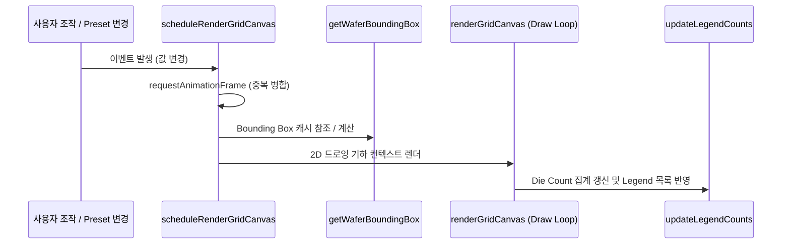

# Map Editor Specifications & Function Reference (MAP_EDITOR_SPEC.md)

본 문서는 `assyManager` 프로젝트의 2세대 격자 맵 에디터([`client2/src/map_editor.js`](file:///c:/Users/kk980/Developments/assyManager/client2/src/map_editor.js))에 구현된 모든 프론트엔드 자바스크립트 함수들의 설계 규격, 변환 공식 및 상세 API 레퍼런스를 정리합니다.

---

## 1. 격자 및 좌표계 아키텍처 (Coordinate System Architecture)

격자 맵 에디터는 **물리(Physical) 좌표계**, **화면 격자 셀 인덱스(Grid Cell Index)**, **시각(Visual/Standard) 좌표계**의 삼원화된 구조를 사용하여 웨이퍼 기판의 3D 공간적 물리 거동(회전, 면 반사)과 화면상의 2D 공간 표시를 매끄럽게 처리합니다.

### 1) 기하 변환 수식 (Geometric Transformation Formulas)

사용자가 설정한 `X Start`, `Y Start` 좌표는 **화면상에 보여지는 격자 내 유효 웨이퍼 영역 Bounding Box의 최소값(`box.minC`, `box.minR`)**의 좌표를 지칭합니다.

#### 화면 기준 웨이퍼 유효 셀 경계 상자 (Wafer Bounding Box)
격자 내부 영역($c \in [0, \text{visualCols}-1]$, $r \in [0, \text{visualRows}-1]$)에 속하는 셀 중, 물리 엔진 상 웨이퍼 유효 반경 내부인 셀들의 스크린 인덱스 최댓값/최소값 범위를 계산합니다.
$$\text{box} = \{ \text{minC}, \text{maxC}, \text{minR}, \text{maxR} \}$$

#### 시각 좌표 (Visual / Standard Coordinates) 계산
화면의 셀 눈금 `(c, r)`로부터 데이터베이스에 기록할 직교 좌표 `(xv, yv)`를 도출하는 수식입니다. 백면(Back Side) 미러링 반사 상태에 따른 X/Y축 축반전을 완벽히 보정합니다.

* **수평(X) 축 변환**:
  * X축이 좌우 반전되는 조건 ($\text{side} = \text{back}$ 이며 90°/270° 회전이 아닐 때):
    $$xv = \text{box.maxC} - c + \text{startX}$$
  * 그 외의 모든 경우 (일반 방향):
    $$xv = c - \text{box.minC} + \text{startX}$$

* **수직(Y) 축 변환**:
  * Y축이 상하 반전되는 물리적 조건 ($\text{side} = \text{back}$ 이며 90°/270° 회전일 때 Y축이 물리적으로 미러링):
    $$\text{isYMirrored} = (\text{side} = \text{back} \land \text{rotation} \in \{90, 270\})$$
  * `invertY` (Y축 방향 역전 옵션)와 `isYMirrored` 상태의 조합에 따라 분기:
    * **`invertY`가 `false` (상->하 증가) 일 때**:
      * $\text{isYMirrored} = \text{false}$: $yv = r - \text{box.minR} + \text{startY}$
      * $\text{isYMirrored} = \text{true}$: $yv = \text{box.maxR} - r + \text{startY}$
    * **`invertY`가 `true` (하->상 증가) 일 때**:
      * $\text{isYMirrored} = \text{false}$: $yv = \text{box.maxR} - r + \text{startY}$
      * $\text{isYMirrored} = \text{true}$: $yv = r - \text{box.minR} + \text{startY}$

---

## 2. 상태 관리 변수 (State Variables)

| 변수명 | 타입 | 설명 |
| :--- | :--- | :--- |
| `currentRotation` | `number` | 현재 화면 격자의 회전 상태 (`0`, `90`, `180`, `270`) |
| `currentSide` | `string` | 웨이퍼의 앞/뒷면 설정 (`"front"`, `"back"`) |
| `activeBrush` | `string` | 현재 팔레트에서 선택되어 격자에 색칠할 값(Legend Value) |
| `gridData` | `object` | 기판 고유 물리 좌표 키(`"${xp}_${yp}"`)를 기준으로 맵핑된 칩 값 매트릭스 |
| `gridCells2D` | `object` | 스크린 인덱스 `gridCells2D[r][c]` 기준으로 맵핑된 시각/물리 좌표 정보 캐시 |
| `isOriginMode` | `boolean` | 사용자가 마우스 클릭으로 `(0, 0)` 원점의 위치를 직접 지정하는 모드 활성화 여부 |
| `isPainting` | `boolean` | 마우스 드래그를 이용해 격자에 연속 페인팅을 수행 중인지 여부 |
| `isRightDrag` | `boolean` | 마우스 오른쪽 버튼을 드래그하여 연속 지우개(Erase)를 수행 중인지 여부 |
| `boundingBoxCache` | `object` | 각 각도/직경/칩 피치 기하 설정별 웨이퍼 Bounding Box 연산 결과 캐시 |

---

## 3. 전체 함수 명세 (Function Reference)

### Category 1: Initialization & DOM Setup (초기화 및 DOM 바인딩)

#### 1) `debounce(func, wait = 200)`
* **용도**: 입력 또는 창 크기 조절 시 이벤트가 단기간에 과도하게 호출되는 것을 방지하기 위한 디바운스 유틸리티.
* **매개변수**:
  * `func` (`Function`): 실행할 콜백 함수.
  * `wait` (`number`): 디바운스 대기 제한 시간 (ms).
* **반환값**: `Function` (디바운스 래핑된 새 함수).

#### 2) `initDOMElements()`
* **용도**: 화면상의 모든 HTML 조작 노드(Inputs, Buttons, Dropdowns, Canvas)를 탐색하여 전역 `el` 객체에 캐싱하고, 이벤트 리스너(Change, Click, Mouse 등)를 최초 바인딩합니다.
* **내부 흐름**:
  * 각 설정 입력 필드(`Cols`, `Rows`, `StartX`, `StartY`, `YInvert`) 변경 시 유효성 검사 및 `scheduleRenderGridCanvas()` 호출 리스너 등록.
  * 물리 형상 설정 입력 필드 변경 시 캐시(`boundingBoxCache`) 초기화 처리 리스너 등록.

#### 3) `initMouseDragEvents()`
* **용도**: Canvas 뷰포트 내에서의 마우스 클릭, 드래그(연속 그리기), 마우스 오른쪽 버튼(연속 지우기) 인터랙션 상태 머신을 초기화합니다.
* **마우스 리스너 바인딩**:
  * `mousedown`: 클릭 대상 셀 검출 및 페인팅 또는 지우기 상태(`isPainting`, `isRightDrag`) 설정.
  * `mousemove`: 드래그 중인 셀의 위치로 마우스가 이동할 때 실시간 색상 브러시 칠/지우기 적용.
  * `mouseup` / `mouseleave`: 드래그 및 페인팅 상태 초기화.

---

### Category 2: Table & Metadata Management (DB 연동 및 테이블 스키마)

#### 4) `loadTablesList()` (async)
* **용도**: assyManager 서버 API(`/api/tables`)를 호출하여 적재 가능한 테이블 목록을 가져와 드롭다운(`el.tableSelect`)에 바인딩합니다.

#### 5) `switchTable(tableName)` (async)
* **용도**: 테이블을 전환할 때 해당 테이블의 컬럼 스키마(`/api/tables/{tableName}/schema`)를 조회하여 화면 메타데이터 입력창 및 좌표 매핑 셀렉터를 동적으로 렌더링합니다.

#### 6) `renderMetadataInputs()`
* **용도**: 조회된 테이블 스키마의 컬럼 타입 정보를 바탕으로 사용자로부터 맵 저장 시 기입할 메타데이터 입력 필드들(예: `lot_id`, `wafer_no` 등)을 화면 왼쪽 하단에 자동 렌더링합니다.

#### 7) `getBaseColumnName()`
* **용도**: 현재 활성화된 스키마 중 데이터 값을 나타내는 핵심 Value 컬럼명(일반적으로 `bin` 또는 `class`)을 기본값으로 추정 반환합니다.

#### 8) `fillColumnDropdowns()`
* **용도**: 스키마 구조 내의 수치형/문자열형 컬럼들을 분류하여 좌표 및 매핑 드롭다운(`X 좌표 컬럼`, `Y 좌표 컬럼`, `값 컬럼`) 리스트를 채웁니다.

---

### Category 3: Geometry & Coordinate Conversion (기하학 및 좌표 변환식)

#### 9) `getPhysicalCoords(colVisual, rowVisual, cols, rows, rotation, side)`
* **용도**: 화면상의 격자 인덱스 `(colVisual, rowVisual)`를 물리 기판 기준 정렬 좌표인 `(xp, yp)`로 일대일 변환합니다. 회전각과 단면 상태에 따른 기판의 이동각을 2D Matrix 변환식으로 모사합니다.
* **반환값**: `{ x: xp, y: yp }`

#### 10) `getCellFromPhysicalCoords(xp, yp, cols, rows, rotation, side)`
* **용도**: `getPhysicalCoords`의 역함수. 물리 좌표 `(xp, yp)`를 현재 회전/단면 설정 상태 하의 시각적 셀 인덱스 `(c, r)`로 역산합니다.
* **반환값**: `{ c, r }`

#### 11) `getCellFromVisualCoords(xv, yv, cols, rows, rotation, side, invertY, startX, startY)`
* **용도**: 데이터베이스 등에 저장되어 있는 시각 좌표 `(xv, yv)`를 입력받아 현재 화면의 격자 셀 인덱스 `(c, r)`로 역변환합니다. (X/Y 미러링 역산 및 Y-Invert 오프셋 제거 적용)
* **반환값**: `{ c, r }`

#### 12) `getWaferBoundingBox(rotation, side)`
* **용도**: 화면 격자 내부의 유효 셀 범위 내에서 내부 영역에 완벽히 들어오는 웨이퍼의 2D 시각 컬럼/로우 경계상자 `[minC, maxC, minR, maxR]`를 계산하고 캐싱합니다.
* **반환값**: `{ minC, maxC, minR, maxR }` (완전 격자 내부로 클리핑 됨)

#### 13) `getVisualCoords(colVisual, rowVisual, cols, rows, rotation, side, invertY, startX, startY)`
* **용도**: 화면의 셀 인덱스 `(colVisual, rowVisual)`를 받아서 화면상의 시각 2D 직교 좌표 `(xv, yv)`로 실시간 변환합니다. (공식 단원 **1. 기하 변환 수식** 참조)
* **반환값**: `{ x: xv, y: yv }`

#### 14) `getTransformedPhysicalConfig(currentRotation, currentSide)`
* **용도**: 사용자가 입력한 물리 오프셋(`offsetX`, `offsetY`) 및 칩 크기(`chipX`, `chipY`) 정보를 회전각과 뒤집힘 방향에 맞춰 좌표축을 재배치한 물리 설정 구조체를 반환합니다.
* **반환값**: `{ waferDia, edgeMargin, effectiveRadius, chipX, chipY, offsetX, offsetY }`

#### 15) `getScreenShift(physConfig, cellW, cellH)`
* **용도**: 화면 좌표 `(0,0)` 기준 픽셀 좌표계에서 물리 좌표의 원점이 캔버스 중앙 정렬되도록 미세한 픽셀 평행이동 오프셋(`shiftX`, `shiftY`)을 계산합니다.
* **반환값**: `{ shiftX, shiftY }`

#### 16) `isCellInsideWaferFast(c, r, visualCols, visualRows, physConfig, width = 700, height = 700)`
* **용도**: 셀의 4가지 꼭짓점 픽셀 좌표가 물리 기판 원의 유효 반경 범위 내부에 완전하게 속하는지 여부를 실시간으로 고속 검증합니다.
* **반환값**: `boolean` (`true` 이면 완전 포함)

#### 17) `isCellInsideWafer(c, r, visualCols, visualRows)`
* **용도**: 전역 UI 설정 노드들의 최신 값을 직접 긁어와 `isCellInsideWaferFast`를 호출해주는 간이 헬퍼 함수.

#### 18) `applyPhysicalGeometry()`
* **용도**: 물리 형상 설정 필드의 변경값을 감지하여 그리드의 Col, Row 크기를 자동 재조정 및 업데이트합니다.

#### 19) `updateOrientationUI()`
* **용도**: 회전(0°, 90°, 180°, 270°) 및 단면(FRONT, BACK) 상태가 변경되었을 때 화면 오른쪽 상단의 시각 버튼 클래스 활성화 상태 및 그리드 눈금 정보를 갱신합니다.

#### 20) `getVisualGridDimensions()`
* **용도**: 회전각에 따른 Grid의 가로/세로 기하적 축스왑 상태를 고려하여 시각적으로 보여질 실제 컬럼 수(`visualCols`) 및 로우 수(`visualRows`)를 반환합니다.
* **반환값**: `{ visualCols, visualRows }`

---

### Category 4: Preset Management (제품 규격 프리셋)

#### 21) `renderPresetDropdown()`
* **용도**: 코드에 등록된 기본 빌트인 제품 규격 프리셋 리스트(`BUILTIN_PRESETS`) 및 브라우저 로컬 저장소(`localStorage`)에 저장된 사용자 정의 프리셋을 파싱하여 화면 상단 드롭다운 리스트를 구성합니다.

#### 22) `loadSelectedPreset()`
* **용도**: 사용자가 제품 프리셋을 클릭했을 때 격자 크기, 축 오프셋, 반전 설정들을 인풋 필드에 자동 이식하고 즉시 격자를 새로 그립니다.

#### 23) `saveCustomPreset()`
* **용도**: 현재 입력된 커스텀 격자 매개변수를 브라우저 로컬 스토리지에 사용자 지정 이름으로 영구 보존(Save)합니다.

---

### Category 5: Rendering & Canvas Control (격자 렌더링 제어)

#### 24) `getGridCellObject(c, r, visualCols, visualRows, physConfig, width, height)`
* **용도**: 특정 셀 인덱스 `(c, r)`에 속하는 셀의 물리/시각 좌표, 고유 키, 웨이퍼 범위 내 소속 여부 및 원점 여부를 일체화한 구조체를 생성하여 반환합니다.
* **반환값**: `{ c, r, x, y, px, py, key, inside, isOrigin }`

#### 25) `getGridCellFromMouseEvent(e)`
* **용도**: Canvas 영역 내부에서 이벤트가 일어난 마우스 스크린 픽셀 위치 `(clientX, clientY)`를 격자의 행렬 셀 좌표 `(c, r)`로 역추적하여 셀 객체를 반환합니다.
* **반환값**: `GridCellObject` 또는 `null` (그리드를 벗어난 마우스인 경우)

#### 26) `scheduleRenderGridCanvas()`
* **용도**: 브라우저 렌더링 프레임 단위(`requestAnimationFrame`)로 중복 그리기 요청을 병합하여 호출 성능 성능 저하를 방지합니다.

#### 27) `renderGridCanvas()`
* **용도**: 에디터의 핵심 렌더링 파이프라인. 전체 Canvas 격자, 배경, 셀 텍스트 라벨, 붉은색 원점 테두리, 그리고 웨이퍼의 물리적 원 외곽 실선들을 미려하게 그립니다.
* **드로잉 구성 순서**:
  1. 캔버스 리사이징 및 버퍼 세정
  2. `boundingBoxCache` 갱신 및 `hasZeroZero` 검출
  3. 격자 그리드 및 웨이퍼 영역 칩 드로잉 (Legend 색상 맵핑)
  4. 원점(Origin) 셀 강조 처리 (붉은 테두리 및 반투명 배경)
  5. 텍스트 라벨 렌더링 (폰트 크기 자동 맞춤 적용)
  6. 가이드라인 원(외곽 실선 및 에지 마진 실선) 렌더링

#### 28) `updateCellStyles(cell, val)`
* **용도**: 마우스 조작을 통해 특정 셀의 브러시 맵핑 값을 변경한 뒤 즉시 렌더링 프레임 예약을 걸어줍니다.

#### 29) `updateNotchPosition()`
* **용도**: 회전각에 따른 물리적 Notch(노치) 지시자 방향을 계산하여 Canvas 상단/우측/하단/좌측에 노치 삼각형 마커를 그래픽적으로 드로잉합니다.

---

### Category 6: Legend & Brush Painting (범례 관리 및 맵 매핑)

#### 30) `updateLegendCounts()`
* **용도**: 현재 격자 맵 상에 칠해진 각 범례 분류값의 수량(Die Count)을 실시간 집계하여 우측 스패널의 범례 테이블 카운터를 업데이트합니다.

#### 31) `loadLegendFromStorage()`
* **용도**: 로컬 캐시 스토리지로부터 사용자가 일전에 저장했던 커스텀 공정 bin/범례 색상 리스트를 동적으로 복원합니다.

#### 32) `saveLegendToStorage()`
* **용도**: 에디터 우측 패널에서 수정된 범례 테이블의 색상 및 분류 명칭들을 로컬 스토리지에 저장합니다.

#### 33) `renderLegendTable()`
* **용도**: 범례 테이블 UI를 HTML로 재생성하며, 색상 피커 바인딩 및 범례 이름 변경 리스너를 연동하여 범례 제어 시스템을 구축합니다.

#### 34) `selectBrush(val)`
* **용도**: 사용자가 범례 행을 마우스로 클릭했을 때 해당 값(Value)을 브러시 모드로 선택하고 시각적 선택 효과를 부여합니다.

#### 35) `addNewLegendRow()`
* **용도**: 범례 리스트 하단에 새로운 커스텀 분류 bin을 추가하고 화면을 리렌더링합니다.

#### 36) `remapGridValues(oldVal, newVal)`
* **용도**: 맵 데이터 내의 기존 범례 문자열 `oldVal`을 새 문자열 `newVal`로 전역 일괄 치환(Mapping)합니다.

---

### Category 7: Interactive Designation & Operations (인터랙션 및 특수 기능)

#### 37) `handleCellClick(cell, event)`
* **용도**:
  * 일반 모드: 단일 셀 클릭 시 브러시 페인팅 또는 우클릭 해제 적용.
  * 원점 모드(`isOriginMode = true`): 클릭된 셀 `(c, r)`이 시각 좌표 `(0, 0)`이 되도록 역산하여 `startX`, `startY` 입력 필드 값을 즉시 업데이트합니다. (수식: `newStartX = -xv_0`, `newStartY = -yv_0`)

#### 38) `clearGrid()`
* **용도**: 전체 격자 셀 데이터를 완전히 지우고 초기화 상태로 캔버스를 갱신합니다.

#### 39) `fillGrid()`
* **용도**: 유효 웨이퍼 원 영역 내부에 속하는 모든 유효 칩 셀을 현재 선택된 브러시의 값으로 일괄 페인팅합니다.

#### 40) `pushMapData()` (async)
* **용도**: 현재 에디터에서 완성된 시각 2D 맵 데이터 및 메타데이터, 그리고 저장 당시의 격자 설정 스냅샷(`grid_metadata`)을 하나의 트랜잭션 페이로드로 구성하여 assyManager 백엔드 서버에 일괄 영속 적재합니다.

#### 41) `getEdgeClassification()`
* **용도**: 100% 프론트엔드 공간 위상 판별 알고리즘. 웨이퍼 내부에 존재하는 셀 중 E1(가장 외곽 1줄) 및 E2(외곽에서 2번째 줄)의 경계 격자 셀 세트를 추출합니다.
* **반환값**: `{ E1: Set, E2: Set }`

#### 42) `getVisualGridDimensions()`
* **용도**: 현재 구성 하에서 캔버스의 실제 픽셀 너비와 높이를 그리드 눈금과 연동하여 취득합니다.

#### 43) `selectEdgeCells(target)`
* **용도**: 화면 눈금 상에서 E1 또는 E2 분류에 속하는 모든 셀을 마우스 브러시 선택 효과로 강조합니다.

#### 44) `autoPaintE1E2()`
* **용도**: E1 영역 및 E2 영역에 대응하는 웨이퍼 테두리 칩들을 각각 지정된 고유 빈(Bin) 값으로 1초 만에 일괄 페인팅하는 자동화 매크로 기능입니다.

#### 45) `fillSelectedCells()`
* **용도**: 현재 멀티 셀 셀렉션이 활성화된 경우 선택 구역 전체를 브러시 값으로 자동 페인팅합니다.

#### 46) `clearSelectedCells()`
* **용도**: 현재 선택된 멀티 셀 영역의 데이터 값을 완전히 지웁니다.

#### 47) `copyGridToExcel()`
* **용도**: 현재 격자 맵의 레이아웃 배열 구조 그대로 시각 좌표 인덱스에 맞춰 탭 분리 문자열(TSV) 구조로 클립보드에 가공 기입하여, 사용자가 **엑셀(MS Excel)에 바로 붙여넣기(Ctrl+V)** 할 수 있도록 인터랙션 데이터를 이식합니다.

---

## 4. 에디터 렌더링 프레임 라이프사이클 (Rendering Lifecycle Flow)

격자 맵의 상태 변화 및 리드로잉은 프레임 단편화를 막기 위해 다음과 같은 순서로 실행됩니다.

본 명세에 수록된 모든 물리 맵 변환 법칙 및 47가지 전원 함수 규격을 바탕으로 코드를 해석 및 유지보수하여 주시기 바랍니다.
