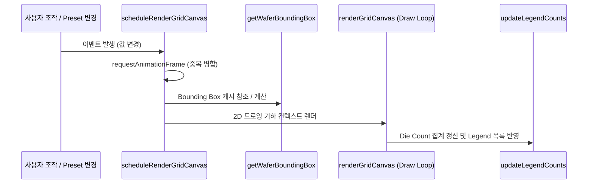

# Map Editor Specifications & Function Reference (MAP_EDITOR_SPEC.md)

> **Status:** 🟢 Living | **Last-verified:** 2026-08-05 | **Owner:** UI/Map | **Source-of-truth:** `client2/src/map_editor.js`, **`client2/src/map_key.js`**, **`client2/src/split_registry_row.js`**, `client2/src/transfer_plan.js`, `server/map_overlay.py`, `server/bonding_plan.py`, `server/transfer_plan.py`, `server/utils/coordinate_transformer.py` · 상위 [SYSTEM_OVERVIEW](../overview/SYSTEM_OVERVIEW.md)
>
> ### 🔴 읽기 전에 — 라운드가 지나도 이 자리에서 내리지 않는 세 줄
> 1. **맵 기준 가치 여섯 줄이 좌표 규약보다 위에 있습니다**(사용자 확정 2026-07-31 · §1의 0-요약, 정본은 보드). 축은 **실제 물리 환경**이고, 핵심은 **4)와 5)의 구분**입니다 — 기하를 바꾸는 것과 방향을 바꾸는 것은 좌표에 대해 **다른 일**입니다.
> 2. **저장 좌표 = 오리진 기준 칸수, mm 아님.** 칸수에 피치를 곱해 mm로 읽으면 **없는 결함이 만들어집니다** — 그렇게 추론한 라운드가 실제로 기각됐고 두 라운드를 소모했습니다. 규약 전문(화면이 기준 · 표시 = 오리진 + DB 값 · `start_x/y` = 유효 다이 영역의 최소 열·행이자 **운영자의 선언** · 오리진 = start가 (0,0)으로 읽히는 칸 · **칸수, mm 아님**)은 이 문서 **§1의 0)**입니다.
> 3. **「같은 날 아침 쓴 §5.7-bis가 같은 날 오후에 통째로 거짓이 됐다」** — 이 문서, 특히 §5.7-bis는 **기본적으로 불신받습니다**(2026-07-30 하루에 네 번, 2026-07-31에 다시 한 번 뒤집혔습니다). 🔴 **인용하기 전에 문자열을 소스에서 grep하십시오** — 제품에 없는 토스트 문구를 인용한 코드 블록이 실제로 두 번 남았습니다.
>
> ### 이번 라운드 (2026-08-05 · 2차 — `d4e0fed`+`04ed01b`+`b9a0ab1`+`b445c2e`, **설계 협의 기록**)
> - **§5.9 신설 — 「규격을 모르는 맵을 정렬한다」 사슬 하나.** 전제는 **규격 부재가 정상이라는 것**(조작자가 정렬을 도는 이유가 그 규격을 모르기 때문)이고 나머지는 전부 거기서 따라 나옵니다: **빌린다**(웨이퍼 규격 여섯 + 격자 치수 + `grid_start_x/y`) → **담기는지 본다**(`cells_outside_grid`, **제안보다 먼저**, 치수 스왑 허용) → **바닥이 선언이 아니면 요청 단위로 한 번 거절**(`basis_undeclared`). 🔴 **판정·실측의 정본은 [MAP_ALIGNMENT_SPEC §9.1·§9.4·§9.5·§9.6](./MAP_ALIGNMENT_SPEC.md)이고 §5.9는 수를 다시 적지 않습니다.**
> - 🔴 **§1-ter.1의 「빌리는 것은 `PHYS_KEYS` 여섯뿐」이 뒤집혔습니다** — 고쳐 쓰지 않고 **뒤집혔다고 표시**했습니다. 옛 규칙은 **메커니즘에 대해 옳았고 어느 경우가 전형인가에서 틀렸습니다.**
> - **§4-bis.3-ter 신설 — 고른 프레임은 골랐다고 기록됩니다**(`frame_chosen_from: "data"|"panel"`). 🔴 **일곱째 provenance 토큰이 아닙니다** — 여섯 토큰은 「이 **축의 값**이 어떤 증거인가」에 답하고, 「사람이 모달에 답했다」는 **행에 대한 사실**입니다. 선례는 토큰이 아니라 `phys_assumed_from`. 그리고 **⚙️ 현재 패널 분기는 빈 칸을 0으로 지어내지 않고 이름을 대며 거절합니다**(§4-bis.3-ter.1).
> - **§5.9 ④에 미판정 항목 하나를 OPEN으로 적었습니다** — 「가정 수락이 소스 맵의 **선언된** 격자까지 덮어야 하는가」. **오늘 코드는 덮지 않습니다.** 양쪽 근거를 함께 적었으니 **어느 쪽으로도 구현하지 마십시오.**
>
> ### 직전 라운드 (2026-08-05 · 1차 — `98b48e9`)
> - 🔴 **§4-bis.3의 트리거가 넓어졌고, 종전 문장은 거짓이 됐습니다.** 좌표계 선택 모달은 이제 *「`wafer_map_metadata`가 없는 맵」*이 아니라 **「규격 행이 없거나, 있어도 START X,Y를 읽을 수 없는 맵」**에서 뜹니다. 사본을 함께 고친 자리: **§4-bis.2**(복원 경로) · **§5.8-bis**(라우팅 호출 조건) · [PRIMITIVES §1](../architecture/PRIMITIVES.md) · [FEATURE_CHECKLIST §2.1/§2.9](../qa/FEATURE_CHECKLIST.md) · [map_editor/architecture_and_management §3.1](../map_editor/architecture_and_management.md) · [config/table_config](../guide/config/table_config.md).
> - 🔴 **그 확대가 클라·서버의 술어를 갈랐습니다(§5.8-bis, 총괄 판정 대기)** — 클라는 읽을 수 없는 규격 행을 **통째로 버려** 「선언 없음」으로 흘리는데, 서버 라우팅은 **행의 존재**로 `meta_present`를 답합니다. 에러가 아니라 **침묵**이고, 하필 기본값이 가장 필요한 맵에서 그렇습니다.
> - **§1-ter.1에 여섯째 어휘 `assumed`가 들어왔습니다**(`aa24bfd` — 이 라운드의 다른 레인이 작성). **개수를 핀으로 박지 마십시오**: 「정확히 다섯」이라는 핀이 정당한 서버 측 추가를 클라 결함으로 읽게 만들었습니다.
>
> ### 그 앞 라운드 (2026-08-04)
> - 🔴 **「`mm`은 일부러 비워 뒀습니다」를 삭제했습니다 — 클라에 mm 공간이 생겼습니다**(`cd3e0f4`). 기준 가치 6)의 ⏳가 풀렸고 §1-bis에 **웨이퍼 mm 좌표 공간** 절이 들어갔습니다. 나흘간 이 문서를 포함해 여러 곳에서 거짓이었습니다. ⚠️ **저장 좌표는 여전히 칸수입니다** — 둘은 다른 얘기입니다.
> - **§1-bis에 파일 경계 표 신설 — 맵 에디터는 더 이상 파일 하나가 아닙니다**(R1 `689ebb9` `map_key.js` · R2 `636f867` `split_registry_row.js`). 분할은 **진행 중**입니다.
> - **§6.2-ter에 클라 절반 추가** — `inactive_subtractions`를 화면이 어떻게 그리는지가 이제 계약입니다(`*` 각주 표시). 종전 그 절은 *「그 `ok`를 어떻게 그릴지는 소비자가 정합니다」*로 끝났고, 소비자가 정했습니다.
>
> ### 이전 라운드
> **[`docs/history/`](../history/)에 있습니다.** 🔴 **이 헤더에 다시 쌓지 마십시오** — 2026-07-30에 이 줄 하나가 **9,402자(UTF-8 15,248바이트)**까지 자랐고, *문서가 현재인지 알려 주는 자리*가 그 자체로 읽을 수 없는 changelog가 돼 있었습니다. `Last-verified`는 **날짜 · 이번 라운드에 바뀐 것**까지입니다. 위 「내리지 않는 두 줄」만 예외이고, 그 자격은 **잃으면 하루를 다시 쓰는 것**입니다.
>
> §1~§4는 격자 에디터 본체(2026-07-24 검증), **§5 범용 맵 오버레이**·**§6 전사 계획**은 M2/M2-v2(`8e34804`/`da65a87`)에서 신설됐습니다. **§5는 `7d931dc`(변환 클라 일원화)+`251dbfd`(테이블 전환 해제·메타 단일 기준 규칙)에 맞춰 전면 재작성됐습니다** — 종전의 "서버가 정렬해서 내려준다" 서술은 더 이상 클라 경로를 설명하지 않습니다.

본 문서는 `assyManager` 프로젝트의 2세대 격자 맵 에디터([`client2/src/map_editor.js`](file:///c:/Users/kk980/Developments/assyManager/client2/src/map_editor.js))에 구현된 모든 프론트엔드 자바스크립트 함수들의 설계 규격, 변환 공식 및 상세 API 레퍼런스를 정리합니다.

---

## 1. 격자 및 좌표계 아키텍처 (Coordinate System Architecture)

격자 맵 에디터는 **다이 인덱스(die index)**, **캔버스 셀 인덱스(canvas cell)**, **저장 좌표(DB coordinates)**의 삼원화된 구조를 사용하여 웨이퍼 기판의 3D 공간적 물리 거동(회전, 면 반사)과 화면상의 2D 공간 표시를 매끄럽게 처리합니다. **세 공간의 함수 이름은 §1-bis의 표가 정본입니다**(2026-07-31 개명 — 옛 이름 둘은 자기가 돌려주는 것의 반대를 말하고 있었습니다).

### 0-요약) 맵 기준 가치 — **사용자 확정 2026-07-31 · 아래 좌표 규약의 *상위*** {#map-founding-values}

🔴 **축은 실제 물리 환경입니다.** 여섯 줄이 좌표 규약보다 위에 있고, 상충하면 이쪽이 이깁니다.

> **정본은 [process/PROJECT_STATUS](../process/PROJECT_STATUS.md)의 「맵 기준 가치」 블록**(총괄 소유)이고 아래는 그 사본입니다. **인용해야 할 일이 있으면 보드를 읽으십시오** — 이 절을 고칠 권한은 총괄에게 있습니다.

| # | 가치 | 이 문서에서 그것이 사는 자리 |
|---|---|---|
| **1)** | 유효 다이 영역은 항상 **물리 WF 내 상대 위치를 보존**한다 → 유효 다이 영역은 **맵 기하 메타와 한 몸**이다. 🔴 회전 중심은 **맵 기하 메타에만** 의존하고 유효 다이와 무관하다. **유효 다이 영역을 불러올 때는 기존 맵 기하 메타를 유효 다이의 것으로 갈아끼운다** | §5.7-bis(기하 교체 + 치수 파생) |
| **2)** | **회전·반전은 물리 WF 중심을 기준**으로 한다 | §1의 1) 변환 수식 |
| **3)** | **`START X,Y`는 현재 표기된 셀에 좌표를 매길 「기준」**이고, 그 기준은 **유효 다이 영역의 최소 X,Y를 START로 잡는 것에서 시작**한다 | 아래 0)의 ③ |
| **4)** | **유효 영역 및 맵 기하를 바꾸는 행위는 기존 셀 좌표를 변경하지 않는다** | §5.7-bis · §5.7-ter (`reseatCellsToStoredCoords`) |
| **5)** | **회전·반전·Y축 반전은 셀 좌표를 변경한다** | §5.7-bis의 거절 축 |
| **6)** | 서로 다른 메타를 가진 맵을 오버레이할 때는 각자의 회전·반전·셀 크기를 모두 고려한 **WF 내 물리(mm) 좌표**로 오버레이한다 | ✅ **착지 `cd3e0f4`** — §1-bis의 웨이퍼 mm 절 · §5.1. ⚠️ 종전 이 칸의 *「클라에 mm 공간이 아직 없습니다」*는 **거짓이 됐습니다** |

⚖️ **4)와 5)의 구분이 이 규약의 핵심입니다** — 기하를 바꾸는 것과 방향을 바꾸는 것은 좌표에 대해 **다른 일**입니다. 종전에는 이 둘을 구분하지 않아 「무엇이 좌표를 움직여도 되는가」에 답이 없었습니다.

### 0) 좌표 규약 — **사용자 확정 (2026-07-30, 위 가치의 하위 세부)**

🔴 **아래 다섯 줄이 이 문서 전체의 전제입니다.** 좌표 관련 결함 판정·수리 설계는 여기서 출발하고, 여기와 어긋나는 서술은 이 절이 이깁니다.

| # | 규약 | 그래서 무엇이 결함인가 |
|---|---|---|
| **①** | **화면이 기준이다** — 저장은 화면을 따라간다(`⚡ Push`가 쓰는 x/y = 화면이 말하는 그 좌표) | **결함은 화면이 *말없이* 움직이는 것**이다. 움직였다는 사실을 알리기만 하면 그것은 결함이 아니다 |
| **②** | **표시 = 오리진 + DB 값** | 표시와 저장은 **한 수량**이다. 표시만 고치거나 저장만 보정하는 수리는 둘을 갈라놓는다 |
| **③** | **`start_x`/`start_y` = 유효 다이 영역의 최소 열·행** | 「격자의 최소 열」이 아니라 **유효 영역의** 최소 열이다 — 그래서 유효 다이 근거가 바뀌면 같은 칸이 다른 번호를 읽는다(§5.7) |
| **④** | **오리진 = `start`가 놓였을 때 (0,0)으로 읽히는 칸** | 오리진은 다이가 아니라 **좌표계의 원점**이다. 원점 마커는 화면 자리를 표시할 뿐이다([map_editor/README §2.3](../map_editor/README.md)) |
| **⑤** | **저장 좌표는 오리진 기준 *칸수*이고 mm 주소가 아니다** | 「피치는 셀 좌표랑 상관없지」(사용자 판정). **칸수에 피치를 곱해 mm로 읽으면 없는 결함이 만들어진다** — 그렇게 추론한 라운드가 실제로 기각됐고 두 라운드를 소모했다 |

> 🔴 **`start_x`/`start_y`는 운영자의 선언이고 편집기가 자동으로 쓰지 않습니다**(「START X,Y는 바뀌면 안됨」). 편집기가 이 두 값에 쓰는 자리는 셋뿐입니다 — **📍 Set Origin 모드의 클릭**(`handleCellClick`의 `isOriginMode`) · **로드 시 메타/초안 복원**(`loadExistingMap`·`applyMetaToPanel`·초안 복원) · **메타 없는 맵의 📐 표준 분기**(아래 §4-bis.3-bis). 유효 다이 지정은 여기에 **없습니다**(§5.7-bis).
>
> ⚠️ 좌표계는 **선언되는 것이지 데이터에 맞춰 재계산되는 것이 아닙니다.** 좌표를 옮겨 화면을 맞추는 수리는 ①·②를 동시에 깨뜨립니다 — `019140c`가 정확히 그 결함의 수리였습니다.

### 1) 기하 변환 수식 (Geometric Transformation Formulas)

사용자가 설정한 `X Start`, `Y Start` 좌표는 **화면상에 보여지는 격자 내 유효 웨이퍼 영역 Bounding Box의 최소값(`box.minC`, `box.minR`)**의 좌표를 지칭합니다.

> 🟠 **미해결 불일치 — 아래 미러링 분기는 `getDbCoords`에 구현돼 있지 않습니다 (doc-keeper 실측 2026-07-30, **2026-07-31 재확인**, 총괄 판단 대기).**
> `client2/src/map_editor.js:2033`의 `getDbCoords`(구 `getVisualCoords` — `35e84c3`에서 개명)는 X를 **분기 없이** `dbX = colVisual − box.minC + startX` 하나로 계산하고, Y는 **`invertY`만** 봅니다(`isYMirrored` 항 없음). 실측 2026-07-31: `box.maxC`는 이 함수에서 **한 번도 참조되지 않으며**, 파일 전체에서 `box.maxC + startX` 형태는 **0건**입니다(노치 계산과 콘솔 로그의 `box.maxC`만 남아 있습니다).
> 따라서 아래 표에서 **① X축 back 미러 갈래(`dbX = box.maxC − c + startX`)와 ② `isYMirrored = true` 두 행은 현재 코드에 대응물이 없습니다.**
> - **왜 눈에 띄지 않았나**: 역변환 `getCanvasCellFromDb`(구 `getCellFromVisualCoords`, :1866)도 **같은 무-미러 식**이라 왕복(`cell → db → cell`)은 성립합니다. 즉 자기 일관성은 있고, 어긋나는 것은 **문서와 코드** 사이입니다.
> - ✅ **절반은 해소됐습니다 (`da8f390` · 2026-07-30).** 종전 이 자리는 *"같은 파일 안에서도 두 식이 갈린다"* — (0,0)이 격자 위에 있는지 판정하는 `c_zero`/`r_zero`가 `getGridCellObject`에서는 **미러 없이**, `renderGridCanvas`에서는 **`isXMirrored`/`isYMirrored`를 적용해** 계산된다 — 고 기록했습니다. **미러 항을 가진 사본이 삭제됐고 두 자리 모두 역함수 하나를 부릅니다**(`getCanvasCellFromDb(0, 0, …)` — `client2/src/map_editor.js:1175`·`:3244`, 실측 `c_zero`/`isXMirrored`는 주석 1줄을 빼면 소스 히트 0건).
>   - 🔴 **QA 실측 — 두 식은 "둘 다 맞았다"가 아니라 "우연히 같았다"였습니다.** 선언된 모든 프레임의 bbox가 대칭인 동안만 답이 일치했고, **출하되던 값은 이미 틀린 채 범위 안에 있었을 뿐**입니다(`bonding_map/4B13`: 옳은 값 **1** vs 출하값 **25**). 원점 상자가 유효 다이 기준이 되면(§5.7) 그 우연은 성립하지 않으므로, 이 사본 삭제는 정리가 아니라 **수리**였습니다.
>   - ⚠️ **남은 미해결은 위의 두 행뿐입니다** — `getDbCoords`의 X back 미러 갈래와 `isYMirrored` 행에 코드 대응물이 없다는 것. 판정은 여전히 총괄·QA 소관입니다.
> - 🔴 **doc-keeper는 이 표를 고치지 않았습니다.** 셋 중 어느 것이 의도인지(문서가 옳고 구현이 빠진 것인가 · 구현이 옳고 문서가 폐기 설계인가 · `c_zero` 둘 중 하나가 결함인가)는 **저장 좌표 규약의 판정**이므로 총괄·QA 소관입니다. 표는 **원문 그대로 보존**하고 이 사실만 기록합니다(§1의 규율 — 읽을 수 없는 값은 지우지 않고 원문을 남긴다).

#### 화면 기준 웨이퍼 유효 셀 경계 상자 (Wafer Bounding Box)
격자 내부 영역($c \in [0, \text{visualCols}-1]$, $r \in [0, \text{visualRows}-1]$)에 속하는 셀 중, 물리 엔진 상 웨이퍼 유효 반경 내부인 셀들의 스크린 인덱스 최댓값/최소값 범위를 계산합니다.
$$\text{box} = \{ \text{minC}, \text{maxC}, \text{minR}, \text{maxR} \}$$

#### 저장 좌표 (DB Coordinates) 계산
화면의 셀 눈금 `(c, r)`로부터 데이터베이스에 기록할 직교 좌표 `(dbX, dbY)`를 도출하는 수식입니다. 백면(Back Side) 미러링 반사 상태에 따른 X/Y축 축반전을 완벽히 보정합니다.

* **수평(X) 축 변환**:
  * X축이 좌우 반전되는 조건 ($\text{side} = \text{back}$ 이며 90°/270° 회전이 아닐 때):
    $$dbX = \text{box.maxC} - c + \text{startX}$$
  * 그 외의 모든 경우 (일반 방향):
    $$dbX = c - \text{box.minC} + \text{startX}$$

* **수직(Y) 축 변환**:
  * Y축이 상하 반전되는 물리적 조건 ($\text{side} = \text{back}$ 이며 90°/270° 회전일 때 Y축이 물리적으로 미러링):
    $$\text{isYMirrored} = (\text{side} = \text{back} \land \text{rotation} \in \{90, 270\})$$
  * `invertY` (Y축 방향 역전 옵션)와 `isYMirrored` 상태의 조합에 따라 분기:
    * **`invertY`가 `false` (상->하 증가) 일 때**:
      * $\text{isYMirrored} = \text{false}$: $dbY = r - \text{box.minR} + \text{startY}$
      * $\text{isYMirrored} = \text{true}$: $dbY = \text{box.maxR} - r + \text{startY}$
    * **`invertY`가 `true` (하->상 증가) 일 때**:
      * $\text{isYMirrored} = \text{false}$: $dbY = \text{box.maxR} - r + \text{startY}$
      * $\text{isYMirrored} = \text{true}$: $dbY = r - \text{box.minR} + \text{startY}$

### 1-bis) 좌표 공간의 이름 — **개명 2026-07-31 (`35e84c3`)**

두 이름이 자기가 돌려주는 것의 **반대**를 말하고 있어서 전 호출 지점을 함께 고쳤습니다. 옛 이름을 쓰는 서술은 전부 낡은 것입니다.

> **실측(2026-07-31)**: `client2/src`에 옛 이름 **0건**. 새 이름 4종이 `map_editor.js`에 **55회**(정의 4 + 호출 51), `dbX`/`dbY` 17회. ⚠️ **커밋 메시지의 「67 renames」와 보드의 「46개 호출 지점」은 서로 다른 세는 규칙**이므로 어느 쪽도 이 자리에 옮겨 적지 않았습니다 — 필요하면 위 grep으로 다시 세십시오.

| 지금 | 그전 | 돌려주는 것 |
|---|---|---|
| `getDbCoords(c, r, …)` | `getVisualCoords` | **저장 좌표**(`⚡ Push`가 쓰는 x/y). "visual"이라 불렸지만 화면 인덱스가 아니라 **DB에 들어가는 수**였습니다 |
| `getCanvasCellFromDb(dbX, dbY, …)` | `getCellFromVisualCoords` | 위의 역함수 — 저장 좌표가 가리키는 **캔버스 칸** |
| `getDieIndex(c, r, …)` | `getPhysicalCoords` | **다이 인덱스**(`gridData`의 물리 키 `"${x}_${y}"`). **밀리미터가 아닙니다** |
| `getCanvasCellFromDieIndex(x, y, …)` | `getCellFromPhysicalCoords` | 위의 역함수 |
| `dbX` / `dbY` | `xv` / `yv` | 저장 좌표의 두 성분 |

#### 웨이퍼 mm — **세 번째 좌표 공간** (`cd3e0f4`)

> 🔴 **종전 이 자리는 「`mm`은 일부러 비워 뒀습니다」였고 그것은 거짓이 됐습니다.** 기준 가치 6)의 오버레이가 착지하면서 클라가 실제 밀리미터 공간을 갖게 됐습니다.

| 함수 | 돌려주는 것 |
|---|---|
| `dieIndexToWaferMm(ix, iy, L)` | 그 다이 **중심**의 절대 웨이퍼 mm |
| `waferMmToDieCell(mmX, mmY, L)` | 위의 역함수 — **몫이 다이 인덱스, 나머지가 그 다이 *안에서의* mm**(`[0, 피치)`) |
| `projectCellsToWaferMm(cells, frame)` | 소스 원본 셀 → `{ix, iy, mm:{mmX, mmY}, val}` 항목 배열 |
| `seatWaferMmInFrame(items, frame)` | 그 mm 항목들을 **타깃 프레임의 칸에** 앉힌다 |

- 🔴 **mm는 세 번째 *변환*이 아니라 단위 환산입니다.** 회전·반전·오프셋은 전부 `getDieIndex` 안에서 끝나고, 여기서 더하는 것은 「그 칸 번호가 몇 mm인가」(칸수 × 피치) 하나뿐입니다. **오버레이 전용 기하식을 쓰지 않는다**는 §5.1의 계약이 이 구조입니다.
- 🔴 **mm는 반올림 *전* 연속값(`p.xCells`)에서 만듭니다.** 반올림된 다이 인덱스에서 되만들면 오프셋의 칸 미만 잔여가 빠져 **모든 셀이 그만큼 밀립니다** — 실측: 한 픽스처에서 1,836칸 중 1,789칸이 틀린 타깃 칸에 앉았습니다.
- 🔴 **칸 안 나머지는 절대 길이라 피치에 의존합니다.** 7mm 칩 안의 3mm와 15mm 칩 안의 3mm는 **다른 자리**입니다. 그래서 칸 안 좌표는 맵 사이를 그대로 못 건너고 **반드시 절대 mm를 거쳐 다시 나눠야** 합니다 — 그리는 것은 아직 없지만(결함 in-chip 표기가 앞으로 옵니다) 여기서 나머지를 버리면 그 경로를 통째로 다시 열게 됩니다.
- ⚠️ **피치가 없으면 `mm`이 `null`인 항목이 나오고 이 층은 거절하지 않습니다.** 거절 문구를 쓰는 자리는 호출자(오버레이)이고, 유효 다이 해석은 mm를 아예 보지 않습니다.
- ⚠️ **`isCellInsideWaferFast`의 원 판정은 여전히 700×700 픽셀입니다** — mm 공간이 생겼다고 원 판정이 mm로 옮겨간 것은 **아닙니다.** 서버 쪽 mm은 별개로 `PhysicalWaferEngine`에 있습니다.
- 🔴 **저장 좌표는 이 변경과 무관하게 여전히 오리진 기준 칸수입니다**(§1의 0)의 ⑤). mm 공간이 생긴 것과 저장 좌표의 뜻이 바뀐 것은 **다른 얘기**이고, 칸수에 피치를 곱해 mm로 읽으면 여전히 없는 결함이 만들어집니다.

### 1-ter) 캔버스 축척 — **두 축에 px/mm 하나, 그리고 그 하나를 웨이퍼가 정박한다** (2026-08-04 `102cdea`+`edc7ef6`)

> 🔴 **종전 서술(「격자 래퍼를 정사각으로 유지해 타원 왜곡을 막는다」)은 원인을 잘못 짚고 있었습니다.** 래퍼가 정사각이어도 `cellW = width/cols`, `cellH = height/rows`면 격자가 정사각이 아닌 순간 셀이 정사각이 되고 **원이 타원이 됩니다.** 원을 그리는 코드로는 못 고칩니다 — **타원의 원인은 셀**이고, 셀을 고치면 원은 저절로 원이 됩니다.

축척의 **단독 생산자**는 `cellMetrics(width, height, visualCols, visualRows, physConfig)`이고, 렌더(`renderGridCanvas`)와 마우스→셀 매핑(`getGridCellFromMouseEvent`) **둘 다** 이것을 부릅니다(두 번째 구현을 만들지 마십시오).

```
sGrid   = min(width / (cols·chipX), height / (rows·chipY))
sWafer  = (min(width, height) · 0.94) / 선언된 웨이퍼 지름
s       = min(sGrid, sWafer)          ← px per mm, 두 축 공통
cellW   = chipX · s        cellH = chipY · s
padX    = (width  − cols·cellW) / 2   padY = (height − rows·cellH) / 2
```

- 🔴 **정박점은 `waferDia`이지 `effectiveRadius`가 아닙니다.** 후자는 edge margin(공정 파라미터)을 이미 접고 있어, margin 3mm와 5mm로 선언된 **같은** 300mm 웨이퍼가 다른 크기로 그려집니다. 「같은 웨이퍼는 같아 보인다」가 글자 그대로 참이 되는 쪽은 **지름**입니다.
- **그래서 웨이퍼 일부만 덮는 격자는 정당하게 작아 보입니다.** 실측(캔버스 700×700, 선언 지름 300mm 동일): 정박 전에는 20×20 피치 6mm가 원 반지름 875.000px, 52×52 피치 6mm가 336.538px — **같은 웨이퍼가 2.6배 다르게** 그려졌습니다.
- ⚠️ **`min(sGrid, sWafer)`이지 `sWafer`가 아닙니다 — 이건 미관이 아니라 데이터입니다.** `renderGridCanvas`의 캔버스 밖 `continue`는 `gridCells2D` 등록보다 **앞**에 있어, 캔버스를 넘친 선언 칸은 `eachSavableCell`의 정의역 밖이 되어 **저장 페이로드에서 조용히 사라집니다.** `s ≤ sGrid`를 지키면 `padX/padY ≥ 0`이 보장됩니다. 🔴 **따라서 「웨이퍼는 어느 맵에서나 같은 크기」는 격자가 웨이퍼보다 클 때 성립하지 않습니다** — 그때는 격자가 축척을 가져가고 원이 작아집니다.
- **칩 피치 X≠Y면 셀은 직사각형입니다.** 부작용이 아니라 요청된 결과입니다(사용자: *「셀이 정사각형이고 원이 찌그러짐」*).
- **여백은 격자 밖입니다 — 격자선만 긋고 채우지 않습니다.** 「filler 셀」이라는 객체는 없습니다: 렌더 루프가 `onGrid`가 거짓인 칸에 `strokeRect` 하나만 긋고 `continue`하며, 그 `continue`가 `gridCells2D` 등록보다 앞이라 **존재하지도·쓰이지도·세어지지도 않습니다**(쓰기는 `getGridCellFromMouseEvent`의 두 번째 경계 검사가 따로 막습니다 — 가드 둘은 각각 쓰기 동선과 세기·저장 동선을 막으므로 하나로 합치지 마십시오). 여백이 실제로 생겼을 때만(`padX>0.5 || padY>0.5`) 선언된 격자에 굵은 외곽선이 하나 그어집니다.
- **오버레이 마커는 축별로 커집니다** — `markerAxisRadius(cellPx, frac, floorPx)`를 `cellW`/`cellH`에 각각 먹여 `rx`/`ry`를 만들고, 둘이 다르면 `ctx.ellipse`, 같으면 `ctx.arc`입니다. 종전 `Math.max(1.5, Math.min(cellW, cellH) * 0.13)`은 직사각 셀에서 짧은 축을 따라갔습니다.

#### 1-ter.1 `auto_registered` — **「합성 규격이라 아무도 재지 않았다」** (2026-08-04 `cfc09de`+`cd37e2c`)

`auto_registered: true`는 그 행의 물리 규격이 **합성값**이라는 표지입니다. **값에 대한 주장이 아닙니다** — 특히 `chip 1×1`은 *「웨이퍼 원 마스크가 아무 셀도 자르지 않게 하라」*는 합성 어휘이지 **1mm 다이라는 선언이 아닙니다.**

- **표지를 세우는 곳은 둘입니다**: 인제션 등록기 `server/map_meta_registrar.synthesize_grid_meta`, 그리고 에디터의 「표준」 좌표계 분기(`markGeometryAutoRegistered(true)` → `buildPushGridMetadata`가 Push 페이로드에 다시 실음). 로드 시에는 `loadedGridMeta.auto_registered === true`로 **양방향** 복원됩니다.
- 🔴 **판정은 값이 아니라 표지입니다.** `chip === 1`을 보지 않습니다 — 1은 합법적인 피치이고, 표지가 곧 값이면 진짜 1mm 다이를 언젠가 조용히 삼킵니다. **레거시 폴백은 두지 않았고, 필요 없다는 것을 셌습니다**: 실측 2026-08-04(운영 DB, 읽기 전용) `wafer_map_metadata` **668행 중 chip 1×1이 320행(47.9%)이고 그 320행이 전부 표지를 답니다. 표지 없는 1×1은 0건**입니다.
- **원을 정박하지 않습니다.** `physDeclaration('chipX'|'chipY')`가 표지 앞에서 `{value: null, source: 'auto_registered'}`를 돌려주므로 `cellMetrics`는 정박 경로에 **닿기 전에** 비등방 폴백(`width/cols` × `height/rows`)으로 떨어집니다. 🔴 **그래서 이 320행의 셀은 정박 도입 전보다 훨씬 크게 그려집니다** — 1mm 피치를 곧이곧대로 정박하면 셀이 웨이퍼의 1/300로 그려졌을 것이기 때문입니다. 캔버스 안내는 *「기하 규격 미선언 (자동 등록된 합성 규격) — 칩 크기를 잰 적이 없어 웨이퍼 원을 그리지 않습니다」*입니다.
  > ⚠️ **정확히는 「그리지 않는다」가 아니라 「보이지 않는다」입니다.** 원을 그리는 블록 자체는 `isotropic`/`waferAnchored`로 가려져 있지 않고, 합성 지름 ÷ 합성 피치 1이 캔버스 밖으로 나가 결과적으로 안 보입니다. **총괄 보고 대상**(문구와 코드가 같은 것을 말하지 않습니다).
- 🔴 **오버레이 정렬을 합성 피치로 맞추지 않고 거절합니다.** 이것이 `cd37e2c`가 서버에 붙인 절반입니다 — 종전에는 **자동 등록 소스를 실측 타깃에 1mm 피치로 정렬해 「멀쩡해 보이는 좌표」**를 냈습니다.
  - 서버 `map_overlay.make_frame_transform`은 소스·타깃 **양쪽을 이름 대며** 거절합니다: `소스 맵: 물리 규격이 자동 등록된 합성값입니다(chip 1x1은 '웨이퍼 원 마스크 없음'을 뜻하는 합성 어휘이지 1mm 다이가 아닙니다) ― 칩 크기를 잰 적이 없습니다 ― 셀 좌표의 기준인 웨이퍼 바운딩박스를 재현할 수 없어 정렬을 보증할 수 없습니다. …` 어휘는 `auto_registered` / `absent` / `unparsable` 셋입니다.
  - 클라(`7ea2c2f`)는 **사유를 한 번만 사람 말로 옮깁니다** — 종전에는 열거값이 그대로 새어 `소스 auto_registeredxauto_registered`가 화면에 나왔습니다. 지금은 `미선언(자동 등록된 합성 규격)`으로 렌더되고 `align_unavailable`로 실패합니다.
- 🔴 **2026-08-05 — 정렬 경로에는 다섯째 토큰이 있고, 질문도 둘로 갈렸습니다** (맵 정렬 스펙 [§9.1](./MAP_ALIGNMENT_SPEC.md)). 규격 선언이 없는 소스 맵을 **기준 맵의 웨이퍼 치수를 빌려** 채점할 수 있게 되었고(순환을 끊는 자리: 규격이 선언돼야 채점하는데 조작자가 정렬을 도는 이유가 그 규격을 모르기 때문입니다), 빌린 사본은 `map_overlay.GEOMETRY_ASSUMED`(`"assumed"`)로 답합니다.
  - **어휘는 여섯입니다**: `declared` / `auto_registered` / `absent` / `unparsable` / `indeterminate`(방위 축 전용) / **`assumed`**. 클라 거울 `client2/src/map2/declaration.js`도 여섯을 갖습니다. 🔴 **클라는 `assumed`를 생성할 수 없습니다**(빌린 사본이 저장되지 않으므로 클라가 읽는 메타에는 표지가 없습니다) — 그래도 거울에 있어야 하는 이유는 **토큰이 문자열로 도착**하기 때문이고, 빠지면 클라는 침묵하는 게 아니라 **다른 통으로 분류**합니다. 양쪽 채점은 `contracts/map2_seam/`의 `geometry_declaration_cases`입니다. ⚠️ **개수를 핀으로 박지 마십시오** — 「정확히 다섯」이라는 핀이 정당한 서버 측 추가를 클라 결함으로 읽게 만들었습니다. 불변식은 개수가 아니라 **「빌려 오고, 짓지 않는다」**입니다.
  - **질문이 둘입니다**: `geometry_refusal`은 「이 맵의 **선언**인가」이고 빌린 사본에도 여전히 **아니오**라고 답합니다. `geometry_computable`은 「좌표를 계산할 **근거**가 있는가」이고 `declared`·`assumed` 둘 다에 **예**입니다. `make_frame_transform`의 관문이 묻는 것은 뒤엣것으로 바뀌었습니다 — 앞엣것의 답은 바뀌지 않았습니다.
  - 🔴 **빌린 값은 소스 메타에 쓰이지 않습니다.** 쓰는 순간 누군가 잰 값처럼 읽히고 아무도 그것이 가정이었음을 알 수 없게 됩니다(§1-ter.1이 처음부터 막으려던 것과 **같은** 실패). 사본은 메모리에만 살고 표지 `phys_assumed_from`이 출처를 나릅니다.
  - 🗄️ **[2026-08-05 뒤집힘 — 문장을 고쳐 쓰지 않고 남깁니다]** 이 자리는 *「빌리는 것은 `PHYS_KEYS` 여섯뿐이다. 격자 치수는 **맵의** 성질(같은 웨이퍼의 두 맵이 다르게 잘릴 수 있음)이라 빌리지 않고, 방위 축(회전·면·start·y반전)은 풀고 있는 미지라 절대 빌리지 않는다」*라고 적고 있었습니다. **그 메커니즘은 옳았고 어느 경우가 전형인가에서 틀렸습니다** — 이 제품의 소스 맵은 보통 같은 격자의 **부분집합**이라 셀 스팬이 체계적으로 과소평가입니다. 지금 빌리는 것은 **`PHYS_KEYS` 여섯 + 격자 치수 + `grid_start_x/y`**이고(§5.9 · 정본 [MAP_ALIGNMENT_SPEC §9.5](./MAP_ALIGNMENT_SPEC.md)), 절대 안 빌리는 축은 **`rotation`·`side`·`grid_y_invert`** 셋으로 좁아졌습니다. ⚠️ `map_overlay.assume_phys_from` **한 함수만 보면 옛 문장이 아직 참으로 읽힙니다** — 격자를 빌리는 것은 그 함수가 아니라 규격 행이 **없는** 맵을 조립하는 `map_alignment.assumed_meta_for_unregistered`입니다.

### 1-bis-2. 파일 경계 — **맵 에디터는 더 이상 파일 하나가 아닙니다** (2026-08-04, 진행 중)

| 파일 | 무엇이 사나 |
|---|---|
| `client2/src/map_key.js` | **맵 키의 정준형(§7b)** — `canonicalKeyValue` · `composeMapId` · `decomposeMapKey` · `canonicalMapKey` · `getMapIdFromMeta`. R1 `689ebb9` |
| `client2/src/split_registry_row.js` | **`map_split_registry` 행의 정규형** — 저장 페이로드·응답 파서·지문·서명·legend 아이템 정규화. R2 `636f867` |
| `client2/src/map_editor.js` | 나머지 전부 — 렌더·좌표·프레임 스택·오버레이·**legend 저장 오케스트레이션** |

- 🔴 **분할은 진행 중이라 이 표는 다음 라운드에 한 행 늘어납니다.** 「맵 에디터 = `map_editor.js`」로 읽지 말고, 심볼의 현재 거처는 [CODE_MAP](../architecture/CODE_MAP.md)을 **grep**해서 확인하십시오.
- 🔴 **경계는 「순수한가」로 긋습니다.** 모듈 상태를 읽지도 쓰지도 않는 덩어리만 나갑니다. legend 저장의 *오케스트레이션*(`saveLegendToServer`·`persistLegend`·`applyRegistryRowsToLegend` …)은 legend 클러스터 7변수를 쓰고 그 변수들은 **맵 로드·프레임 스택·드래프트 복원·legend 패널** 네 곳에서도 쓰이므로, 그 절반은 `map_editor.js`에 **영구히** 남습니다 — 나중에 뺄 것을 미룬 게 아닙니다.
- ⚠️ **하네스는 이 파일들의 텍스트를 잘라 vm에서 돌립니다.** 그래서 심볼을 옮기면 `client2/tests/*`와 `contracts/*/client_harness.mjs`의 경로 사전도 함께 옮겨야 하고, `export ` 키워드는 **슬라이스에서 빼야** 합니다(vm 안의 `export` 문은 SyntaxError). 인질 파일은 심볼 이름뿐 아니라 **파일 경로**로도 grep해서 세십시오 — 이름만 세면 놓칩니다(R1에서 3 → 실제 5).

#### 1-bis-2.1 파일을 안 옮기는 분할 — **긴 함수는 이름 붙은 단계로 읽힌다** (R3~R5)

파일 밖으로 못 나가는 절반(모듈 상태를 쓰는 오케스트레이션)에도 할 일이 있었습니다. **한 벽이던 함수 셋이 각각 이름 붙은 단계들로 갈렸고, 단계들은 모듈 상태를 읽지도 쓰지도 않습니다** — 즉 파일에는 남았지만 **채점 가능해졌습니다.**

| 함수 | 단계 수 | 라운드 |
|---|---|---|
| `loadExistingMap` | **7** — `collectMapKeyFilterModel` → `scanCoordinateBounds` → `resolveDeclaredGridMeta` → `promptCoordinateChoice` → `resolveGridFrame` → `deriveLegendFromCellValues` → `restoreDoeDraftWithPrecedence` | R3 `2f3fa6f` |
| `resolveValidDie` | **5** — `fitGridToMask` · `summariseReseat` · `resolveReferenceSpec` · `deriveMaskKeys` · `diagnoseDesignationAlignment` | R4 `cafd61f` |
| `pushMapData` | **5** — `confirmLogShapedPushTarget` · `collectMetaFieldValues` · `buildPushGridMetadata` · `confirmMissingSplitDescriptions` · `outsideCircleNoteForPush` | R5 `4a0c402` |

- 🔴 **단계는 「호출 순서대로, 모듈 상태 없이」가 계약입니다.** 그 두 성질이 없으면 단계를 따로 채점할 수 없고, 그러면 이름만 붙은 것이지 분할이 아닙니다.
- 🔴 **R6(`510a748`)이 이 분할을 되돌아가지 못하게 못박았습니다** — `map_editor.js`의 **모듈 레벨 가변 바인딩에 천장**이 걸렸습니다(빌드 게이트 `CEILINGS`, 상한 **48**, 세는 규칙은 [frontend §2.1](../architecture/frontend.md)). 분할이 진행 중인 파일에서는 **순수 절반을 떼어내는 것보다 새 전역을 다는 것이 늘 더 쉬우므로**, 천장이 없으면 분할이 순손실이 됩니다. ⚠️ **실측 2026-08-04: 48 — 여유가 0이고, 그 48에는 이미 죽은 것으로 판정된 바인딩 둘(`tables`·`isMouseDown`)이 포함**돼 있습니다. 여유가 필요하면 천장을 협상하지 말고 그 둘을 지우십시오.

---

## 2. 상태 관리 변수 (State Variables)

| 변수명 | 타입 | 설명 |
| :--- | :--- | :--- |
| `currentRotation` | `number` | 현재 화면 격자의 회전 상태 (`0`, `90`, `180`, `270`) |
| `currentSide` | `string` | 웨이퍼의 앞/뒷면 설정 (`"front"`, `"back"`) |
| `activeBrush` | `string` | 현재 팔레트에서 선택되어 격자에 색칠할 값(Legend Value) |
| `gridData` | `object` | 기판 고유 물리 좌표 키(`"${xp}_${yp}"`)를 기준으로 맵핑된 칩 값 매트릭스 |
| `gridCells2D` | `object` | 스크린 인덱스 `gridCells2D[r][c]` 기준으로 맵핑된 시각/물리 좌표 정보 캐시 |
| `loadedFCells` | `Set` | **로드 시점에 잠금 값이었던 셀**의 물리 좌표 키 집합. `isProtectedFCell`이 이것과 오버레이 잠금을 OR로 묶어 편집을 거부한다(§5.5의 단일 관문). ⚠️ 잠금 값은 **하드코딩 `'F'`가 아니라** 서버 `paint_lock` 선언에서 오는 `isLockedValue` 판정이다 — 맵을 다시 로드할 때마다 다시 채워진다 |
| `isOriginMode` | `boolean` | 사용자가 마우스 클릭으로 `(0, 0)` 원점의 위치를 직접 지정하는 모드 활성화 여부 |
| `isPainting` | `boolean` | 마우스 드래그를 이용해 격자에 연속 페인팅을 수행 중인지 여부 |
| `isRightDrag` | `boolean` | 마우스 오른쪽 버튼을 드래그하여 연속 지우개(Erase)를 수행 중인지 여부 |
| `boundingBoxCache` | `object` | 각 각도/직경/칩 피치 기하 설정별 웨이퍼 Bounding Box 연산 결과 캐시 |

---

## 3. 전체 함수 명세 (Function Reference)

### Category 1: Initialization & DOM Setup (초기화 및 DOM 바인딩)

#### 1) `debounce(func, wait = 200)`
* **용도**: 입력 또는 창 크기 조절 시 이벤트가 단기간에 과도하게 호출되는 것을 방지하기 위한 디바운스 유틸리티.
* **매개변수**:
  * `func` (`Function`): 실행할 콜백 함수.
  * `wait` (`number`): 디바운스 대기 제한 시간 (ms).
* **반환값**: `Function` (디바운스 래핑된 새 함수).

#### 2) `initDOMElements()`
* **용도**: 화면상의 모든 HTML 조작 노드(Inputs, Buttons, Dropdowns, Canvas)를 탐색하여 전역 `el` 객체에 캐싱하고, 이벤트 리스너(Change, Click, Mouse 등)를 최초 바인딩합니다.
* **내부 흐름**:
  * 각 설정 입력 필드(`Cols`, `Rows`, `StartX`, `StartY`, `YInvert`) 변경 시 유효성 검사 및 `scheduleRenderGridCanvas()` 호출 리스너 등록. 🔴 **한 배열(`inputsToRedraw`)이지만 분기는 같지 않습니다** — `Cols`/`Rows`는 clamp 뒤 **`reseatCellsToStoredCoords`까지** 부르고(`9d7d9a4`, 규칙 ④), `StartX`/`StartY`/`YInvert`는 부르지 않습니다(규칙 ⑤·START는 좌표를 바꾸는 것이 정상). 계약은 **§5.7-ter**.
  * 물리 형상 설정 입력 필드 변경 시 캐시(`boundingBoxCache`) 초기화 처리 리스너 등록.

#### 3) `initMouseDragEvents()`
* **용도**: Canvas 뷰포트 내에서의 마우스 클릭, 드래그(연속 그리기), 마우스 오른쪽 버튼(연속 지우기) 인터랙션 상태 머신을 초기화합니다.
* **마우스 리스너 바인딩**:
  * `mousedown`: 클릭 대상 셀 검출 및 페인팅 또는 지우기 상태(`isPainting`, `isRightDrag`) 설정.
  * `mousemove`: 드래그 중인 셀의 위치로 마우스가 이동할 때 실시간 색상 브러시 칠/지우기 적용.
  * `mouseup` / `mouseleave`: 드래그 및 페인팅 상태 초기화.

---

### Category 2: Table & Metadata Management (DB 연동 및 테이블 스키마)

#### 4) `loadTablesList()` (async)
* **용도**: assyManager 서버 API(`/api/tables`)를 호출하여 적재 가능한 테이블 목록을 가져와 드롭다운(`el.tableSelect`)에 바인딩합니다.

#### 5) `switchTable(tableName)` (async)
* **용도**: 테이블을 전환할 때 해당 테이블의 컬럼 스키마(`/api/tables/{tableName}/schema`)를 조회하여 화면 메타데이터 입력창 및 좌표 매핑 셀렉터를 동적으로 렌더링합니다.

#### 6) `renderMetadataInputs()`
* **용도**: 조회된 테이블 스키마의 컬럼 타입 정보를 바탕으로 사용자로부터 맵 저장 시 기입할 메타데이터 입력 필드들(예: `lot_id`, `wafer_no` 등)을 화면 왼쪽 하단에 자동 렌더링합니다.

#### 7) `getBaseColumnName()`
* **용도**: 현재 활성화된 스키마 중 데이터 값을 나타내는 핵심 Value 컬럼명(일반적으로 `bin` 또는 `class`)을 기본값으로 추정 반환합니다.

#### 8) `fillColumnDropdowns()`
* **용도**: 스키마 구조 내의 수치형/문자열형 컬럼들을 분류하여 좌표 및 매핑 드롭다운(`X 좌표 컬럼`, `Y 좌표 컬럼`, `값 컬럼`) 리스트를 채웁니다.

---

### Category 3: Geometry & Coordinate Conversion (기하학 및 좌표 변환식)

#### 9) `getDieIndex(colVisual, rowVisual, cols, rows, rotation, side)` *(구 `getPhysicalCoords`)*
* **용도**: 화면상의 격자 인덱스 `(colVisual, rowVisual)`를 기판 기준 정렬된 **다이 인덱스** `(x, y)`로 일대일 변환합니다. 회전각과 단면 상태에 따른 기판의 이동각을 2D Matrix 변환식으로 모사합니다. `gridData`의 물리 키 `"${x}_${y}"`가 이것입니다.
* 🔴 **밀리미터가 아니라 칸 번호입니다** — 옛 이름 `getPhysicalCoords`가 mm처럼 읽혀 이번 주 오독 여러 건의 원인이 됐고, 그래서 `35e84c3`에서 개명했습니다(§1-bis).
* **반환값**: `{ x, y }`

#### 10) `getCanvasCellFromDieIndex(x, y, cols, rows, rotation, side)` *(구 `getCellFromPhysicalCoords`)*
* **용도**: `getDieIndex`의 역함수. 다이 인덱스 `(x, y)`를 현재 회전/단면 설정 상태 하의 캔버스 셀 인덱스 `(c, r)`로 역산합니다.
* **반환값**: `{ c, r }`

#### 11) `getCanvasCellFromDb(dbX, dbY, cols, rows, rotation, side, invertY, startX, startY)` *(구 `getCellFromVisualCoords`)*
* **용도**: 데이터베이스에 저장되어 있는 좌표 `(dbX, dbY)`를 입력받아 현재 화면의 격자 셀 인덱스 `(c, r)`로 역변환합니다. (X/Y 미러링 역산 및 Y-Invert 오프셋 제거 적용)
* **반환값**: `{ c, r }`

#### 12) `getWaferBoundingBox(rotation, side, opts)`
* **용도**: 화면 격자 내부의 유효 셀 범위 내에서 내부 영역에 완벽히 들어오는 2D 시각 컬럼/로우 경계상자 `[minC, maxC, minR, maxR]`를 계산하고 캐싱합니다. **이 상자가 `start_x/start_y`가 어느 칸에 놓이는가를 정합니다**(§1의 0) ③·④).
* 🔴 **근거가 둘입니다** (`da8f390`) — 유효 다이가 `ref`로 해석됐고 프레임 창 밖이면 **유효 다이 마스크의 최소 사각형**, 그 외에는 **원 기하**. 판정식 `maskDeclaresTheFrame`, 캐시 태그 `'C'` / `V<validDieResolveSeq>`. 계약과 함정은 이 문서 **§5.7**.
* `opts.circleOnly` — 마스크와 무관하게 **원 기하**의 상자를 묻습니다. 유일한 소비자는 `computeNotchCell`입니다: 노치는 클립보드 프레임 지문이라, 유효 다이 해석의 성패(네트워크 1회 실패)에 지문이 흔들리면 정상 붙여넣기가 엉뚱한 사유로 거절됩니다(§4-ter.4).
* **반환값**: `{ minC, maxC, minR, maxR }` (완전 격자 내부로 클리핑 됨). 마스크 근거인데 이 격자 안에 마스크 셀이 **0개**면 `console.warn` 후 원 상자로 폴백합니다 — 빈 상자 `{0,0,0,0}`은 좌표계 전체를 조용히 옮깁니다.

#### 13) `getDbCoords(colVisual, rowVisual, cols, rows, rotation, side, invertY, startX, startY)` *(구 `getVisualCoords`)*
* **용도**: 화면의 셀 인덱스 `(colVisual, rowVisual)`를 받아서 **DB에 기록될 좌표** `(dbX, dbY)`로 실시간 변환합니다. (공식 단원 **1. 기하 변환 수식** 참조)
* **반환값**: `{ x: dbX, y: dbY }`

#### 14) `getTransformedPhysicalConfig(currentRotation, currentSide)`
* **용도**: 사용자가 입력한 물리 오프셋(`offsetX`, `offsetY`) 및 칩 크기(`chipX`, `chipY`) 정보를 회전각과 뒤집힘 방향에 맞춰 좌표축을 재배치한 물리 설정 구조체를 반환합니다.
* **반환값**: `{ waferDia, edgeMargin, effectiveRadius, chipX, chipY, offsetX, offsetY }`

#### 15) `getScreenShift(physConfig, cellW, cellH)`
* **용도**: 화면 좌표 `(0,0)` 기준 픽셀 좌표계에서 물리 좌표의 원점이 캔버스 중앙 정렬되도록 미세한 픽셀 평행이동 오프셋(`shiftX`, `shiftY`)을 계산합니다.
* **반환값**: `{ shiftX, shiftY }`

#### 16) `isCellInsideWaferFast(c, r, visualCols, visualRows, physConfig, width = 700, height = 700)`
* **용도**: 셀의 4가지 꼭짓점 픽셀 좌표가 물리 기판 원의 유효 반경 범위 내부에 완전하게 속하는지 여부를 실시간으로 고속 검증합니다.
* **반환값**: `boolean` (`true` 이면 완전 포함)

#### 17) `isCellInsideWafer(c, r, visualCols, visualRows)`
* **용도**: 전역 UI 설정 노드들의 최신 값을 직접 긁어와 `isCellInsideWaferFast`를 호출해주는 간이 헬퍼 함수.

#### 18) `applyPhysicalGeometry()`
* **용도**: 물리 규격에서 격자 치수를 **파생**시켜 Col/Row에 써넣고, 그 뒤 **같은 호출 안에서** `reseatCellsToStoredCoords`를 돌린 다음 렌더합니다.
* 🔴 **파생과 재배치는 한 쌍입니다** (`4761a3a`). 치수가 바뀌면 같은 칸이 다른 저장 좌표를 낳으므로, 파생만 하고 끝내면 그것이 `94b9baa`에서 거절당한 동작(273칸 전부의 좌표가 움직임)입니다. 순서도 계약입니다 — 옛 치수로 앉히면 렌더가 새 치수로 좌표를 되만들어 저장 좌표가 조용히 옮겨갑니다.
* ⚠️ **치수 하한 5는 파생값의 최소치**이고, 상한은 `frameDimBounds().max`(H5) 하나에서 옵니다.

#### 19) `updateOrientationUI()`
* **용도**: 회전(0°, 90°, 180°, 270°) 및 단면(FRONT, BACK) 상태가 변경되었을 때 화면 오른쪽 상단의 시각 버튼 클래스 활성화 상태 및 그리드 눈금 정보를 갱신합니다.

#### 20) `getVisualGridDimensions()`
* **용도**: 회전각에 따른 Grid의 가로/세로 기하적 축스왑 상태를 고려하여 시각적으로 보여질 실제 컬럼 수(`visualCols`) 및 로우 수(`visualRows`)를 반환합니다.
* **반환값**: `{ visualCols, visualRows }`

---

### Category 4: Preset Management (제품 규격 프리셋)

#### 21) `renderPresetDropdown()`
* **용도**: 코드에 등록된 기본 빌트인 제품 규격 프리셋 리스트(`BUILTIN_PRESETS`) 및 브라우저 로컬 저장소(`localStorage`)에 저장된 사용자 정의 프리셋을 파싱하여 화면 상단 드롭다운 리스트를 구성합니다.

#### 22) `loadSelectedPreset()`
* **용도**: 사용자가 제품 프리셋을 클릭했을 때 격자 크기, 축 오프셋, 반전 설정들을 인풋 필드에 자동 이식하고 즉시 격자를 새로 그립니다.
* 🔴 **회전·면은 이식하지 않습니다** (`02a72c6`) — 프리셋이 `rotation`/`side`를 선언해도 **읽고 무시**하며, 현재 화면과 다를 때만 info 토스트 1회로 알립니다(`preset_orientation_ignored`). 적용 지점은 `applyPresetObject` 하나이고 모든 호출자가 그것을 경유합니다 — 계약은 이 문서 **§4-bis.4**.

#### 23) `saveCustomPreset()`
* **용도**: 현재 입력된 커스텀 격자 매개변수를 브라우저 로컬 스토리지에 사용자 지정 이름으로 영구 보존(Save)합니다.

---

### Category 5: Rendering & Canvas Control (격자 렌더링 제어)

#### 24) `getGridCellObject(c, r, visualCols, visualRows, physConfig, width, height)`
* **용도**: 특정 셀 인덱스 `(c, r)`에 속하는 셀의 물리/시각 좌표, 고유 키, 웨이퍼 범위 내 소속 여부 및 원점 여부를 일체화한 구조체를 생성하여 반환합니다.
* **반환값**: `{ c, r, x, y, px, py, key, inside, isOrigin }`

#### 25) `getGridCellFromMouseEvent(e)`
* **용도**: Canvas 영역 내부에서 이벤트가 일어난 마우스 스크린 픽셀 위치 `(clientX, clientY)`를 격자의 행렬 셀 좌표 `(c, r)`로 역추적하여 셀 객체를 반환합니다.
* **반환값**: `GridCellObject` 또는 `null` (그리드를 벗어난 마우스인 경우)

#### 26) `scheduleRenderGridCanvas()`
* **용도**: 브라우저 렌더링 프레임 단위(`requestAnimationFrame`)로 중복 그리기 요청을 병합하여 호출 성능 성능 저하를 방지합니다.

#### 27) `renderGridCanvas()`
* **용도**: 에디터의 핵심 렌더링 파이프라인. 전체 Canvas 격자, 배경, 셀 텍스트 라벨, 붉은색 원점 테두리, 그리고 웨이퍼의 물리적 원 외곽 실선들을 미려하게 그립니다.
* **드로잉 구성 순서**:
  1. 캔버스 리사이징 및 버퍼 세정
  2. `boundingBoxCache` 갱신 및 `hasZeroZero` 검출
  3. 격자 그리드 및 웨이퍼 영역 칩 드로잉 (Legend 색상 맵핑)
  4. 원점(Origin) 셀 강조 처리 (붉은 테두리 및 반투명 배경)
  5. 텍스트 라벨 렌더링 (폰트 크기 자동 맞춤 적용)
  6. 가이드라인 원(외곽 실선 및 에지 마진 실선) 렌더링

#### 28) `updateCellStyles(cell, val)`
* **용도**: 마우스 조작을 통해 특정 셀의 브러시 맵핑 값을 변경한 뒤 즉시 렌더링 프레임 예약을 걸어줍니다.

#### 29) `updateNotchPosition()`
* **용도**: 회전각에 따른 물리적 Notch(노치) 지시자 방향을 계산하여 Canvas 상단/우측/하단/좌측에 노치 삼각형 마커를 그래픽적으로 드로잉합니다.

---

### Category 6: Legend & Brush Painting (범례 관리 및 맵 매핑)

#### 30) `updateLegendCounts()`
* **용도**: 현재 격자 맵 상에 칠해진 각 범례 분류값의 수량(Die Count)을 실시간 집계하여 우측 스패널의 범례 테이블 카운터를 업데이트합니다.

#### 31) `loadLegendFromStorage()`
* **용도**: 로컬 캐시 스토리지로부터 사용자가 일전에 저장했던 커스텀 공정 bin/범례 색상 리스트를 동적으로 복원합니다.

#### 32) `saveLegendToStorage()`
* **용도**: 에디터 우측 패널에서 수정된 범례 테이블의 색상 및 분류 명칭들을 로컬 스토리지에 저장합니다.

#### 33) `renderLegendTable()`
* **용도**: 범례 테이블 UI를 HTML로 재생성하며, 색상 피커 바인딩 및 범례 이름 변경 리스너를 연동하여 범례 제어 시스템을 구축합니다.

#### 34) `selectBrush(val)`
* **용도**: 사용자가 범례 행을 마우스로 클릭했을 때 해당 값(Value)을 브러시 모드로 선택하고 시각적 선택 효과를 부여합니다.

#### 35) `addLegendRowForPanel()` *(구명 `addNewLegendRow`)*
* **용도**: 범례 리스트 하단에 새로운 커스텀 분류 bin(`D<n>`)을 추가하고 화면을 리렌더링합니다. [U6] 색·설명은 공용 자동 추가 경로 `autoAddLegendValue`(§5.6 — 선언 행 우선, 다음 팔레트 규칙)를 탑니다.

#### 36) `remapGridValues(oldVal, newVal)`
* **용도**: 맵 데이터 내의 기존 범례 문자열 `oldVal`을 새 문자열 `newVal`로 전역 일괄 치환(Mapping)합니다.

---

### Category 7: Interactive Designation & Operations (인터랙션 및 특수 기능)

#### 37) `handleCellClick(cell, event)`
* **용도**:
  * 일반 모드: 단일 셀 클릭 시 브러시 페인팅 또는 우클릭 해제 적용.
  * 원점 모드(`isOriginMode = true`): 클릭된 셀 `(c, r)`이 시각 좌표 `(0, 0)`이 되도록 역산하여 `startX`, `startY` 입력 필드 값을 즉시 업데이트합니다. (수식: `newStartX = -xv_0`, `newStartY = -yv_0`)

#### 38) `clearGrid()`
* **용도**: 전체 격자 셀 데이터를 완전히 지우고 초기화 상태로 캔버스를 갱신합니다.

#### 39) `fillGrid()`
* **용도**: **유효 다이 집합 안의** 셀만 현재 브러시 값으로 일괄 페인팅합니다. 판정은 렌더된 셀 객체의 `inside`, 없으면 `isValidDieAt`·`isCellInsideWafer`를 같은 순서로 부릅니다 — 즉 유효 다이 맵이 지정돼 있으면 **원이 아니라 그 맵**을 따릅니다(§4-bis). 밖으로 건너뛴 칸 수는 토스트로 보고합니다(0칸 결과도 반드시 말합니다).
* ⚠️ **`064550f` 이전에는 사각 격자 전체를 칠했습니다.** 그 셀들은 캔버스에 색이 나오지도 직렬화되지도 않으면서 적재 대조 게이트의 분모(`gridData`)에는 들어가, **Fill All 한 번이 원 기반 맵의 Push를 영구 거절 상태로** 만들었습니다.

#### 40) `pushMapData()` (async)
* **용도**: 현재 에디터에서 완성된 시각 2D 맵 데이터 및 메타데이터, 그리고 저장 당시의 격자 설정 스냅샷(`grid_metadata`)을 하나의 트랜잭션 페이로드로 구성하여 assyManager 백엔드 서버에 일괄 영속 적재합니다.
* **적재 대조 게이트(`6db517d` H2)**: **저장 대상 집합의 수**(`eachSavableCell` — 곧 `updates.length`)가 **원시 `gridData`의 non-empty 키 수**보다 **적으면 confirm 이전에 거부**합니다 — replace 의미론에서 빠진 셀은 곧 삭제이기 때문입니다. 대조 상대는 "화면의 수량"이 **아닙니다**: 화면 수량도 `eachSavableCell`을 지나므로 그렇게 읽으면 게이트가 자기 자신과 비교하는 죽은 코드가 됩니다(§6.0-ter의 ⚠️ 블록).
* **로그형 대상 게이트(`deed6d2` Gate 4)**: 대상 테이블에 맵 계약(맵 키 + 바인딩된 X/Y/값 + 시스템 컬럼 + 커버 컬럼만으로 합성되는 bk) 밖의 데이터 컬럼이 있으면 **모든 다이얼로그 이전에 거부**하고 파괴될 컬럼명을 명시합니다. 사이트 선언 `map_push_ok: true`(table_config)만이 이를 소실 확인 confirm 1회로 완화합니다. 결정 함수는 `logShapedPushDecision`(하네스와 공유). §6.0-ter 참조.

#### 41) `getEdgeClassification()`
* **용도**: 100% 프론트엔드 공간 위상 판별 알고리즘. 웨이퍼 내부에 존재하는 셀 중 E1(가장 외곽 1줄) 및 E2(외곽에서 2번째 줄)의 경계 격자 셀 세트를 추출합니다.
* **반환값**: `{ E1: Set, E2: Set }`

#### 42) `getVisualGridDimensions()`
* **용도**: 현재 구성 하에서 캔버스의 실제 픽셀 너비와 높이를 그리드 눈금과 연동하여 취득합니다.

#### 43) `selectEdgeCells(target)`
* **용도**: 화면 눈금 상에서 E1 또는 E2 분류에 속하는 모든 셀을 마우스 브러시 선택 효과로 강조합니다.

#### 44) `autoPaintE1E2()`
* **용도**: E1 영역 및 E2 영역에 대응하는 웨이퍼 테두리 칩들을 각각 지정된 고유 빈(Bin) 값으로 1초 만에 일괄 페인팅하는 자동화 매크로 기능입니다.

#### 45) `fillSelectedCells()`
* **용도**: 현재 멀티 셀 셀렉션이 활성화된 경우 선택 구역 전체를 브러시 값으로 자동 페인팅합니다.

#### 46) `clearSelectedCells()`
* **용도**: 현재 선택된 멀티 셀 영역의 데이터 값을 완전히 지웁니다.

#### 47) `copyGridToExcel()`
* **용도**: 현재 격자 맵의 레이아웃 배열 구조 그대로 시각 좌표 인덱스에 맞춰 클립보드에 기입합니다. **`text/plain`(TSV)과 `text/html`을 둘 다 싣습니다** — 전자가 왕복의 읽기 대상이고 후자가 엑셀에서 보이는 서식입니다.
* **COPY HEADER MODE(`localStorage['mapCopyHeader']`)를 켜면** 격자에 두 블록이 더 실립니다 — 상단 `TITLE`(= `copyTitleText()` = `테이블 · 맵키`) + 열 그룹 띠(`맵키 그룹 · 1H · MID · TOP`), 우측 보조표 `VALUE | COUNT | STACK | DESC`. `COUNT`는 `copyHeaderAuxRows`가 `eachSavableCell` 계열 집계에서 가져오므로 범례 뱃지·DOE 패널·Push와 **같은 수**입니다(§2 #40).
* **열 폭은 글자 수에서 나옵니다**(`5a14e77`) — `headerSpanFor`가 필요한 맵 셀 칸 수를 내고 `distributeSpans`가 **최대 잔여법**으로 나눠 **모든 행의 열 합계를 정확히 일치**시킵니다. 종전에는 헤더 칸 하나 = 맵 셀 하나(32px)라 `MIDLOT_01` 같은 라벨이 잘렸고, 균등 분배는 짧은 라벨과 긴 라벨에 같은 폭을 줘 긴 쪽이 다시 잘립니다. 행마다 열 수가 어긋나면 엑셀이 표 전체를 밀어 버리므로 이는 미관이 아니라 산출물 정합성입니다.
* **상단 병합은 맵 격자에서 끝납니다**(`9d7d9a4`) — `headerBandCols = max(visualCols, groupMinCols)`이고 남는 열은 병합이 아니라 개별 빈 칸(`bandPad`)입니다. 행 폭은 여전히 `totalCols`라 위 「모든 행의 열 합계 일치」가 유지됩니다. 전문은 **§4-ter.2-bis**.
* **노치 `D`는 그림입니다** — 값이 빈 셀에만 찍히며 좌표는 `computeNotchCell(rotation, side)` 하나에서 나옵니다(붙여넣기가 같은 함수를 씁니다 — §4-ter).
* 왕복의 읽기 절반은 **#48**이며 계약 전문은 **§4-ter**입니다.

#### 48) `onMapGridPaste(e)` *(F1ⓑ · `c9bf2c7`)*
* **용도**: COPY HEADER MODE로 내보낸 **회사 본딩맵 양식을 격자로 되읽습니다.** 격자 셀 + DOE 행(VALUE·STACK·DESC)을 복원하고, 화면의 프레임에 놓을 수 없으면 **사유를 붙여 거부**합니다.
* **동선은 Ctrl+V 하나뿐이고 새 컨트롤은 0개입니다** — 선택이 아니라 물리적 제약입니다. 운영은 평문 HTTP라 `navigator.clipboard`가 `undefined`이고 `execCommand('paste')`는 웹 콘텐츠에서 차단되므로, 클립보드 내용을 주는 것은 네이티브 `paste` 이벤트의 `e.clipboardData`뿐입니다. 등록은 `document` 레벨 1개(`map_editor.js:1076`)이고, DOE 패널이 먼저 처리한 이벤트(`defaultPrevented`)와 입력 칸 안의 붙여넣기는 비킵니다.
* **서버에 아무것도 쓰지 않습니다.** 확인창 **1회**(Clear Grid·Fill All과 같은 급) 후 화면만 바꾸고, 저장은 여전히 `⚡ Push` 하나입니다.
* 분업: `readCompanyMapBlock`(순수 — 읽기) · `checkPasteAgainstFrame`(순수 — 프레임 대조) · `applyPastedGridRows`/`applyPastedAuxRows`(적용) · `pastedCellCount`(확인창의 수). 계약은 **§4-ter**.

---

## 4. 에디터 렌더링 프레임 라이프사이클 (Rendering Lifecycle Flow)

격자 맵의 상태 변화 및 리드로잉은 프레임 단편화를 막기 위해 다음과 같은 순서로 실행됩니다.



본 명세에 수록된 모든 물리 맵 변환 법칙 및 48가지 전원 함수 규격을 바탕으로 코드를 해석 및 유지보수하여 주시기 바랍니다.

---

## 4-bis. 새로고침 생존 계약 (2026-07-28 · `b35bc9f`+`280ebf0`)

새로고침이 보존하는 것은 두 축입니다 — **무엇을** 편집하고 있었나(초안)와 **어디를** 열고 있었나(최근 열람). 둘은 다른 저장소·다른 규율을 씁니다.

### 4-bis.1 초안 — 지문 게이트 로컬 초안 (`map_doe_draft::<table>::<mapKey>`)

DOE 편집 **과 맵 셀**(v3부터)이 localStorage 초안으로 살아남습니다. 자동 저장이 삭제되고 `pushMapData`가 유일한 서버 기록자가 된 뒤로, **Push 전의 모든 편집은 이 초안에만 존재합니다.** 페인팅·드래그·fill·paste·legend 개명 전 편집 경로가 디바운스 writer(`scheduleCellDraft`, 400ms)를 태웁니다.

핵심 규율은 **기반 지문(fingerprint) 우선순위**입니다 — 초안은 뜰 때 기반이 된 서버 상태의 지문(registry FNV-1a + 셀 digest)을 함께 저장하고, 다시 열 때: **일치 → 초안 적용**(내 편집이 엄격히 더 새 것) · **불일치 → 적용하지 않되 버리지도 않음**(화면은 서버본, 사실은 토스트) · **서버 조회 실패 → 초안 표시 + 저장 보류** · **저장 성공 → 초안 삭제**. 재사용 관점 정리는 [PRIMITIVES §1](../architecture/PRIMITIVES.md)에 있습니다.

> **「버리지도 않음」은 `0052d76`(5b)부터 실제로 지켜집니다.** 그전에는 로드 경로의 재기준(persist)이 방금 로드한 서버 상태를 초안 슬롯에 되써서, **토스트가 "초안은 지우지 않았습니다"라고 말한 직후 바로 그 초안을 덮었습니다.** 지금은 불일치 초안을 유지하는 동안 그 persist를 건너뜁니다(`staleDraftKept` 게이트) — 슬롯을 정당하게 덮는 것은 사용자의 다음 편집뿐입니다(단일 초안 슬롯은 최신 편집을 보호합니다).

**로드 경로는 정확히 한 번, 초안 우선순위가 끝난 뒤에 영속합니다**(`6db517d` H1). 종전에는 `loadExistingMap`의 legend 자동 감지 블록이 방금 로드한 **서버 상태를 초안이 읽히기도 전에** 초안으로 되저장해, 비어 있지 않은 모든 맵에서 칠한 셀 초안이 새로고침을 넘지 못했습니다(`280ebf0` 회귀). 지금 로드 중의 영속 지점은 registry 블록 안 — 초안 적용이 끝난 뒤 — 하나뿐입니다. 부속 규칙 둘:
- **「복구했습니다」의 기준은 "초안에 내용이 있었다"가 아니라 "화면이 실제로 바뀌었다"입니다.** Push 성공 직후 초안이 서버본과 동일하게 재저장되므로, 내용 기준이면 계획이 있는 맵을 열 때마다 유령 복구 토스트가 뜹니다.
- **실제 복구는 미저장 상태로 표시됩니다**(`legendDirty`). 복구된 편집은 여전히 이 브라우저에만 있는 편집이라, 표시하지 않으면 초안이 살아남은 바로 그 새로고침 뒤에 칩이 "저장됨"으로 읽힙니다.
- **[5b `0052d76`] `legendDirty`는 맵 단위 상태라 로드 성공이 리셋합니다** — 리셋은 registry/초안 우선순위 블록 **이전**에 놓여, 초안 복구가 그 **뒤에** 다시 dirty를 세웁니다(순서가 뒤집히면 복구 편집이 "저장됨"으로 읽힘). 리셋이 없던 시절에는 맵 A의 미저장 표시가 맵 B로 새서 편집 0건인 맵에 `● 저장 안 됨` 칩이 떴습니다. registry **읽기 실패** 갈래에서도 초안을 적용했다면 dirty를 다시 세웁니다. 자재 프레임 왕복은 `legendDirty`(와 §6.4-bis의 `frameTouched`)를 프레임 스냅샷에 담아 복원합니다 — 없으면 자재 맵 한 번 다녀오는 것으로 부모 맵의 미저장 표시가 지워집니다.
- **[U6-1] 0셀 맵 + 레지스트리 행 0개 = 시드 갈래** — 같은 테이블에서 연속 로드해도(테이블 전환 없이도) `seedEmptyDoe()`를 먼저 타고, 그 뒤에 레지스트리 답을 병합합니다. 이 리셋이 없으면 이전 맵의 legend가 화면에 남아 새 맵의 계획으로 상속됩니다. 레지스트리 **읽기 실패는 반대로 행 보존**입니다(unknown-server-state — §5.6).

### 4-bis.2 최근 열람 — 부팅 복원은 수동 경로의 재연이다 (`map_editor_last_open` · `280ebf0`)

- **기록**: `{v: 1, table, metaValues, at}` — `loadExistingMap` 성공 말미와 Push 성공 직후에 씁니다. **자재 프레임 안에서는 둘 다 기록하지 않습니다**(`editorFrames.length > 0` 스킵) — 프레임은 여정이지 집이 아니므로, 새로고침은 항상 depth-0의 루트 맵으로 돌아갑니다.
- **복원**: 부팅 시 `loadTablesList()` 직후 `restoreLastOpenMap()`이 **한 번** 읽고, **사용자가 손으로 했을 경로를 그대로 재연**합니다 — `switchTable` → 메타 입력 채움 → `loadExistingMap({quiet: true})`. 병렬 복원 경로를 만들지 않았으므로 초안 우선순위(§4-bis.1)·missing-key 동작(빈 맵)·정체 고정(`loadedIdentity`)이 전부 기존 코드로 처리됩니다.
- **실패는 조용히**: 레코드 파싱 실패·테이블 소멸(목록에 없음)·로드 예외 전부 초기 화면으로 물러납니다. 부팅이 에러 다이얼로그를 띄우지 않습니다. 복원 동안 테이블 선택과 Load 버튼을 잠가 더블 로드를 막습니다.
- ⚠️ **좌표계가 확정되지 않은 맵은 복원 시에도 좌표계 선택 모달이 다시 뜹니다.** 결함이 아니라 의도입니다 — 복원 경로는 `allowEmpty`를 쓰지 않으므로, 물어봐야 하는 맵은 복원이라고 해서 조용히 프레임을 추측하지 않습니다. **「물어봐야 하는 맵」의 정의는 §4-bis.3에 있고 `98b48e9`에서 넓어졌습니다** — 규격 행이 없는 맵만이 아니라 **행이 있어도 START X,Y를 읽을 수 없는 맵**이 여기 들어옵니다.

### 4-bis.3 좌표계가 확정되지 않은 맵의 기본 프레임 — 데이터 bbox + 마스크 중립 기하 (5b `0052d76` · 총괄 설계 · **트리거 확대 `98b48e9` 2026-08-05**)

**모달이 뜨는 조건은 「규격 행이 없거나, 있어도 START X,Y를 읽을 수 없는 맵」입니다**(📐 표준 / ⚙️ 현재 좌측 패널 설정 / ❌ 취소). 설계 원칙은 하나입니다 — **어떤 기본 선택도 Push 불가능한 맵을 만들면 안 됩니다.**

> 🔴 **[`98b48e9` · 2026-08-05] 종전 이 절은 트리거를 *「`wafer_map_metadata`가 없는 맵」* 하나로 적었고, 그것은 이제 거짓입니다.** 규격 행이 **등록돼 있는데 원점이 없는** 상태가 실재하고, 그 맵은 이 모달로 옵니다. 갈래가 셋인 이유는 부재의 철자가 둘이기 때문입니다 — **키 자체가 없으면** 좌표가 `NaN` 한 칸으로 시끄럽게 접히고, **`null`이면** `Number(null) === 0`이라 셀이 전부 다른 칸에 조용히 앉은 뒤 ⚡ Push가 **아무도 고른 적 없는 `0`을 영속화**합니다(화면은 멀쩡합니다). 그래서 판정은 `Number()` 하나가 아니라 **부재와 0을 가르는 술어**(`declaredNum`)입니다 — 지우면 뒤엣것이 그대로 돌아옵니다.
> - 🔴 **읽을 수 없는 규격 행은 반쯤 살려 두지 않고 통째로 버립니다.** 원점 없는 `grid_cols`/`rotation`을 운영자가 고른 원점과 섞으면 **아무도 선언한 적 없고 아무도 고른 적 없는 프레임**이 나옵니다. 그래서 아래 경로는 「규격 행이 아예 없는 맵」과 **한 글자도 다르지 않게** 흐릅니다(프리셋 라우팅이 여기서부터 걸리는 것도 같은 이유 — §5.8-bis).
> - 🔴 **조회 실패(`refuseUnconfirmedMeta`)와는 같은 자리로 보내지 않습니다.** 조회 실패는 선언이 **무엇인지 모르는** 상태라 고른 프레임을 Push가 쓰면 실재하는 선언을 덮습니다. 여기서는 선언을 **읽었고** 그 선언에 원점이 없다는 것을 압니다 — 아는 것이 다릅니다.
> - 모달 제목은 `맵 규격 미등록` → **`좌표계 미확정`**으로 바뀌었습니다. 행이 등록돼 있으면서 읽을 수 없는 상태가 있으므로 옛 제목은 거짓입니다. 진입 시 `warning` 토스트 1회로 왜 묻는지 알립니다(확인창은 아닙니다 — 모달이 곧 그 자리입니다).

- **📐 표준(기본)의 뜻**: **데이터 전체의 사각 bounding box** 격자 + **마스크가 사실상 없는 물리 기하**(Rot 0°, front). 종전에는 이 선택 아래에서도 좌측 패널의 웨이퍼 원 마스크가 살아 있어 모서리 셀이 `inside:false`가 됐고, §6.0-ter 적재 대조 게이트가 **모든 Push를 거부**했습니다(QA 재현: 1293행 로드 → 379셀만 직렬화 → 거부). 지금은 기본 선택이 로드 가능한 모든 셀을 Push 가능하게 둡니다(QA 재확인: 920셀 거부 → 1293셀 정상 confirm).
- **"마스크 없음"은 마스크 술어의 어휘로 표현합니다** — inside 판정(`isCellInsideWaferFast`)에는 끄는 스위치가 없으므로, `chip 1×1 / offset 0 / margin 3` + 격자 반대각선을 외접하는 웨이퍼 직경을 **기존 프리셋 프리미티브(`applyPresetObject`)로** 기입합니다. 모든 셀 꼭짓점이 유효 타원 안에 들어와 전 셀이 pushable입니다. 별도 "마스크 오프" 분기를 만들지 않았습니다.
- **원 마스크 프리셋은 여전히 선택지입니다** — ⚙️ "현재 좌측 패널 설정" 선택이 그 경로입니다. 기본이 바뀌었을 뿐 원형 규격이 막히지 않았습니다.
- **합성 규격은 Push 시점에 저장됩니다** — `pushMapData`는 항상 **`wafer_map_metadata` 테이블 레코드**를 함께 밀어 넣으므로(§5.0의 정본 payload — 폐기된 셀 레벨 컬럼이 아님), 이 합성 물리 규격이 그대로 등록되고 한 번 Push하면 다음 로드부터는 메타 있는 맵입니다.
- H2 적재 대조 게이트(§6.0-ter)는 **2선 방어로 그대로 유지**됩니다 — 기본이 안전해졌다고 게이트를 걷지 않습니다.

### 4-bis.3-bis 📐 표준은 데이터의 원점을 **선언**한다 — 셀 번호를 다시 매기지 않는다 (`019140c` · 2026-07-30)

종전 📐 표준 분기는 `startX = startY = 0`을 세우고 **셀 루프에서 모든 저장 좌표에서 `minX`/`minY`를 뺐습니다.** 아무도 그것을 되더하지 않았고 프레임에도 뺐다는 기록이 남지 않았으므로, **셀의 정체가 이동했습니다.**

🔴 **이것이 §1의 0) ①·②가 말하는 결함의 교과서적 사례입니다.** `getDbCoords`(= `cellObj.x`의 출처이자 `pushMapData`가 x/y 컬럼에 쓰는 값)는 `getCanvasCellFromDb`(로드가 셀을 놓는 식)의 **정확한 역함수**이므로 표시와 저장은 **한 수량**입니다 — 재번호된 좌표가 화면이 말하는 값이자 `⚡ Push`가 쓰는 값이었습니다. **화면은 이것을 드러낼 수 없었습니다**: 칸 안 라벨이 곧 그 재계산된 좌표이고, 그나마 **빈 셀에만** 그려집니다.

- **수리**: `startX = minX`, `startY = minY`로 **프레임에 원점을 선언**하고 셀 루프의 감산을 삭제했습니다. `c = xv − startX + box.minC`에서 `xv`와 `startX`가 함께 움직이므로 **모든 셀이 종전과 정확히 같은 캔버스 칸에 앉습니다** — 화면은 한 픽셀도 안 움직이고, 바뀌는 것은 **화면이 말하는 수(그리고 Push가 쓰는 수)가 이제 저장된 그 수라는 것**뿐입니다. 저장 경로는 손대지 않았습니다(Push 시점 보정 **없음**).
- **손상은 1회성이고 누적이 아닙니다** — 첫 통과 뒤 저장된 최솟값이 0이라 다음 감산은 0의 감산입니다(결함 복원 상태에서 2차 Push→reload 실측: 94좌표 중 0 이동).
- 🔴 **노출은 실재했으나 *실현된* Push는 발견되지 않았습니다 — 두 진술이 어긋나 있고, 이 문서는 어긋난 채로 둡니다.**
  - **커밋 메시지(`019140c`)의 주장**: *"메타 없는 맵 4개에 그려진 셀 1,923개 중 451개가 Push에 도달"*.
  - **감사 추적 실측(2026-07-30 · 운영 읽기 전용)**: 판별자는 `audit_logs.source_name`입니다 — 에디터 Push는 `source_name: 'user'`를 쓰고(`client2/src/map_editor.js:5325`) 인제션은 파서 파일명을 씁니다. 이것은 **에피소드 수준의 증거라 `replace_map`의 삭제·재적재를 견딥니다**(행 상태 증거는 못 견딥니다). 맵 테이블 6개에서 2026-06-20 ~ 2026-07-30 사이 **사용자 좌표 쓰기 트랜잭션 239건** 중 기록된 최솟값이 (0,0)인 것은 **정확히 1건**이고 **그것은 맵 Push가 아닙니다**(`grid_metadata`를 쓰지 않았는데 진짜 Push는 언제나 씁니다 · x=314까지 도달해 어떤 편집기 프레임으로도 불가능). `grid_metadata` 쓰기를 동반한 Push 트랜잭션 **101건 중 수리 전 `standard` 서명과 일치하는 것은 0건**입니다. *"451개가 Push에 도달"*은 **쓰기의 기록이 아니라 페이로드의 시뮬레이션일 가능성이 매우 높고**, *"메타 없는 맵 4개"*는 어떤 그룹핑으로도 재현되지 않았습니다.
  - **그래서 확실한 것**: 코드 경로가 그 감산을 실제로 했으므로 **노출은 실재**했습니다. **확실하지 않은 것**: 그 경로를 통과해 저장까지 간 좌표가 실제로 있었는지. 🔴 **이 대비를 조용히 한쪽으로 정리하지 마십시오** — 커밋은 공개돼 있고 [히스토리 항목](../history/)도 같은 불일치를 기록합니다.
  - ⚠️ **교훈**: 결함의 **존재**는 커밋에서 가져와도 되지만 **기간·건수·반경은 측정해야 합니다.** 커밋 메시지는 시뮬레이션 결과를 기록처럼 적을 수 있습니다.
- ⚠️ **만약 손상된 좌표가 있었다면 애플리케이션 저장소에서 복구되지 않습니다** — `replace_map`이 행을 `CellSource`/`CellOverwrite` 이력과 함께 하드 삭제합니다(`crud.py`의 `if batch.replace_map` purge). 그래서 **행 상태로는 이 결함의 실현 여부를 판정할 수 없고**, 위 감사 추적이 그 자리를 대신합니다. 어느 쪽이든 **이 수리는 새 손상을 멈추는 것이지 옛 손상을 되돌리는 것이 아닙니다.**
- 회귀 그물: `client2/tests/standard_frame_origin_harness.mjs` — 출하된 `loadExistingMap`을 vm 샌드박스에서 실행하고, **어떤 좌표 함수도 참여하지 않는 오라클**(fixture 각 행의 VALUE가 자기 저장 좌표를 인코딩)에 19단언으로 채점합니다. 변이 7/7 포착.

### 4-bis.3-ter 고른 프레임은 **골랐다고 기록됩니다** — `frame_chosen_from` (`b9a0ab1` · 2026-08-05)

§4-bis.3의 모달이 답을 받으면 그 프레임은 `⚡ Push`를 타고 `wafer_map_metadata`에 들어갑니다. **종전에는 그 행이 사람이 선언한 행과 바이트 단위로 같았습니다.** 실측 페이로드 셋:

| 무엇을 골랐나 | 저장된 표지 |
|---|---|
| 선언 없음 + 📐 표준 | `auto_registered: true` — **phys 표지뿐**(격자 축은 그 표지가 덮지만 「등록기가 썼다」는 뜻이다) |
| 선언 없음 + ⚙️ 현재 패널 | **하나도 없음** |
| 진짜 선언된 메타 | **바로 위 행과 같음** |

그래서 아무도 선언한 적 없는 프레임이 선언과 **구별 불가능**해지고, 그 상태가 영구히 누적됐습니다. 기록되는 것은 **키 하나**입니다 — `frame_chosen_from: "data" | "panel"`(📐 표준 = 이 맵의 셀 bbox / ⚙️ 현재 패널 = 에디터 좌측 패널, 직전 맵의 잔상일 수도 있는 그 값). **있을 때만 있으므로 표지 없는 맵의 payload는 이 키로 한 바이트도 바뀌지 않습니다.**

🔴 **일곱째 provenance 토큰이 아니고, 그 구분이 이 판정의 전부입니다.** §1-ter.1의 여섯 토큰은 전부 **「이 *축의 값*이 어떤 종류의 증거인가」** 하나에 답합니다. 「사람이 모달에 답했다」는 그 질문의 답이 아니라 **행에 대한 사실**입니다. 하나씩 확인한 결과:

| 토큰 | 왜 이 사실을 실을 수 없는가 |
|---|---|
| `declared` | 사람이 정말 골랐으므로 좁은 뜻에서 **이미 참**이다 — 고른 프레임과 맵의 선언 **양쪽에** 참이라 구분을 실을 수 없다 |
| `indeterminate` | 「골랐다는 증거가 없다」는 **정반대의 거짓**이고, `isFrameUsable`이 치수를 거절하게 만들어 `98b48e9`가 연 문(맵이 **열리게** 하는 것)을 다시 닫는다 |
| `auto_registered` | **등록기가 썼다**는 뜻이다. 사람이 잰 피치가 들어 있을 수 있는 패널 프레임에 붙이면 `geometryDeclaration`이 뒤집혀 서버가 합성 `chip 1×1`을 인용하며 정렬을 거절한다 — **반대 방향을 가리키는 거짓** |
| `absent` / `unparsable` | 값이 있고 읽힌다 — 둘 다 거짓 |
| `assumed` | 바닥에서 빌린 것(§5.9)이고 서버 메모리에만 산다 |

🔴 **선례는 토큰이 아니라 `phys_assumed_from`입니다** — **일어났을 때만 있는 키**이고, 그 **값이 수가 어디서 왔는지**를 말합니다. 「이 가정이 나중에 거짓으로 밝혀지면 **어느 결정이 그 위에 서 있었나**」가 물어질 수 있어야 하고, 그러려면 출처가 기록에 있어야 합니다. `frame_chosen_from`은 같은 형식입니다 — **어떤 토큰도 움직이지 않았고 `isFrameUsable`도 `geometryDeclaration`도 그대로이며, 늘어난 것은 관측 가능성 하나**입니다.

- **표지는 양방향입니다.** 로드 시 `markFrameChosen(loadedGridMeta.frame_chosen_from || null)` — 표지 **없는**(=진짜 선언된) 메타를 불러올 때 반드시 **지웁니다.** 안 지우면 직전 맵의 표지가 남아 진짜 선언이 「고른 것」으로 읽힙니다(`auto_registered`와 **같은 규율**).
- **표지가 사는 곳은 값이 사는 곳입니다** — 프레임의 원점이 START 칸에 있으므로 표지도 그 두 칸의 `dataset`에 붙습니다(모듈 상태를 늘리지 않습니다 — §1-bis-2.1의 천장 여유 0). **두 칸 모두에 쓰고 두 칸 모두를 읽습니다**: 한 축만 읽으면 나머지 축의 쓰기가 조용히 낡습니다.
- **낡지 않는 사실만 담습니다.** 이 표지는 「지금 칸에 든 수를 누가 쳤는가」가 아니라 **「이 맵이 선언을 갖기 전에 프레임이 어디서 왔는가」**입니다. 조작자가 나중에 칸을 고쳐도 그 사실은 참으로 남으므로 편집 리스너가 필요 없습니다.
- ⚠️ **서버 쌍둥이는 아직 없고, 그것을 숨기지 않고 적어 둡니다.** `grid_metadata`는 JSON 블롭이고 이 키를 읽는 서버 코드는 **0건**이라 오늘 갈릴 것이 없습니다 — 어휘 규율(「빌려 오고, 짓지 않는다」 · §1-ter.1)은 **토큰**에 대한 것이고 이 키는 토큰이 아닙니다. 서버 절반(읽기, 그리고 그것이 중요한 자리에서의 거절)은 **보드에 있고 착지하지 않았습니다.**

#### 4-bis.3-ter.1 빈 칸은 0이 아니다 — ⚙️ 현재 패널 분기가 **거절합니다**

같은 라운드의 나머지 절반입니다. ⚙️ 분기는 종전에 `parseInt(el.gridStartX.value, 10) || 0`으로 좌표계를 세웠고, **빈 칸이 0을 지어냈습니다.** 실측: 그 0이 **칸에 되쓰여** 화면이 그것을 조작자의 값처럼 보여 준 뒤 셀 46개가 그 아래 앉았습니다 — §4-bis.3이 막으려던 바로 그 결함이 **조작자 자신의 화면을 가면으로 쓴** 모양입니다.

- **컨트롤 독법은 `readGridFrameControls` 하나입니다** — `⚡ Push` · `📐 규격만 저장` · 좌표계 선택의 ⚙️ 분기 셋이 같은 함수를 부릅니다. 종전에는 ⚙️ 분기가 같은 질문을 `parseInt(...) || N`으로 **다시** 물었고, 두 철자가 갈리기도 전에 **둘 다** 빈 칸을 지어냈습니다.
- 빈 칸이 하나라도 있으면 **그 칸의 이름을 대고**(`격자 COLS` / `격자 ROWS` / `START X` / `START Y`) 거절합니다 — 거절문이 어느 칸인지 말할 수 있어야 하므로 술어가 **이름을 함께** 돌려줍니다(`frame.silent`).
- 호출부는 그 거절을 **취소와 같은 자리**로 접습니다. 새 분기도 새 상태도 확인창도 만들지 않았습니다 — 사유는 이미 말했습니다.
- ⚠️ **「이 칸이 아무 말도 안 했는가」는 이미 이 파일 안에 있었습니다.** `physDeclaration`의 클로저로 살고 있었고, 이 라운드가 하마터면 **두 번째 철자**를 쓸 뻔했습니다(변이 앵커가 충돌해 드러났습니다). 지금은 `controlIsSilent` 하나를 **양쪽이 부릅니다** — 이음매 계약(`contracts/map_seam/vectors.json`)에도 **호출 대상(callee)으로 등재**돼 있습니다. 안 등재하면 그것을 부르는 리더가 채점기 안에서 던지고, 벡터마다 답 대신 스택 트레이스가 기록됩니다.

### 4-bis.4 규격 프리셋은 **기하만** 말한다 — 방향은 운영자의 것이다 (`02a72c6` · 2026-07-30)

`maps.json`은 운영자가 편집하므로 프리셋이 `rotation`/`side`를 **선언할 수는** 있습니다. **읽되 적용하지 않습니다** — 다만 **조용히는 아닙니다.**

- **근거**: 회전 버튼과 front/back 라디오로 **운영자가 이미 방향을 소유**하고 있고, 프리셋이 그것을 다시 주장하는 것은 **동의 없이 화면이 움직이는 것**입니다(§1의 0) ①이 금지하는 그 하나). 그리고 방향이 바뀌면 **모든 셀의 번호가 다시 매겨집니다**.
- **적용 지점은 하나입니다** — `applyPresetObject`. 호출자 전부(`loadSelectedPreset` · `applyRoutedPreset`(§5.8-bis) · 자재 프레임의 빈 맵 열기 · 📐 표준 분기의 마스크 없는 규격)가 이 함수 하나를 경유하므로, **어느 호출자를 대신해서도 방향을 움직이지 않습니다.**
- **선언값이 현재 화면과 다를 때만** `dedupeKey: 'preset_orientation_ignored'` **info 토스트 1회** + `console.info` 1줄. 확인창도 새 컨트롤도 없습니다(읽기 무마찰).
- ⚠️ **사후 통지가 정당한 이유는 정확히 "아무것도 안 바뀌었기 때문"입니다** — 이동 예고가 아니라 **화면이 그대로 있었다는 보고**입니다. 이 성질이 깨지면(= 무언가를 적용하게 되면) 토스트로는 부족합니다.

---

## 4-ter. 회사 양식 왕복 계약 (F1ⓐ/F1ⓑ · `064550f`+`5a14e77`+`c9bf2c7`)

COPY HEADER MODE는 **내보내기가 아니라 왕복**입니다. 쓰기(#47)는 `064550f`에 착지했고 읽기(#48)는 `c9bf2c7`에 착지했습니다.

> **INV-F1ⓑ-1 (왕복 항등):** COPY HEADER MODE로 복사한 맵을 그대로 되붙이면 격자가 **셀 하나까지 같습니다**(빈 칸 포함). 아래 규칙은 전부 이 한 문장을 정직하게 만들기 위해 있습니다. 실측(`c9bf2c7`): 실맵에서 복사 → Clear → 붙여넣기 → 다시 복사 시 **두 클립보드 플레이버가 바이트 동일**.

### 4-ter.1 읽는 쪽은 `text/plain`이다 — 그리고 그 대가가 계약을 만든다

복사는 `text/html`과 `text/plain`을 둘 다 싣지만 **읽는 것은 평문 하나**입니다. 근거 셋:

1. **이 저장소의 TSV 리더는 `tsv.js`의 `parseTsv` 하나뿐**이고, 엑셀의 인용 규칙(탭·줄바꿈을 품은 셀)을 아는 것도 그것뿐입니다. HTML을 읽으려면 표 파서를 새로 써야 하는데 그것이 곧 **두 번째 격자 파서**입니다(`compose_map_id`가 셋이었던 때와 같은 형태 — [PRIMITIVES §2](../architecture/PRIMITIVES.md)).
2. **사용자가 실제로 되붙이는 것은 엑셀을 거친 표**입니다. 엑셀이 내보내는 HTML은 mso 조건부 주석·중첩 표·rowspan이 섞인 넓은 표면이고, 우리가 쓴 `colspan`과 같다는 보장이 없습니다.
3. **대가는 명시합니다.** 평문에는 병합이 없으므로 `colspan` 구조가 **"글자 뒤의 빈 칸"이라는 관례로만** 남습니다 — 그래서 아래 INV-F1ⓑ-3이 부수적 규칙이 아니라 핵심 규칙입니다.

> **INV-F1ⓑ-3 (병합 관례):** **머리 띠 안의 빈 칸은 "왼쪽 칸의 연장"이지 "빈 열"이 아닙니다.** 보조표는 열마다 폭이 달라(`VALUE` 3열 · `COUNT` 2열 · `STACK` 2열 · `DESC` 6열 식) 평문에서 `VALUE ␣ ␣ COUNT ␣ STACK ␣ DESC ␣ …`로 도착하고 데이터 줄도 **같은 자리**에 놓입니다. 그래서 읽기는 **머리줄에서 배운 열 위치**(`aux.positions`)로만 읽습니다. 빈 칸을 걷어내고 압축하면 `['F','12','','FAIL']`이 `['F','12','FAIL']`이 되어 **DESC가 STACK으로 들어갑니다** — 화면은 멀쩡하고 값만 틀리는 그 부류입니다. 이 변이는 하네스에 고정돼 있습니다.

### 4-ter.2 상단 그룹 띠는 **의도적으로 읽지 않는다**

`맵키 그룹 | 4B12 | 1H | … | MID | … | TOP | …` 띠는 그리기 전용입니다. 이유는 순환입니다 — **그룹 칸의 값은 비어 있을 수 있고**(그 구역에 자재가 없는 맵), 평문에서 "빈 칸"과 "병합 연장"은 **같은 문자**입니다. 폭을 복원하려면 글자를 알아야 하고 글자를 읽으려면 폭을 알아야 합니다.

따라서 **정체 확인은 TITLE 한 칸**(항상 0열)이 하고, 그룹 띠는 읽지 않습니다. 읽을 수 없는 것을 읽은 척하지 않습니다. 결과로 **자재(1H/MID/TOP)는 왕복하지 않습니다** — 붙여넣기가 복원하는 DOE 필드는 `VALUE`·`STACK`·`DESC` 셋뿐입니다.

> 보조표 머리줄 판정(`auxHeaderInLine`)이 **`VALUE` 열을 요구**하는 것도 같은 이유입니다. 자재가 없는 맵에서는 그룹 띠의 마지막 비어 있지 않은 칸들이 `1H`·`MID`·`TOP`이고 셋 다 `DOE_COLUMNS`의 헤더 단어라 `looksLikeHeader`를 그대로 통과합니다 — 그러면 격자 폭이 그룹 띠에서 계산돼 표 전체가 어긋납니다.

### 4-ter.2-bis 상단 병합은 **맵 격자에서 끝난다** — 하한은 `groupMinCols` (`9d7d9a4` · 2026-07-31)

TITLE 줄과 그룹 띠는 종전에 둘 다 `totalCols`(= 격자 + `HDR_GAP_COLS` + 보조표 전체)에 걸쳐 병합됐습니다. 그래서 **인쇄물에서 제목과 그룹 띠가 DOE 보조표 위를 지나갔습니다** — 실측(`9d7d9a4` 커밋 메시지): **23열 맵이 32열을, 51열 맵이 60열을** 병합했습니다. 지금 병합 폭은 `headerBandCols = max(visualCols, groupMinCols)`입니다.

- **남는 열은 병합이 아니라 개별 빈 칸**(`bandPad`)입니다. 그래서 **모든 행의 열 합계는 여전히 `totalCols`**이고 엑셀이 표를 밀지 않습니다 — §4-ter 전체가 기대고 있는 그 불변식은 그대로입니다.
- **하한이 `groupMinCols`인 이유**: 라벨이 들어갈 최소 폭보다 격자가 좁으면(열 3~5개) 띠를 격자에 맞춰 깎는 것은 `MIDLOT_01`을 다시 자르는 일이고, 그것이 **열 폭 정책이 존재하는 바로 그 결함**입니다(`5a14e77`). 그 경우 폭은 종전과 같습니다 — 좁은 격자에서는 이 라운드가 아무것도 바꾸지 않았습니다.
- ✅ **읽는 쪽은 영향이 없습니다.** 보조표 `VALUE`의 열 자리는 **격자 행**이 정하고 이 변경은 격자 행을 한 줄도 건드리지 않으므로, §4-ter.3의 `gridWidth = (VALUE 열 위치) − HDR_GAP_COLS`가 그대로 격자 폭을 되찾습니다. 게다가 §4-ter.2대로 **그룹 띠는 애초에 읽지 않으므로** 병합 폭이 바뀌어도 읽기가 볼 것이 없습니다.
- ⚠️ **평문 쪽에서 죽은 줄 하나가 살아났습니다.** 그룹 칸 채움 루프(`while (groupCells.length < totalCols)`)는 종전에 분배가 `totalCols`를 정확히 채워 **무동작**이었고, 띠가 격자에서 끝나면서 이제 **실제로 남은 열을 채웁니다.** 「어차피 안 도는 줄」로 읽고 지우지 마십시오 — 지우면 그 행만 짧아져 엑셀이 표 전체를 밉니다.

### 4-ter.3 격자 폭은 상수 하나에서 되찾는다 — `HDR_GAP_COLS`

읽기는 `gridWidth = (보조표 VALUE의 열 위치) − HDR_GAP_COLS`로 격자 폭을 복원합니다. 그래서 **격자와 보조표 사이의 빈 칸 수는 쓰기와 읽기가 같은 상수를 봐야** 합니다. 종전에는 `auxTsv`·`auxCells`가 각각 리터럴 한 칸을 찍고 폭 계산(`totalCols`)만 상수를 썼습니다 — 갈리는 순간 **붙여넣은 격자가 통째로 한 칸 밀립니다.** `c9bf2c7`이 셋을 상수 하나로 모았습니다(재사용 관점은 [PRIMITIVES §4](../architecture/PRIMITIVES.md)).

### 4-ter.4 노치 `D`의 **세 가지 역할**

| 방향 | 역할 |
|---|---|
| 나갈 때(#47) | **그림** — 값이 빈 셀에만 찍는 표식. 데이터가 아닙니다 |
| 돌아올 때(#48 대조) | **프레임 지문** — 자리가 (회전, 면, bbox)의 함수라, **치수가 같은 채로 프레임만 바뀐 경우**(rot 0↔180, front↔back)를 잡는 유일한 신호입니다. 격자 밖으로 나가면 `null` = 지문 **없음**이지 0이 아니고, **지문이 없으면 붙여넣기를 거부합니다**(§4-ter.5 다섯째 갈래 — `ae2811c`. 종전에는 통과 후 확인창에 경고 한 줄이었습니다) |
| 적용할 때(#48 쓰기) | **버립니다** — `COUNT`와 같은 처리 |

세 번째가 없으면 붙여넣기 한 번이 그 맵을 **영구 Push 거절 상태**로 만듭니다: 그 자리는 웨이퍼 bbox 밖이라 `inside`가 거짓 → 캔버스에 색도 안 나오고 Push가 직렬화하지도 않는데 **적재 대조 게이트의 분모(원시 `gridData`)에는 들어갑니다**(§6.0-ter — `Fill All`이 만들던 상태와 같은 계급). 확인창이 말하는 셀 수(`pastedCellCount`)도 이 한 칸을 뺍니다 — 실측 `2026-07-30`, 실맵 4B12에서 "178칸"이라 말하고 177칸을 놓던 어긋남입니다.

> **술어는 복사와 붙여넣기가 공유합니다 (`ae2811c` · `notchMarkCell`)** — **지문은 「격자 안이고 비어 있는 노치 셀」에만 존재합니다.** 종전에는 두 술어가 갈려 복사는 `빈 셀일 때만` 'D'를 찍는데 붙여넣기는 격자 안이면 **무조건** 'D'를 요구했습니다. 그래서 ① **노치 자리가 칠해진 맵**(M4의 사각 유효 다이 저작 경로가 만드는 바로 그 형태)은 복사는 되고 되붙이기는 *"회전·면이 다릅니다"*라는 **원인과 무관한 사유로** 영구 거부됐고, ② 값이 진짜 `D`인 셀은 붙여넣기가 표식으로 보고 **조용히 비웠습니다**(왕복마다 셀 하나 손실). 지금은 칠해진 노치 셀은 **지문 없음**(= 아래 다섯째 갈래)이 되고 값 `D`는 데이터로 남습니다.
> 그리고 **경계는 인자 `rotation`으로 잽니다.** `getVisualGridDimensions()`는 모듈의 `currentRotation`을 읽으므로, 화면과 다른 회전을 물으면 좌표는 그 회전으로 계산하고 경계는 화면 회전으로 재는 자기모순이 생깁니다(하네스 실측: rot 270을 rot-0 화면에서 물었을 때 격자 밖 좌표가 `null`이 아니라 좌표로 돌아왔습니다 — **지문이 아닌 것이 지문으로 쓰이던 경로**).

### 4-ter.5 거부 사유는 **다섯** 갈래이고, 최선 노력 배치를 하지 않는다

`checkPasteAgainstFrame`은 규격이 안 맞으면 **사유를 붙여 거부**합니다 — 밀린 격자도 여전히 유효한 격자로 보이기 때문에 여기서 통과시키면 아무도 못 잡습니다.

| 갈래 | 판정 |
|---|---|
| **열 수** | 복사본 `gridWidth ≠` 화면 `visualCols` |
| **행 수** | 복사본이 화면보다 짧거나(`rows.length < visualRows`), 화면 행 범위 **밖에 값이 있음**(둘 다 이 갈래) |
| **정체** | TITLE이 현재 화면의 `copyTitleText()`와 다름. **TITLE이 없는 복사본은 "다르다"가 아니라 "미상"**이라 통과시키되 확인창이 그 사실을 말합니다 |
| **프레임 지문 불일치** | 노치가 격자 위에 있는데 그 자리가 `D`가 아님(§4-ter.4) |
| **프레임 지문 부재** (신설 `ae2811c`) | 노치가 **격자 위에 없음** — 대조할 신호가 아예 없으므로 **거부**합니다(아래) |

🔴 **다섯째 갈래 — 지문이 없으면 통과가 아니라 거부입니다 (P0-2 · `ae2811c`)**

종전에는 지문 부재를 통과시키고 확인창에 경고 **한 줄**을 넣었습니다. 그 한 줄은 다섯 줄 중 하나였고, **회전·면은 격자 치수를 보존하므로 다른 네 갈래가 하나도 걸리지 않습니다.** 실측: 12×10 격자(마스크 없음 → 노치 r10 = 격자 밖)에서 rot 0 복사본을 rot 180 화면에 붙여넣으면 `ok: true`·`notchVerified: false`로 통과하며 **물리 키 120개 전부의 값이 바뀌었습니다** — 격자가 통째로 뒤집혀 쓰였습니다. 복사·회전·Ctrl+V는 전부 평범한 조작입니다.

- **왜 지문이 없는 맵이 다수인가**: rot 0에서 노치 자리는 `box.maxR + 1`인데, **메타 없는 모든 맵에 적용되는 §4-bis.3의 마스크 중립 프레임에서는 bbox가 격자 전체를 덮으므로** 그 좌표가 격자 밖입니다(네 회전 모두). 즉 지문은 **가장 필요한 맵에서 구조적으로 부재**했습니다.
- ⚠️ **대가는 명시합니다 — 선언된 맵 179개 중 노치가 격자 안에 들어오는 것은 27개입니다. 이 거부로 나머지 152개에서 붙여넣기 왕복이 사라집니다.** 안전에서는 옳고 능력에서는 비쌉니다. **양식 쪽 후속(제목 줄에 회전/면 토큰을 싣는 안)은 대기열에 있고 아직 구현되지 않았습니다** — 그때까지 왕복은 "노치가 격자 안에 들어오는 규격에서만" 성립합니다. 운영자 안내는 [DOE_GUIDE §4.2](../guide/DOE_GUIDE.md).

읽기 단계(`readCompanyMapBlock`)의 거부는 별개입니다 — 빈 클립보드 · 윗줄(TITLE·그룹 띠) 없음 · 격자 없이 보조표만. 그리고 **격자 모양이 전혀 아닌 클립보드는 조용히 지나갑니다**(토스트 없음) — 아무 붙여넣기에나 경고를 띄우지 않기 위해서입니다.

### 4-ter.6 적용 규율

- **빈 칸도 씁니다.** 왕복 항등은 "값 있는 셀을 옮긴다"가 아니라 "격자가 같아진다"이므로, 복사본에서 비어 있던 셀은 화면에서도 비웁니다. 잠금 셀(`isProtectedFCell` — 페인팅·지우기가 쓰는 그 관문)은 건드리지 않고 **개수를 보고**합니다.
- **DOE 행의 정체는 `VALUE`입니다.** DOE 패널의 붙여넣기는 "포커스한 행부터 순서대로"라 VALUE가 개명이지만, 이 양식은 **값으로 주소를 매긴 표**라 VALUE가 키입니다 — 그래서 **개명하지 않습니다.**
- 🔴 **붙여넣기는 값을 지우지 않습니다.** 복사본에 없는 값은 "삭제하라"가 아니라 **"이 복사본이 말하지 않은 것"**입니다. registry 행을 없앨 권한은 DOE 패널의 삭제 버튼에만 있습니다.
- **`COUNT`는 알아보되 버립니다**(INV-F1ⓑ-2). 칠한 셀 수는 격자에서 세는 값이지 붙여넣기로 정하는 값이 아닙니다 — 열 판정·폐기는 `mapPastedGrid`(DOE 패널이 쓰는 그 경로)에 그대로 위임합니다.
- **COLOR는 이 양식에 없습니다.** 기존 값은 자기 색을 유지하고 새 값은 공용 팔레트 경로(`autoAddLegendValue`)가 배정합니다. legend 변조는 `updateLegendRowForPanel` 관문을 지납니다 — 이 파일에 legend를 직접 만지는 두 번째 경로를 만들지 않습니다.
- 적용 뒤 **저장되지 않을 셀을 보고**합니다(`classifyUnsavableCells` — Push 관문이 쓰는 그 분류기). 조용히 버리지도, 조용히 남기지도 않습니다.

### 4-ter.7 머리줄 인식 로스터 `IGNORED_HEADERS` — 4 → 13 (`5a14e77`)

계약 밖이지만 **머리줄에서는 알아보는** 단어들입니다. 모르는 척하면 그 줄이 머리줄로 인식되지 않고 **데이터 행**으로 들어가, 값 이름이 `VALUE`이고 STACK이 `COUNT`인 행이 생깁니다. 정본은 `client2/src/doe_bands.js`이며 **계약이 이 로스터를 집합(set)으로 단언**합니다 — 표본 단언이던 시절 `COUNT` 추가에 331 단언이 전부 초록이었습니다(하네스는 자기가 든 벡터만 채점합니다).

| 묶음 | 단어 | 성격 |
|---|---|---|
| 파생 표시 | `COLOR` · `COLOR*` · `칠함` · `칠함*` · `COUNT` | `칠함`/`COUNT`는 같은 값의 화면 이름·내보내기 이름. `*` 붙은 둘은 **하위호환 전용**(앱은 이제 `*`를 어디에서도 렌더하지 않음 — 측정 2026-07-29) |
| 자재 롤업 ② | `MAT` · `BIN` · `MAP` · `가용` · `사용` · `사용≈` · `잔여` · `잔여≈` | ⚠️ **예비(PREPARATORY)** — 아래 참조 |

> 🔴 **여덟 개의 롤업 단어는 예비입니다 — 로스터에 있다는 사실이 ②→① 경로가 배선됐다는 증거가 아닙니다.** `rollupToGrid`는 export돼 있지만 **importer가 0건**입니다(측정 2026-07-30, 하네스가 매 실행마다 재측정). 즉 자기 주석이 의도로 선언한 ②→① 왕복은 **아직 배선되지 않았고**, 이 단어들은 "그 경로가 생겼을 때 머리줄이 머리줄로 읽히도록" 미리 넣어 둔 것입니다.

`COLOR*`가 뒤늦게 들어온 근거: `칠함*`과 **같은 줄·같은 커밋·같은 별표**(폐기된 `tp-ch-row l1`, `b35bc9f` → `7694b42`에서 그 줄이 통째로 소멸)에서 왔으므로, `칠함*`을 남겨 두는 유일한 근거(옛 내보내기·손으로 만든 시트가 아직 그 단어를 담고 있다)가 `COLOR*`에도 똑같이 성립합니다. 하나만 로스터에 있는 것은 근거 없는 비대칭이었습니다.

---

## 5. 범용 맵 오버레이 (Universal Map Overlay) — 정렬 계약

오버레이는 **계획 전용 기능이 아니라 맵 인프라**입니다 — 임의의 맵을 임의의 맵 위에, map meta가 달라도 겹칩니다. 계획 UI는 이 능력의 소비자 중 하나일 뿐입니다.

> **읽는 순서**: §5.0이 도메인 규칙(무엇이 정렬의 근거인가), §5.1이 **클라 파이프라인**(현재 화면에 그려지는 것), §5.2가 **서버 계약**(엔드포인트는 살아 있고 여전히 정렬된 좌표를 내려줍니다 — 다만 맵 에디터가 그 좌표를 더 이상 소비하지 않습니다).

### 5.0 정렬의 유일한 기준은 `wafer_map_metadata`다 (사용자 확정 2026-07-26 · `251dbfd`)

```
맵 데이터를 담는 모든 테이블(defect / EDS / DT / bonding / core …)은 메타 등록이 전제다.
정렬은 소스·타깃 메타의 델타에서 유도한다. 그 외의 정렬 근거는 두지 않는다.
```

- **미등록은 정상 상태가 아니라 누락입니다.** "메타가 없으면 identity"는 규칙이 아니라 **폴백**이며, 폴백이 발동했다는 사실 자체가 등록 누락의 신호입니다.
- **계측 결과(DEFECT WF로 측정한 어긋남)도 메타에 기록합니다** — 별도 오버라이드 레이어를 두지 않습니다. `align_overrides`(config 선언 · `by_eqp` 분기)는 **2026-07-27에 제거됐습니다**([히스토리](../history/20260727_004500_align_consolidation_meta_single_source.md)). 사용자 config에 키가 남아 있어도 서버는 무시합니다.
- **셀 레벨 `grid_metadata` 컬럼은 폐기 스킴입니다** — 정렬 소스로 문서화하지도, 새로 구현하지도 마십시오.
  > ⚠️ 이름이 겹칩니다. 폐기 대상은 **맵 데이터 행마다 붙던 `grid_metadata` 컬럼**이고, `wafer_map_metadata` **테이블의 동명 payload 컬럼은 정본**입니다([architecture_and_management §2](../map_editor/architecture_and_management.md)). `loadExistingMap`에 셀 레벨 폴백 코드가 아직 남아 있으나(`client2/src/map_editor.js:2594-2604`), 어떤 맵 테이블도 `/tables/{t}/schema`에 `grid_metadata`를 노출하지 않아 라이브에서는 **사문**입니다.

> **🟠 격차의 절반이 닫혔습니다 (M3 `ab6ac02` · 2026-07-29)** — 종전: `bonding_map`의 distinct 맵 키 **약 39만 개**에 `wafer_map_metadata` 등록이 **9행**이었고, 실사용의 거의 전부가 "규격 미등록 → 현재 화면 규격으로 해석"으로 **조용히** 떨어졌습니다. 원인은 **수동 에디터 push만 메타를 등록**했다는 것이었고, M3이 **인제션 쓰기 경로**(파일 워처·체인 워커 양쪽)에 등록을 붙여 그 원인을 제거했습니다.
> - **앞으로 들어오는 맵**은 적재 시점에 메타를 갖습니다 — 배치 자신의 x/y bbox + 마스크 중립 기하로, **절대 덮어쓰지 않고 부재일 때만**(소스 `auto_map_meta` = 최하위 우선순위라 사용자 편집이 항상 이깁니다). 계약 전문·끄는 법은 [INGESTION_GUIDE §1.10](../guide/INGESTION_GUIDE.md).
> - **이미 쌓인 메타 없는 키의 소급 등록(백필)은 아직입니다** — M4 결정 사항입니다. 즉 **기존 39만 건에 대해서는 위 폴백이 그대로 살아 있습니다.**
> - 합성 메타는 **정직한 최소치이지 계측이 아닙니다.** 실제 웨이퍼 원을 추측하지 않으므로(M4 방향 = 맵 기반 유효 다이) 여기서 유도되는 정렬은 "이 격자에서 이 좌표"까지만 말합니다. 계획·우선순위는 [PROJECT_STATUS](../process/PROJECT_STATUS.md)가 정본이며 여기서 되풀이하지 않습니다.

> **🔑 맵 정체성은 *선언 타입으로 캐노니컬화*해 조합·조회한다 (7b `ab6ac02` · 2026-07-29)** — `map_id`는 키 컬럼 값을 `_`로 이은 문자열인데, **그 값을 원문 그대로 이으면 등록된 메타를 빗나갑니다.** 운영 실증: `number` 선언 slot 컬럼은 `1`을 저장하므로 메타가 `LOT_1`로 등록되는데, 파싱된 자재 토큰은 `01`을 주어 `LOT_01`을 조합했습니다(`Float` 컬럼의 `1.0` 왕복도 같은 부류). 셀 데이터 필터만 무사했던 이유는 crud가 **선언 컬럼 타입으로 캐스팅**했기 때문이고, **정체성 조합과 풀 바인드도 같은 이유로 같은 규율을 타야 합니다.**
> - 규칙: 선언 타입 `number` → 정수 판정(`'01'`·`' 1 '`·`1.0` 전부 `'1'`, 읽을 수 없으면 **원문 트림 보존** — 지어내지 않고 정직하게 빗나갑니다) · 그 외/미선언 → 트림만(패딩이 유의미할 수 있음).
> - 구현은 `map_overlay.canonical_key_value` **하나**입니다(`canonical_bind_value`/`canonical_role_value`/`compose_map_id`가 그 사용 형태). 조합 사이트와 pool lot/slot 바인드, `map_key` 분해(`build_key_filters`), **그리고 등록 측**(M3 `map_meta_registrar.compose_map_id`)이 전부 이것을 경유합니다 — **등록과 조회가 같은 정체성을 조합하지 않으면 메타는 있는데 아무도 못 찾습니다.** 두 번째 구현을 만들지 마십시오.
> - 클라가 조합해 보내는 키는 **여전히 불투명하게 도착합니다**(서버가 클라 문자열을 파싱하지 않는다는 기존 불변식) — 클라 측 대응은 별도 착지 예정입니다.

### 5.1 클라 파이프라인 — 변환은 클라 단일 구현이다 (`7d931dc`)

```
소스 원본 (x,y) ─[소스 자신의 메타 프레임]─▶ 다이 인덱스 ─[× 소스 피치]─▶ 절대 웨이퍼 mm
                                                            ─[÷ 타깃 피치]─▶ 타깃의 칸
```

**메인 맵 로드는 이 파이프라인의 특수 케이스**입니다(소스 메타 == 현재 화면 컨트롤). 그래서 **오버레이 전용 변환 코드는 존재하지 않습니다.**

- **프레임 창(frame window)** — 변환 함수들이 규격을 DOM에서 읽는 지점은 `getTransformedPhysicalConfig`·`getWaferBoundingBox` **두 곳뿐**이며, 이 두 곳이 `physNum`/`gridDimNum`을 경유합니다. `withPhysFrame(frame, fn)`이 `physFrameOverride`를 잠깐 갈아끼운 채 콜백을 돌립니다. **동기 전용**입니다(내부 `await` 금지 — `try/finally` 복원이 프레임 경계를 넘어 새면 조용한 오답이 됩니다).
- **[2026-07-31 `4761a3a`] 프레임 창은 이제 자기 상자를 실어 나를 수 있습니다** — `physFrameOverride.box`가 있으면 `getWaferBoundingBox`가 그것을 돌려줍니다.
  - 🔴 **두 번째 상자 정의가 아닙니다.** 창에 실리는 값은 언제나 **같은 함수가 앞서 만들어 낸 상자**이고(`seatingSnapshot`이 붙들어 둔 것), "상자가 무엇인가"는 여전히 `getWaferBoundingBox` 하나만 답합니다. 창은 "그때 그 답"을 다시 제시할 뿐입니다.
  - 🔴 **다시 계산해서 얻을 수 없기 때문에** 실어 나릅니다 — 창 안에서는 `isValidDieAt`이 **원으로** 답하므로(바로 아래 문단) 근거가 유효 다이 맵이었을 때의 **옛 마스크 상자는 원리적으로 재구성되지 않습니다.**
  - ⚠️ **`circleOnly`가 이 창보다 셉니다.** 노치는 마스크와 무관한 물리 특징을 묻는 자리라(§4-ter.4의 클립보드 프레임 지문) 마스크에서 유래한 상자를 받으면 지문이 흔들립니다.
  - ⚠️ **오버레이 경로는 이 변경에 영향받지 않습니다** — 기존 프레임 생산자 중 `box`를 실어 보내는 것이 하나도 없으므로 구성상 종전과 동일합니다.
- **창 안에서 유효 다이는 원입니다.** `isValidDieAt`이 `physFrameOverride`가 열려 있으면 마스크를 적용하지 않습니다 — 창 안의 계산은 **소스 맵의 좌표계**를 푸는 중이고, 거기에 타깃 맵의 마스크를 먹이면 조용히 다른 맵의 마스크로 소스를 재단하게 됩니다.
- **투영은 메인 로드와 같은 두 줄**입니다 — `projectCellsToWaferMm`(과 그 얇은 소비자 `projectCellsToPhys`)은 `getCanvasCellFromDb` → `getDieIndex`를 소스 프레임을 씌운 채 호출할 뿐, 새 기하식을 쓰지 않습니다. **mm는 그 뒤에 붙는 단위 환산 하나**(칸 번호 × 피치)이고, 앉히는 것은 `seatWaferMmInFrame`(mm ÷ 타깃 피치)입니다 — §1-bis의 웨이퍼 mm 절이 정본입니다.
- **물리 키(다이 인덱스)는 화면 조작에 불변**입니다. `gridData`가 이미 다이 인덱스 키(`${x}_${y}`)로 저장되고 렌더가 매 프레임 `(c,r) → getDieIndex → coordKey`로 되짚으므로, 사용자가 회전·면·치수를 어떻게 돌리든 **메인 맵과 오버레이가 같은 규칙으로 함께 움직입니다**.
- **재투영 규율** — 레이어는 `rawCells`(소스 원본 좌표) + `frame`(그 좌표가 사는 프레임)을 동반 보관하고, `currentGeomSignature`가 바뀌면 `syncOverlayGeometry`가 원본에서 다시 투영합니다. 서명에는 **물리 파라미터 6종(`phys_wafer_dia/chip_x/chip_y/offset_x/offset_y/edge_margin`)이 반드시 포함**됩니다 — 소스 메타에 물리 항목이 빠져 현재 화면 값으로 폴백하는 경로에서는 이 재투영이 실제로 일해야 하기 때문입니다(이전 C7 결함 해소).
- **정렬 여부 판정은 `align.origin`으로만** 합니다. `origin`은 `frameAxesKey`(회전·면·y반전·START·치수·물리 6종 = **축 전부**) 비교로 산출합니다. `rotation`/`flip`/`offset` 값으로 판단하면 y반전·START만 다른 정상 보정을 "무보정"으로 오표시합니다.
- 🔴 **[2026-08-04 정정 — 격자 규격 호환성 관문은 삭제됐습니다]** 종전 이 자리는 *「소스·타깃의 `cols×rows`가 다르면 `align_unavailable`로 명시 거절」*이었고, `cd3e0f4`(규칙 6)가 그것을 없앴습니다 — **셀 크기가 다르면 격자 치수도 당연히 다르고, 그 둘을 겹치는 것이 규칙 6의 목적**입니다. 지금 남은 거절은 둘입니다:
  - **치수 정의역** — 소스·타깃의 `grid_cols/rows`가 `1~100` 정수 밖이면 `align_unavailable`. 🔴 **이것은 규격 관문이 아니라 *온전성* 관문입니다**: `projectCellsToWaferMm`이 소스 치수로 프레임 창을 열고 그 안에서 `getWaferBoundingBox`가 격자를 전수 순회하므로, `grid_cols/rows = 1024`인 메타 행 하나면 **취소 수단 없는 동기 루프가 104만 칸**을 돕니다. 셀 수는 `OVERLAY_CELL_LIMIT`이 막지만 **치수는 아무도 안 막습니다** — 종전에는 치수 일치 관문이 *우연히* 이것까지 막고 있었으므로, 그 관문을 걷을 때 이 가드를 같이 걷으면 안 됩니다.
  - **피치 미상** — 소스나 타깃의 `phys_chip_x/y`를 확정할 수 없으면 `align_unavailable`. 칸 번호를 길이로 바꿀 수 없으면 「WF 내 물리 좌표」라는 기준 자체가 없습니다.
  - 🔴 **판정은 `resolveFrame`의 출력을 보지 않습니다** — 그 값은 `physNum`이 이미 기본값으로 접어 놓은 뒤라 **「선언 없음」이 관측 불가능**합니다. 읽는 것은 **그 값이 어디서 왔는가**(`physDeclaration`)입니다. 🔴 **프레임을 선언한 소스는 그 프레임의 피치도 선언해야 합니다**: 소스 메타가 격자만 선언하고 칩 크기를 비우면 `physNum`이 **타깃의 화면 피치**로 메꾸고, 그러면 두 맵이 같은 칸 크기라고 주장하는 셈이라 **화면은 완벽히 정렬돼 보이고 값은 전부 틀립니다**(실측 600칸 중 570칸).
- **실패해도 목록에 행으로 남깁니다**(조용한 소실 금지). 각 실패 행은 재시도(`↻`) 버튼을 유지합니다.

**실패 상태(status) 4종** — 전부 "그리지 않는다"입니다.

> 종전의 `align_unconfirmed` · `align_override_declared` 두 상태는 **2026-07-27에 삭제**됐습니다. 둘 다 "서버에 계측 보정 선언이 있는가"를 묻던 `probeAlignDeclaration` 관문의 산물인데, 선언 레이어 자체가 사라져 물어볼 대상이 없어졌습니다(보정은 소스 메타에 들어 있고, 소스 메타는 어차피 읽습니다). 관문이 하나 줄어든 만큼 오버레이 추가의 REST 왕복도 하나 줄었습니다.

| status | 뜻 |
|---|---|
| `meta_unavailable` | 소스 또는 타깃 **규격 조회 자체가 실패**했다(≠ 미등록). 규격을 모르는 채로 겹치면 좌표가 조용히 어긋남 |
| `binding_unavailable` | 소스 테이블의 좌표 바인딩을 **서버가 해석해 주지 못했다**(`binding: null`) **또는 `fallback_guess`라 오버레이가 거부했다**(§5.6-bis). ⚠️ 종전 뜻("클라가 스키마에서 유도 못 함 — 관례 밖 컬럼명 `dt_log`의 `tx/ty` 등")은 `17f65bd`에서 **소멸**했습니다: 선언만 되어 있으면 이제 그대로 로드·오버레이됩니다 |
| `align_unavailable` | **변환을 계산할 근거가 없다** — 오버레이 경로에서는 **치수 정의역 밖**(`1~100` 정수)이거나 **피치 미상**. ⚠️ **「격자 규격 불일치」는 더 이상 사유가 아닙니다**(`cd3e0f4` — 치수가 다른 맵을 겹치는 것이 규칙 6의 목적). 가용량 경로의 추가 사유는 아래 ③ |
| `no_data` | 겹칠 셀이 0건 |

이 4종 외에 **일반 `error`**가 있습니다 — 소스 스키마 조회 실패, 셀 조회 실패처럼 사유가 명확한 IO 실패입니다. 명명된 4종과 구분해 두는 이유는, 위 4종이 전부 **"근거가 없으면 그리지 않는다"는 판단**의 결과인 반면 `error`는 단순 실패이기 때문입니다.

> **`무보정`(identity)은 실패가 아닙니다** — 칩에 별도 표기되며, 소스 메타가 없어 현재 화면 규격으로 해석한 경우 툴팁에 그 사실이 드러납니다. §5.0의 규칙에 비추면 이 표기는 "정상"이 아니라 **등록 누락의 알림**으로 읽어야 합니다.

**"확인하지 못했다"와 "선언이 없다"를 절대 같은 값으로 다루지 마십시오** — `fetchGridMetaFor`는 **404/405만** "없다"(null)로 읽고 나머지는 throw합니다. `fetchPaintRules`가 세운 규약과 동일합니다(§5.4).

### 5.2 서버 계약 — 엔드포인트는 살아 있다

**`/api/maps/overlay`와 `server/map_overlay.py`는 삭제되지 않았고 여전히 정렬된 좌표를 제공합니다.** 바뀐 것은 **맵 에디터가 그 좌표를 더 이상 소비하지 않는다**는 것뿐입니다. 현재 소비자:

| 소비자 | 무엇을 쓰는가 |
|---|---|
| `GET /api/maps/overlay` (`main.py`) | `map_overlay.get_overlay` — 정렬 좌표 `overlays[]` 전체 |
| **`server/bonding_plan.py`** | `map_overlay.resolve_map_transform` / `align_status_label` — **가용량 산출의 정렬**(2026-07-27 배선) |
| **`server/transfer_plan.py`** | 같은 두 함수 + `resolve_binding` / `build_key_filters` / `load_overlay_config` |
| `GET /api/maps/paint-rules` | `map_overlay.get_paint_rules` — 페인트 잠금 정본(§5.5) + **[U6] 서빙되는 맵 기본값**(`value_column_candidates`·`default_legend`, §5.6) + **[F1 `17f65bd`] 서빙되는 좌표 바인딩**(`binding` — `resolve_binding_info`, §5.6-bis) |
| `server/tests/test_map_overlay.py` | 엔드포인트 계약 회귀 |

> ℹ️ **맵 에디터 클라는 이 엔드포인트를 더 이상 호출하지 않습니다.** 좌표를 안 쓰게 된 뒤로 남아 있던 `limit=1` probe(계측 보정 선언 유무 확인)마저 선언 레이어와 함께 제거됐습니다(§5.1).

> ✅ **[구 A2 해소]** `server/bonding_plan.py`가 갖고 있던 자체 정렬 구현(`normalize_align`/`make_align_transform`/`align_status_label`)은 **삭제**됐고, 가용량 산출도 위 표대로 `map_overlay`를 경유합니다. 이로써 **서버의 좌표 변환 구현은 하나**입니다(렌더용 클라 구현과 합쳐 총 2개 — 가용량이 서버에서 계산되는 한 이 둘이 하한입니다).

**서버의 정렬 결정 규율**(오버레이·가용량 공통 — `map_overlay.resolve_map_transform` 단일 진입점):

```
① 소스·타깃 wafer_map_metadata의 델타에서 유도한다(회전·면·y반전·start·치수·phys 6종)  origin = derived
② 유도 근거가 없으면(양쪽 메타 부재) identity로 그대로 붙인다                            origin = identity
③ 변환을 계산할 근거가 없을 때만 status = align_unavailable
   (치수 비호환 · phys 규격 미등록 · **한쪽 메타만 등록**된 비대칭)
```

- **③의 "비대칭" 조항이 가용량 경로에만 있는 추가 규율입니다.** 소스 프레임은 아는데 canonical(코어) 프레임을 모르면 상대 회전을 알 수 없습니다. 오버레이는 그 상태를 칩으로 사용자에게 드러내지만(`무보정 · 규격 미등록`), 가용량은 숫자 하나로 나가므로 드러낼 자리가 없습니다 — 그래서 `align_unavailable` + 강등 경고로 거절합니다.
- canonical 프레임은 **좌표를 바인딩한 첫 역할**이 정의합니다(`bonding_plan.CANONICAL_FRAME_ROLES` = total_chips → defect → eds_fail, `transfer_plan`은 `frame:"origin"` fail 원천의 선언 순서). 그 역할의 메타가 없으면 **뒤 역할로 넘어가지 않습니다** — 넘어가면 회전된 계측 맵이 스스로 기준을 참칭해 변환이 조용히 identity로 떨어집니다.

### 5.3 프레임 vs 물리 좌표계 — A1이 고친 것 (서버 측)

`WaferMapCoordinateTransformer.cell_to_physical`이 정의하는 **프레임(visual) → 물리(canonical)** 사상과, `PhysicalWaferEngine.is_cell_inside_wafer(c, r, cols, rows)`가 쓰는 좌표계는 **다릅니다.** 엔진은 `x_mm = (c-cc)*chip_x + off_x`로 격자 인덱스를 mm로 바꾸는데, 여기의 `(c, r)`은 **프레임** 인덱스이므로 `chip_x`도 **프레임 x축의 피치**여야 합니다.

| rotation | 엔진에 넣을 (chip_x, chip_y) | (off_x, off_y) |
|---|---|---|
| 0 | (cx, cy) | ( oox, ooy) |
| 90 | **(cy, cx)** ← 스왑 | ( ooy, −oox) |
| 180 | (cx, cy) | (−oox, −ooy) |
| 270 | **(cy, cx)** ← 스왑 | (−ooy, oox) |

`oox`는 **back 면에서 부호가 뒤집힙니다**(`cell_to_physical`이 회전 **전에** 면 반전을 적용하고, 그 반전이 물리 x축을 뒤집기 때문). 이 보정을 빼면 회전 맵의 웨이퍼 bbox가 통째로 어긋나고, **저장 좌표가 bbox 상대값이라 전 셀이 어긋납니다.**

구현은 `map_overlay._frame_phys_params` **한 함수에 가둬** 있습니다. `WaferMapCoordinateTransformer`·`PhysicalWaferEngine`은 무수정입니다.

> **✅ A2 해소 (2026-07-27)** — `bonding_plan.make_align_transform`(bbox 항 없는 구 산술)은 **삭제**됐고 가용량 산출이 `map_overlay`로 배선됐습니다. 실측 대조: 라이브 규격(40×40 · chip 7×7 · dia 300 · margin 3)은 bbox가 `(0,39,0,39)`라 두 구현의 결과가 **1288셀 전건 일치** — 그래서 라이브 가용량 수치는 변하지 않습니다. 반면 웨이퍼 원에 잘리는 격자(29×25 · chip 11×13)에서는 **425셀 전건 불일치**하며 편차는 거울 축에서 `2·minC` = (4,4)입니다. 구 사본이 틀렸고, 그것이 휴면이 아니었다는 점도 함께 확인됐습니다 — `bonding_plan_config.json`·`transfer_plan_config.json` 둘 다 `eds_fail`에 `rotation:180`을 **라이브로 선언**하고 있었습니다(그 값은 `eds_fail_map` 메타의 rotation과 정확히 같아, 선언이 메타의 중복이었음을 보여줍니다).
> **✅ A3 해소 (2026-07-26, 재기동 후 REST 실측)** — 3케이스 전부 `status: ok` + `align_applied.origin: derived` + 격자 밖 셀 0건, `bonding_map/EXP1`의 `x=-1` 소멸 확인. 응답 필드명은 `align`이 아니라 **`align_applied`**입니다.
> 함정 기록: **존재하지 않는 경로는 정적 catch-all이 HTML을 200으로** 반환하므로 살아있음의 근거로 쓸 수 없습니다. ~~당시 `/health`도 그런 경로였습니다~~ — **2026-07-27부터 `/health`는 실제 라우트로 존재하고 항상 JSON을 반환합니다**([backend §1.3](../architecture/backend.md)). 그 외 경로에는 이 함정이 그대로 유효합니다.
> **회귀 시험 규율** — 오버레이 좌표 회귀는 반드시 **bbox ≠ 0인 실데이터**(29×25, 27×21 등)로 확인하십시오. 40×40(`minC=0`)은 결함이 **원리적으로 발현할 수 없는** 구간입니다. 축 조합은 `chip_x≠chip_y` · rot 90/180/270 · back · `offset≠0`을 **동시에** 만족시켜야 의미가 있습니다.

### 5.4 클라 측 경계 규약 (메인 로드와의 분리)

- **메인 로드와 코드 경로 분리** — `addOverlayLayer`는 `selectedTable`·`tableSchema`·`gridData`·legend·규격·brush·메타 입력을 읽기만 하고 쓰지 않으며 `switchTable`을 경유하지 않습니다. 유일한 의도적 교차는 `importOverlayToGrid`(오버레이 → `gridData`, **서버 쓰기 없음**, 페인트 잠금 존중, 격자 밖 셀 제외, 정체성 불변)입니다.
- **오버레이는 그 시점 타깃 프레임에 묶입니다** — 기준이 바뀌면 남겨두지 않고 **해제**합니다. 해제 지점은 셋입니다: 맵 로드(`loadExistingMap`) · **테이블 전환(`switchTable`)** · 프레임 진입(`openMapFrame`). **해제 자체는 셋 다 그대로입니다.**
  > **알림은 토스트가 아닙니다 (2026-07-30 `c24d47b`)** — 앞의 둘이 내던 토스트(`기준 맵이 교체되어…` / `테이블이 바뀌어…`)는 **`console.debug`로 내려갔습니다.** 근거: 오버레이 목록은 자기 개수를 든 채 좌측 블록에 있으므로 **해제는 이미 화면에 있고** 토스트는 그것을 반복할 뿐이며, 둘 다 **되돌리는 비용이 `＋ 겹치기` 한 번**입니다(비가역 경로가 아님). 종전 서술 *"앞의 둘은 토스트로 알립니다"*는 이 커밋 이후 거짓입니다 — **해제 동작은 한 글자도 바뀌지 않았습니다.**
  > 테이블 전환 해제는 `251dbfd`에서 **신설**됐습니다. 그전에는 오버레이가 그대로 서 있었고 `가져오기` 버튼도 살아 있어, **이전 테이블의 값을 새 테이블에 써 넣을 수 있었습니다.** `gridData`만 비우는 것으로는 그 경로가 닫히지 않습니다.
- 세션 저장·복원에는 `overlayLayers`와 `overlayGeomSig`가 함께 들어가고, 복원 직후 `syncOverlayGeometry`로 재투영합니다.

#### 5.4-bis 오버레이 점은 **자기 값이 선언한 색**을 입는다 — 없으면 안 칠한다 (2026-08-04 `376e1c8` → `41b17ee`)

🟩 **legend가 유일한 색 출처입니다. 두 번째 색 사전을 만들지 마십시오.** 판정은 `legendColorForValue(val)` 하나이고 폴백은 정확히 세 단계입니다:

1. **열린 맵 자신의 legend 행** — 모듈 배열 `legend`에서 `String(item.value) === String(val)`로 찾아 `item.color`.
2. **서버가 서빙한 사이트 기본 선언** — `declaredLegendRow(v)` → `overlayContract.defaultLegend`(= `GET /api/maps/paint-rules`의 `default_legend`, 원본은 `map_overlay_config.json`)에서 같은 방식으로 찾아 `r.color`.
3. **둘 다 없으면 `null`** — 그리고 **`null`은 사실입니다**: 아무도 이 값에 색을 선언하지 않았다는 뜻입니다.

🔴 **`pickUnusedColor()`도 `LEGEND_PALETTE`도 여기서 호출되지 않습니다.** 팔레트에서 아무 색이나 집어 주면 화면은 예뻐지지만 **그 색은 아무것도 뜻하지 않고**, 운영자는 그것을 선언된 색으로 읽습니다. 하네스 `client2/tests/overlay_value_colour_harness.mjs`가 그 축을 소스 대조로 채점합니다(A10g — `pickUnusedColor|LEGEND_PALETTE|OVERLAY_COLORS` 0건).

**「안 칠한다」가 화면에서 정확히 무엇인가** (`paintOverlayDot`): 원호는 **그대로 그려지고** 흰 후광(`lineWidth 1.6`) + 레이어 색 링(`0.8`)으로 **두 번 스트로크**됩니다. `fill`이 `null`이면 `fillStyle`이 **대입조차 되지 않습니다**(대입해 두면 칠하기까지 한 줄이므로 — 하네스가 `fills.length === 0`과 `assignedFill.length === 0`을 **따로** 채점합니다). 즉 미선언 값 = **속이 빈 링 점**이지, 안 그리는 것도 아니고 레이어를 잃는 것도 아닙니다.

- **칸에 값이 여럿이면 채우지 않습니다** — `overlayMarkerFill(list)`은 `list.length !== 1`이면 `null`입니다. **값이 서로 같아도** 채우지 않습니다: 대표를 하나 고르는 순간 그 점은 자기가 하나인 척하게 됩니다.
- **속이 빈 이유 둘은 픽셀이 아니라 말로 구분합니다** — `overlayFanChip`(값이 여럿) / **`overlayLegendChip`(선언되지 않은 값 — `범례 밖 N종`)**. 후자의 툴팁이 처방까지 말합니다: 「legend에 없는 값이라 색을 지어내지 않고 속이 빈 점으로 그립니다 · … · 범례(2. Legend & DOE)에 값을 추가하면 그 색으로 칠해집니다」.
- **칩은 캐시하지 않고 매 렌더마다 살아 있는 legend로 다시 셉니다**, 그리고 `renderLegendTable()`이 오버레이가 있을 때 `renderOverlayList()`를 부르므로 **legend를 고치면 그 자리에서 칩이 줄어듭니다.**
- ⚠️ **빈 값(`''`·`null`·`undefined`)은 「범례 밖」에 세지 않습니다** — 빈 값은 애초에 색을 원한 적이 없습니다.
- 🔴 **새 UI 영역·입력을 만들지 않았습니다**(기존 `ov-chip` 클래스 재사용, 오버레이 행에 `<input>`·`<select>` 0건 — 하네스 A9c/A11b).

### 5.5 페인트 잠금 (Paint Lock)

잠금 선언의 **정본은 서버**(`GET /api/maps/paint-rules`)입니다 — 종전 클라 하드코딩 `'F'`를 대체했습니다. 기본은 F 잠금.

- **조용한 fail-open 금지**: 404/405만 "선언이 없다"(=해제가 정답)로 해석하고, 네트워크·5xx는 **"확인하지 못했다"**로 분류해 **직전 잠금 값을 유지**하고 `source:'stale'` + 툴바 칩 + 경고 토스트를 냅니다.
- 편집 가능 판정의 단일 관문은 `isProtectedFCell`입니다 — 모든 편집 경로(브러시·Fill·Auto-Paint·오버레이 가져오기)가 여기로 수렴합니다.

> **⚠️ 열린 항목 (QA v2 재검수 — 미해소)**
> - **C4 콜드 스타트 fail-open** — "직전 값"이 페이지 로드 직후엔 기본값 `{enabled:false}`라, **첫 조회가 실패하면 잠금이 걸리지 않은 채 시작**합니다. 칩이 뜨므로 *조용하지는* 않지만 잠기지도 않습니다. 테이블 전환 시 실패하면 이전 테이블의 잠금 값이 새 테이블에 계속 적용됩니다(fail-closed 방향이라 안전하나 의미상 부정확).
> - **~~C7 오버레이 기하 서명에 물리 파라미터 누락~~ → ✅ 해소(`7d931dc`)** — `currentGeomSignature`가 `phys_wafer_dia/chip_x/chip_y/offset_x/offset_y/edge_margin` 6종을 포함합니다. 다만 **소스 메타가 완비된 정상 경로에서는 재투영이 항등**이라 이 6종은 여분이고, **실제로 일하는 곳은 소스 물리 규격이 미등록이라 화면 값으로 폴백하는 경로**뿐입니다(§5.0의 등록 누락 문제와 같은 뿌리).
> - **F1 물리 규격 불일치를 관문이 막지 않는다 (미해소·잠복)** — §5.1의 호환성 관문은 `cols×rows`만 비교하고, 소스·타깃의 `phys_chip_*`/`phys_offset_*` 차이는 **툴팁 문구로만** 드러납니다. 물리 좌표는 인덱스이고 그 인덱스가 어느 다이인지는 `offset/chip` 비율이 정하므로, 반 피치를 넘는 offset 차이는 **전 셀 1다이 이동**을 조용히 만듭니다(임계값에서 불연속으로 튐). 라이브 등록 9건은 계열별로 물리 규격이 같아 **현재 도달성 0**.
> - **F2 관문의 타깃 기준이 DOM 메타 입력이다 (미해소)** — `addOverlayLayer`의 `targetKey`는 `getCurrentMapKey()`, 즉 **로드된 맵이 아니라 현재 메타 입력 필드**를 읽습니다. 맵을 로드하지 않고 입력만 바꾸면 관문이 엉뚱한 맵의 메타로 판정합니다. 로드 시점에 확정된 식별자(`loadedIdentity`)를 쓰는 것이 정답입니다.
> - **C3 계획 규모 상한 (M2.6으로 단위가 바뀜 — 재등급 필요)** — 클라 조회는 여전히 `limit=500`이고 절단을 로드 실패로 강등하지만, **세는 단위가 자재 행에서 legend 값으로 바뀌었습니다.** 자재·층 구조가 `map_split_registry` 한 행의 zone 컬럼 안으로 들어갔기 때문에 종전의 도달 예시(20값 × 3구간 × 10자재 = 600행)는 이제 **20행**입니다. 상한은 `map_split_registry` **행 = 계획의 값 수** 500이고, 서버 쪽 대응 캡은 `MAX_DOE_PER_PLAN`(500 레지스트리 행)입니다. **[ZONE 2026-07-28] 구역은 행당 정확히 셋이라 구간 수가 폭주할 자리가 zone 경로에는 없습니다** — `MAX_BANDS_PER_PLAN`은 이제 폐기 blob 하나가 거대할 때 그것을 걷지 않고 거부하는 데만 쓰이며, `bands` 역할의 절단 경고는 zone 경로에서 나오지 않습니다. 남는 팬아웃 축은 **자재 수**뿐입니다(`MAX_SOURCES_PER_DOE`·`MAX_DEMANDS_PER_PLAN`·`MAX_SOURCES_PER_PLAN`). 여유가 커졌을 뿐 상한 자체가 사라진 것은 아니며, **재등급은 QA 몫입니다.**
> - **C6 헤더 신선도** — 초안 시각(`S.savedAt`)이 서버 시각(`S.serverSavedAt`)보다 우선해, 화면 데이터는 서버본인데 칩은 낡은 초안 시각을 표시할 수 있습니다.
> - **C5 legend 저장 오탐** — `saveLegendToServer`가 *실패*와 *보낼 것 없음*을 같은 `false`로 반환해, 마지막 값 삭제 시 근거 없는 경고 토스트가 뜹니다.
> - **C8 `sticky` 토스트** — 상한 초과 퇴거에서 보호되지 않습니다. 현재 프로덕션 호출부가 없어 영향 0.

### 5.6 서버 선언 맵 기본값 (U6 · `95bf072`) — 클라 하드코딩의 선언 이관

`GET /api/maps/paint-rules` 응답이 잠금 규칙에 더해 **config 수준 맵 기본값 둘**을 싣습니다(`map_overlay_config.json` 선언, 요청마다 재읽기 — 테이블과 무관하게 동일):

| 필드 | 의미 | 서버 해석 |
|---|---|---|
| `value_column_candidates` | 값 컬럼 자동 탐지의 **순서 있는** 후보 목록(앞선 것 우선) | 항상 **RESOLVED 값**을 서빙합니다 — 선언이 있으면 선언이 기본을 **통째로 대체**하고, 없으면 문서화 기본 `[val, value, leg, grade, result, code, split, doe]`(`resolve_value_column_candidates`). 서버 자신의 바인딩 유도(`derive_table_binding`)도 **같은 resolved 목록**을 따릅니다 |
| `default_legend` | 레지스트리(`map_split_registry`) 행이 없는 맵이 받는 legend 행 `{value, desc, color, locked}` | **선언한 배열 그대로**(서버가 행을 지어내지 않음). 미선언 = `null` = 기본 의미론 없음(`get_default_legend`) |

**클라는 두 목록의 사본을 갖지 않습니다**(U6에서 삭제: 값 컬럼 후보 2사본 · builtin stage 목록 · 팔레트 3사본 · E1/E2 고정 색). 캐시는 `overlayContract` 하나이고 규율은 잠금(§5.5)과 같은 **unknown-server-state**입니다 — `value_column_candidates`를 실은 응답만 캐시를 갱신하고, 실패·구버전 서버는 마지막으로 아는 값을 유지합니다.

- **값 컬럼 자동 탐지**(`fillColumnDropdowns` · 오버레이 `deriveMapBinding`)는 서빙된 목록만 씁니다. 목록이 없으면(미조회·도달 불가) 자동 탐지는 없고 첫 컬럼/일반 폴백으로 갑니다 — **builtin 목록으로 돌아가지 않습니다.** ✅ *(구 잔여 이슈 해소 `0052d76` fix D: 후보 매칭은 이제 세 소비처(클라 컬럼 드롭다운·클라 오버레이 유도·서버 유도) 모두 **정확 일치**입니다 — 대소문자만 다른 후보는 자동 선택되지 않는 것이 "일치 없음"의 정직한 해석입니다.)*
- **빈 맵 legend 시드 = 서빙된 `default_legend`.** `null`(또는 빈 배열)이면 **VALUE 1 하나짜리 빈 행**(`EMPTY_DOE_SEED`)입니다. 세 번째 갈래가 아닙니다 — "registry 행 있음 → 그 행 / 없음 → 시드"라는 기존 두 갈래 규칙에서 **시드의 어휘가 선언 가능해진 것**뿐이고, 현행 라이브 선언도 VALUE 1 한 행이라 사용자 관찰 동작은 동일합니다.
- **값이 legend에 자동 추가되는 경로는 `autoAddLegendValue` 하나입니다**(E1/E2 자동 페인팅 · 붙여넣기/가져오기의 미지 값 · 맵 로드 legend 구성 · 패널 [+ 값]). 선언된 `default_legend` 행이 있으면 그 색·설명이 이기고, 없으면 단일 팔레트(`LEGEND_PALETTE` — 사본 하나) 규칙입니다. E1/E2의 고정 hex는 삭제됐습니다.
- **[U6-1] 같은 테이블 연속 로드의 시드 갈래**: 0셀 맵을 로드했는데 레지스트리가 **행 0개로 답하면**, 테이블 전환이 없었어도 `seedEmptyDoe()`로 시드 갈래를 탑니다 — 이전 맵의 legend가 화면에 남아 새 맵의 계획으로 상속되던 결함의 수리(QA 라이브 재현). 단 **레지스트리 읽기 실패는 행 보존**입니다(read.ok 아래에서만 시드 — unknown-server-state는 "비어 있음"이 아닙니다).

#### 5.6-bis 서빙되는 좌표 바인딩 `binding` (F1/F2 · `17f65bd`) — 유도의 두 번째 구현을 삭제한 자리

같은 `GET /api/maps/paint-rules` 응답이 **세 번째 필드**를 싣습니다. 위 둘과 달리 이것은 **테이블 의존**이므로 `?table=`이 있을 때만 나옵니다(없으면 `null`).

```
binding: {x, y, val, key_columns: [...], source: "declared" | "derived" | "fallback_guess"} | null
```

- **서버가 해석하고 클라는 소비만 합니다**(`map_overlay.resolve_binding_info` → 클라 `fetchServedBinding`/`servedBindingCache`). 우선순위는 데이터 경로(`resolve_binding`)와 **동일**합니다: `map_overlay_config.table_bindings` **선언 > `table_config` 유도**. 선언 바인딩의 누락 키는 데이터 경로가 실제로 쓰는 기본값(x/y/val 리터럴, `key_columns=[lot, slot]`)으로 채워 **효력 그대로**를 서빙합니다.
- **왜 생겼나 — 같은 질문에 답하는 유도기가 셋이었습니다.** 서버는 `table_bindings`를 모든 이름 형태(대문자·한글·숫자 시작·`tx`/`ty`)에 대해 정확히 존중했는데, **에디터가 그것을 읽은 적이 없었습니다** — 클라가 자체 유도로 리터럴 소문자 `x`/`y`를 요구했고, `/api/maps/overlay`를 호출하는 클라 코드는 아예 0곳이었습니다. 사용자가 보고한 "오버레이 설정이 안 먹는다"는 문자 그대로였습니다. 클라 유도 ~40줄과 대소문자 무시 x/y 매칭기는 **삭제**됐습니다(§5.1의 "변환은 클라 단일 구현"과 같은 규율 — 유도도 하나여야 합니다).
- 🔴 **`fallback_guess`는 신뢰하면 안 되는 표지입니다.** 후보 목록에 맞는 값 컬럼이 하나도 없을 때 서버가 "첫 비-키/비-좌표/비-시스템 컬럼"을 고른 **추측**이며, **데이터 경로는 이 추측을 거부합니다**(`derive_table_binding`이 x/y 부재와 똑같이 `None` — 오버레이 엔드포인트는 `source_missing`, `_painted_values`는 `unverified`). 클라 규율은 경로별로 갈립니다:
  - **로드 경로** — 드롭다운에 미리 선택하되 **추측 경고**를 냅니다(사람이 컬럼을 바꿀 수 있는 자리입니다).
  - **오버레이 경로** — **거부**합니다. 추측한 컬럼을 칠하면 이 라운드가 없애려던 바로 그 미끼 셀(decoy)이 됩니다(수리 전 번들이 같은 픽스처에 미끼 칩 4개를 칠했고, 수리 후 번들은 거부하는 것이 차등 실증됐습니다).
- **행은 받았는데 셀이 0개**면 초록 성공 토스트 대신 **원인을 이름 붙인 경고**를 냅니다(종전에는 성공처럼 보였습니다).

> ⚠️ **`declared`/`derived`/`fallback_guess`는 *바인딩*의 출처이지 *정렬*의 출처가 아닙니다.** 정렬 출처(`align.origin`)는 `derived`/`identity`(+서버 내부 `unresolvable`)이고 **`declared`는 그 어휘에 없습니다**(선언 정렬 레이어는 2026-07-27에 삭제됐습니다 §5.0). 두 어휘가 `derived`를 공유해 섞이기 쉽습니다.

### 5.7 유효 다이의 근거 — `valid_die_ref` (M4 phase 1 · 2026-07-29)

원 기하는 **판정자에서 생성기로 강등**되는 중입니다. phase 1은 **소비만** 합니다 — 프리셋=템플릿 생성기(phase 2)와 `inside`에서 원 은퇴 + 기존 메타 이관(phase 3)은 별개 라운드입니다.

**선언의 문법·필드 규격은 [map_editor/architecture_and_management §2.3-bis](../map_editor/architecture_and_management.md)가 정본입니다** — 여기서 되풀이하지 않습니다. §5가 붙드는 것은 **오버레이 인프라와의 관계** 셋뿐입니다.

- **참조 해석은 오버레이와 구조적으로 같은 연산입니다** — 바인딩(§5.6-bis) → 키 캐노니컬화(§5.0의 7b) → 소스 메타 조회(§5.0) → 프레임 투영(§5.1의 그 두 줄). **새 기하식은 양쪽 어디에도 없습니다.** 다른 점은 결과를 그리지 않고 마스크로 쓴다는 것뿐입니다.
- **거절 규율은 §5.1의 4종과 같은 판단입니다** — "근거가 없으면 그리지 않는다"가 여기서는 "근거가 없으면 판정하지 않는다"입니다. 참조가 풀리지 않으면 **조용히 원으로 되돌아가지 않고** 사유를 남깁니다. 서버 어휘는 `source_missing`/`align_unavailable`/`ref_unavailable`/`no_data`로 §5.2의 어휘를 그대로 씁니다.
  - **`fallback_guess` 바인딩은 오버레이와 같이 거부**합니다(§5.6-bis). 추측한 컬럼으로 만든 마스크는 그려지지도 않으므로 미끼보다 더 조용합니다.
- 🔴 **바운딩 박스는 이제 이 기능의 영향권 *안*입니다** (**정정 2026-07-30 `da8f390`** — 이 줄은 종전에 *"영향권 밖이고 계속 원으로 계산한다"*고 적었고 그 서술은 **거짓이 됐습니다**). `getWaferBoundingBox`는 근거가 `ref`로 해석됐을 때 **유효 다이 마스크의 최소 사각형**을 원점 상자로 쓰고, 그 외(원·`refused`·저작 캔버스·프레임 창 안·`opts.circleOnly`)에서만 원으로 계산합니다. 판정식은 `maskDeclaresTheFrame = !circleOnly && !physFrameOverride && validDieBasis() === 'ref'`이고, 캐시 태그가 `'C'`(원) / `V<validDieResolveSeq>`(마스크)로 갈립니다.
  - **이것이 §5.7-bis의 화면 이동이 나오는 자리입니다.** 저장 좌표의 기준(**[§1의 1) 기하 변환 수식](#1-기하-변환-수식-geometric-transformation-formulas)** — `xv = c − box.minC + startX`)에서 `box.minC`가 바뀌면 **같은 칸이 다른 번호를 읽습니다.** 그래서 지정은 셀을 저장 좌표가 가리키는 칸으로 **다시 앉히고**(§5.7-bis), 그 재배치가 없으면 화면과 저장값이 조용히 갈립니다.
  - ⚠️ **마스크가 이 격자 안에 한 칸도 없으면 원 상자로 되돌아갑니다**(`maskCount === 0` → `console.warn` 후 원). 빈 상자는 `{0,0,0,0}`으로 무너져 좌표계 전체를 조용히 옮기기 때문입니다 — **미상은 0이 아닙니다.**
  - 서버 측 `get_wafer_bounding_box`는 **바뀌지 않았습니다**(계속 원). 원을 `inside`에서 빼는 것은 여전히 phase 3입니다.
  > 📌 **참조 정정 (2026-07-30)**: 이 줄은 종전에 *"§5.1 저장 규약"*을 가리켰습니다. §5.1은 **클라 파이프라인**이고 그 이름의 규약을 담고 있지 않습니다 — 저장 좌표 규약의 정본은 **§1의 1)**(bbox 항이 들어간 변환 수식)이고, 개념 서술은 [map_editor/philosophy §2.3](../map_editor/philosophy.md)입니다. 앵커 드리프트이므로 이름을 고쳤습니다. ⚠️ 단 **§1에는 미해결 불일치가 하나 걸려 있습니다**(미러링 분기 미구현 — §1의 🟠 블록). 이 줄이 의존하는 부분(`box.minC/minR` 감산이 저장 좌표를 만든다)은 그 불일치와 무관하게 **코드에서 확인된 사실**입니다.

#### 5.7-a 저작은 `valid_die_ref` 한 테이블에 고정된다 — **저장 형식은 그대로다** (2026-08-04 `6420ad0`)

사용자 확정: 「유효 다이 맵을 저장하는 테이블은 `valid_die_ref`라는 테이블로 항상 고정」. 그래서 지정 UI의 **테이블 선택 `<select>`가 사라졌고**, 클라는 `VALID_DIE_TABLE = 'valid_die_ref'` 상수 하나를 씁니다. `valid_die_ref`는 **제품 소유 테이블**로 승격됐습니다(`server/product_tables.py` — 이름·컬럼을 바꾸지 마십시오).

- **행 하나 = 맵 하나의 셀 하나.** `business_key = cell_key`, 조립은 `composite_key_source = [product, type, x, y]` + 구분자 `_`. **맵을 식별하는 쌍은 `map_key_columns = (product, type)`**이라 맵 키는 `PRODUCT_TYPE`으로 읽힙니다. `val`은 칸마다 칠해진 값이고, **마스크는 「어느 칸이 존재하는가」**입니다 — 🔴 **「이 다이가 유효한가」 컬럼을 따로 만들지 마십시오. 행의 존재가 곧 답입니다.**
- ⚠️ **여기 행이 있는 것만으로는 참조가 안 됩니다** — 그 맵이 `wafer_map_metadata`에도 등록돼 있어야 무엇도 그것을 가리킬 수 있습니다.

🔴 **읽기는 고정, 쓰기는 보존.** 두 문장을 한 문장으로 줄이지 마십시오 — 서로 다른 두 함수의 이야기입니다.

| | 무엇을 하는가 | 서버 | 클라 |
|---|---|---|---|
| **읽기(조회 대상)** | 선언이 어느 테이블을 이름 붙였든 **언제나 `valid_die_ref`에서 읽는다** | `map_overlay.parse_valid_die_ref` → `{table: VALID_DIE_TABLE, map_id, declared_table}` | `parseValidDieRef` → `{table: VALID_DIE_TABLE, mapKey, declaredTable}` |
| **쓰기(저장 바이트)** | 손대지 않은 선언의 **바이트를 그대로 둔다** — 재조준하지 않는다 | `apply_valid_die_ref`(형식 그대로) | `validDieRefForPush` / `applyValidDieRef` |
| **거절문(무엇을 가리켰나)** | 선언이 원래 이름 붙인 테이블을 **버리지 않고** 사유에 붙인다 | `valid_die_redirect_note` · 저장 바이트 판독은 `valid_die_ref_display` | `redirectNote` · `validDieRefDisplay` |

- 🔴 **문법은 안 바뀌었습니다** — 맨 문자열도 객체형(`table`/`target_table` + `map_id`/`map_key`)도 종전대로 **읽을 수 있는 선언**입니다. 바뀐 것은 그 테이블이 **조회 대상을 정하지 않는다**는 것뿐입니다. 테이블을 뺀 객체형(`{map_id: k}`)도 여전히 오류가 아닙니다.
- 🔴 **[2026-08-04 정정]** 이 자리는 `c97b319`(클라 고정)부터 `map_overlay` 고정까지 *"맨 문자열은 여전히 「내 테이블」의 맵"*이라고 적고 있었고, 그 문장은 **양쪽 코드 어디에서도 참이 아니게 됐습니다.** 그 사이 두 구현은 같은 행에 대해 **서로 다른 맵을 지목**했고(클라는 거절, 서버는 `bonding_map`/`dt_map`에서 해석), 그 불일치는 `contracts/map_seam/vectors.json`에 OPEN으로 기록됐다가 서버 고정으로 닫혔습니다. 지금 그 닫힘을 붙드는 것은 산문이 아니라 단언입니다 — `test_the_two_sides_now_name_the_SAME_table`.
- ⚠️ **기존 선언 8건은 전부 거절됩니다**(실측 2026-08-04: 7건이 `bonding_map`을 뜻하는 맨 문자열, 1건이 `dt_map`, `valid_die_ref`에 등록된 키와 겹치는 것은 **0건**). 사용자 승인 아래의 의도된 손실입니다(개발 환경 데이터). **조용히 마스크가 비지 않고** 키와 「원래 가리키던 테이블」을 이름으로 대며 거절하고, 서버는 그것을 `[ValidDie] REFUSED …` 한 줄로 로그에 남깁니다.

저작 쪽 고정은 `validDieRefFromControls()`의 판정 한 줄에만 있고, 그 판정은 **「키를 건드렸는가」** 하나입니다:

```js
const table = (key === shown.key) ? shown.table : VALID_DIE_TABLE;
```

즉 **이 판정 이전에 저작된 선언은 조용히 다른 테이블로 재조준되지 않습니다**(실측: 손대지 않은 저장에서 8건 중 0건이 바뀝니다). 그것이 저장 형식을 안 건드린 이유이고, 하네스 `client2/tests/valid_die_authoring_harness.mjs`가 그 축(`INV-4`)을 상시 채점합니다.

#### 5.7-b 고르는 것이 곧 적용이다 — **APPLY/SAVE 두 버튼은 삭제됐다** (2026-08-04 `5b15c24`)

> 🔴 **이 절은 하루 안에 두 번 뒤집혔습니다.** ① blur 하나가 곧 적용 → ② `🎯 APPLY` / `💾 SAVE` 두 버튼(`6420ad0`) → ③ **버튼 없음, 고르는 것이 적용**(`5b15c24`, 사용자 지시). ①과 ②는 **전부 거짓**입니다. `btn-valid-die-apply`·`btn-valid-die-save`는 마크업에도 JS에도 **없고**(하네스 `geometry_origin_reseat_harness.mjs`가 부재를 단언), 그 사실을 인용 전에 grep하십시오.

**컨트롤은 하나이고 두 얼굴을 갖습니다** — `renderValidDieKeyControl()`이 매 호출마다 어느 쪽을 보일지 다시 정합니다.

| | `<select id="valid-die-ref-select">` | `<input id="valid-die-ref-key">` (폴백) |
|---|---|---|
| 언제 보이나 | 목록이 **완전**하고(`dataset.suggest === ''`) · 지금 키가 **목록 안**이거나 비어 있고 · 항목이 **1개 이상**일 때 | 그 셋 중 **하나라도** 아닐 때 — `truncated` / `unavailable` / 선언된 키가 목록에 없음 / 목록 0개 |
| 적용 계기 | **`change`** — 고르는 즉시 |  **`keydown` Enter만** (IME 조합 중 Enter는 `isComposing`/`keyCode 229`로 배제) |
| 적용 안 하는 것 | — | 🔴 **`input`은 `renderValidDieKeyControl`만 부른다**(다시 그릴 뿐 적용하지 않는다) · **`blur`/`change` 리스너는 아예 없다** |

- **`select`의 `change`는 정본 필드를 먼저 씁니다** — `#valid-die-ref-key.value = select.value` 다음에 `onValidDieRefChanged()`. 순서가 계약입니다(나머지 코드가 읽는 것은 언제나 `#valid-die-ref-key`입니다).
- 🔴 **키를 고르는 데 요청은 여전히 0건입니다.** 목록을 읽는 유일한 리스너는 `focus → populateValidDieRefList`이고, **완전한 답만 캐시**됩니다(잘린 목록은 일부러 캐시하지 않아 다음 focus에 다시 묻습니다 — 하네스 `map_key_datalist_harness.mjs`가 `1`과 `2`로 채점).
- 목록의 출처는 `GET /tables/wafer_map_metadata/data?limit=500&filters={target_table equals valid_die_ref}` — 즉 **셀 테이블이 아니라 등록된 맵 규격**입니다(`VALID_DIE_LIST_LIMIT = 500`).
- `onValidDieRefChanged()`는 **화면까지**입니다 — `resolveValidDie` + `renderGridCanvas` 후 `frameTouched = true; framePushed = false;`. 서버 쓰기는 0건입니다.

##### 5.7-b-1 기록하는 자리는 둘이고, 둘 다 유효 다이 블록 **밖**에 있다

| | 무엇을 쓰나 | 위치 |
|---|---|---|
| `⚡ Push Map Data` (`btn-push-map`) | 맵 전체(셀 + 규격) | 그리드 툴바 |
| **`📐 규격만 저장`** (`btn-save-map-spec` → `saveMapSpecOnly`) | **규격 블록만 — 셀은 한 건도 쓰지 않는다** | 그리드 툴바, `⚡ Push` 옆 |

`saveMapSpecOnly()`의 계약:

- 🔴 **신원은 「지금 화면의 컨트롤」이다**(사용자 지시) — `selectedTable` + `getCurrentMapKey()`(`#meta-input-*`에서 조립)이지 `loadedIdentity`가 **아닙니다.** 맵 키가 비었거나 `default_map`이면 *「맵 키 칸을 채워야 규격을 저장할 수 있습니다 — 어느 맵의 규격으로 등록할지 알 수 없습니다」*로 거절합니다.
- 🔴 **없는 등록을 만들 수 있습니다.** 새 라우트는 없고 지워진 💾 SAVE가 쓰던 그 `PUT /tables/wafer_map_metadata/data/updates`인데, 그 엔드포인트는 `business_key_val`로 **upsert**합니다(`crud._get_or_create_row`). 확인창이 `isNew`(= 사전 조회 `fetchGridMetaFor`가 `null`)에 따라 *「규격을 **새로 등록**합니다」* / *「등록된 규격을 **갱신**합니다」* 중 하나를 말합니다.
- **읽지 못하면 쓰지 않습니다** — 사전 조회 실패는 중단입니다(종전 SAVE의 거절 규율을 그대로 계승).
- 페이로드는 **`grid_metadata` 한 필드**이고, 그 값은 `⚡ Push`와 **같은 조립기** `buildPushGridMetadata`가 만들며(`auto_registered`·`valid_die_ref` 포함) `mergeStoredGridMeta`가 기존의 모르는 키를 보존합니다.
- **응답에 시한이 있습니다** — `MAP_SPEC_SAVE_TIMEOUT_MS = 15000` + `AbortController`. ⚠️ **시한 초과 문구는 「기록되지 않았습니다」라고 말하지 않습니다**(그 쓰기는 멱등이고, 안 됐다고 단정하면 운영자가 실제로 착지한 쓰기를 되돌리려 듭니다): *「맵 규격 저장 — 15초 안에 응답이 오지 않았습니다. 저장됐는지 확인이 필요합니다 …」*. 🔴 **15000에는 운영 실측 근거가 없습니다**(`30284bf`가 그렇게 적고 있습니다).
- 성공 시 `legendDirty`가 아니면 `frameTouched = false`로 미저장 표시를 내립니다.

##### 5.7-b-2 미저장 경고는 **싼 쪽을 이름으로 부른다**

`unsavedWorkNotice()`가 가운데 한 줄만 만들고(`framePushed || !frameTouched`면 `null`), 문 두 곳이 각자 첫 문장을 붙입니다.

| 셀이 바뀌었나 | 가운데 줄 |
|---|---|
| 예(`legendDirty`) | `· 셀 값이 바뀌었습니다 — [⚡ Push]로 저장하십시오.` |
| **아니오** | `· 셀은 하나도 바뀌지 않았습니다 — [📐 규격만 저장]이면 충분합니다.` |

문 둘: **뒤로 가기**(`popMapFrame` — 첫 문장 `이 맵의 편집을 저장하지 않았습니다.`)와 **다른 맵 로드**(`loadExistingMap` — `다른 맵을 불러오면 지금 화면의 편집이 사라집니다.`, `9e41995`+`282c6f2`에서 합류). 둘 다 네이티브 `confirm()`이고 `quiet` 로드는 건너뜁니다.

##### 5.7-b-3 참조가 안 풀리면 **이름을 대고 거절한다** — 빈 마스크가 아니다

`resolveReferenceSpec`의 문구(정확한 철자, `VALID_DIE_TABLE`은 언제나 리터럴 `valid_die_ref`):

```
이 유효 다이 맵을 valid_die_ref에서 찾을 수 없습니다 ― 키 「<mapKey>」로
등록된 맵 규격(wafer_map_metadata)이 없습니다.
```

`refuse()`가 이것을 `console.warn('[Map Editor][M4] valid_die_ref 해석 실패 — …')`와 `showToast('유효 다이 맵을 해석하지 못했습니다 — …', 'error')`로 감싸고, 칩은 `⚠️ 유효 다이 맵 미해석`이 되며 툴팁이 *「판정 근거를 확인하기 전까지 이 맵의 유효 다이 표시를 믿지 마십시오」*라고 적습니다. 같은 함수의 형제 거절 둘: `${ref.table}: 좌표 바인딩을 서버가 해석해 주지 못했습니다.` · `${ref.table}: 값/좌표 컬럼이 추측(fallback_guess)뿐입니다.`

해제 시에는 토스트 하나가 **두 저장 버튼을 이름으로** 부릅니다: `유효 다이 지정을 해제했습니다 — 원 기하로 되돌아갑니다. 📐 규격만 저장 또는 ⚡ Push로 저장하십시오.`(`dedupeKey: 'valid_die_cleared'`).

**구현 지점**(두 번째 구현을 만들지 마십시오):

| 역할 | 서버 | 클라 |
|---|---|---|
| 선언 파싱 **(조회 대상 = 고정)** | `map_overlay.parse_valid_die_ref` | `parseValidDieRef` |
| 고정 테이블 상수 | `map_overlay.VALID_DIE_TABLE`(= `product_tables.PRODUCT_TABLES`의 키, 테스트가 대조) | `VALID_DIE_TABLE`(계약 `client_consts`) |
| **저장 바이트 판독**(선언이 무엇을 가리켰나) | **`map_overlay.valid_die_ref_display`** | **`validDieRefDisplay`** |
| 거절문의 「원래 가리키던 곳」 | **`map_overlay.valid_die_redirect_note`** | `resolveValidDie`의 `redirectNote` |
| 저작 시 테이블 판정 | (없음 — 클라 저작 규율) | **`validDieRefFromControls`**(고정의 단독 소유자) |
| 적용 / 기록 | (없음) | `onValidDieRefChanged` / `saveValidDieRefDeclaration` |
| 판정 근거 결정 | **`map_overlay.resolve_valid_die_basis`** → `{basis, source(`ref`\|`circle`\|`refused`), reason}` | `validDieBasis` / `isValidDieAt` |
| 참조 → 셀 집합 | `map_overlay.resolve_valid_die_set`(DB 경유·작업 단위 캐시) | `resolveValidDie` |
| 참조 키 캐노니컬화 | `map_overlay.canonical_map_key`(→ `canonical_key_value`) | `canonicalMapKey` |

> 양쪽은 `contracts/map_seam/`의 **같은 벡터 파일로 채점**됩니다(`valid_die_basis_cases`). INV-M4-1의 기대값은 서술이 아니라 `2a9f6c4`에서 **실측된** 마스크(`mask_baseline_cases`)를 참조합니다.

### 5.7-bis 참조가 정렬되지 않을 때 — **아무것도 채택하지 않고, 셀은 자기 좌표를 따라간다** (F6 `73b5925`→`ae2811c`→`7873070`→`d4b9660` → **F8 전량 철회 `61440e6`+`94b9baa`** → **원점 축 `7a9c2b0` + 좌표 추종 `da8f390`** · 2026-07-30)

지정하려는 참조 맵이 이 맵과 격자 크기나 **원점**에서 다를 수 있습니다. 답은 **아무것도 채택하지 않는 것**입니다. 사용자 지시(2026-07-30): 「그리드 크기가 달라도 좌표는 db값 그대로 보존하고 화면 표기 밀리게 그냥 보여주기」.

> 🔴 **이 절은 2026-07-30 하루에 네 번 바뀌었습니다** — 거절 → F6 채택·재배치 → F8 전량 철회 → 원점 축 + 좌표 추종. 그 하루의 기록으로 남길 문장 하나: **「같은 날 아침 쓴 §5.7-bis가 같은 날 오후에 통째로 거짓이 됐다」.** 이 절이 **기본적으로 불신받는 이유**이고, 여기 적힌 문구를 인용하기 전에 **소스에서 grep해야 하는 이유**입니다(제품에 없는 토스트 문구를 인용한 코드 블록이 실제로 두 번 남았습니다).
>
> ⚠️ **직전 판의 「화면은 아무것도 안 바뀐다」는 거짓입니다**(§5.7의 원점 상자가 마스크를 근거로 삼게 되면서 그 문장이 성립하지 않게 됐습니다). 지금 붙드는 불변식은 하나입니다 — **좌표는 안 움직이고, 칸은 좌표를 따라간다.**

- 🔴 **[2026-07-31 `35e84c3` 정정] 기하는 이제 참조를 따라갑니다 — 「어떤 축도 채택하지 않는다」는 두 축에 대해 거짓이 됐습니다.** [기준 가치 1)](#map-founding-values)이 그렇게 정했습니다: *「유효 다이 영역을 불러올 때는 기존 맵 기하 메타를 유효 다이의 것으로 갈아끼운다」*.
  - ✅ **갈아끼웁니다**: **물리 규격**(참조 프리셋 → `applyPresetObject`) · **격자 치수**(그 규격에서 `applyPhysicalGeometry`가 **파생**).
  - ❌ **여전히 채택하지 않습니다**: 회전·면·`invertY`·**`grid_start_x/y`**.
  - 🔴 **파생이지 베끼기가 아닙니다.** `94b9baa`가 지운 것은 참조가 **선언한** `cols/rows`를 그대로 기입하는 동작이었고, 지금 하는 것은 갈아끼운 규격에서 치수를 **유도**하는 것입니다(§3의 18) `applyPhysicalGeometry` — 「격자 크기는 방향·물리 규격에서 파생되며 데이터 좌표 범위에서 역산하지 않는다」는 §5.0의 규칙 그대로). 그리고 **파생과 재배치는 반드시 같은 호출 안에 있습니다** — 파생만 하면 그것이 거절당한 그 동작입니다.
  - 🔴 **적합 가드는 파생 다음에만, 담지 못할 때만 넓힙니다** — 「유효 다이가 온전히 보이게」(사용자). 마스크 키를 `getCanvasCellFromDieIndex`로 칸에 되돌려 축별 위반 수를 세고, 위반이 난 축만 한 칸씩 늘립니다. 담고 있으면 **한 칸도 늘리지 않습니다.** 상한은 `frameDimBounds().max` 하나이고, 상한에 닿으면 **더 넓히지 않고 멈추고 `console.warn`으로 사유를 남깁니다** — 조용히 자라지도, 잘라 내지도 않습니다.
  - ⚠️ **한 번의 조작이 반응을 두 걸음 태웁니다**(규격 교체 → 파생 치수, 그다음 마스크 적합 확장). 두 걸음은 **그 시점의 `cellsSeatedUnder`를 각각 읽어야** 이어 붙습니다 — 미리 잡아 둔 옛 기록을 두 번째 걸음에 넘기면 같은 이동을 두 번 적용합니다.
  - 🔴 **`START X,Y`는 운영자의 선언이고 편집기가 쓰지 않습니다**(사용자 확정 2026-07-30: 「START X,Y는 바뀌면 안됨」). 참조가 자기 최소 다이를 다른 번호로 부르더라도 이 맵의 START는 그대로이고, 그 차이는 **알리기만 합니다**(아래). 편집기가 START를 쓰는 유일한 자리는 **📍 Set Origin 모드의 클릭**(`handleCellClick`의 `isOriginMode` 분기)과 **로드 시 메타/초안 복원**뿐입니다 — 유효 다이 경로에는 없습니다.
- **참조가 이 맵과 정렬되지 않으면 마스크가 밀려 보이고, 셀도 함께 움직입니다** (**정정 `da8f390`** — 종전 이 자리는 *"화면은 아무것도 안 바뀐다"*였고 거짓이 됐습니다). 마스크 키는 `projectCellsToPhys(cells, refFrame)`가 **참조 자신의 프레임**으로 만들고(화면 컨트롤을 읽지 않습니다), 그 마스크가 §5.7의 원점 상자를 다시 정의하므로 `box.minC/minR`이 움직입니다.
- 🔴 **셀이 붙드는 것은 칸이 아니라 번호입니다 — 칸은 파생입니다** (`da8f390` · **2026-07-31 `4761a3a`에서 단일 함수 `reseatCellsToStoredCoords`로 수렴**). 근거를 갈아끼우기 **전에** 각 셀이 지금 말하는 저장 좌표를 `getDbCoords`로 되찾고, 갈아끼운 **뒤** 그 좌표가 새 좌표계에서 가리키는 칸(`getCanvasCellFromDb` → `getDieIndex`)에 다시 앉힙니다. `gridData`·`loadedFCells`·`serverCellKeys.keys` **세 집합이 같은 사상으로 함께** 이주합니다 — 서버 집합을 빼먹으면 서버에서 온 셀이 「보낸 적 없음」으로 읽혀 정리 경로가 실재하는 행을 지우자고 제안합니다.
  - 🔴 **근거가 무엇이든 반응은 하나입니다** (사용자 확정 2026-07-31). **유효 다이 선언이 없는 맵에서 유효 다이 영역은 곧 웨이퍼 원이므로**, 기하 프리셋이나 칩 피치를 고치는 것은 참조를 지정하는 것과 **닮은 연산이 아니라 같은 연산**입니다. 그래서 `set()`이 자기 사본을 갖지 않고 **물리 규격 입력의 리스너와 같은 함수**를 부릅니다(§5.7-ter).
  - 🔴 **반대 연산에서는 아무것도 하지 않습니다.** `rotation`/`side`/`invertY`/`startX`/`startY` 중 하나라도 다르면 이 반응은 **거절**합니다 — 그것이 [기준 가치 5)](#map-founding-values)의 연산이기 때문입니다. **방향은 다이를 붙들고 번호를 옮기고, 기하는 번호를 붙들고 자리를 옮깁니다.** 기하 반응이 회전에서 뜨면 규칙 ④가 규칙 ⑤를 덮어씁니다.
  - **`cellsSeatedUnder`는 「셀이 마지막으로 어디에 *앉았는가*」이지 「상자가 무엇인가」가 아닙니다.** 상자의 유일한 권위는 `getWaferBoundingBox`이고, 이 기록에 담기는 것은 그 함수가 **이미 내놓은 답**입니다(그래서 프레임 창이 실어 나를 수 있습니다 — §5.1). 쓰는 자리는 **정확히 두 곳**이고 그중 하나가 `renderGridCanvas`의 맨 위라, 좌표계를 움직이는 모든 경로가 렌더로 끝나므로 **기록 갱신을 잊을 수 있는 상태 변경이 없습니다**. `seatingSnapshot()`은 프레임 창 안에서는 `null`을 돌려줍니다 — 창 안에서 기록하면 **소스 맵의 좌석**을 이 화면의 좌석으로 적게 됩니다.
  - ⚠️ **캐시를 반드시 비웁니다**(`boundingBoxCache = {}`, 대입 직후). 캐시 태그는 `V<validDieResolveSeq>`인데 그 번호는 `resolveValidDie` **진입 시** 오르므로, 진입과 대입 사이의 되찾기 질문이 **옛 마스크로 만든 상자를 새 번호의 키에** 실어 버립니다. 지난 라운드가 정확히 이렇게 무너졌습니다.
  - ⚠️ **로드 경로에서는 아무 일도 하지 않습니다.** `loadExistingMap`이 세 집합을 `resolveValidDie`보다 **먼저** 비우므로 무비용이고, 로드는 이미 옳습니다. 여기가 고치는 것은 **화면에 이미 앉아 있는 셀**(지정/해제/변경)뿐입니다.
- **저장 좌표는 하나도 움직이지 않습니다.** 셀에 저장된 좌표라는 것은 **없습니다** — `gridData`는 `물리 키 → 값`뿐이고, DB의 x/y는 Push 시점에 `pushMapData`의 직렬화 루프가 `cellObj.x/.y`(= 현재 프레임으로 **렌더가 유도한** 좌표)에서 만듭니다. **그래서 좌표를 보존하는 유일한 방법은 칸을 좌표가 가리키는 자리로 다시 앉히는 것입니다**(F8 초판은 이것을 「칸을 그대로 두는 것」으로 적었는데, 원점 상자가 마스크를 근거로 삼는 순간 같은 칸이 다른 번호를 읽으므로 그 문장은 성립하지 않게 됐습니다). 치수 채택을 되살리면 안 되는 이유는 그대로입니다 — 채택은 새 프레임이 만들지 못하는 좌표 앞에서 셀을 버리거나(삭제) 번호를 다시 매기는(재좌표화) 수밖에 없었고, **둘 다 금지입니다.**
- **정렬 알람의 축은 치수가 아니라 원점입니다** (`7a9c2b0` · **`dedupeKey: 'valid_die_frame_differs'`** — 구 `valid_die_dims_differ`). 거절도 확인창도 없이 **info 토스트 1회**이고, 낡은 세대(`stale()`)의 해석은 토스트도 내지 않습니다.
  - 🔴 **원점 어긋남과 치수 차이는 서로 독립입니다** — 같은 크기에서도 원점이 어긋날 수 있고(실측 `MID_01 ← 4MAIN_DT`) 그 반대도 성립합니다. 문구는 **성립한 사유만** 말합니다.
  - 판정: 참조가 자기 최소 다이를 부르는 번호(`refMinX/refMinY` = 참조 **자신의 좌표**에서 잰 최솟값)와 이 맵이 선언한 `START X,Y`의 차이. ⚠️ **이 캔버스에서 읽은 좌표를 쓰면 순환합니다** — 그 좌표는 이미 START로 만들어진 값입니다.
  - 🔴 **문구에 나가는 두 수는 다른 것을 잽니다.** `originDiffer`는 **프레임 정렬의 사실**이고 데이터를 움직인 양이 **아니며**, `screenShift`는 이번 지정으로 셀과 마스크가 화면에서 **실제로 움직인 칸 수**입니다(실측 `4E → DT`: 전자 (1,1) / 후자 (-3,-2)). 종전 문구가 전자를 「어긋남」으로 내놓아 사용자가 본 이동량과 맞지 않았습니다 — **섞어 쓰지 마십시오.**
  - ⚠️ **토스트·콘솔 문구에 cp949를 벗어나는 문자를 쓰지 않습니다**(em dash `U+2014` 대신 `U+2015`). 운영 콘솔이 한국어 Windows라 한 글자에 로깅 핸들러가 **줄 전체를 버립니다** — 이 진단은 그동안 사용자 화면에 한 번도 도착하지 않았습니다.
- **사용자 QA용 `[유효다이]` 콘솔 7줄**(`da8f390`) — `1)` 참조 정체·셀 수·참조 프레임 / `2)` 이 맵의 현재 값 / `3)` 마스크 평행이동 / `4)` 반전 중심 축 / `5)` 캔버스 내 마스크 범위 / `6)` 오리진 칸 + **선언된 START가 놓인 열·행** + 참조가 부르는 최솟값 / `7)` 셀 재배치 결과(움직인 셀이 0이면 없음). **사용자가 실제로 이 줄을 읽어 QA합니다** — 번호·순서를 바꾸면 [VALID_DIE_MAP_GUIDE §4-bis.3](../guide/VALID_DIE_MAP_GUIDE.md)을 함께 고칩니다. `7)`은 `set()`이 로그 블록보다 먼저 도는 탓에 `placementNote`로 담아 두었다가 1~6 **뒤에** 찍습니다.
- ⚠️ **다음 라운드에 대한 경고.** "참조 규격이 이미 `wafer_map_metadata`에 있으니 그대로 열어 주면 되지 않나"는 재유도하기 쉽고, **실제로 F6이 그렇게 만들어졌다가 되돌려졌습니다.** 근거는 위의 데이터 모델입니다. 소스에도 같은 이력이 `resolveValidDie` 안 「① 종전 거절 → ② F6 채택 → ③ F8 아무것도 채택 안 함」 주석 블록으로 남아 있습니다 — 지우지 마십시오.
- ✅ **살아 있는 거절은 치수 정의역뿐**(H5 · `frameDimBounds`/`frameDimError`) — 참조의 `grid_cols`/`grid_rows`가 `1~100` 정수 밖이면 **참조 셀을 한 건도 읽기 전에** 거절합니다. clamp하지 않습니다. 근거가 F8에서 **바뀌었지만 둘 다 살아 있습니다**: ① **비용** — 채택이 없어도 `projectCellsToPhys(cells, refFrame)`가 참조 치수로 프레임 창을 열고 그 안에서 `getWaferBoundingBox`가 `visualCols × visualRows`를 전수 순회합니다(1024×1024 메타 행 하나면 그 자리에서 104만 칸의 동기 루프이고 취소 수단이 없습니다. 참조 **셀**은 `OVERLAY_CELL_LIMIT` 2,000이 막고 있었고 참조 **치수**는 아무도 막지 않았습니다). ② **정확성** — 이쪽이 이제 더 무겁습니다. `0`·비정수를 통과시키면 `gridDimNum`의 `ov || dflt`가 0을 10으로 읽고 `parseInt`가 `45.5`를 45로 읽어, 마스크가 **참조가 선언한 적 없는 인덱스 공간**에서 만들어집니다.
- 회귀 그물: `client2/tests/valid_die_frame_adoption_harness.mjs`. 파일명은 역사적입니다 — F6용으로 쓰였고 F8 계약을 채점하도록 다시 쓰였습니다.
  - 🔴 **이 하네스는 2026-07-31 현재 부분 빨강이고 `check_harnesses.mjs`의 부채 목록에 있습니다.** 빨간 단언 대부분이 **`da8f390` 이전 계약을 붙들고 있는 픽스처**(격자 치수 불변)인데, 그 계약은 기준 가치 1)이 뒤집었습니다. **좌표 보존 부분집합은 개명 전후로 바이트 단위 동일**했습니다(`35e84c3` 실측 — 전 8 실패, 후 같은 8 실패).
  - ⚠️ **러너의 부채 사유 문자열은 정적 라벨이지 실측 점수가 아닙니다** — 스크립트에 적힌 수와 실제 실행 수가 이미 갈렸습니다. **점수를 인용해야 하면 돌려 보고 인용하십시오.** 이 자리에 수를 다시 적지 않는 이유가 그것입니다(종전 「192 단언 · 변이 16/16」은 두 라운드 만에 낡았습니다).

> 🗄️ **아래는 F6이 무엇을 만들었다가 왜 지워졌는지의 기록입니다.** ⚠️ **본문의 함수 이름은 개명 전 철자입니다**(`getVisualCoords`/`getPhysicalCoords` 등 — 대응은 §1-bis의 표). 이력 문서라 원문 그대로 보존합니다. 계약이 아니라 이력이며, `61440e6`+`94b9baa`로 소스에서 사라진 것들을 가리킵니다(`adoptFrameSpec`·`storedCoordRepositionPlan`·`applyStoredCoordReposition`·`repositionRefusalReason`·`adoptionCoordinateCost`·`adoptedFrameOf`·`dbCoordsByPhysKey`·`announceFrameAdoption` — `client2/src/`에 **0건**). 재사용하려 하지 마십시오. 남는 교훈은 [PRIMITIVES §4](../architecture/PRIMITIVES.md)에 있습니다.

<details>
<summary>F6 채택·재배치 라운드의 기록 (폐기 2026-07-30)</summary>

§5.7의 지정은 종전에 **치수가 다르기만 하면** 거절됐습니다(`격자 규격이 다릅니다`). 그 관문은 클라 쪽 판정이고 서버의 정렬 관문(§5.1의 격자 규격 호환성)과는 **다른 관문**입니다 — 서버 쪽은 **저장된 맵**의 정렬을 지키는 자리라 손대지 않았습니다. F6의 답은 관문을 무르게 하는 것이 아니라 **타깃 격자를 참조 맵 크기로 여는 것**(채택)이었고, 그 채택에 **하나의 거절 규율**이 붙었습니다.

**채택하는 것과 하지 않는 것**

| 축 | 채택? | 근거 |
|---|---|---|
| 물리 규격(직경·칩 피치·offset·margin) | ✅ | 참조가 선언한 축만. 미선언 축은 **화면 값이 그대로 남습니다**(`resolveFrame`과 같은 해석) |
| 격자 치수(`cols`/`rows`) | ✅ **참조의 저장값으로 명시 기입** | `applyPresetObject`가 파생한 치수는 **저장된 치수와 갈릴 수 있고**(데이터 bbox로 연 맵·인제션 자동 등록), 마스크 키는 **저장된 치수의 인덱스 공간**에서 만들어졌습니다 |
| 회전·면 | ❌ **채택하지 않습니다**(INV-F6-4) | 물리 키가 회전 불변인 정준 인덱스라 마스크가 **공짜로 함께 돕니다**. 0°로 저작한 참조를 90° 화면에 지정하면 그대로 맞습니다 |
| 원점(`grid_start_x/y`)·`invertY` | ❌ | 순수 평행이동이라 애초에 거절 사유가 아닙니다 |
| `wafer_map_metadata` | ❌ **쓰지 않습니다**(INV-F6-2) | 채택은 **화면 컨트롤만** 건드립니다(`adoptFrameSpec`은 `applyPresetObject` + `el.gridCols/gridRows` 직서까지이고 서버 쓰기가 없습니다). 위험한 형태는 메타만 바뀌고 저장된 셀은 그대로인 것이고, 그것은 메타를 직접 쓰는 코드에서만 생깁니다. ⚠️ 다만 메타가 **영구히** 안 바뀐다는 뜻은 아닙니다 — 다음 ⚡ Push가 메타 기하와 셀 좌표를 **한 번의 Push 안에서 함께** 다시 씁니다(`pushMapData`의 요청 1/2 = `wafer_map_metadata` PUT, 요청 2/2 = `replace_map` 셀 페이로드. **한 페이로드가 아니라 두 요청이고 트랜잭션도 아닙니다** — 1/2이 실패하면 `metaPushFailed`로 잡아 성공을 알리지 않습니다). 그것이 사용자 최초 요청(*"유효 다이맵 지정 시 geometry preset도 다이맵 메타 값에 종속되게"*)이고, 이 절이 막는 것은 **둘이 갈라지는 것**뿐입니다 |
| 격자 치수의 정의역 | ✅ **거절 사유**(H5 · `d4b9660`) | 참조가 선언한 `grid_cols/rows`가 정수 `1~100`(편집기가 이미 선언한 정의역 — `map_editor.html`의 `min="1" max="100"`, `applyPhysicalGeometry`의 clamp) 밖이면 **참조 셀을 한 건도 읽기 전에** 거절합니다(`frameDimBounds` / `frameDimError`). clamp하지 않습니다 — 잘라 넣으면 참조와 다른 인덱스 공간에 마스크가 앉고, 그것은 이 절이 근사하지 않고 거절한다고 적어 둔 절단 국면 그 자체입니다. 한 번의 채택은 격자 전수 순회 **4회**(`storedCoordRepositionPlan` 2 map + `adoptionCoordinateCost` 2 map) + 동기 렌더 1회이므로 네 자리 치수 메타 행 하나로 탭이 굳고 취소 수단이 없습니다. 참조 **셀**은 `OVERLAY_CELL_LIMIT`(2,000)이 막고 있었고 참조 **치수**는 아무도 막지 않았습니다. 정수도 요구합니다(`45.5`는 해석이 `parseInt`로 45, 화면은 45.5로 갈립니다) |

> 채택 뒤 프레임을 **다시 읽어** 치수가 맞았는지 확인하고, 못 맞췄으면 사유를 대고 거절합니다 — 다른 인덱스 공간의 키 집합으로 마스크를 앉히면 **화면은 멀쩡하고 값만 틀립니다.**

🔴 **재배치 규율 — 치수는 참조가 이기고, 저장 좌표는 보존되며, 보존할 수 없을 때만 거절합니다 (`7873070`)**

`73b5925`의 안전성 논증은 *"`gridData`는 물리 키이므로 프레임이 바뀌면 셀이 함께 움직이고 다음 Push가 다시 쓴다 — 회전 버튼을 누르는 것과 같은 한 번의 행위"*였습니다. **회전에는 참이지만 치수 변경에는 거짓입니다**: `getWaferBoundingBox`가 격자 치수를 읽고 `getVisualCoords`가 `box.minC/minR`을 빼므로, **치수 변경은 물리 키를 보존한 채 모든 저장 좌표를 재좌표화합니다**([philosophy §2.3](../map_editor/philosophy.md)). 실측: DB(24,24) 셀이 DB(22,22)가 되면서 **§6.0-ter 대조 게이트는 0을 보고**하고 토스트는 "아직 저장 안 됨"이라고 말했습니다 — `classifyUnsavableCells`가 볼 수 없는 종류의 손상입니다.

⚠️ 그 시정(`ae2811c`)이 세운 가드는 **기준이 바뀐 채로 살아남았습니다.** `7873070`이 저장 좌표를 **보존하는** 재배치를 넣었으므로 판정은 「좌표가 움직이는가」가 아니라 **「새 프레임이 그 좌표를 만들어 낼 수 있는가」**(표현 가능성)입니다. 불변식이 뒤집힌 모양은 이렇습니다 — before는 `저장 x = c_old − minC_old + startX`, after는 **저장 x를 고정**하고 `c_new = c_old + (minC_new − minC_old)`. 즉 (5,7)에 있던 셀은 여전히 (5,7)이고 **화면 위치만** 움직입니다.

🔴 **저장 좌표는 오리진 기준 칸수이고 mm 주소가 아닙니다**(사용자 판정 2026-07-30: 「피치는 셀 좌표랑 상관없지」 · 「다이 이동을 왜 고려하지? 오리진 기준으로 칸수만 따지면 되는데」). `getVisualCoords`가 돌려주는 것도 `replace_map`이 쓰는 것도 그 칸수이고, 제품 어디에도 그것에 피치를 곱해 위치를 얻는 코드는 없습니다. 피치가 바뀌면 셀이 화면에서 움직이고 저장값은 그대로입니다 — **칸수에 피치를 곱해 mm로 읽으면 없는 결함이 만들어집니다.** 그 칸수가 치수 변경을 견디는 이유는 `− box.minC` 항이 오리진을 웨이퍼에 붙들기 때문이고(캔버스가 웨이퍼 주위로 커지면 `c`와 `minC`가 같이 움직여 차이가 안 움직임), 그것이 깨지는 국면은 **절단**(격자가 원보다 작아 `minC`가 0으로 clamp)과 **패리티** 둘뿐입니다. 두 국면도 **식으로 판정하지 않습니다** — 키마다 「새 프레임이 실제로 그 저장 좌표를 만드는가」를 **측정**합니다.

- **판정자는 `storedCoordRepositionPlan`입니다.** 저장 좌표를 고정한 채 물리 키를 되유도하고(`dbCoordsByPhysKey`를 두 프레임에서 만들어 새 프레임 쪽을 **뒤집어** 합성 — 새 변환은 한 줄도 없습니다), `unrepresentable` · `stranded` · `collision` 중 하나라도 있으면 거절합니다. `adoptionCoordinateCost`는 더 이상 판정자가 아니라 **독립 대조 오라클**입니다 — `rekeyedWithValue == moved + lost`가 성공 경로의 항등이고(가드가 앞서 두 모집단을 걸러 냈으므로 그 지점 이후에서만 참), 갈리면 콘솔에 `error`가 남습니다.
- **그래서 "치수가 다르면 거절"이 아닙니다.** 좌표가 하나도 움직이지 않는 치수 변경(bbox 항이 같은 경우)은 애초에 옮길 것이 없습니다 — 45×45→47×47에 직경이 다른 케이스(fixture D)가 `allowed`인 것이 그 증거로 고정돼 있습니다. 같은 규격의 45×45→46×46은 재배치가 없다면 **저장 좌표 1272개가 밀리고 41개가 사라집니다**(하네스 fixture C 실측 — 강제 채택 전후의 Push 페이로드를 대조. ⚠️ 종전 이 자리의 *"1272셀을 움직이고 **하나도 잃지 않아**"*는 실측과 다릅니다. 논점은 유지됩니다: `lost`만 세는 가드는 41개는 보고 **1272개는 보지 못합니다**) — 지금은 그 조합이 **채택되고 재배치됩니다**: 저장 좌표 **2025개가 바이트 단위로 보존**되고 화면 위치 2025개가 다시 유도되며 `serverCellKeys`·`loadedFCells`가 함께 이주합니다. 45×45→47×47(직경 320)은 재키가 **0개**여서 재배치 문장 없이 채택됩니다.
- **거절은 모집단·수·실제 표본·복구 경로를 함께 말합니다** — 막는 셀이 몇 개인지(`unrepresentable + stranded`), `저장 좌표 (23, -5)` 같은 실제 표본 하나, 그리고 **격자를 그 치수로 맞춘 뒤 📂 Load로 다시 불러오면** 셀이 그 좌표계로 읽혀 채택 없이 지정된다는 안내. **빈 맵·새 맵에는 이 제한이 없습니다**(보존할 좌표가 없음).
- **한 수량에는 한 수만 말합니다**(H2 · `d4b9660`). 재배치 문장은 `plan.rekeyedWithValue` 하나만 쓰고 **0이면 문장을 뺍니다** — 종전에는 `plan.moves.size`(따져 본 셀 = 빈 값·서빙 전용 키 포함)를 말하면서 괄호에 `adoptionCoordinateCost.moved`(값 있는 셀)를 붙여, 실측 `BASE_4E ← 4B13`에서 「262개 … 0개」, 45×45에서 「2025개 … 21개」가 됐습니다. 한 문장 안에서 두 자리 수가 갈리고 **일어나지 않은 동작을 단정**했습니다.
- **거절 문구도 모집단마다 다릅니다**(H4 · `repositionRefusalReason`). collision 단독은 셀을 세지 않고 **프로그램 결함**이라고 말합니다 — `(c,r) → 물리 키`와 `(c,r) → 저장 좌표`가 둘 다 단사이므로 collision은 **구성상 도달 불가**이고, 그래서 운영자를 맵 데이터로 보내지 않습니다. 순수 함수로 떼어 둔 이유가 그것입니다(도달 불가 분기를 채점할 수 있는 유일한 방법).
- ✅ **재키는 `7873070`에 착지했습니다.** `gridData`·`serverCellKeys`·`loadedFCells`가 **같은 plan 하나**로 이주합니다(`applyStoredCoordReposition`) — 서빙 키가 표현 불가면 `replace_map`이 산 행을 지우므로 **서빙 키도 값 있는 셀과 같은 등급의 거절 사유**입니다(불변식 ④. 실측: `served` 항을 빼면 같은 입력이 채택되고 `serverCellKeys`가 825→725로 줄어 `replace_map`이 산 행 100개를 지웁니다). **가드는 죽지 않았습니다**: 실데이터 `bonding_map/4MAIN_TRIM`(33×25, 449셀)은 29×25 참조에 저장 좌표 11개, 27×21에 53개가 새 프레임의 상에 없어 거절합니다(라이브 DB 프로브 `client2/tests/reposition_regime_probe.mjs`, 2026-07-30). 하네스 fixture E는 같은 규격에 33×25 전 범위(825셀)를 칠해 **725개는 재배치 가능하고 100개가 거절 사유**임을 고정합니다.
- 채택의 대가(격자·유효 다이 밖으로 밀린 칠한 셀)를 **여기서 세지 않습니다** — `classifyUnsavableCells`의 정의역은 렌더가 만든 `gridCells2D`이므로 새 프레임·새 마스크로 그려진 뒤에 세야 합니다(`announceFrameAdoption`). 거절을 만드는 수는 Push 관문과 **같은 함수**(`pushBlockingCount`)에서 나옵니다.

> 🗄️ 여기까지가 F6의 기록입니다. **`pushBlockingCount`/`classifyUnsavableCells`/`eachSavableCell`은 살아 있습니다**(Push 관문이 계속 씁니다 — §6.0-ter). 사라진 것은 채택·재배치 쪽뿐입니다.

</details>

### 5.7-ter 참조가 **없는** 맵에서도 같은 일이 일어난다 — 원점 상자가 움직였을 때의 유일한 반응 (`4761a3a` + **`9d7d9a4`(격자 치수)** · 2026-07-31)

사용자의 한 문장이 두 결함을 하나로 접었습니다: **유효 다이 선언이 없는 맵에서 유효 다이 영역은 곧 웨이퍼 원이다.** 그러면 기하 프리셋을 바꾸는 것은 그 영역을 바꾸는 것이고, **참조를 지정하는 것과 같은 연산**입니다. 원-근거 경로를 별개 결함으로 다루던 세 라운드가 그 오해 위에서 지나갔습니다.

- **반응은 함수 하나입니다 — `reseatCellsToStoredCoords(was)`.** `resolveValidDie`의 `set()`이 갖고 있던 사본이 삭제됐고, **지정과 기하 편집이 같은 함수를 부릅니다.**
  - 부르는 자리는 **넷**이고 함수는 여전히 **하나**입니다(2026-07-31 실측 — `client2/src/map_editor.js`의 호출 4건):
    ① **물리 규격 6칸의 `input`/`change` 리스너**(직경·칩 X/Y·offset X/Y·edge margin) · ② **`applyPhysicalGeometry`의 파생 직후**(프리셋 드롭다운은 `applyPresetObject` → `applyPhysicalGeometry`로 여기를 탑니다) · ③ **`resolveValidDie`의 지정 경로**(§5.7-bis) · ④ 🆕 **격자 `COLS`/`ROWS`의 `change` 리스너**(`9d7d9a4` — 아래).
    **네 자리 모두 새 컨트롤 0개, 새 확인창 0개.**
  - ⚠️ **리스너는 변경 *전* 상태를 스스로 잡을 수 없습니다** — `input`/`change`는 DOM 값이 **이미 바뀐 뒤**에 뜹니다. 그래서 직전 렌더가 남긴 `cellsSeatedUnder`가 옛 좌표계입니다(§5.7-bis의 그 기록).
- 🆕 **격자 치수(`COLS`/`ROWS`) 직접 입력도 같은 반응을 탑니다 — 네 번째 호출 자리 (`9d7d9a4` · 2026-07-31).** 종전 이 자리에는 *「그 입력의 리스너는 정의역 검증 + 재렌더뿐이고 재배치를 부르지 않습니다 — 손으로 치수를 맞춘 뒤에는 `📂 Load`로 다시 읽는 것이 안전합니다」*라고 적혀 있었고, **두 문장 다 지금은 거짓입니다.** 리스너 순서는 clamp(1~100) → 대형 격자(>400칸) 주석 자동 해제 → **`reseatCellsToStoredCoords`** → `scheduleRenderGridCanvas`입니다.
  - 🔴 **드리프트는 이동이 아니라 *차이*입니다.** 치수가 바뀌면 두 가지가 **함께** 움직입니다 — ① **원점 상자**(원의 반지름은 칸 수로 고정인데 중심이 `visualCols / 2`라 격자가 넓어지면 원 전체가 옆으로 미끄러진다) ② **다이 인덱스 자체**(`getDieIndex`가 웨이퍼 중심 기준이라 셀의 **키**도 함께 움직인다). 같은 양이면 상쇄돼 아무 일도 없고, 어긋나면 격자 전체가 다시 번호를 받습니다.
  - ⚠️ **「상자가 안 움직였으면 반응할 것도 없다」는 거짓입니다.** `QERWER` 23→22열은 `box.minC`가 **2에서 그대로**인데 **261칸 전부**가 다시 번호를 받았습니다. 이 술어로 반응을 건너뛰는 최적화를 넣지 마십시오 — 상자는 두 항 중 **하나**일 뿐입니다.
  - **실측**(`9d7d9a4` 커밋 메시지 — 생산 프레임 3개 × 각 축 ±1~±3): 치수 편집 **36건 중 16건**이 저장 좌표를 흔들었고, 흔든 16건은 **예외 없이 셀의 100%**였습니다(261/261 · 273/273 · 461/461). 나머지 20건에서 이 반응이 옮기는 셀은 **측정된 0**입니다. **중간 값이 없습니다.**
  - 🔴 **그래서 픽스처를 고를 때 상쇄 절반에 앉으면 안 됩니다.** 이 라운드의 첫 치수 픽스처(`COLS 33→35` · `ROWS 25→27`)가 정확히 그 20건 쪽이라 **수리가 존재하기도 전에 초록**이었습니다. 20/36이라는 비율은 「아무 치수나 고르면 절반 넘게 헛짚는다」는 뜻이니, 픽스처는 **드리프트를 먼저 측정하고** 고르십시오.
  - ⏱️ **반응 시점이 규격 6칸과 다릅니다** — 규격 입력은 `input`+`change` 둘 다 걸려 **키스트로크마다** 돌고, 치수 두 칸은 **`change` 하나**라 blur/Enter에서 한 번 돕니다. 사용자 안내는 [VALID_DIE_MAP_GUIDE §4-bis.1-bis/§4-bis.5](../guide/VALID_DIE_MAP_GUIDE.md).
  - ⚠️ 이 호출은 같은 `inputsToRedraw` 배열에 있는 **`#grid-y-invert`·`#grid-start-x/y`에는 닿지 않습니다**(분기가 다릅니다). 반응 자신도 축이 다르면 거절하지만(가치 5), 애초에 부르지 않습니다.
- **거절 축은 [기준 가치 5)](#map-founding-values)입니다.** `rotation`·`side`·`invertY`·`startX`·`startY` 중 하나라도 다르면 **아무것도 하지 않습니다.**
- **마스크가 선언된 맵에서는 0칸을 옮깁니다 — 가정이 아니라 측정된 0**입니다. 마스크 상자가 셀과 함께 평행이동하므로 저장 좌표가 애초에 변하지 않습니다.
- **실측**(HEAD `1e4f23c` 대조, 결함 판을 대조군으로):

  | 조작 | 좌표가 바뀐 셀 (결함판 → 지금) |
  |---|---|
  | 칩 피치 15 → 12 타이핑 | 261/261 → **0/261** |
  | 같은 변경을 기하 프리셋으로 | 261/261 → **0/261** |
  | 키스트로크 연속 입력 `20,,1,12` | 261/261 → **0/261** |
  | 선언된 마스크 `DTWWER` | 0/262 → **0/262** (키 이동 0) |
  | 회전 90/180/270 | HEAD와 동일 |
  | 🆕 격자 `COLS`/`ROWS` 타이핑 (`9d7d9a4` 실측 — **다른 대조축**) | 드리프트한 16/36건에서 261/261 · 273/273 · 461/461 → **0**. 나머지 20건은 상쇄되어 전후 모두 0 |

- 회귀 그물 `client2/tests/geometry_origin_reseat_harness.mjs` — **DOM 이벤트에서 출발**합니다(`initDOMElements`를 슬라이스해 리스너 레지스트리를 가진 스텁에 실행). 그전 픽스처는 두세 단계 아래의 함수를 직접 불러 **배선이 끊겨도 초록**이었습니다(`5441706`: 「수도꼭지가 아니라 배관을 채점하고 있었다」).
  - 🆕 `9d7d9a4`가 **치수 축을 세 케이스로** 넣었습니다: `1d`(ROWS 25→26 · `DTWWER`) · `1d2`(COLS 23→24 · `QERWER`) · `1e`(**`#grid-y-invert`는 같은 배열에 있지만 반응하면 안 된다** — 규칙 ⑤가 규칙 ④에 덮이는 것을 막는 자리). 두 픽스처는 **원점이 실제로 움직이는지 먼저 단언**하고(`fixture/…-really-moves-the-origin`) 그다음 좌표 보존을 채점합니다 — 상쇄 픽스처가 조용히 통과하는 것을 막는 것이 그 단언의 존재 이유입니다. 점수 **46/0 · 변이 8/8**은 `9d7d9a4` 커밋 메시지에서 옮긴 값입니다(이 문서가 재측정한 값이 아닙니다).

### 5.8 로드 시 프리셋 라우팅 — 이 맵을 **어떤 규격으로 열 것인가** (F5 서버 절반 · `50bddda` · 2026-07-30)

종전에는 모든 맵이 같은 기본 규격으로 열렸고, 랏 명명이 제품마다 다른 현장에서는 운영자가 **맵마다 손으로 규격을 다시 입력**했습니다. `GET /api/maps/preset-routing?table=&map_key=`(`server/map_preset_routing.py`)가 그 답을 **선언에서** 냅니다. 엔드포인트 계약 전문은 [architecture/backend §2](../architecture/backend.md), 선언 절차·키 사전은 [guide/config/map_overlay_config §2-bis](../guide/config/map_overlay_config.md)입니다. §5가 붙드는 것은 **정렬 계약과의 관계** 넷입니다.

> 🔑 **우선순위는 절대적입니다 — `wafer_map_metadata` > 라우팅 > 패널.**
> §5.0이 말하는 대로 메타는 그 맵 프레임의 SSOT입니다. 규격이 이미 등록된 맵은 `status: meta_present` + `preset_key: null`로 답하므로 **클라가 저장된 규격을 덮는 것이 구조적으로 불가능**합니다. 이 판정을 클라 규율에 맡기지 않고 **서버가 강제**하는 이유는 규격이 `inside`를 바꾸고 `inside`가 저장 가능 집합을 바꾸기 때문입니다(§6.0-ter 적재 대조 게이트). 라우팅은 **메타가 아직 없는 맵의 첫 열림 기본값**일 뿐이고, 그 맵의 첫 Push가 메타를 등록하면(§4-bis.3) 그때부터 라우팅은 답하지 않습니다.

- **해석 순서가 계약입니다.** ① 선언된 제품코드 조회 테이블 → `product_presets` · ② 순서 있는 텍스트 패턴 규칙(**첫 매치 승리**) · ③ 라우팅 없음. **`status != "ok"`이면 `preset_key`/`preset`은 항상 `null`**이고 호출부는 지금 동작을 그대로 유지합니다 — 그럴듯한 프리셋을 지어내지 않습니다.
- 🔴 **①의 미선언·조회 miss·테이블 부재는 전부 정상 경로이지 경고가 아닙니다.** 제품코드 조회 테이블은 **운영에만 존재하고, 그마저 불완전**합니다. 그래서 부재는 정상 구성이고 miss는 정상 결과이며, 둘 다 `debug` 위로 올라가지 않고 조용히 ②로 떨어집니다. **코드에는 환경 분기가 없습니다 — 선언만 다릅니다**(운영에서만 도는 가지는 이 환경에서 검증될 수 없기 때문). 결과는 로그가 아니라 응답의 `lookup{declared, status, product_code}`로만 드러납니다 — 그 필드가 **운영 선언을 검증하는 유일한 창**입니다.
- **키는 7b 캐노니컬화를 그대로 탑니다**(§5.0). `canonical_map_key`/`canonical_bind_value` 경유이고 이 모듈에 **두 번째 정규화는 없습니다.** ⚠️ 인덱스가 붙은 `business_key_val` 미러를 조회 지름길로 쓰는 안은 **기각**됐습니다 — 그쪽은 `str(v).strip()`이라 `canonical_key_value`와 다른 정규화이고, 둘의 불일치가 **없는 miss를 만들어냅니다.** 이 설계는 miss를 의도적으로 조용하게 두므로 그 오답은 영원히 표면화되지 않습니다.
- **선언 자리는 `map_overlay_config.json`이지 `maps.json`이 아닙니다.** 후자는 `POST/DELETE /api/map-presets`가 통째로 다시 쓰는 API 관리 파일이라, 손으로 쓴 운영 규칙은 나쁜 읽기 한 번에 지워집니다. 프리셋 **본문**은 계속 `maps.json`에서 오고 규칙은 키 또는 `name`으로 그것을 가리킵니다.
- **비용은 맵 로드당 1회**입니다 — 메타 조회 1건 + 조회 테이블 1건, 둘 다 `LIMIT 1`. 셀 단위 경로가 아닙니다. ⚠️ 동적 테이블은 `business_key_val`/`updated_at`만 인덱싱하므로 선언된 조회 컬럼의 등치 필터는 **순차 스캔**입니다 — 프로세스당 1회 `INFO`로 인덱스 필요를 알립니다(경고 아님).

#### 5.8-bis 클라 절반 착지 — 라우팅은 **모달보다 앞에서 패널을 정한다** (F5c · `73b5925` · 2026-07-30)

> ✅ 종전 이 자리에 있던 *"HEAD `c9bf2c7` 기준 클라 소비자 없음"* 서술은 **`73b5925`에서 거짓이 됐습니다.** 그 커밋이 스스로 지정한 후속 의무(§4-bis.3과의 관계를 함께 갱신할 것)를 여기서 이행합니다.

소비자는 **`loadExistingMap` 한 곳**입니다 — `applyRoutedPreset(table, mapKey)`(`client2/src/map_editor.js`)가 `GET /api/maps/preset-routing`을 부릅니다.

- **호출 조건과 위치가 계약입니다.** `if (!loadedGridMeta)` 아래, 그리고 **좌표계 선택 모달(§4-bis.3)과 `'standard'`/`'current'` 분기보다 앞**입니다. 그 분기가 좌측 패널을 읽으므로, **라우팅이 패널을 먼저 정해야 "라우팅 > 패널"이 성립**합니다. 로드당 정확히 1회입니다.
- 🔴 **[`98b48e9` · 2026-08-05] 종전 이 자리에 있던 *"메타가 있는 맵에서는 애초에 호출되지 않습니다"*는 거짓이 됐고, 그와 함께 클라와 서버가 「선언이 있다」의 뜻에서 갈렸습니다.** 클라의 게이트는 `!loadedGridMeta`인데, **START를 읽을 수 없는 규격 행은 통째로 버려져 `null`이 되므로**(§4-bis.3) **행이 존재하는 맵에서도 라우팅이 호출됩니다.** 서버 쪽 판정은 **행의 존재**(`map_overlay.load_map_meta(...) is not None`)라 같은 맵에 `status: meta_present` + `preset_key: null`을 답합니다. 결과는 에러가 아니라 **침묵**입니다 — 라우팅이 기본값을 대 줄 수 있는데 대 주지 않고, 하필 **기본값이 가장 필요한 맵**에서 그렇습니다. ⚠️ **어느 쪽을 고칠지는 총괄 판정 대기입니다**(클라의 게이트를 좁히는 것과 서버의 술어를 「읽을 수 있는 선언인가」로 옮기는 것은 다른 결정입니다). 지금 문서에 적을 수 있는 사실은 **두 술어가 갈렸다는 것**이고, 그 사이에서 §5.8의 *"라우팅이 저장된 규격을 덮는 것이 구조적으로 불가능"*은 **여전히 참**입니다(덮을 기회가 오히려 줄어든 쪽으로 갈렸습니다).
- **§4-bis.3은 폐기되지 않았습니다.** 라우팅이 답해도 **좌표계 선택 모달은 그대로 뜹니다.** 바뀐 것은 모달의 ⚙️ *"현재 좌측 패널 설정"*이 이제 **라우팅이 채워 넣은 규격**을 뜻한다는 것이고, 📐 표준(데이터 bbox + 마스크 중립)은 종전 그대로입니다. 즉 **라우팅은 패널의 기본값을 갈아끼우고, 모달은 여전히 사람에게 묻습니다** — 복원 경로에서 물어야 하는 것을 묻는다는 §4-bis 규율과 같은 형태입니다.
- **적용 실패는 강등이 아닙니다.** HTTP 실패·`status != "ok"`·`preset` 부재는 전부 `console.info` 후 `null` 반환이며 **호출부는 성공/실패로 분기하지 않습니다** — 라우팅의 부재는 정의상 "종전 동작(패널 그대로)"이라 강등할 것이 없습니다(§5.8의 서버 규율과 같은 문장).
- **적용은 조용하지 않습니다.** 화면 규격이 실제로 바뀌므로 알림이 남습니다 — `c24d47b`의 토스트 정리에서 이 알림이 **명시적으로 유지**됐습니다(근거: [PRIMITIVES §3](../architecture/PRIMITIVES.md) — 적용은 눈에 보이는 변화이고 눈에 보이는 변화는 조용하지 않다).
- **끄는 스위치는 없습니다.** 라우팅은 **첫 열기의 기본값**일 뿐이고 실제로 만드는 것은 첫 `⚡ Push`이므로, 사용자는 Push 전에 무엇이든 바꿀 수 있습니다 — 순 추가 컨트롤 0개.

### 5.9 규격을 모르는 맵을 정렬한다 — **사슬 하나** (2026-08-05 · 제품 소유자 확정 · `0947972` → `04ed01b` → `b445c2e`)

> **경계부터.** 이 절이 서술하는 것은 **정렬 채점 경로**(`server/map_alignment.score_candidates` + 맵 정렬 화면 [frontend §4.2](../architecture/frontend.md))이고, 이 문서가 주로 다루는 **레거시 에디터의 오버레이(§5.1)가 아닙니다.** 레거시 에디터가 같은 전제에 내놓는 답은 **좌표계 선택 모달**(§4-bis.3)입니다 — 둘은 같은 사실에서 출발해 다른 화면으로 갈라집니다.
> 🔴 **판정·실측·어휘의 정본은 [MAP_ALIGNMENT_SPEC §9.1·§9.4·§9.5·§9.6](./MAP_ALIGNMENT_SPEC.md)입니다.** 이 절은 그 사슬을 **한 번에 읽히게 놓을 뿐** 수와 어휘를 다시 적지 않습니다 — 같은 실측이 두 문서에 있으면 그것은 영원히 둘 다 고치겠다는 약속입니다.

**전제 — 규격이 선언돼 있지 않은 것은 정상이지 오류 상태가 아닙니다.** 조작자가 정렬을 도는 이유가 **바로 그 소스 맵의 규격을 모르기 때문**입니다. 선언을 먼저 요구하는 것은 **질문보다 답을 먼저 내놓으라는 것**이고, 아래 넷은 전부 이 한 줄에서 따라 나옵니다.

| 단계 | 하는 것 | 🔴 이 단계가 **하지 않는** 것 |
|---|---|---|
| **① 빌린다** | 조작자가 고른 **바닥**(기준 맵)에서 **웨이퍼 규격 여섯 + 격자 치수 + `grid_start_x/y`** | **`rotation`·`side`·`grid_y_invert`는 안 빌린다** — 후보가 푸는 미지 그 자체다. 그리고 **아무것도 쓰지 않는다**: 사본은 메모리에만 살고 `wafer_map_metadata`에 도달하는 경로가 없다 |
| **② 담는지 본다** | 빌린 격자가 그 맵의 셀을 담는가(`cells_outside_grid`) | **회전을 하나로 고정하지 않는다** — 치수 스왑을 허용한다(아래 ②) |
| **③ 없으면 거절한다** | 바닥이 선언이 아니면 **요청 단위로 한 번**(`basis_undeclared`) | **소스 맵마다 세지 않는다.** 화면 프레임·항등 프레임에 얹어 「눈으로 보게」 하는 폴백을 만들지 않는다 |
| **④ 표시한다** | 빌린 사본은 `geometry_declaration → assumed` + 표지 `phys_assumed_from` | **격자 절반을 위한 두 번째 표지를 만들지 않는다** — 어휘가 둘이면 「가정인가」의 답이 둘이 된다 |

**① `grid_start`까지 빌리는 것은 종전 판정의 *반전*이고, 옛 걱정 자체는 옳았습니다**

- **옛 근거**(§9.1): 격자는 **맵의** 성질이라 빌리지 않는다 — 한 웨이퍼의 두 맵이 다르게 잘려 있을 수 있다. **그 걱정은 참입니다.** 다르게 잘린 두 맵에 한쪽의 격자를 씌우면 좌표가 조용히 어긋납니다.
- **틀린 것은 어느 경우가 전형인가였습니다.** 이 제품에서 소스 맵은 보통 같은 격자의 **부분집합**입니다(DT를 일부만 돌리면 격자가 작아집니다). 그러므로 셀 스팬은 가끔이 아니라 **체계적으로** 과소평가이고, 실제 격자를 들고 있는 쪽은 바닥입니다. **기계는 옳게 봤고 빈도를 틀리게 봤습니다.**
- 🔴 **치수만 빌리고 start를 그 맵의 셀에서 유도하면 전부 틀립니다.** 부분 맵의 좌표를 자기 최솟값으로 다시 재면 **맵 전체가 평행이동**하고, 시프트 풀이는 ±3까지만 흡수하므로 그 오차는 **조용히 남습니다** — 화면은 멀쩡하고 셀 개수로는 안 보입니다. 오라클 대조 수치와 픽스처는 [§9.5](./MAP_ALIGNMENT_SPEC.md)가 정본입니다.
- ⚠️ **이 반전이 §1-ter.1의 옛 문장을 거짓으로 만들었습니다.** 그 자리는 고쳐 쓰지 않고 **뒤집혔다고 표시**했습니다 — 옛 규칙이 **메커니즘에 대해서는 옳았고 어느 경우가 전형인가에서 틀렸다**는 것이 읽는 사람에게 보여야 하기 때문입니다.

**② 담김이 유일하게 남은 관문이고, 그것이 옛 걱정을 *증거*로 바꿉니다**

- 격자를 빌리기 전에는 `grid_dims_differ`가 「같은 웨이퍼인가」를 걸렀습니다. 이제 소스는 바닥의 격자를 **구성상** 받으므로 그 관문이 사라집니다. 그 자리를 **의심이 아니라 증거**가 대신합니다 — **셀이 빌린 인덱스 공간 밖이면 그것은 두 맵이 같은 격자가 아니라는 양(陽)의 증거**이고, 프레임 밖에 셀을 앉히는 대신 이름을 대고 거절합니다(`cells_outside_grid`).
- 🔴 **제안보다 *먼저* 판정합니다.** 안 들어가는 맵을 제안했다가 켠 뒤에 거절하면 조작자는 같은 막다른 길에 **한 번 더** 도착합니다.
- ⚠️ **치수 스왑은 일부러 허용합니다.** 저장 좌표의 가용 범위는 프레임의 ***visual*** 치수가 정하고(§1의 1)), 90/270 프레임에서 그것은 물리 치수의 스왑입니다. 회전 0으로 고정한 가드는 **회전된 전면 맵을 거짓 거절**합니다 — 즉 이 기능이 존재하는 이유인 바로 그 맵들을 막습니다. 회전은 후보 루프가 **아직 푸는 중**이므로, 여기서 하나로 고정하는 것은 **풀이보다 먼저 답을 적는 것**입니다.
- `grid_dims_differ`는 없어지지 않습니다 — **자기 격자를 선언한 맵**이 바닥과 어긋나는 경우는 그대로 그 코드입니다. 두 코드는 다른 사실입니다(선언한 격자가 다르다 / 빌린 격자에 안 들어간다).

**③ 바닥이 선언이 아니면 — 요청 단위로 *한 번* 거절합니다**

- 사유 코드 `basis_undeclared`. 🔴 **이것은 맵의 사실이 아니라 요청의 사실입니다.** 종전에는 소스 맵 N장이 전부 제외 집계에 실렸는데, 선언이 필요한 것은 조작자가 고른 **바닥 한 장**입니다 — N을 세어 보내면 **고칠 곳이 N개처럼 보이고**, 조작자는 자기가 고르지도 않은 맵 N개를 등록하러 갑니다.
- **폴백은 없습니다.** 근거 없이 그린 좌표는 멀쩡해 보이고 전부 틀리며 셀 개수로는 안 보입니다 — §5.1의 「근거가 없으면 그리지 않는다」와 **같은 판단**입니다.

**④ 🕐 [OPEN — 판정 전] 가정 수락이 소스 맵의 «선언된» 격자까지 덮어야 하는가**

**오늘 코드는 덮지 않습니다.** `score_candidates`가 빌림 분기에 들어가는 조건은 **「이 메타가 선언이 아니다」**(`geometry_refusal(meta) is not None`)이므로, 읽을 수 있는 선언을 가진 맵은 **그 분기를 지나가지도 않고** 그대로 격자 대조로 내려가 바닥과 다르면 `grid_dims_differ`로 제외됩니다. 방어층이 하나 더 있습니다 — `map_overlay.assume_phys_from`은 소스가 `declared`면 **그 자체로 거절**합니다(「잰 값을 빌린 값으로 덮지 않는다」). 즉 **손으로 입력된 메타를 가진 맵은 가정을 켜도 여전히 치수 불일치로 거절됩니다.**

| | 근거 |
|---|---|
| **덮어야 한다** (제품 소유자에게 올린 권고, 미판정) | 부분 맵 위에서 손으로 넣었거나 유도된 격자는 **격자가 아예 없는 것과 정확히 같은 정도로** 신뢰할 수 없다(위 ①의 「부분집합이 전형」이 그 행에도 그대로 적용된다). 그리고 조작자가 **가정을 명시적으로 수락**했다 |
| **덮지 말아야 한다** (오늘 동작) | 선언은 선언이다 — 사람이 적어 넣은 값을 빌린 값으로 덮는 것은 §9.1이 「잰 값을 빌린 값으로 덮지 않는다, 가정은 **빈 자리**에만 들어간다」로 못박은 규칙의 정반대다. 그리고 `grid_dims_differ`는 **그 맵만** 빼지 요청을 죽이지 않으므로 오늘의 실패 모드가 조용하지 않다 |

🔴 **결정되지 않았으므로 어느 쪽으로도 구현하지 마십시오.** 이 칸은 총괄/제품 소유자 판정을 기다리는 자리이고, 판정이 나면 **한쪽 행이 근거와 함께 남고 다른 쪽이 취소선으로** 갑니다.

**⑤ 근거 없는 웨이퍼 테두리는 그리지 않습니다** (`d4e0fed`)

정렬 캔버스의 점선 원은 **하드코딩된 장식**이었고 실제 데이터가 오면 **모든 맵이 그것을 넘쳤습니다** — 제품 소유자가 그것을 「유효 다이 맵이 웨이퍼 밖으로 흘러넘친다」로 읽었습니다. **웨이퍼처럼 보이면서 웨이퍼를 모르는 도형은 도형이 없는 것보다 나쁩니다**: 조작자에게 안/밖을 그것으로 읽으라고 초대하는데, **그 판정이 정확히 마스크의 일**이기 때문입니다. 다시 그려지는 조건은 **그 맵 *자신의* 선언된 phys가 원을 몰 수 있을 때**뿐이고(`client2/src/map2/seating.js`의 `physOf` → `isCellInsideWafer`, `physOf`는 선언이 없으면 `null`), 근거가 없으면 아무것도 그리지 않습니다. 치수·삭제 경위·CSS 잔존 규칙은 [frontend §4.2](../architecture/frontend.md)가 정본입니다.

---

## 6. 전사 계획 (Transfer Plan) — 「계획 = 그 맵 자체」

**계획은 별도 개체가 아니라 지금 열어 편집 중인 그 맵입니다.** `bonding_map`을 열면 본딩 계획, `dt_map`을 열면 DT 계획이며, stage는 열린 테이블에서 `stages.*.target_map.table` 역인덱스로 유도합니다. 별도 stage 선택 UI·타깃 입력창·`plan_id`·계획 맵 사본은 **없습니다**.

**[U6 `95bf072`] stage 선언의 소스는 `GET /api/transfer-plan/stages`(서버 `transfer_plan_config.json`) 하나뿐입니다** — 클라 builtin stage 목록(`BUILTIN_STAGES`)은 삭제됐습니다. 404/405·빈 선언은 "선언 없음"(확정 답, stages = `[]`)이고, 그 외 실패는 "확인 못 함"으로 **마지막으로 아는 선언을 유지**한 채 다음 맵 전환에서 재시도합니다 — 어느 쪽도 클라가 계획 테이블을 추측하지 않으며, stage가 없는 테이블은 기존 강등 상태(`일반 맵 (legend)` 배지 — 조회 실패 시 툴팁이 그 사실을 말함)로 렌더됩니다. 에디터의 **초기 테이블 선택**도 같은 선언을 소비합니다(`stageTargetTables` — 선언된 stage 타깃 중 첫 맵 테이블, 없으면 첫 맵 테이블. 종전 `bonding_map` 하드코딩 대체).

| 개념 | 정의 |
|---|---|
| 계획 정체성 | `(ref_table, map_key)` — 맵 정체성과 동일 |
| 관리 단위 | **DOE = value** — 맵에 칠한 값 하나가 조건군 하나 |
| 층 구조(STACK) | **[ZONE 2026-07-28 — band 모델을 대체]** 숫자 하나(`stack`)와 **고정된 세 구역**입니다: `mat_1h`=1층 · `mat_top`=STACK층 · `mat_mid`=그 사이 전부. **1H가 비면 MID가 1층부터, TOP이 비면 MID가 STACK층까지**입니다. FROM도 TO도 band 행도 `seq`도 값 집합 스코프도 **없습니다**. **[U9 2026-07-28] STACK `0`은 높이가 아니라 마커 선언**입니다 — 상태 표시 값(예: BASE FAIL)으로, 구역·소요·롤업 행이 구성적으로 없고(부재이지 0이 아님) 칠한 셀 수는 곱수가 아니라 메시지입니다. 공백은 마커가 아닙니다(공백=미기입=V5 차단, 0=선언, 음수=여전히 invalid) |
| 영역 지정 | **값 페인팅이 정본**(rect 영역 선택 모드는 폐기됨) |
| 수량 | **저장하지 않고 파생합니다.** 구역 소요 = `칠한 셀 수 × 그 구역의 층 수`, 매당 소요 = `ceil(구역 소요 / 자재 수)`. 저장된 총량은 누가 셀을 하나 더 칠하는 순간 어긋납니다. ⚠️ **올림은 분배되지 않습니다**(`ceil(3/2)+ceil(3/2)=4` vs `ceil(6/2)=3`) — 합을 먼저 내고 나눕니다. 클라·서버가 **같은 벡터 파일**(`contracts/doe_band_rules/vectors.json`)에 대조돼 있습니다 |
| 자재 | 세 `mat_*` 컬럼에 **원문 토큰의 JSON 배열**로. 토큰 문법 `lot["_"slot][":"BIN]`은 **공유 계약**이며, 분리자 없는 `MID1`은 **로트 전체**를 뜻합니다(해석 실패가 아닙니다). 롤업 행의 정체는 **풀 `(lot, slot, BIN)`**이고 키는 `JSON.stringify([...])`입니다 — 분리자로 이으면 안 됩니다 |
| 저장소 | **`map_split_registry` 한 테이블**(`plan_store.registry` 바인딩). 필수 역할 = `ref_table`·`map_key`·`value`·`stack`·`mat_1h`·`mat_mid`·`mat_top`. 🗄️ `bands`는 **선택**(폐기·읽기 전용) |

> **왜 겹침·구멍 검사가 사라졌는가.** 세 구역이 `1..STACK`을 **구성적으로** 덮습니다 — 한 층을 두 번 덮거나 비워 두는 배치가 존재하지 않습니다. 구 B1/B2(`FROM>TO`·`FROM<1`)·B5(겹침)·B6(구멍)·B4/B9(값 집합 참조)는 완화된 것이 아니라 **말할 수 없는 상태**가 됐습니다. 코드에 그 검사가 없는 것은 누락이 아닙니다.
>
> 🔴 **살아남은 하나가 V5입니다.** 구 모델은 값의 높이를 **덮인 층에서 유도**해서, 배정되지 않은 위쪽 구간이 그냥 max를 낮추고 다른 규칙은 전부 통과했습니다 — **16층 스택이 조용히 15층이 됐습니다.** zone은 높이를 유도하지 않고 STACK이 말합니다. 그 구멍이 닫히는 것은 STACK을 **읽을 수 있는 동안뿐**이므로, 읽을 수 없는 STACK은 **가장 먼저** 차단합니다.

#### 6.0-bis 차단 규칙 V1~V6 (정본: `contracts/doe_band_rules/vectors.json` v3)

| # | 규칙 | 왜 |
|---|---|---|
| **V5** | STACK을 1 이상의 정수로 읽을 수 없다 | **가장 먼저 판정합니다.** 다른 모든 판정이 계산할 수 없는 층 수에서 유도됩니다. 이 행에서는 V1을 함께 내지 않습니다(한 행에 모순된 두 메시지) |
| **V2** | STACK 1인데 1H·TOP이 둘 다 있다 | 층이 하나뿐인데 두 자재가 그 층을 잡습니다. **MID 문제로 보고하지 않습니다** — MID 구역은 여기서 0층이고, MID를 탓하면 유일하게 결백한 칸으로 사용자를 보냅니다 |
| **V1** | MID 구역이 비어 있지 않은데 MID가 없다 | **조건부입니다.** `STACK=2` + 1H·TOP만(구역 0층)은 **통과**하고, `STACK=1` MID단독도 통과합니다. 무조건 요구하면 정상 계획을 막습니다 |
| **V4** | 자재 토큰을 읽을 수 없다 | 조회할 수 없으니 가용이 영원히 `0`으로만 보고될 수 있는데, `0`은 "다 썼다"로 읽힙니다. 진실은 "해석한 적이 없다"입니다 |
| **V3** | 로트 전체와 그 로트의 슬롯이 **같은 BIN**에 함께 지정됐다 | **계획 전체의 성질**입니다 — 두 토큰은 보통 서로 다른 값에 있어서, 행 단위 구현은 통과시키고 이중 계산된 웨이퍼가 나중에 부족으로 튀어나옵니다. 같은 로트라도 **BIN이 다르면 다른 풀**이라 정상입니다 |
| **V6** | STACK 0(**마커**)인데 구역에 자재가 있다 | **마커 행이 답하는 유일한 규칙**입니다. 층이 없는 값은 자재를 가질 수 없으며, 둘 중 무엇이 틀렸는지는 사용자만 압니다 — 보고하되 자재를 조용히 버리지 않습니다. 마커 행에서 V4·W-DUP은 **함께 내지 않고**(한 행에 모순된 두 지시 금지 — V5가 V1을 억제하는 것과 같은 패턴) 마커의 토큰은 **V3 풀 스캔에도 불참**합니다(소요 없는 토큰은 이중 계산할 것이 없습니다). 마커 행은 소요 0·롤업 **부재**입니다 |

경고(차단 아님): `W-DUP-MAT` — 한 구역 **안**의 자재 중복(`ceil(총/n)`의 분모를 이유 없이 바꿉니다). 구역을 **가로지르는** 중복은 정당합니다(바닥과 중간은 다른 층의 수요).

> 🗄️ **폐기된 `bands` 행은 읽되 표현 불가하면 거부합니다.** 실계획이 아직 그 컬럼에 있고 legend 저장이 `replace_map`이라, 읽지 못하면 그 맵을 여는 순간 화면이 비고 **다음 편집 한 번이 계획을 빈 집합으로 지웁니다.** 마이그레이션 규칙: 구간 1개 → MID 단독 / 구간 n>1 → 첫 구간이 정확히 1층이면 1H, 마지막이 정확히 STACK층이면 TOP, 남은 것은 **하나 이하**여야 합니다. 구간 4개·읽을 수 없는 `to`·역전된 `to`·1층에서 시작하지 않는 첫 구간은 **접지 않고 거부**합니다 — 접은 결과를 되쓰면 서버의 진짜 계획이 그 손실 읽기로 덮입니다. 클라·서버가 같은 벡터(`legacy_band_cases`)로 고정돼 있습니다.

#### 6.0-ter 데이터 보호 게이트 — 저장을 실제로 막는 4종 (`6db517d` → 게이트 4는 `deed6d2`)

V1~V6은 검증 **보고 등급**입니다(`blocks` = 행 옆 차단 표기 / `warns` = 경고) — **저장(Push)을 막지는 않으며**, 불완전한 계획도 Push됩니다. 쓰기를 실제로 거부하는 것은 아래 4종뿐이고, 넷 모두 같은 형태입니다: **직렬화하지 않은 것을 replace가 삭제하게 될 쓰기**를 막습니다.

| 게이트 | 경로 | 언제 거부하나 |
|---|---|---|
| `zone-columns-missing` | legend/registry 저장 preflight | 서버 저장소에 zone 컬럼(`stack`·`mat_1h`·`mat_mid`·`mat_top`)이 없다 — 지금 저장하면 층 구조가 버려진 행으로 계획 전체가 교체된다. 서버가 갱신되면 자동 재시도 |
| `legacy-unreadable` | legend/registry 저장 preflight | 3구역으로 표현할 수 없는 폐기 `bands` 행이 남아 있다(위 🗄️ 블록) — 접어 되쓰면 서버 원본이 손실 읽기로 덮인다. 해당 값의 STACK·구역을 직접 채우면 풀린다 |
| **적재 대조 게이트(contrast guard)** (`6db517d` H2 · 대조축 명명 `064550f`) | `pushMapData` — **confirm·쓰기 이전** | **저장 대상 집합의 수(`eachSavableCell` = 직렬화된 `updates.length`) < 원시 `gridData`의 non-empty 키 수**면 거부하고, **삭제될 셀 수를 메시지에 명시**한다. ⚠️ **두 값이지 세 값이 아니다.** F2(`064550f`) 이후 "화면의 수량"은 범례 뱃지·DOE 패널·COPY HEADER의 COUNT까지 전부 `eachSavableCell`을 지나므로 **화면 = 직렬화**이고, 게이트의 분모는 그 셋 중 어느 것도 아닌 **세 번째 값 — 값이 들어 있는 `gridData` 키 전량**(`inside` 여부를 모르는 평면 맵)이다. 이 구분이 사라지면 "N < N"으로 읽혀 **영원히 발화하지 않는 게이트**로 오독된다. 빠지는 셀은 ① 유효 다이(`isValidDieAt` — 원 또는 지정된 유효 다이 맵) 밖 ② 현재 격자가 순회조차 하지 않는 좌표. replace_map은 맵 키 범위 전량을 지우고 다시 쓰므로 빠진 만큼 서버에서 삭제된다(QA 실측 1293→379 — 당시 메타 미등록 맵의 기본 프레임이 이 상태를 만들었고, `0052d76`부터 기본 프레임은 마스크 중립이라 이 게이트를 발화시키지 않는다 §4-bis.3. 게이트는 **2선 방어로 존치**). 좌표 diff가 아니라 **수 대조**라 좁아진 격자가 아예 순회하지 않는 좌표까지 잡히고, 비어 있음 판정이 양쪽 모두 같은 술어(`(v \|\| '') !== ''`)라 사용자가 지운 셀은 함께 빠져 **동수 Push는 무마찰 통과**한다 |
| **로그형 대상 게이트(log-shaped target)** (`deed6d2` Gate 4) | `pushMapData` — **모든 다이얼로그 이전**(적재 대조 게이트보다도 먼저) | 대상 테이블에 **맵 계약 밖의 데이터 컬럼**이 있으면 거부하고 **파괴될 컬럼명을 메시지에 명시**한다. 위 세 게이트가 "직렬화하지 않은 **행/셀**"을 지킨다면 이 게이트는 "직렬화할 수 없는 **컬럼**"을 지킨다 — 로그형 테이블(dt_log 등)을 맵으로 **여는** 것은 정상이지만, ⚡ Push는 replace라 범위 내 실제 행을 (키·좌표·값)만의 셀로 다시 쓰므로 `dt_id`·`eventtime`·장비 컬럼 같은 행별 데이터가 전량 NULL이 된다(2026-07-28 니어미스: dt_log 256행이 confirm 한 번 거리였다). 판별은 이름이 아니라 **구조**다(`getUnprotectedPushColumns`): **"페이로드가 실어 주거나 서버가 재구성하는 컬럼만 push를 살아남는다"** — 맵 키 · 현재 바인딩된 X/Y/값 · 시스템 컬럼(`PUSH_SYSTEM_COLUMNS`) · **합성 business key**(단, `composite_key_source`가 전부 커버 컬럼일 때만 — 서버가 쓰기마다 재계산하므로 bonding_map의 `pkg_id`(base_x_y)는 살아남고, 소스가 빈 dt_log의 `dt_id`는 못 살아남는다)는 커버, 그 외 전부 미보호. config 분류 불요. **유일한 완화는 사이트 선언 `map_push_ok: true`**(table_config → `/schema` 서빙): 차단이 소실 컬럼명을 명시한 **confirm 1회**로 내려간다(R&D 수동 계측 덮어쓰기 흐름용 — 선언 **제거**가 양산 전환의 재잠금 스위치). JSON boolean `true`만 유효(서버 `is True` / 클라 `=== true` — 문자열 `"false"` 오타가 파괴를 해제하지 못함). 깨끗한 테이블 위의 선언은 inert(마찰 추가 없음). 하네스 15/15가 `logShapedPushDecision` — pushMapData가 실제로 행동하는 바로 그 결정 함수 — 를 채점한다 |

패턴 정리는 [PRIMITIVES §7](../architecture/PRIMITIVES.md)(교체 쓰기 전 **수 대조 게이트** — 행/셀 · 교체 쓰기 전 **대상 형태 게이트** — 컬럼).

> **서버 쪽 정직성 계약 — replace_map 응답 `scope` (U6 `deed6d2`).** ⚡ Push·legend/registry 저장이 타는 `POST /api/tables/{t}/update-batch`의 `replace_map` 응답은 이제 `scope: {filters, deleted, inserted}`를 싣습니다 — purge DELETE에 **실제 사용된** 필터와 삭제·삽입 건수입니다(범위는 `crud.derive_replace_map_scope` 단일 리졸버가 결정하고 그 결과가 그대로 응답에 echo되므로 "알린 범위 ≠ 지운 범위" 드리프트가 없습니다). purge 범위를 못 잡으면(`map_key_columns` 미선언 + 페이로드에서 파생 불가) **400 거부**입니다 — 종전의 "아무것도 안 지우면서 200"(행이 조용히 누적) 무음 no-op은 폐기됐습니다. 요청의 명시적 `scope` 필드(맵 키 계약 내 컬럼만 허용, 위반은 400) + 빈 `updates`는 **합법적인 그 범위 전량 소거**입니다 — 이때 `inserted: 0`이 정직하게 내려가므로 호출자는 "교체를 기대했는데 deleted 0"을 응답만으로 탐지할 수 있습니다. 클라 게이트(위 표)와 이 계약은 별개의 방어선입니다: 게이트는 쓰기 전에 파괴를 막고, `scope`는 쓰기 후에 무엇이 지워졌는지를 말합니다.

### 6.1 가용량 계약

```
가용 = 총 − (fail ∪ transferred)      ← 칩 단위 합집합(이중 감산 없음)
```

`origin_log`가 연결되지 않으면 M1식 단순 감산으로 폴백합니다. tape 계층의 fail은 코어 fail을 `dt_log` 조인으로 투영해 내립니다.

#### 6.1-bis BIN 축 (2026-07-27) — **DT 맵은 하나의 풀이 아니다**

DOE 자재 토큰은 `lot[_slot][:BIN]`이고 서로 다른 값이 **같은 맵에서** 다른 BIN을 경쟁 없이 가져갑니다. 그래서 `GET /api/transfer-plan/source-summary?bins=1,2`가 BIN별 분해를 동봉합니다. 정본은 [spec/DOE_BAND_MODEL §6-bis](DOE_BAND_MODEL.md).

```
가용(자재, BIN) = |총 ∩ BIN셀| − |(fail ∪ transferred) ∩ BIN셀|
```

**위 6.1과 같은 양을 BIN 부분집합으로 좁힌 것입니다** — "그 BIN의 맵 셀 수"가 아닙니다(그 수는 `cells` 필드로 따로 실립니다). 셀 수로 빼면 이미 불량이거나 이미 전사된 다이가 잔여에 섞여 **조용히 덜 주문하는 계획**이 됩니다. 산술은 `_region_block` 재사용이라 합집합 의미론(이중 감산 없음)이 자동으로 따라옵니다.

* 항목 `status`는 `ok` / `bin_absent` / `unknown` **3종이며 `0`이 어느 것도 대신하지 않습니다.** `0`은 "다 썼다"로 읽히므로 없는 BIN을 `0`으로 돌려주면 §6.2의 방어가 클라 쪽에서 물리적으로 성립할 수 없습니다. 진짜 소진(맵에 그 BIN이 있고 전부 막힘)은 `ok` + `remaining: 0`으로, 부재와 **다른 답**입니다.
* BIN 축은 `source.bin_map` **선언**으로만 성립합니다. 미선언은 결함이 아니라 `axis:"unavailable"`이며, 컬럼을 추측하지 않습니다. 🚨 **`source_config_ref`(M1 위임) stage는 `bin_map`을 선언해도 축이 켜지지 않습니다** — 위임 경로는 좌표 집합을 만들지 않으므로 무조건 `unavailable`입니다. BIN 축이 필요하면 inline `source`로 선언하십시오(격리 :8081 E2E로 확인, CONFIG_GUIDE §5.8) — 라이브 `dt_map.val`은 이미 `origin_area_map`의 **출신 코어 식별자**라 그대로 재사용하면 코어 이름이 BIN 자리에 들어갑니다.
* BIN은 층 경계와 **같은 정수 판정기**로 읽습니다(`'1'`=`'01'`=`' 1 '`, `'0x10'`은 BIN이 아님). 정수가 아닌 셀은 버리지 않고 `unbinned_cells`로 셉니다.
* `scope=lot`은 토큰의 로트 전체 형태이며 `slot` 동반 시 **400**입니다(같이 세면 그 슬롯이 두 번 계산됩니다 — B10과 같은 규율).
* **로트 전개(2026-07-27)** — `scope=lot`은 `by_slot`(슬롯 한 줄씩, `map_exists` 포함)과 합산 `bins`를 함께 싣습니다. 전개는 표시 편의가 아니라 **로트 데이터 품질의 진단면**입니다: 랏 스플릿 후 전산에 자재가 남아 있으면 사람이 그 어긋남을 보고 그리드에서 고칩니다(핵심가치 ①). 그래서 슬롯 목록은 **선언된 자재 대장**(`source.lot_membership`)에서 오고, 맵 기준 폴백은 `slots_origin:"map"` + `lot_membership_degraded`로 한계를 말합니다 — 맵으로 세면 *맵이 없는 슬롯*이 사라져 진단이 조용히 '깨끗함'을 보고하기 때문입니다. 열거 불가는 빈 목록이 아니라 `slots: null` + `slots_status:"unknown"`입니다.
* ⚠️ **합산치는 배분이 아니라 충분성 판정입니다**(`bins.basis: "pool_sufficiency"`). 웨이퍼는 기록되지 않은 순서로 한 장씩 소진되므로, 균등배분처럼 보이는 수가 답할 수 있는 것은 *"이 풀 전체에 충분한가"*(양수면 가능)뿐입니다. **"이 웨이퍼가 정확히 N장을 댄다"로 이름 붙이면 안 됩니다.**

#### 6.1-ter 파생 컬럼의 **갱신 트리거** — "정체가 바뀌었나"와 "서버를 다시 읽었나"는 다른 질문이다 (F4 · `c24d47b` · 2026-07-30)

운영자가 dt 맵을 만들어 저장하고 본딩 맵으로 돌아왔는데 롤업이 계속 `MAP X`(그런 맵 없음)를 말했고, **`↻ 가용`을 누르기 전까지 존재 조회 요청이 한 건도 나가지 않았습니다.** 틀린 답을 준 것이 아니라 **묻지 않은 것**이고, 핵심가치 #3(실시간 전파) 위반입니다 — 하물며 시스템이 부정한 것은 운영자가 방금 자기 손으로 만든 것이었습니다. 게이트는 **직렬 두 겹**이고 각각 단독으로 증상을 재현합니다.

**① 트리거 — `changed || serverRead`**

`notifyMapContext(info)`의 패널 ② 갱신은 종전에 `changed`(테이블·맵키·depth 차이)만 봤습니다. **같은 맵을 다시 로드하는 것은 정체 변화가 아니므로** 갱신이 아예 돌지 않았습니다 — 정체에 걸린 트리거는 **"같은 것을 다시 읽었다"는 사건을 구조적으로 누락**합니다. 질문이 둘로 나뉩니다:

| 질문 | 무엇을 발동시키나 |
|---|---|
| 정체가 바뀌었나 (`changed`) | 화면을 다시 묶는 것 — 플래시 초기화 등 |
| **서버를 방금 다시 읽었나 (`serverRead`)** | **서버 상태에서 파생되는 것** — 자재 맵 유무·가용량 |

`loadExistingMap`의 로드 성공 지점이 `notifyMapContext({ serverRead: true })`를 부릅니다(Push 성공 지점도 같은 증거이고, 그 자리는 이미 `validDieListCache.delete`·`serverCellKeys`를 무효화하던 두 줄 옆입니다 — **존재 캐시는 아무도 그 증거에 배선하지 않은 세 번째 캐시였습니다**). **폴링은 쓰지 않습니다** — 타이머는 "화면이 결국 동의한다"를 사 주고 "화면이 묻지 않는다"를 그대로 남깁니다. 읽기 사건에 묻는 것이 **읽기당 정확히 1회**입니다.

**② 존재 캐시는 긍정 답만 캐시한다 — `has()`가 틀린 술어였다**

`probeMaterialMap`은 `S.matMapState.has(ck)`로 first-write-wins였고, `has()`는 `false`("그런 맵 없음")와 `null`("확인 못 했다")도 **확정으로 취급**합니다. 그 둘이 정확히 **운영자가 보고 행동하는 답**이므로, 정확히 **가장 낡기 쉬운 답**입니다.

| 캐시된 답 | 규율 |
|---|---|
| `true` | **다시 묻지 않는다** — 이 흐름에 맵을 지우는 경로가 없고, 긍정은 사용자를 행동으로 밀지 않으므로 낡아도 해가 없다 |
| `false` | **다시 묻는다** — 사용자가 그사이에 무효화했을 수 있는 **유일한** 답이다 |
| `null` | **다시 묻는다** — "확인 못 했다"를 캐시하면 **장애가 사실로 굳는다** |

규율은 발명한 것이 아니라 **같은 파일의 형제 캐시(`getPoolSummary`)에서 그대로 들어올린 것**입니다(그쪽은 이미 `ok`/`loading`만 존중하고 `error`는 재조회). 판정자는 `matMapCacheHit(ck)` 하나이고 **`true`만** 히트입니다. 비용은 풀당 `limit=1` 한 건이며 형제 캐시가 이미 지불하고 있습니다. `force`는 여전히 **`↻ 가용` 전용**이고 `serverRead` 경로는 `force=false`이므로 **토스트를 내지 않습니다**(읽기는 무마찰). depth > 0에서는 추가 요청 0건입니다.

> 🔴 재사용 관점은 [PRIMITIVES §7](../architecture/PRIMITIVES.md) — **"없다"와 "확인 못 했다"를 구분하는 규율의 캐시 판이고, 두 결함은 같은 뿌리에서 나옵니다**: 부정 답을 확정으로 다루는 것.

**③ 같은 계열의 세 번째 트리거 — STACK 편집이 마커 경계(0 ↔ 0 아님)를 넘을 때 (`ae2811c`)**

자재 칸(`ZONES`)을 고치면 풀이 새로 생기므로 이미 재조회가 발동합니다. **STACK도 같은 자리를 만듭니다**: `0`은 마커(구역 해당 없음·소요 0·롤업 부재 — §3.1/§6의 U9)이므로 `0 → 3`은 **롤업 행을 새로 만들고** `3 → 0`은 없앱니다. `commitRow`가 **편집 전 행**과 **패치된 STACK**에 같은 판정기(`isMarkerStack`)를 한 번씩 적용해(`stackCrossesMarkerBoundary`) 경계를 넘을 때만 `kickMaterialRefresh()`를 부릅니다(붙여넣기 다중 행은 250ms 디바운스로 한 박자 모음).

- 🔴 **조건을 `patch.stack !== undefined`로 두면 안 됩니다** — `3 → 4`는 어떤 풀도 만들지 않으므로 타건마다 요청이 나갑니다. 타건 비용을 계측하고 있는 프로젝트에서 **자릿수 하나당 요청 하나는 실제 퇴행**입니다.
- 🔴 **빈칸·읽을 수 없는 STACK은 마커가 아닙니다.** 그 행들은 소요 0으로 롤업에 이미 들어가 있으므로(풀이 이미 존재) `빈칸 → 3`은 경계를 넘지 않는 것이 맞습니다.
- **판정은 대칭입니다** — 방향을 따지면 "어느 방향이 안전한가"라는 두 번째 규칙이 생깁니다. 마커로 **들어가는** 방향은 풀이 사라지는 쪽이라 새 요청이 0건이고 비용이 렌더 한 번이므로, 경계 자체를 술어로 두는 편이 더 싸고 짧습니다.

### 6.2 신뢰 표기 3층 방어 — 이 스펙에서 가장 중요한 계약

역할 바인딩이 하나라도 강등되면(또는 하드캡 절단·음수 remaining), 서버는 **값을 주지 않습니다**:

```
remaining: null                 ← 숫자 자체를 내려보내지 않는다
remaining_reliable: false
warnings: [{type: "source_degraded", role, status, effect, detail}, ...]
```

`validate`는 이 상태에서 부족·fail 판정을 **전부 생략**하고 `availability_unreliable`만 발행합니다. 최종 `status`는 `ok` / `warnings` / **`unverified`** 3값으로, **"검사 안 함"과 "이상 없음"을 절대 같은 값으로 내지 않습니다.**

#### 6.2-bis 선언된 미추적 소비 — `transfer_log: "none"` (7c `ab6ac02` · 2026-07-29)

**바인딩이 깨진 것과 사이트가 "그런 기록이 없다"고 말한 것은 다른 상태입니다.** 전사(소모) 로그 자체가 존재하지 않는 사이트가 `transfer_plan_config.json`의 `stages.*.source.transfer_log`에 **정확히 문자열 `"none"`**을 선언하면:

| 항목 | 값 |
|---|---|
| 역할 상태 | **`connected(untracked)`** — **강등이 아닙니다**(`_status_is_degraded` 대상 밖, `source_degraded` 미발행) |
| `transferred` | **`null`** — 미상입니다. 가짜 `0`("한 칩도 안 썼다")으로 내보내지 않습니다 |
| `remaining` | `null` + **`remaining_upper_bound`**(= 총 − fail) |
| 경고 | 전용 `transfer_untracked`(role `transfer_log`, effect `remaining_upper_bound`) — 클라는 `미상` 대신 **`≤N`**을 렌더할 수 있습니다 |
| `by_core` | `used`·`remaining` 모두 `null`(로그·area_map **양 경로**). `count_only`의 선언판 형제입니다 — 어느 쪽이든 칩 단위 정체를 알 수 없습니다 |
| `?bins=` 항목 | `transfer_untracked: true` + `remaining_upper_bound`(= `bin∩총` − `bin∩fail`), `remaining`·`reliable`은 죽습니다 |

- **상한 주장이 성립하는 근거**: `used_set`이 빈 집합이므로 감산항 하나가 통째로 빠진 것이고, 감산항이 빠지면 값은 **커질 수만** 있습니다 — 그래서 진짜 상한입니다(§7 [PRIMITIVES](../architecture/PRIMITIVES.md) *강등된 감산항은 과소 기여만 허용*). 단 **다른 강등이 겹치면 상한의 성립도 주장하지 않습니다**: `bins_base_reliable`은 untracked를 **제외한** 다른 모든 원인을 담아 두고, untracked가 유일한 이유일 때만 BIN별 상한이 나갑니다.
- 🔴 **상한(`≤N`) 선언은 정확히 `"none"` 문자열뿐입니다.** JSON `null`·`"None"` 등 **값이 있는데 그 값이 아닌** 형태는 전부 종전 그대로 `missing`입니다 — `null`은 실수로 지운 것과 구별할 수 없기 때문이고, 이 엄격함 덕분에 **오타 하나가 깨진 바인딩을 자신만만한 숫자로 바꾸는 일이 구조적으로 불가능**합니다. ⚠️ **[2026-08-04 정정] 「키 삭제」는 이제 여기 속하지 않습니다** — 키 부재는 `missing`이 아니라 `not_declared`이고 상한이 아니라 **숫자**가 나갑니다(§6.2-ter). 두 선언은 답이 다릅니다: `"none"`은 「추적하지 않는다 → 상한만 안다」, 키 부재는 「그 표 자체가 없다 → 그 감산 없이 센다」.
- 설정 관점은 [guide/config/transfer_plan_config](../guide/config/transfer_plan_config.md)의 `transfer_log` 항목.

#### 6.2-ter 미선언 보조 역할 — `not_declared`와 `inactive_subtractions` (2026-08-04 `2c2a777`)

**선언이 깨진 것과 그런 표가 애초에 없는 것은 다른 상태입니다.** 현장은 `transfer_log`·`origin_log`·`fail_sources`·`process_history` 부속 테이블을 두지 않고 **불량 맵을 겹쳐 그려 맵 위에서 차감**합니다(사용자 확정). 종전 엔진은 키 부재를 깨진 바인딩과 같은 `missing`으로 접어 강등시켰고, 그런 사이트에서는 **모든 자재의 가용이 `미상`**이었습니다 — §6.2의 방어가 지켜 줄 값 자체가 없는 상태.

| 상황 | 역할 상태 | `remaining` | 강등인가 |
|---|---|---|---|
| 역할 **키 자체가 없음** | **`not_declared`** | **숫자**(그 감산항 없이 계산) | 아니오 — `_status_is_degraded` 대상 밖, `source_degraded` 미발행 |
| 키는 있는데 깨짐(오타·테이블 부재·`null`) | `missing` 등 | `null` | 예 — §6.2 3층 방어 그대로 |
| `transfer_log: "none"` | `connected(untracked)` | `null` + 상한 | 아니오(§6.2-bis) |
| **`fail_values`는 선언, `val`은 부재** | **`connected(fail_value_column_absent)`** | `null` + 상한 | **예** — 아래 6.2-ter.0 |
| **정렬은 됐는데 확정의 근거가 약함** | **`connected(not_declared)`** | **숫자** | 아니오 — 아래 6.2-ter.2 |

#### 6.2-ter.0 🔴 답할 수 없음은 **YES가 아니다** — `fail_value_column_absent` (2026-08-04 `5d35337` · N14)

완화의 반대쪽 경계입니다. **키 부재가 전부 사이트의 선언인 것은 아닙니다** — 그 부재가 **질문 자체를 답할 수 없게** 만들면 그것은 선언이 아니라 결함입니다.

`fail_values`는 **어느 값이** fail인지를 말하고 `val`은 **어디서 읽는지**를 말합니다. `val`이 없으면 「이 행이 fail인가」는 답할 수 없고, **술어 없이 세면 풀 전체가 fail**이 되어 감산이 과대 계상됩니다 — §6.2의 3층 방어가 딛고 선 **상한 불변식이 정확히 그 방향으로 깨집니다.** 그래서 판정은 **거절 · 0 서빙 · 강등**입니다(`align_unavailable`과 같은 규율).

- **실측된 결함**: `dt_log`/`DT-2601-001` slot 22 — 풀 **144행**, `fail_values` 일치 **0행**, 그런데 **144행 전부가 fail로 계상**됐고 응답은 `reliable: true`였습니다. 🔴 **가장 나쁜 모양입니다** — §6.2가 막으려는 것이 바로 「틀린 숫자가 신뢰 표기를 달고 나가는 것」입니다.
- ⚠️ **`connected(column_unresolved:val)`과 다른 단어인 것이 요점입니다.** 저쪽은 「이름을 댔는데 그 테이블에 없다」(수리: 고치거나 지운다), 이쪽은 「이름이 아예 없다」(수리: 하나 선언한다). **결과는 같고 지시가 다릅니다.**
- **술어는 하나이고 읽는 곳이 셋입니다** — `bonding_plan.fail_filter_status`(단독 소유자) · `transfer_plan._fail_filter_status`(얇은 통과) · `transfer_plan._status_is_degraded`가 **철자를 다시 쓰지 않고 `bonding_plan.FAIL_VALUE_COLUMN_ABSENT`를 읽습니다**(두 번째 철자는 곧 두 개의 진실이 됩니다).

- **`total_chips`는 예외입니다** — 분모가 없으면 가용이 성립하지 않으므로 부재도 `missing`입니다.
- `transferred`·`used`는 로그가 없으면 **`null`**입니다(가짜 `0` 금지 — §6.2-bis와 같은 규율). 그런데 `remaining`은 **숫자**입니다: 감산항이 존재하지 않는다고 사이트가 선언했으므로 미지수가 아닙니다.
- 🔑 **`inactive_subtractions`** — 감산에서 빠진 종류의 이름 목록. **가용 수치를 내는 모든 응답이 같은 이름·같은 모양으로** 싣습니다: 슬롯 요약 · `scope=lot` 요약 · M1 `core-summary` · **그리고 `validate`**. 목록이 비면 필드 자체가 없으므로 전 역할 선언 환경의 응답은 **완화 전과 바이트 단위로 동일**합니다.
- ⚠️ **`validate`의 판정(`status`)은 이 필드 때문에 바뀌지 않습니다.** 미선언은 결함이 아니라 선언이므로 `ok`는 계속 `ok`이고, `remaining_reliable`도 계속 `true`입니다(신뢰 축을 하나 더 만들지 않았습니다). 서버가 하는 일은 **총량이 순량 행세를 하지 못하게 「무엇을 빼지 않았는지」 말하는 것**입니다. 2026-08-04 QA(B1)가 잡은 것이 정확히 이 자리입니다 — 판정을 내는 라우트만 그 필드를 모른 채 숫자를 읽고 있었습니다.
- ⚠️ **`validate`의 목록은 `remaining_reliable` 관문을 *통과한 뒤* 모읍니다.** 판정 불가로 걸러진 소스는 어떤 수치도 판정에 기여하지 않았으므로 그 소스의 미선언 종류를 「이 판정의 근거」라고 주장하지 않습니다. 목록의 뜻은 정확히 **「이 판정이 딛고 선 수치들」**입니다.

##### 6.2-ter.1 화면의 절반 — 각주 표시 `*` (2026-08-04)

**그 `ok`를 어떻게 그리는지도 계약입니다.** 종전 이 절은 *「소비자가 정합니다」*로 끝났고, 그 사이 `inactive_subtractions`는 `client2/`에 **읽는 곳이 0곳**이었습니다 — 감산을 하나도 하지 않은 `8`이 완전 순량 `8`과 **바이트 단위로 같은 화면**(`<b>8</b>`)을 그렸습니다. 구현은 `client2/src/transfer_plan.js`.

| 표면 | 전 역할 선언(필드 부재) | 완화(필드 있음) |
|---|---|---|
| 가용 칸 | `8` | `8*` |
| 잔여 칸 | `≈5` | `≈5*` |
| ② 각주 | *(추가 없음)* | `*` 표시가 붙은 수의 뜻 + **빠진 감산의 이름 나열** |
| `↻ 가용` 토스트 | info | warning + 이름 나열 |

- 🔴 **필드가 없으면 렌더는 변경 전과 문자 단위로 동일합니다.** 이것은 「오늘의 코드로 만든 기댓값」이 아니라 **변경 전 출력을 문자열 리터럴로 박제해** 대조합니다 — 결함이 있는 렌더러와 그 렌더러로 만든 기댓값은 언제나 일치하므로 그 방식으로는 아무것도 증명되지 않습니다.
- 🔴 **표시는 `≤`를 빌려 쓰지 않습니다.** `≤`는 `remaining_upper_bound` 전용이고 완화 갈래는 그 필드를 **일부러 세우지 않습니다**. 두 상태는 **동시에 참일 수 있으므로**(어떤 역할은 `"none"` 선언, 다른 역할은 키 부재) 표시는 대체가 아니라 **병기**입니다 — `≤12*`.
- 🔴 **표시는 `remaining_reliable`에 묶여 있지 않습니다.** 완화 갈래에서 그 값은 `true`이고, 표시를 신뢰 축에 묶으면 사이트가 쓰기로 결정한 숫자가 다시 `미상`으로 붕괴해 **완화의 목적 자체가 사라집니다.** 판정은 `inactive` 목록의 길이 하나입니다.
- 🔴 **서버의 어휘를 그대로 인쇄합니다** — 번역하지 않고 정렬하지 않습니다(서버가 보낸 순서 그대로). 운영자가 `transfer_plan_config.json`에서 찾아야 할 토큰이기 때문입니다.
- 🔴 **표시를 축소하지 않습니다.** 가용 열은 58px이라 문장이 안 들어가므로 공시를 **둘로 쪼갭니다**: 칸에는 본문과 **같은 크기·같은 굵기**의 한 글자(`*`)만 두고, **이름은 같은 화면의 기존 각주에 본문 크기로** 적습니다. 9px 배지에 표 이름 셋을 담는 것은 공시의 외양이지 공시가 아닙니다(핵심가치 — 가독성은 기능입니다). 색만 축을 가르는 것은 같은 열의 `.tp-bound`가 이미 세운 문법입니다.
- ⚠️ **총량에서 유도된 잔여는 빨강으로 칠하지 않습니다**(부족 하이라이트 억제 유지). 클라는 빠진 감산의 **크기**를 모르므로 근거 없는 알람이 됩니다. 그 공백은 색이 아니라 표시와 각주로 메웁니다.
- ⚠️ **미해결**: `doe_bands.js`의 `rollupToGrid`(②의 엑셀 복사 출력)는 가용을 **맨 숫자**로 그리고 **호출자가 0곳**입니다. 그 복사 경로가 배선되는 날 같은 자격 표시가 함께 가지 않으면, 완화된 숫자가 아무것도 달지 않은 채 스프레드시트로 빠져나갑니다 — 그리고 전달되는 것은 스프레드시트의 숫자입니다.
- 회귀 그물: `client2/tests/availability_gross_marker_harness.mjs`.

##### 6.2-ter.2 계획이 **무엇 위에 서 있는가** — `frame_basis`와 중간 등급 (2026-08-05)

[맵 정렬 스펙 §0.1](./MAP_ALIGNMENT_SPEC.md)의 사슬(좌표계 확정 → 얼라인 → 다이 맵 → **계획**)에서 계획은 종점입니다. 종전 계획은 기준 프레임 — **다른 모든 소스를 어느 프레임 위로 옮기는가**, 곧 N항 합의 결정 그 자체 — 을 `bonding_plan.CANONICAL_FRAME_ROLES` 튜플의 **선언 순서**로 골랐습니다. 기록도 판도 소스 목록도 없었습니다.

**응답에 `frame_basis`가 추가됩니다(추가 전용 — 기존 키는 한 글자도 바뀌지 않습니다).**

| `kind` | 뜻 | 함께 오는 것 |
|---|---|---|
| **`confirmation`** | 층 ⑧의 확정 기록이 기준을 지목했다 | `confirmation_uid` · `version` · `reference{table,map_id}` · `warrant` · `weakest{source_name,priority}` |
| **`role_order`** | 확정이 없어 **퇴화형**(선언 순서)으로 골랐다 | `reason` · `roles` |

- 🔴 **확정이 있으면 `CANONICAL_FRAME_ROLES`는 상의되지 않습니다.** 「읽기는 하되 튜플이 계속 결정한다」는 아무것도 바꾸지 않은 것과 같으므로, 회귀 그물은 둘을 **일부러 어긋나게** 세우고 정렬 마커가 뒤집히는지를 봅니다(`server/tests/test_plan_frame_basis.py`).
- 🔴 **퇴화형은 자기 이름을 댑니다.** 확정과 똑같이 보이는 퇴화형이 바로 이 사슬이 없애려는 상태입니다. `reason`은 **새 단어가 아닙니다** — `not_declared`(확정이 없다 / 확정은 있는데 공통 바닥을 선언하지 않았다) · `mapping_unavailable`(바닥은 선언됐는데 그 선언을 읽지 못했다). 둘을 한 단어로 접으면 운영자가 없는 선언을 채우러 갑니다.
- 🔴 **중간 등급 `connected(not_declared)`.** 종전에는 `connected`와 `connected(align_unavailable)` 둘뿐이라 **「정렬은 됐는데 근거가 약함」**을 어느 한쪽으로 반올림할 수밖에 없었습니다. 합쳐진 것은 **가장 약한 기여자**를 따라가므로(정렬 스펙 §0.2 ⑨) 넷 중 하나가 미확정이면 그 판은 확정을 보증하지 못합니다. **여섯째 토큰을 만들지 않습니다** — 이미 있는 `not_declared`를 마커로 얹으며, 강등이 아니므로 `_status_is_degraded` 대상 밖이고 숫자가 그대로 나갑니다.
- ⚠️ **`bonding_plan`과 `transfer_plan`은 같은 함수(`bonding_plan.canonical_basis`)를 부릅니다.** 한쪽만 확정을 읽으면 같은 웨이퍼가 M1과 M2에서 다른 수치를 보고합니다.

### 6.3 클라 `replace` 권한 불변식 (C1) — **M2.6에서 자리를 옮겼습니다**

```
legendReplaceScope = { table, mapKey, fingerprint } | null
   ⇒ "이 화면은 이 맵의 레지스트리 행에서 왔고, 읽었을 때 이랬다"
```

M2.6 전에는 계획 행을 지우는 **prune 권한**(`serverKeys`/`doeServerLoaded`/`adoptServerDoe`)이었습니다. 계획이 `map_split_registry` 한 테이블로 접히면서 저장이 legend 저장과 같은 **`replace_map` 쓰기**가 됐고, 차집합 계산 기계장치(`pruneScoped`·`serverKeys`)는 비활성화가 아니라 **삭제**됐습니다. 남은 것은 같은 위험을 막는 **하나의 주장**이며 구현은 `client2/src/map_editor.js`에 있습니다.

- **권한**: 그 맵 자신의 레지스트리에서 온 legend만 그 맵을 replace할 수 있습니다. "조회에 성공했다"를 "화면이 서버본이다"로 승격시키면 안 됩니다 — 회복 재시도가 응답 본문을 버리는 경로가 있었고, 그 모순 상태에서 삭제 범위가 그 맵의 행 전량이 되어 실제로 데이터가 파괴됐습니다(QA 라이브 2회 재현).
- **소거 조건**: 테이블 전환 · 조회 실패 · **절단 응답(`total > rows.length`)** · 맵 언로드. 절단된 읽기는 replace 의미론 아래서 **데이터 파괴 읽기**입니다.
- **동시성(M2.6 신설)**: 쓰기 직전 재읽기해 `fingerprint`가 어긋나면 **upsert로 강등하지 않고 거부**합니다(`legendConflict`, 해당 맵의 모든 레지스트리 쓰기 차단 → 리로드해야 풀림). 강등하면 낡은 층 구조가 남의 세션 것을 덮습니다.
- **분배**: 자재 수량은 **`Math.ceil`**(서버 규약 일치 — `round`면 부족이 숨습니다).

> ⚠️ `transfer_plan.js`는 **서버에 직접 쓰지 않습니다.** 위 가드 전부가 한 경로에 있어야 갈라지지 않기 때문입니다.

### 6.4 자재 이동 라우팅 — LOAD 동등성 (2026-07-28 · `280ebf0`)

`openMaterial(id)`(맵 간 이동의 유일 허브)는 자재 ID를 `material_identity` 규칙으로 `(lot, slot)`에 분해해 프레임 필터를 만듭니다. **분해가 안 되는 ID는 이제 막다른 길이 아니라 LOAD와 같은 라우팅입니다** — `{첫 번째 맵 키 컬럼: 원문 ID}` 폴백으로, 「1. Map Search & Load」에 그 필드 하나만 치고 로드한 것과 정확히 같은 경로를 탑니다:

- **없는 키**(예: 아직 만들지 않은 dt_map 풀)를 클릭하면 **빈 격자 프레임**이 열리고(`openMapFrame`의 `allowEmpty`), 키는 ⚡ Push 시점에 생성됩니다.
- **존재 주장은 여전히 추측하지 않습니다** — `probeMaterialMap`은 분해 불가 ID에 계속 `null`(미상)을 반환합니다. 사용자가 요청한 **이동**은 추측해도 되지만, 시스템이 내보이는 **존재 표시**는 추측하면 안 되기 때문입니다.
- 맵 키 컬럼 자체를 못 읽은 테이블(`keyColumns` 빈 배열)만 종전대로 에러 토스트로 남습니다.

### 6.4-bis 프레임 왕복의 정직한 경계 — 뒤로가기 가드와 취소 롤백 (5b `0052d76`)

- **뒤로가기 확인창은 "이 프레임에서 실제로 편집했는가"를 묻습니다**(`frameTouched`). 종전 판정(`!framePushed && cells > 0`)은 비어 있지 않은 자재 맵을 **보기만 해도** 뒤로가기에서 "저장하지 않았습니다" 확인창을 띄웠습니다. `frameTouched`는 모든 편집 경로가 이미 수렴하는 **두 영속 관문**(`persistLegend` — legend 커밋 / `scheduleCellDraft` — 셀 쓰기)에서만 세워지고, `setLoadedIdentity`(로드/재로드)가 `framePushed`와 함께 리셋하며, 프레임 스냅샷에 담겨 왕복을 살아남습니다. **초안 복구는 일부러 세우지 않습니다** — 복구된 내용은 초안 슬롯에 그대로 남아 있어, 뒤로 나가도 잃는 것이 없기 때문입니다.
- **프레임 진입 중 로드 취소는 실패도 빈 맵도 아니라 롤백입니다.** 좌표계 선택 모달의 ❌ 취소(또는 빈 맵 키)는 종전에 "맵이 아직 없습니다" 허위 토스트와 함께 **빈 격자 프레임으로 떨어졌습니다** — 그 화면에서 Push하면 빈 계획이 써질 수 있는 상태였습니다. 지금은 실패 진입과 동일하게 프레임을 pop해 이전 화면을 복원하고 **info 토스트 한 번**("맵 열기를 취소했습니다")으로 끝냅니다. `openMaterial`(transfer_plan.js)은 `cancelled` 결과에 별도 "열기 실패" 에러 토스트를 **덧내지 않습니다**(취소는 에러가 아님).
