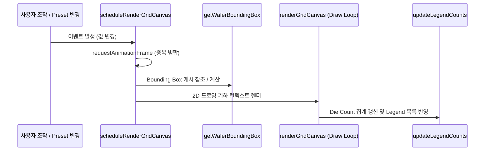

# Map Editor Specifications & Function Reference (MAP_EDITOR_SPEC.md)

> **Status:** 🟢 Living | **Last-verified:** 2026-07-27 (정렬 일원화 · §6 M2.6 1테이블 계획 저장소 `0f8d35f`) | **Owner:** UI/Map | **Source-of-truth:** `client2/src/map_editor.js`, `client2/src/transfer_plan.js`, `server/map_overlay.py`, `server/bonding_plan.py`, `server/transfer_plan.py`, `server/utils/coordinate_transformer.py` · 상위 [SYSTEM_OVERVIEW](../overview/SYSTEM_OVERVIEW.md)
>
> §1~§4는 격자 에디터 본체(2026-07-24 검증), **§5 범용 맵 오버레이**·**§6 전사 계획**은 M2/M2-v2(`8e34804`/`da65a87`)에서 신설됐습니다. **§5는 `7d931dc`(변환 클라 일원화)+`251dbfd`(테이블 전환 해제·메타 단일 기준 규칙)에 맞춰 전면 재작성됐습니다** — 종전의 "서버가 정렬해서 내려준다" 서술은 더 이상 클라 경로를 설명하지 않습니다.

본 문서는 `assyManager` 프로젝트의 2세대 격자 맵 에디터([`client2/src/map_editor.js`](file:///c:/Users/kk980/Developments/assyManager/client2/src/map_editor.js))에 구현된 모든 프론트엔드 자바스크립트 함수들의 설계 규격, 변환 공식 및 상세 API 레퍼런스를 정리합니다.

---

## 1. 격자 및 좌표계 아키텍처 (Coordinate System Architecture)

격자 맵 에디터는 **물리(Physical) 좌표계**, **화면 격자 셀 인덱스(Grid Cell Index)**, **시각(Visual/Standard) 좌표계**의 삼원화된 구조를 사용하여 웨이퍼 기판의 3D 공간적 물리 거동(회전, 면 반사)과 화면상의 2D 공간 표시를 매끄럽게 처리합니다.

### 1) 기하 변환 수식 (Geometric Transformation Formulas)

사용자가 설정한 `X Start`, `Y Start` 좌표는 **화면상에 보여지는 격자 내 유효 웨이퍼 영역 Bounding Box의 최소값(`box.minC`, `box.minR`)**의 좌표를 지칭합니다.

#### 화면 기준 웨이퍼 유효 셀 경계 상자 (Wafer Bounding Box)
격자 내부 영역($c \in [0, \text{visualCols}-1]$, $r \in [0, \text{visualRows}-1]$)에 속하는 셀 중, 물리 엔진 상 웨이퍼 유효 반경 내부인 셀들의 스크린 인덱스 최댓값/최소값 범위를 계산합니다.
$$\text{box} = \{ \text{minC}, \text{maxC}, \text{minR}, \text{maxR} \}$$

#### 시각 좌표 (Visual / Standard Coordinates) 계산
화면의 셀 눈금 `(c, r)`로부터 데이터베이스에 기록할 직교 좌표 `(xv, yv)`를 도출하는 수식입니다. 백면(Back Side) 미러링 반사 상태에 따른 X/Y축 축반전을 완벽히 보정합니다.

* **수평(X) 축 변환**:
  * X축이 좌우 반전되는 조건 ($\text{side} = \text{back}$ 이며 90°/270° 회전이 아닐 때):
    $$xv = \text{box.maxC} - c + \text{startX}$$
  * 그 외의 모든 경우 (일반 방향):
    $$xv = c - \text{box.minC} + \text{startX}$$

* **수직(Y) 축 변환**:
  * Y축이 상하 반전되는 물리적 조건 ($\text{side} = \text{back}$ 이며 90°/270° 회전일 때 Y축이 물리적으로 미러링):
    $$\text{isYMirrored} = (\text{side} = \text{back} \land \text{rotation} \in \{90, 270\})$$
  * `invertY` (Y축 방향 역전 옵션)와 `isYMirrored` 상태의 조합에 따라 분기:
    * **`invertY`가 `false` (상->하 증가) 일 때**:
      * $\text{isYMirrored} = \text{false}$: $yv = r - \text{box.minR} + \text{startY}$
      * $\text{isYMirrored} = \text{true}$: $yv = \text{box.maxR} - r + \text{startY}$
    * **`invertY`가 `true` (하->상 증가) 일 때**:
      * $\text{isYMirrored} = \text{false}$: $yv = \text{box.maxR} - r + \text{startY}$
      * $\text{isYMirrored} = \text{true}$: $yv = r - \text{box.minR} + \text{startY}$

---

## 2. 상태 관리 변수 (State Variables)

| 변수명 | 타입 | 설명 |
| :--- | :--- | :--- |
| `currentRotation` | `number` | 현재 화면 격자의 회전 상태 (`0`, `90`, `180`, `270`) |
| `currentSide` | `string` | 웨이퍼의 앞/뒷면 설정 (`"front"`, `"back"`) |
| `activeBrush` | `string` | 현재 팔레트에서 선택되어 격자에 색칠할 값(Legend Value) |
| `gridData` | `object` | 기판 고유 물리 좌표 키(`"${xp}_${yp}"`)를 기준으로 맵핑된 칩 값 매트릭스 |
| `gridCells2D` | `object` | 스크린 인덱스 `gridCells2D[r][c]` 기준으로 맵핑된 시각/물리 좌표 정보 캐시 |
| `isOriginMode` | `boolean` | 사용자가 마우스 클릭으로 `(0, 0)` 원점의 위치를 직접 지정하는 모드 활성화 여부 |
| `isPainting` | `boolean` | 마우스 드래그를 이용해 격자에 연속 페인팅을 수행 중인지 여부 |
| `isRightDrag` | `boolean` | 마우스 오른쪽 버튼을 드래그하여 연속 지우개(Erase)를 수행 중인지 여부 |
| `boundingBoxCache` | `object` | 각 각도/직경/칩 피치 기하 설정별 웨이퍼 Bounding Box 연산 결과 캐시 |

---

## 3. 전체 함수 명세 (Function Reference)

### Category 1: Initialization & DOM Setup (초기화 및 DOM 바인딩)

#### 1) `debounce(func, wait = 200)`
* **용도**: 입력 또는 창 크기 조절 시 이벤트가 단기간에 과도하게 호출되는 것을 방지하기 위한 디바운스 유틸리티.
* **매개변수**:
  * `func` (`Function`): 실행할 콜백 함수.
  * `wait` (`number`): 디바운스 대기 제한 시간 (ms).
* **반환값**: `Function` (디바운스 래핑된 새 함수).

#### 2) `initDOMElements()`
* **용도**: 화면상의 모든 HTML 조작 노드(Inputs, Buttons, Dropdowns, Canvas)를 탐색하여 전역 `el` 객체에 캐싱하고, 이벤트 리스너(Change, Click, Mouse 등)를 최초 바인딩합니다.
* **내부 흐름**:
  * 각 설정 입력 필드(`Cols`, `Rows`, `StartX`, `StartY`, `YInvert`) 변경 시 유효성 검사 및 `scheduleRenderGridCanvas()` 호출 리스너 등록.
  * 물리 형상 설정 입력 필드 변경 시 캐시(`boundingBoxCache`) 초기화 처리 리스너 등록.

#### 3) `initMouseDragEvents()`
* **용도**: Canvas 뷰포트 내에서의 마우스 클릭, 드래그(연속 그리기), 마우스 오른쪽 버튼(연속 지우기) 인터랙션 상태 머신을 초기화합니다.
* **마우스 리스너 바인딩**:
  * `mousedown`: 클릭 대상 셀 검출 및 페인팅 또는 지우기 상태(`isPainting`, `isRightDrag`) 설정.
  * `mousemove`: 드래그 중인 셀의 위치로 마우스가 이동할 때 실시간 색상 브러시 칠/지우기 적용.
  * `mouseup` / `mouseleave`: 드래그 및 페인팅 상태 초기화.

---

### Category 2: Table & Metadata Management (DB 연동 및 테이블 스키마)

#### 4) `loadTablesList()` (async)
* **용도**: assyManager 서버 API(`/api/tables`)를 호출하여 적재 가능한 테이블 목록을 가져와 드롭다운(`el.tableSelect`)에 바인딩합니다.

#### 5) `switchTable(tableName)` (async)
* **용도**: 테이블을 전환할 때 해당 테이블의 컬럼 스키마(`/api/tables/{tableName}/schema`)를 조회하여 화면 메타데이터 입력창 및 좌표 매핑 셀렉터를 동적으로 렌더링합니다.

#### 6) `renderMetadataInputs()`
* **용도**: 조회된 테이블 스키마의 컬럼 타입 정보를 바탕으로 사용자로부터 맵 저장 시 기입할 메타데이터 입력 필드들(예: `lot_id`, `wafer_no` 등)을 화면 왼쪽 하단에 자동 렌더링합니다.

#### 7) `getBaseColumnName()`
* **용도**: 현재 활성화된 스키마 중 데이터 값을 나타내는 핵심 Value 컬럼명(일반적으로 `bin` 또는 `class`)을 기본값으로 추정 반환합니다.

#### 8) `fillColumnDropdowns()`
* **용도**: 스키마 구조 내의 수치형/문자열형 컬럼들을 분류하여 좌표 및 매핑 드롭다운(`X 좌표 컬럼`, `Y 좌표 컬럼`, `값 컬럼`) 리스트를 채웁니다.

---

### Category 3: Geometry & Coordinate Conversion (기하학 및 좌표 변환식)

#### 9) `getPhysicalCoords(colVisual, rowVisual, cols, rows, rotation, side)`
* **용도**: 화면상의 격자 인덱스 `(colVisual, rowVisual)`를 물리 기판 기준 정렬 좌표인 `(xp, yp)`로 일대일 변환합니다. 회전각과 단면 상태에 따른 기판의 이동각을 2D Matrix 변환식으로 모사합니다.
* **반환값**: `{ x: xp, y: yp }`

#### 10) `getCellFromPhysicalCoords(xp, yp, cols, rows, rotation, side)`
* **용도**: `getPhysicalCoords`의 역함수. 물리 좌표 `(xp, yp)`를 현재 회전/단면 설정 상태 하의 시각적 셀 인덱스 `(c, r)`로 역산합니다.
* **반환값**: `{ c, r }`

#### 11) `getCellFromVisualCoords(xv, yv, cols, rows, rotation, side, invertY, startX, startY)`
* **용도**: 데이터베이스 등에 저장되어 있는 시각 좌표 `(xv, yv)`를 입력받아 현재 화면의 격자 셀 인덱스 `(c, r)`로 역변환합니다. (X/Y 미러링 역산 및 Y-Invert 오프셋 제거 적용)
* **반환값**: `{ c, r }`

#### 12) `getWaferBoundingBox(rotation, side)`
* **용도**: 화면 격자 내부의 유효 셀 범위 내에서 내부 영역에 완벽히 들어오는 웨이퍼의 2D 시각 컬럼/로우 경계상자 `[minC, maxC, minR, maxR]`를 계산하고 캐싱합니다.
* **반환값**: `{ minC, maxC, minR, maxR }` (완전 격자 내부로 클리핑 됨)

#### 13) `getVisualCoords(colVisual, rowVisual, cols, rows, rotation, side, invertY, startX, startY)`
* **용도**: 화면의 셀 인덱스 `(colVisual, rowVisual)`를 받아서 화면상의 시각 2D 직교 좌표 `(xv, yv)`로 실시간 변환합니다. (공식 단원 **1. 기하 변환 수식** 참조)
* **반환값**: `{ x: xv, y: yv }`

#### 14) `getTransformedPhysicalConfig(currentRotation, currentSide)`
* **용도**: 사용자가 입력한 물리 오프셋(`offsetX`, `offsetY`) 및 칩 크기(`chipX`, `chipY`) 정보를 회전각과 뒤집힘 방향에 맞춰 좌표축을 재배치한 물리 설정 구조체를 반환합니다.
* **반환값**: `{ waferDia, edgeMargin, effectiveRadius, chipX, chipY, offsetX, offsetY }`

#### 15) `getScreenShift(physConfig, cellW, cellH)`
* **용도**: 화면 좌표 `(0,0)` 기준 픽셀 좌표계에서 물리 좌표의 원점이 캔버스 중앙 정렬되도록 미세한 픽셀 평행이동 오프셋(`shiftX`, `shiftY`)을 계산합니다.
* **반환값**: `{ shiftX, shiftY }`

#### 16) `isCellInsideWaferFast(c, r, visualCols, visualRows, physConfig, width = 700, height = 700)`
* **용도**: 셀의 4가지 꼭짓점 픽셀 좌표가 물리 기판 원의 유효 반경 범위 내부에 완전하게 속하는지 여부를 실시간으로 고속 검증합니다.
* **반환값**: `boolean` (`true` 이면 완전 포함)

#### 17) `isCellInsideWafer(c, r, visualCols, visualRows)`
* **용도**: 전역 UI 설정 노드들의 최신 값을 직접 긁어와 `isCellInsideWaferFast`를 호출해주는 간이 헬퍼 함수.

#### 18) `applyPhysicalGeometry()`
* **용도**: 물리 형상 설정 필드의 변경값을 감지하여 그리드의 Col, Row 크기를 자동 재조정 및 업데이트합니다.

#### 19) `updateOrientationUI()`
* **용도**: 회전(0°, 90°, 180°, 270°) 및 단면(FRONT, BACK) 상태가 변경되었을 때 화면 오른쪽 상단의 시각 버튼 클래스 활성화 상태 및 그리드 눈금 정보를 갱신합니다.

#### 20) `getVisualGridDimensions()`
* **용도**: 회전각에 따른 Grid의 가로/세로 기하적 축스왑 상태를 고려하여 시각적으로 보여질 실제 컬럼 수(`visualCols`) 및 로우 수(`visualRows`)를 반환합니다.
* **반환값**: `{ visualCols, visualRows }`

---

### Category 4: Preset Management (제품 규격 프리셋)

#### 21) `renderPresetDropdown()`
* **용도**: 코드에 등록된 기본 빌트인 제품 규격 프리셋 리스트(`BUILTIN_PRESETS`) 및 브라우저 로컬 저장소(`localStorage`)에 저장된 사용자 정의 프리셋을 파싱하여 화면 상단 드롭다운 리스트를 구성합니다.

#### 22) `loadSelectedPreset()`
* **용도**: 사용자가 제품 프리셋을 클릭했을 때 격자 크기, 축 오프셋, 반전 설정들을 인풋 필드에 자동 이식하고 즉시 격자를 새로 그립니다.

#### 23) `saveCustomPreset()`
* **용도**: 현재 입력된 커스텀 격자 매개변수를 브라우저 로컬 스토리지에 사용자 지정 이름으로 영구 보존(Save)합니다.

---

### Category 5: Rendering & Canvas Control (격자 렌더링 제어)

#### 24) `getGridCellObject(c, r, visualCols, visualRows, physConfig, width, height)`
* **용도**: 특정 셀 인덱스 `(c, r)`에 속하는 셀의 물리/시각 좌표, 고유 키, 웨이퍼 범위 내 소속 여부 및 원점 여부를 일체화한 구조체를 생성하여 반환합니다.
* **반환값**: `{ c, r, x, y, px, py, key, inside, isOrigin }`

#### 25) `getGridCellFromMouseEvent(e)`
* **용도**: Canvas 영역 내부에서 이벤트가 일어난 마우스 스크린 픽셀 위치 `(clientX, clientY)`를 격자의 행렬 셀 좌표 `(c, r)`로 역추적하여 셀 객체를 반환합니다.
* **반환값**: `GridCellObject` 또는 `null` (그리드를 벗어난 마우스인 경우)

#### 26) `scheduleRenderGridCanvas()`
* **용도**: 브라우저 렌더링 프레임 단위(`requestAnimationFrame`)로 중복 그리기 요청을 병합하여 호출 성능 성능 저하를 방지합니다.

#### 27) `renderGridCanvas()`
* **용도**: 에디터의 핵심 렌더링 파이프라인. 전체 Canvas 격자, 배경, 셀 텍스트 라벨, 붉은색 원점 테두리, 그리고 웨이퍼의 물리적 원 외곽 실선들을 미려하게 그립니다.
* **드로잉 구성 순서**:
  1. 캔버스 리사이징 및 버퍼 세정
  2. `boundingBoxCache` 갱신 및 `hasZeroZero` 검출
  3. 격자 그리드 및 웨이퍼 영역 칩 드로잉 (Legend 색상 맵핑)
  4. 원점(Origin) 셀 강조 처리 (붉은 테두리 및 반투명 배경)
  5. 텍스트 라벨 렌더링 (폰트 크기 자동 맞춤 적용)
  6. 가이드라인 원(외곽 실선 및 에지 마진 실선) 렌더링

#### 28) `updateCellStyles(cell, val)`
* **용도**: 마우스 조작을 통해 특정 셀의 브러시 맵핑 값을 변경한 뒤 즉시 렌더링 프레임 예약을 걸어줍니다.

#### 29) `updateNotchPosition()`
* **용도**: 회전각에 따른 물리적 Notch(노치) 지시자 방향을 계산하여 Canvas 상단/우측/하단/좌측에 노치 삼각형 마커를 그래픽적으로 드로잉합니다.

---

### Category 6: Legend & Brush Painting (범례 관리 및 맵 매핑)

#### 30) `updateLegendCounts()`
* **용도**: 현재 격자 맵 상에 칠해진 각 범례 분류값의 수량(Die Count)을 실시간 집계하여 우측 스패널의 범례 테이블 카운터를 업데이트합니다.

#### 31) `loadLegendFromStorage()`
* **용도**: 로컬 캐시 스토리지로부터 사용자가 일전에 저장했던 커스텀 공정 bin/범례 색상 리스트를 동적으로 복원합니다.

#### 32) `saveLegendToStorage()`
* **용도**: 에디터 우측 패널에서 수정된 범례 테이블의 색상 및 분류 명칭들을 로컬 스토리지에 저장합니다.

#### 33) `renderLegendTable()`
* **용도**: 범례 테이블 UI를 HTML로 재생성하며, 색상 피커 바인딩 및 범례 이름 변경 리스너를 연동하여 범례 제어 시스템을 구축합니다.

#### 34) `selectBrush(val)`
* **용도**: 사용자가 범례 행을 마우스로 클릭했을 때 해당 값(Value)을 브러시 모드로 선택하고 시각적 선택 효과를 부여합니다.

#### 35) `addNewLegendRow()`
* **용도**: 범례 리스트 하단에 새로운 커스텀 분류 bin을 추가하고 화면을 리렌더링합니다.

#### 36) `remapGridValues(oldVal, newVal)`
* **용도**: 맵 데이터 내의 기존 범례 문자열 `oldVal`을 새 문자열 `newVal`로 전역 일괄 치환(Mapping)합니다.

---

### Category 7: Interactive Designation & Operations (인터랙션 및 특수 기능)

#### 37) `handleCellClick(cell, event)`
* **용도**:
  * 일반 모드: 단일 셀 클릭 시 브러시 페인팅 또는 우클릭 해제 적용.
  * 원점 모드(`isOriginMode = true`): 클릭된 셀 `(c, r)`이 시각 좌표 `(0, 0)`이 되도록 역산하여 `startX`, `startY` 입력 필드 값을 즉시 업데이트합니다. (수식: `newStartX = -xv_0`, `newStartY = -yv_0`)

#### 38) `clearGrid()`
* **용도**: 전체 격자 셀 데이터를 완전히 지우고 초기화 상태로 캔버스를 갱신합니다.

#### 39) `fillGrid()`
* **용도**: 유효 웨이퍼 원 영역 내부에 속하는 모든 유효 칩 셀을 현재 선택된 브러시의 값으로 일괄 페인팅합니다.

#### 40) `pushMapData()` (async)
* **용도**: 현재 에디터에서 완성된 시각 2D 맵 데이터 및 메타데이터, 그리고 저장 당시의 격자 설정 스냅샷(`grid_metadata`)을 하나의 트랜잭션 페이로드로 구성하여 assyManager 백엔드 서버에 일괄 영속 적재합니다.

#### 41) `getEdgeClassification()`
* **용도**: 100% 프론트엔드 공간 위상 판별 알고리즘. 웨이퍼 내부에 존재하는 셀 중 E1(가장 외곽 1줄) 및 E2(외곽에서 2번째 줄)의 경계 격자 셀 세트를 추출합니다.
* **반환값**: `{ E1: Set, E2: Set }`

#### 42) `getVisualGridDimensions()`
* **용도**: 현재 구성 하에서 캔버스의 실제 픽셀 너비와 높이를 그리드 눈금과 연동하여 취득합니다.

#### 43) `selectEdgeCells(target)`
* **용도**: 화면 눈금 상에서 E1 또는 E2 분류에 속하는 모든 셀을 마우스 브러시 선택 효과로 강조합니다.

#### 44) `autoPaintE1E2()`
* **용도**: E1 영역 및 E2 영역에 대응하는 웨이퍼 테두리 칩들을 각각 지정된 고유 빈(Bin) 값으로 1초 만에 일괄 페인팅하는 자동화 매크로 기능입니다.

#### 45) `fillSelectedCells()`
* **용도**: 현재 멀티 셀 셀렉션이 활성화된 경우 선택 구역 전체를 브러시 값으로 자동 페인팅합니다.

#### 46) `clearSelectedCells()`
* **용도**: 현재 선택된 멀티 셀 영역의 데이터 값을 완전히 지웁니다.

#### 47) `copyGridToExcel()`
* **용도**: 현재 격자 맵의 레이아웃 배열 구조 그대로 시각 좌표 인덱스에 맞춰 탭 분리 문자열(TSV) 구조로 클립보드에 가공 기입하여, 사용자가 **엑셀(MS Excel)에 바로 붙여넣기(Ctrl+V)** 할 수 있도록 인터랙션 데이터를 이식합니다.

---

## 4. 에디터 렌더링 프레임 라이프사이클 (Rendering Lifecycle Flow)

격자 맵의 상태 변화 및 리드로잉은 프레임 단편화를 막기 위해 다음과 같은 순서로 실행됩니다.



본 명세에 수록된 모든 물리 맵 변환 법칙 및 47가지 전원 함수 규격을 바탕으로 코드를 해석 및 유지보수하여 주시기 바랍니다.

---

## 5. 범용 맵 오버레이 (Universal Map Overlay) — 정렬 계약

오버레이는 **계획 전용 기능이 아니라 맵 인프라**입니다 — 임의의 맵을 임의의 맵 위에, map meta가 달라도 겹칩니다. 계획 UI는 이 능력의 소비자 중 하나일 뿐입니다.

> **읽는 순서**: §5.0이 도메인 규칙(무엇이 정렬의 근거인가), §5.1이 **클라 파이프라인**(현재 화면에 그려지는 것), §5.2가 **서버 계약**(엔드포인트는 살아 있고 여전히 정렬된 좌표를 내려줍니다 — 다만 맵 에디터가 그 좌표를 더 이상 소비하지 않습니다).

### 5.0 정렬의 유일한 기준은 `wafer_map_metadata`다 (사용자 확정 2026-07-26 · `251dbfd`)

```
맵 데이터를 담는 모든 테이블(defect / EDS / DT / bonding / core …)은 메타 등록이 전제다.
정렬은 소스·타깃 메타의 델타에서 유도한다. 그 외의 정렬 근거는 두지 않는다.
```

- **미등록은 정상 상태가 아니라 누락입니다.** "메타가 없으면 identity"는 규칙이 아니라 **폴백**이며, 폴백이 발동했다는 사실 자체가 등록 누락의 신호입니다.
- **계측 결과(DEFECT WF로 측정한 어긋남)도 메타에 기록합니다** — 별도 오버라이드 레이어를 두지 않습니다. `align_overrides`(config 선언 · `by_eqp` 분기)는 **2026-07-27에 제거됐습니다**([히스토리](../history/20260727_004500_align_consolidation_meta_single_source.md)). 사용자 config에 키가 남아 있어도 서버는 무시합니다.
- **셀 레벨 `grid_metadata` 컬럼은 폐기 스킴입니다** — 정렬 소스로 문서화하지도, 새로 구현하지도 마십시오.
  > ⚠️ 이름이 겹칩니다. 폐기 대상은 **맵 데이터 행마다 붙던 `grid_metadata` 컬럼**이고, `wafer_map_metadata` **테이블의 동명 payload 컬럼은 정본**입니다([architecture_and_management §2](../map_editor/architecture_and_management.md)). `loadExistingMap`에 셀 레벨 폴백 코드가 아직 남아 있으나(`client2/src/map_editor.js:2594-2604`), 어떤 맵 테이블도 `/tables/{t}/schema`에 `grid_metadata`를 노출하지 않아 라이브에서는 **사문**입니다.

> **🔴 열린 격차(규칙과 현실의 충돌)** — `bonding_map`의 distinct 맵 키 **약 39만 개**에 대해 `wafer_map_metadata` 등록은 **9행**입니다. 즉 실사용의 거의 전부가 "규격 미등록 → 현재 화면 규격으로 해석"으로 **조용히** 떨어집니다. 규칙상 이것은 누락이므로, 그 조용함 자체가 계약 위반입니다. 해소 트랙은 보드의 **M3**(맵 메타 자동 등록)에서 추적합니다 — 계획·우선순위는 [PROJECT_STATUS](../process/PROJECT_STATUS.md)가 정본이며 여기서 되풀이하지 않습니다.

### 5.1 클라 파이프라인 — 변환은 클라 단일 구현이다 (`7d931dc`)

```
소스 원본 (x,y) ─[소스 자신의 메타 프레임]─▶ 물리 좌표 ─[타깃의 현재 화면 컨트롤]─▶ 셀
```

**메인 맵 로드는 이 파이프라인의 특수 케이스**입니다(소스 메타 == 현재 화면 컨트롤). 그래서 **오버레이 전용 변환 코드는 존재하지 않습니다.**

- **프레임 창(frame window)** — 변환 함수들이 규격을 DOM에서 읽는 지점은 `getTransformedPhysicalConfig`·`getWaferBoundingBox` **두 곳뿐**이며, 이 두 곳이 `physNum`/`gridDimNum`을 경유합니다. `withPhysFrame(frame, fn)`이 `physFrameOverride`를 잠깐 갈아끼운 채 콜백을 돌립니다. **동기 전용**입니다(내부 `await` 금지 — `try/finally` 복원이 프레임 경계를 넘어 새면 조용한 오답이 됩니다).
- **투영은 메인 로드와 같은 두 줄**입니다 — `projectCellsToPhys`는 `getCellFromVisualCoords` → `getPhysicalCoords`를 소스 프레임을 씌운 채 호출할 뿐, 새 기하식을 쓰지 않습니다.
- **물리 키는 화면 조작에 불변**입니다. `gridData`가 이미 물리 키(`${px}_${py}`)로 저장되고 렌더가 매 프레임 `(c,r) → getPhysicalCoords → coordKey`로 되짚으므로, 사용자가 회전·면·치수를 어떻게 돌리든 **메인 맵과 오버레이가 같은 규칙으로 함께 움직입니다**.
- **재투영 규율** — 레이어는 `rawCells`(소스 원본 좌표) + `frame`(그 좌표가 사는 프레임)을 동반 보관하고, `currentGeomSignature`가 바뀌면 `syncOverlayGeometry`가 원본에서 다시 투영합니다. 서명에는 **물리 파라미터 6종(`phys_wafer_dia/chip_x/chip_y/offset_x/offset_y/edge_margin`)이 반드시 포함**됩니다 — 소스 메타에 물리 항목이 빠져 현재 화면 값으로 폴백하는 경로에서는 이 재투영이 실제로 일해야 하기 때문입니다(이전 C7 결함 해소).
- **정렬 여부 판정은 `align.origin`으로만** 합니다. `origin`은 `frameAxesKey`(회전·면·y반전·START·치수·물리 6종 = **축 전부**) 비교로 산출합니다. `rotation`/`flip`/`offset` 값으로 판단하면 y반전·START만 다른 정상 보정을 "무보정"으로 오표시합니다.
- **격자 규격 호환성 관문** — 소스·타깃의 `cols×rows`가 다르면 `align_unavailable`로 **명시 거절**합니다(물리 좌표는 정준 격자의 인덱스라, 치수가 다르면 같은 인덱스가 같은 다이가 아닙니다).
- **실패해도 목록에 행으로 남깁니다**(조용한 소실 금지). 각 실패 행은 재시도(`↻`) 버튼을 유지합니다.

**실패 상태(status) 4종** — 전부 "그리지 않는다"입니다.

> 종전의 `align_unconfirmed` · `align_override_declared` 두 상태는 **2026-07-27에 삭제**됐습니다. 둘 다 "서버에 계측 보정 선언이 있는가"를 묻던 `probeAlignDeclaration` 관문의 산물인데, 선언 레이어 자체가 사라져 물어볼 대상이 없어졌습니다(보정은 소스 메타에 들어 있고, 소스 메타는 어차피 읽습니다). 관문이 하나 줄어든 만큼 오버레이 추가의 REST 왕복도 하나 줄었습니다.

| status | 뜻 |
|---|---|
| `meta_unavailable` | 소스 또는 타깃 **규격 조회 자체가 실패**했다(≠ 미등록). 규격을 모르는 채로 겹치면 좌표가 조용히 어긋남 |
| `binding_unavailable` | 소스 테이블의 좌표 바인딩을 스키마에서 유도할 수 없다(좌표 컬럼명이 관례 밖 — `dt_log`의 `tx/ty` 등. 선언이 서버 config에만 있음) |
| `align_unavailable` | 격자 규격 불일치 등 **변환을 계산할 근거가 없다** |
| `no_data` | 겹칠 셀이 0건 |

이 4종 외에 **일반 `error`**가 있습니다 — 소스 스키마 조회 실패, 셀 조회 실패처럼 사유가 명확한 IO 실패입니다. 명명된 4종과 구분해 두는 이유는, 위 4종이 전부 **"근거가 없으면 그리지 않는다"는 판단**의 결과인 반면 `error`는 단순 실패이기 때문입니다.

> **`무보정`(identity)은 실패가 아닙니다** — 칩에 별도 표기되며, 소스 메타가 없어 현재 화면 규격으로 해석한 경우 툴팁에 그 사실이 드러납니다. §5.0의 규칙에 비추면 이 표기는 "정상"이 아니라 **등록 누락의 알림**으로 읽어야 합니다.

**"확인하지 못했다"와 "선언이 없다"를 절대 같은 값으로 다루지 마십시오** — `fetchGridMetaFor`는 **404/405만** "없다"(null)로 읽고 나머지는 throw합니다. `fetchPaintRules`가 세운 규약과 동일합니다(§5.4).

### 5.2 서버 계약 — 엔드포인트는 살아 있다

**`/api/maps/overlay`와 `server/map_overlay.py`는 삭제되지 않았고 여전히 정렬된 좌표를 제공합니다.** 바뀐 것은 **맵 에디터가 그 좌표를 더 이상 소비하지 않는다**는 것뿐입니다. 현재 소비자:

| 소비자 | 무엇을 쓰는가 |
|---|---|
| `GET /api/maps/overlay` (`main.py`) | `map_overlay.get_overlay` — 정렬 좌표 `overlays[]` 전체 |
| **`server/bonding_plan.py`** | `map_overlay.resolve_map_transform` / `align_status_label` — **가용량 산출의 정렬**(2026-07-27 배선) |
| **`server/transfer_plan.py`** | 같은 두 함수 + `resolve_binding` / `build_key_filters` / `load_overlay_config` |
| `GET /api/maps/paint-rules` | `map_overlay.get_paint_rules` — 페인트 잠금 정본(§5.4) |
| `server/tests/test_map_overlay.py` | 엔드포인트 계약 회귀 |

> ℹ️ **맵 에디터 클라는 이 엔드포인트를 더 이상 호출하지 않습니다.** 좌표를 안 쓰게 된 뒤로 남아 있던 `limit=1` probe(계측 보정 선언 유무 확인)마저 선언 레이어와 함께 제거됐습니다(§5.1).

> ✅ **[구 A2 해소]** `server/bonding_plan.py`가 갖고 있던 자체 정렬 구현(`normalize_align`/`make_align_transform`/`align_status_label`)은 **삭제**됐고, 가용량 산출도 위 표대로 `map_overlay`를 경유합니다. 이로써 **서버의 좌표 변환 구현은 하나**입니다(렌더용 클라 구현과 합쳐 총 2개 — 가용량이 서버에서 계산되는 한 이 둘이 하한입니다).

**서버의 정렬 결정 규율**(오버레이·가용량 공통 — `map_overlay.resolve_map_transform` 단일 진입점):

```
① 소스·타깃 wafer_map_metadata의 델타에서 유도한다(회전·면·y반전·start·치수·phys 6종)  origin = derived
② 유도 근거가 없으면(양쪽 메타 부재) identity로 그대로 붙인다                            origin = identity
③ 변환을 계산할 근거가 없을 때만 status = align_unavailable
   (치수 비호환 · phys 규격 미등록 · **한쪽 메타만 등록**된 비대칭)
```

- **③의 "비대칭" 조항이 가용량 경로에만 있는 추가 규율입니다.** 소스 프레임은 아는데 canonical(코어) 프레임을 모르면 상대 회전을 알 수 없습니다. 오버레이는 그 상태를 칩으로 사용자에게 드러내지만(`무보정 · 규격 미등록`), 가용량은 숫자 하나로 나가므로 드러낼 자리가 없습니다 — 그래서 `align_unavailable` + 강등 경고로 거절합니다.
- canonical 프레임은 **좌표를 바인딩한 첫 역할**이 정의합니다(`bonding_plan.CANONICAL_FRAME_ROLES` = total_chips → defect → eds_fail, `transfer_plan`은 `frame:"origin"` fail 원천의 선언 순서). 그 역할의 메타가 없으면 **뒤 역할로 넘어가지 않습니다** — 넘어가면 회전된 계측 맵이 스스로 기준을 참칭해 변환이 조용히 identity로 떨어집니다.

### 5.3 프레임 vs 물리 좌표계 — A1이 고친 것 (서버 측)

`WaferMapCoordinateTransformer.cell_to_physical`이 정의하는 **프레임(visual) → 물리(canonical)** 사상과, `PhysicalWaferEngine.is_cell_inside_wafer(c, r, cols, rows)`가 쓰는 좌표계는 **다릅니다.** 엔진은 `x_mm = (c-cc)*chip_x + off_x`로 격자 인덱스를 mm로 바꾸는데, 여기의 `(c, r)`은 **프레임** 인덱스이므로 `chip_x`도 **프레임 x축의 피치**여야 합니다.

| rotation | 엔진에 넣을 (chip_x, chip_y) | (off_x, off_y) |
|---|---|---|
| 0 | (cx, cy) | ( oox, ooy) |
| 90 | **(cy, cx)** ← 스왑 | ( ooy, −oox) |
| 180 | (cx, cy) | (−oox, −ooy) |
| 270 | **(cy, cx)** ← 스왑 | (−ooy, oox) |

`oox`는 **back 면에서 부호가 뒤집힙니다**(`cell_to_physical`이 회전 **전에** 면 반전을 적용하고, 그 반전이 물리 x축을 뒤집기 때문). 이 보정을 빼면 회전 맵의 웨이퍼 bbox가 통째로 어긋나고, **저장 좌표가 bbox 상대값이라 전 셀이 어긋납니다.**

구현은 `map_overlay._frame_phys_params` **한 함수에 가둬** 있습니다. `WaferMapCoordinateTransformer`·`PhysicalWaferEngine`은 무수정입니다.

> **✅ A2 해소 (2026-07-27)** — `bonding_plan.make_align_transform`(bbox 항 없는 구 산술)은 **삭제**됐고 가용량 산출이 `map_overlay`로 배선됐습니다. 실측 대조: 라이브 규격(40×40 · chip 7×7 · dia 300 · margin 3)은 bbox가 `(0,39,0,39)`라 두 구현의 결과가 **1288셀 전건 일치** — 그래서 라이브 가용량 수치는 변하지 않습니다. 반면 웨이퍼 원에 잘리는 격자(29×25 · chip 11×13)에서는 **425셀 전건 불일치**하며 편차는 거울 축에서 `2·minC` = (4,4)입니다. 구 사본이 틀렸고, 그것이 휴면이 아니었다는 점도 함께 확인됐습니다 — `bonding_plan_config.json`·`transfer_plan_config.json` 둘 다 `eds_fail`에 `rotation:180`을 **라이브로 선언**하고 있었습니다(그 값은 `eds_fail_map` 메타의 rotation과 정확히 같아, 선언이 메타의 중복이었음을 보여줍니다).
> **✅ A3 해소 (2026-07-26, 재기동 후 REST 실측)** — 3케이스 전부 `status: ok` + `align_applied.origin: derived` + 격자 밖 셀 0건, `bonding_map/EXP1`의 `x=-1` 소멸 확인. 응답 필드명은 `align`이 아니라 **`align_applied`**입니다.
> 함정 기록: **존재하지 않는 경로는 정적 catch-all이 HTML을 200으로** 반환하므로 살아있음의 근거로 쓸 수 없습니다. ~~당시 `/health`도 그런 경로였습니다~~ — **2026-07-27부터 `/health`는 실제 라우트로 존재하고 항상 JSON을 반환합니다**([backend §1.3](../architecture/backend.md)). 그 외 경로에는 이 함정이 그대로 유효합니다.
> **회귀 시험 규율** — 오버레이 좌표 회귀는 반드시 **bbox ≠ 0인 실데이터**(29×25, 27×21 등)로 확인하십시오. 40×40(`minC=0`)은 결함이 **원리적으로 발현할 수 없는** 구간입니다. 축 조합은 `chip_x≠chip_y` · rot 90/180/270 · back · `offset≠0`을 **동시에** 만족시켜야 의미가 있습니다.

### 5.4 클라 측 경계 규약 (메인 로드와의 분리)

- **메인 로드와 코드 경로 분리** — `addOverlayLayer`는 `selectedTable`·`tableSchema`·`gridData`·legend·규격·brush·메타 입력을 읽기만 하고 쓰지 않으며 `switchTable`을 경유하지 않습니다. 유일한 의도적 교차는 `importOverlayToGrid`(오버레이 → `gridData`, **서버 쓰기 없음**, 페인트 잠금 존중, 격자 밖 셀 제외, 정체성 불변)입니다.
- **오버레이는 그 시점 타깃 프레임에 묶입니다** — 기준이 바뀌면 남겨두지 않고 **해제**합니다. 해제 지점은 셋입니다: 맵 로드(`loadExistingMap`) · **테이블 전환(`switchTable`)** · 프레임 진입(`openMapFrame`). 앞의 둘은 토스트로 알립니다.
  > 테이블 전환 해제는 `251dbfd`에서 **신설**됐습니다. 그전에는 오버레이가 그대로 서 있었고 `가져오기` 버튼도 살아 있어, **이전 테이블의 값을 새 테이블에 써 넣을 수 있었습니다.** `gridData`만 비우는 것으로는 그 경로가 닫히지 않습니다.
- 세션 저장·복원에는 `overlayLayers`와 `overlayGeomSig`가 함께 들어가고, 복원 직후 `syncOverlayGeometry`로 재투영합니다.

### 5.5 페인트 잠금 (Paint Lock)

잠금 선언의 **정본은 서버**(`GET /api/maps/paint-rules`)입니다 — 종전 클라 하드코딩 `'F'`를 대체했습니다. 기본은 F 잠금.

- **조용한 fail-open 금지**: 404/405만 "선언이 없다"(=해제가 정답)로 해석하고, 네트워크·5xx는 **"확인하지 못했다"**로 분류해 **직전 잠금 값을 유지**하고 `source:'stale'` + 툴바 칩 + 경고 토스트를 냅니다.
- 편집 가능 판정의 단일 관문은 `isProtectedFCell`입니다 — 모든 편집 경로(브러시·Fill·Auto-Paint·오버레이 가져오기)가 여기로 수렴합니다.

> **⚠️ 열린 항목 (QA v2 재검수 — 미해소)**
> - **C4 콜드 스타트 fail-open** — "직전 값"이 페이지 로드 직후엔 기본값 `{enabled:false}`라, **첫 조회가 실패하면 잠금이 걸리지 않은 채 시작**합니다. 칩이 뜨므로 *조용하지는* 않지만 잠기지도 않습니다. 테이블 전환 시 실패하면 이전 테이블의 잠금 값이 새 테이블에 계속 적용됩니다(fail-closed 방향이라 안전하나 의미상 부정확).
> - **~~C7 오버레이 기하 서명에 물리 파라미터 누락~~ → ✅ 해소(`7d931dc`)** — `currentGeomSignature`가 `phys_wafer_dia/chip_x/chip_y/offset_x/offset_y/edge_margin` 6종을 포함합니다. 다만 **소스 메타가 완비된 정상 경로에서는 재투영이 항등**이라 이 6종은 여분이고, **실제로 일하는 곳은 소스 물리 규격이 미등록이라 화면 값으로 폴백하는 경로**뿐입니다(§5.0의 등록 누락 문제와 같은 뿌리).
> - **F1 물리 규격 불일치를 관문이 막지 않는다 (미해소·잠복)** — §5.1의 호환성 관문은 `cols×rows`만 비교하고, 소스·타깃의 `phys_chip_*`/`phys_offset_*` 차이는 **툴팁 문구로만** 드러납니다. 물리 좌표는 인덱스이고 그 인덱스가 어느 다이인지는 `offset/chip` 비율이 정하므로, 반 피치를 넘는 offset 차이는 **전 셀 1다이 이동**을 조용히 만듭니다(임계값에서 불연속으로 튐). 라이브 등록 9건은 계열별로 물리 규격이 같아 **현재 도달성 0**.
> - **F2 관문의 타깃 기준이 DOM 메타 입력이다 (미해소)** — `addOverlayLayer`의 `targetKey`는 `getCurrentMapKey()`, 즉 **로드된 맵이 아니라 현재 메타 입력 필드**를 읽습니다. 맵을 로드하지 않고 입력만 바꾸면 관문이 엉뚱한 맵의 메타로 판정합니다. 로드 시점에 확정된 식별자(`loadedIdentity`)를 쓰는 것이 정답입니다.
> - **C3 계획 규모 상한 (M2.6으로 단위가 바뀜 — 재등급 필요)** — 클라 조회는 여전히 `limit=500`이고 절단을 로드 실패로 강등하지만, **세는 단위가 자재 행에서 legend 값으로 바뀌었습니다.** 자재·구간이 `map_split_registry` 한 행의 `bands` JSON 안으로 들어갔기 때문에 종전의 도달 예시(20값 × 3구간 × 10자재 = 600행)는 이제 **20행**입니다. 상한은 `map_split_registry` **행 = 계획의 값 수** 500이고, 서버 쪽 대응 캡은 `MAX_DOE_PER_PLAN`(500 레지스트리 행)·`MAX_BANDS_PER_PLAN`(2000 구간)입니다. 여유가 커졌을 뿐 상한 자체가 사라진 것은 아니며, **재등급은 QA 몫입니다.**
> - **C6 헤더 신선도** — 초안 시각(`S.savedAt`)이 서버 시각(`S.serverSavedAt`)보다 우선해, 화면 데이터는 서버본인데 칩은 낡은 초안 시각을 표시할 수 있습니다.
> - **C5 legend 저장 오탐** — `saveLegendToServer`가 *실패*와 *보낼 것 없음*을 같은 `false`로 반환해, 마지막 값 삭제 시 근거 없는 경고 토스트가 뜹니다.
> - **C8 `sticky` 토스트** — 상한 초과 퇴거에서 보호되지 않습니다. 현재 프로덕션 호출부가 없어 영향 0.

---

## 6. 전사 계획 (Transfer Plan) — 「계획 = 그 맵 자체」

**계획은 별도 개체가 아니라 지금 열어 편집 중인 그 맵입니다.** `bonding_map`을 열면 본딩 계획, `dt_map`을 열면 DT 계획이며, stage는 열린 테이블에서 `stages.*.target_map.table` 역인덱스로 유도합니다. 별도 stage 선택 UI·타깃 입력창·`plan_id`·계획 맵 사본은 **없습니다**.

| 개념 | 정의 |
|---|---|
| 계획 정체성 | `(ref_table, map_key)` — 맵 정체성과 동일 |
| 관리 단위 | **DOE = value** — 맵에 칠한 값 하나가 조건군 하나 |
| 밴드(STACK) | **[M2.6]** `bands` JSON 배열의 원소 하나 = 구간 하나. `seq`(정수)가 **정체**, **배열 위치가 순서**입니다. 구간은 **연속**이라 `to`만 저장하고 `from`은 앞 원소의 `to`+1로 유도합니다(층 수 = `to − 이전 to`). **삭제·재정렬 시 재번호를 매기지 않습니다** — 재번호는 그 구간에 붙은 자재를 고아로 만듭니다. ⚠️ `seq`는 이제 **DB가 유일성을 강제하지 않습니다**(자유 텍스트 varchar 안의 JSON) — 서버가 파싱 시점에 유일하게 재배정하며, 집계·판정을 `seq` 유일성에 기대면 조용히 꺼집니다 |
| 영역 지정 | **값 페인팅이 정본**(rect 영역 선택 모드는 폐기됨) |
| 수량 | **저장하지 않고 파생합니다.** 구간 소요 = `칠한 셀 수 × 층 수`, 매당 소요 = `ceil(구간 소요 / 자재 수)`. 저장된 총량은 누가 셀을 하나 더 칠하는 순간 어긋납니다. 클라·서버가 **같은 벡터 파일**(`contracts/band_arithmetic/vectors.json`)에 대조돼 있습니다 |
| 자재 | `bands[].materials[]`에 **사용자 입력 원문 그대로**. `(lot, slot)` 분해는 `plan_store.material_identity` **선언**을 따르며, 못 푸는 ID는 추측하지 않고 `source_unresolved`(클라는 조회조차 하지 않고 `미상`) |
| 저장소 | **`map_split_registry` 한 테이블**(`plan_store.registry` 바인딩). ~~`map_doe`/`map_doe_source`~~는 M2.6에서 폐기 — 읽기용 선언만 남아 있습니다 |

### 6.1 가용량 계약

```
가용 = 총 − (fail ∪ transferred)      ← 칩 단위 합집합(이중 감산 없음)
```

`origin_log`가 연결되지 않으면 M1식 단순 감산으로 폴백합니다. tape 계층의 fail은 코어 fail을 `dt_log` 조인으로 투영해 내립니다.

### 6.2 신뢰 표기 3층 방어 — 이 스펙에서 가장 중요한 계약

역할 바인딩이 하나라도 강등되면(또는 하드캡 절단·음수 remaining), 서버는 **값을 주지 않습니다**:

```
remaining: null                 ← 숫자 자체를 내려보내지 않는다
remaining_reliable: false
warnings: [{type: "source_degraded", role, status, effect, detail}, ...]
```

`validate`는 이 상태에서 부족·fail 판정을 **전부 생략**하고 `availability_unreliable`만 발행합니다. 최종 `status`는 `ok` / `warnings` / **`unverified`** 3값으로, **"검사 안 함"과 "이상 없음"을 절대 같은 값으로 내지 않습니다.**

### 6.3 클라 `replace` 권한 불변식 (C1) — **M2.6에서 자리를 옮겼습니다**

```
legendReplaceScope = { table, mapKey, fingerprint } | null
   ⇒ "이 화면은 이 맵의 레지스트리 행에서 왔고, 읽었을 때 이랬다"
```

M2.6 전에는 계획 행을 지우는 **prune 권한**(`serverKeys`/`doeServerLoaded`/`adoptServerDoe`)이었습니다. 계획이 `map_split_registry` 한 테이블로 접히면서 저장이 legend 저장과 같은 **`replace_map` 쓰기**가 됐고, 차집합 계산 기계장치(`pruneScoped`·`serverKeys`)는 비활성화가 아니라 **삭제**됐습니다. 남은 것은 같은 위험을 막는 **하나의 주장**이며 구현은 `client2/src/map_editor.js`에 있습니다.

- **권한**: 그 맵 자신의 레지스트리에서 온 legend만 그 맵을 replace할 수 있습니다. "조회에 성공했다"를 "화면이 서버본이다"로 승격시키면 안 됩니다 — 회복 재시도가 응답 본문을 버리는 경로가 있었고, 그 모순 상태에서 삭제 범위가 그 맵의 행 전량이 되어 실제로 데이터가 파괴됐습니다(QA 라이브 2회 재현).
- **소거 조건**: 테이블 전환 · 조회 실패 · **절단 응답(`total > rows.length`)** · 맵 언로드. 절단된 읽기는 replace 의미론 아래서 **데이터 파괴 읽기**입니다.
- **동시성(M2.6 신설)**: 쓰기 직전 재읽기해 `fingerprint`가 어긋나면 **upsert로 강등하지 않고 거부**합니다(`legendConflict`, 해당 맵의 모든 레지스트리 쓰기 차단 → 리로드해야 풀림). 강등하면 낡은 `bands`가 남의 세션 것을 덮습니다.
- **분배**: 자재 수량은 **`Math.ceil`**(서버 규약 일치 — `round`면 부족이 숨습니다).

> ⚠️ `transfer_plan.js`는 **서버에 직접 쓰지 않습니다.** 위 가드 전부가 한 경로에 있어야 갈라지지 않기 때문입니다.
