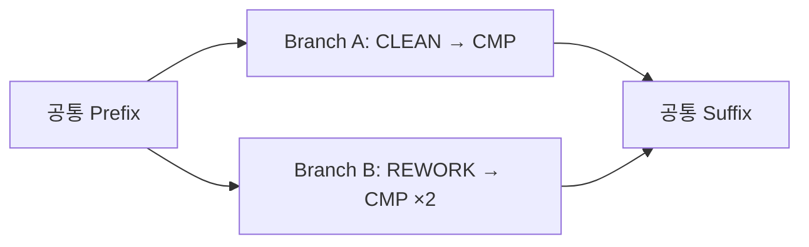

# Process Sequence Comparison Algorithm

> **Status: 설계 계약.** 구현 완료 여부는 이 문서가 아니라 연결된 코드와 테스트가
> 증명한다. 이 문서는 공정 순서 변경·반복·생략·분기 스키마 차이를 원장에서 어떻게
> 읽고, 비교하고, 압축 표시할지를 고정한다.
>
> 근거 원칙: [SCENARIO_CONSOLE_BRIEF](../process/SCENARIO_CONSOLE_BRIEF.md)의
> 「route master를 선언하지 않는다」와 「결측은 정상 상태다」.

## 1. 목적

여러 CHIP·Wafer·Core의 실제 공정 이벤트를 비교해 다음만 답한다.

1. 무엇이 같은가.
2. 순서·횟수·공정 구성·조건 중 무엇이 다른가.
3. 그 차이가 불량군에 얼마나 집중되는가.
4. 결측 때문에 확정할 수 없다면 무엇을 확인해야 가장 많이 좁혀지는가.

알고리즘은 표준 공정 순서를 정답으로 저장하지 않는다. 실제 실행 순서는 append-only
원장의 이벤트 시각과 이동 근거에서 파생한다.

## 2. 불변식

- **Route master 없음**: `A → B`를 정상이라고 미리 선언하지 않는다.
- **이벤트 보존**: 같은 공정이 세 번 실행되면 세 사건이다. 집합으로 접지 않는다.
- **부분 순서 보존**: 순서 근거가 불충분한 사건을 임의의 전순서로 만들지 않는다.
- **결측 분리**: 기록 없음, 명시적 미실시, 미상, 상충을 한 상태로 합치지 않는다.
- **N-way**: 비교 대상·Core·DT·Bonding layer 수에 의미상 상한을 두지 않는다.
- **증거 우선**: 원인 *후보*와 증명된 원인을 구분하고 모든 차이에 evidence id를 남긴다.
- **표시 예산과 의미 분리**: 접기·가상화·지연 렌더링은 허용하지만 선택 대상을 자르지 않는다.

## 3. 입력

### 3.1 사건

`processed_with` 사건에서 최소한 다음을 읽는다.

```text
subject/component identity
occurred_at
evidence_id
step
recipe
resolution state
```

`transferred` 사건은 Core가 여러 DT를 거쳐 어느 Bonding layer에 갔는지 연결한다.
LOT·SLOT·output job이 비어도 사건을 버리지 않고 해소 상태를 함께 전달한다.

### 3.2 비교 역할

대상은 `finding`과 `reference`처럼 역할을 가질 수 있다. 역할이 없으면 개별 경로 차이는
계산할 수 있지만 불량 농축도나 원인 후보 점수는 계산하지 않는다.

### 3.3 비교 가능한 구성요소

Core를 억지로 1:1 매칭하지 않는다. 다음 키가 충분히 구체적일 때만 같은 비교 슬롯에
놓는다.

```text
core_type + role + bonding position/layer + component identity evidence
```

후보가 여러 개면 `candidate`, 연결이 없으면 `unresolvable`로 남기고 구성 집합 자체를
비교한다.

## 4. 내부 표현

### 4.1 Event token

순서 비교 토큰은 공정 의미만 담는다.

```text
token = (step, recipe)
```

recipe는 STEP occurrence의 두 번째 정본 필드다. 설비·family·actual/setpoint·노브 값은
Process 입력도 후보도 아니다. 모든 수치 비교는 `measured` Measurement facet에서만 한다.

반복 사건은 `(token, occurrence_ordinal)`로 구별한다. `CMP`가 세 번이면 `CMP#1`,
`CMP#2`, `CMP#3`이다.

### 4.2 Process path

각 component의 사건을 다음 규칙으로 정렬한다.

1. 설비 sequence나 transfer sequence처럼 명시된 순서 근거
2. `occurred_at`
3. 결정적 출력만을 위한 `evidence_id`

3번은 화면을 안정시키는 tie-breaker일 뿐, 같은 시각의 두 사건에 실제 선후관계를
발명하지 않는다. 실제 선후가 불명확하면 관계는 `ambiguous_order`다.

### 4.3 Schema signature

```text
signature = hash(token#occurrence_ordinal의 순서열)
```

동일 signature의 대상은 먼저 한 군집으로 접는다. 100개 대상이 같은 경로를 가졌다면
한 번만 비교하고 지지 대상 수만 보존한다.

## 5. 비교 알고리즘

### Stage A — 경로 추출

component별 공정 사건과 transfer 사건을 시간 창 안에서 읽는다. Core → DT₁…DTₙ →
Bonding의 이동은 한 component path로 보존하고 대표 DT 하나를 고르지 않는다.

### Stage B — 동일 경로 군집화

schema signature로 exact cluster를 만든다. 속성 값은 signature에 포함하지 않으므로
공정열이 같고 노브만 다른 대상은 같은 스키마 군집 안에서 비교된다.

### Stage C — 공통 anchor 찾기

군집별 토큰열에서 유일한 연속 토큰 묶음(k-gram)을 찾는다.

1. 긴 묶음부터(`k=4 → 1`) 후보를 만든다.
2. 각 경로에서 한 번만 나타나는 후보를 우선한다.
3. 모든 경로에서 순서가 보존되는 anchor만 LIS(longest increasing subsequence)로 남긴다.
4. anchor 사이를 **difference window**로 자른다.

반복 토큰을 무리하게 한 점에 맞추지 않기 위해 유일하지 않은 토큰은 anchor로 쓰지 않는다.

### Stage D — difference window 분류

각 window를 다음 순서로 분류한다.

| 종류 | 판정 | 화면 표현 |
|---|---|---|
| `same` | 토큰열과 비교 속성이 동일 | 접힌 `동일 N개` |
| `repeat_change` | 같은 토큰의 발생 횟수가 다름 | `CMP ×1 / ×3` |
| `order_change` | 양쪽에 존재하는 사건의 선후관계가 반대 | `A → B / B → A` |
| `record_absent` | 한 군집에 사건 기록이 없고 미실시 증거도 없음 | `기록 없음` |
| `not_performed` | 미실시를 뒷받침하는 명시적 근거가 있음 | `미실시` |
| `substitution` | 같은 문맥 위치에서 step 또는 recipe가 다름 | `BOND_PREP · RCP-1 / RCP-2` |
| `schema_branch` | 삽입·삭제·스왑이 섞여 하나의 국소 변경으로 설명 불가 | 분기 후 재합류 |
| `ambiguous_order` | 사건은 있으나 선후 근거가 부족 | `순서 미상` |
| `contradiction` | 서로 양립할 수 없는 순서·identity 근거 | `상충 후보 N개` |

`record_absent`를 `not_performed`로 승격하지 않는다. 정상군의 94%가 A를 거쳤더라도
해당 대상의 답은 “A 기록이 드물게 없다”이지 “A를 안 했다”가 아니다.

### Stage E — 순서 변경 검출

두 window에 공통으로 존재하는 occurrence를 대상으로 선후관계를 비교한다.

```text
before_s(A, B) ∈ {true, false, unknown}
```

두 군집에서 값이 `true/false`로 반대이면 `order_change`다. 반복 때문에 occurrence
대응이 둘 이상 가능하면 하나를 선택하지 않고 `ambiguous_order`로 내린다.

화면에는 모든 역전 쌍을 나열하지 않는다. 전이적으로 중복되는 관계를 제거한 최소
변경 엣지만 보여준다.

### Stage F — 스키마 분기 구성

동일 anchor 사이의 서로 다른 window를 각각 branch로 만든다.



분기는 “정상/비정상 공정표”가 아니라 실제로 관측된 경로 군집이다. 각 branch에 대상 수,
역할별 비율, evidence coverage를 붙인다.

### Stage G — N-way 압축

대상별 원문 100개를 나란히 놓지 않는다.

1. exact schema cluster로 접는다.
2. 모든 군집에 공통인 anchor span을 한 줄로 접는다.
3. 차이 window만 펼친다.
4. 사용자가 branch를 선택하면 그때 대상·LOT·SLOT·evidence를 details로 연다.

## 6. 불량 원인 후보 점수

공정 차이는 곧 원인이 아니다. 후보는 다음 근거를 각각 표시한다.

- 불량군 지지도: 그 조합을 가진 불량 대상 비율
- 정상군 대비 차이: 정상군에도 같은 조합이 있는지
- 조합 특이성: 단일 노브가 아니라 `Core type + branch + step + knob` 조합인지
- 귀속 coverage: 최종 CHIP까지 연결된 component 비율
- 해소 등급: resolved / candidate / unresolvable
- 기전 연결: 선언된 mechanism binding에 닿는지

점수는 정렬용이고 “원인 확정” 문구를 만들 권한이 없다. 정상군 분모가 없으면 농축도는
`absent`이며 순위도 강등한다.

## 7. 결측과 메타 액션

결측 후보마다 “값을 얻으면 몇 개 판정이 바뀌는가”를 계산한다.

```text
information_gain = 영향받는 대상 수
                 × 바뀔 수 있는 후보/branch 수
                 × 현재 불확실성
                 × 회수 가능성
```

예를 들어 DT output job의 LOT·SLOT 하나가 12개 component의 후보 경로를 하나로
해소한다면, 단일 공정 파라미터 한 칸보다 먼저 확인한다. 화면에는 수식 대신
`이 값을 확인하면 후보 7개가 2개로 줄어듭니다`처럼 결과만 표시한다.

## 8. 출력 계약

```json
{
  "coverage": {"resolved": 118, "total": 150},
  "clusters": [{"id": "schema:…", "subjects": 6, "role": "finding"}],
  "common_spans": [{"from": "INGOT_RELEASE", "to": "PRE_BOND_MI", "count": 6}],
  "differences": [{
    "kind": "order_change",
    "left": ["A", "B"],
    "right": ["B", "A"],
    "support": {"finding": 5, "reference": 0},
    "resolution": "candidate",
    "evidence_ids": ["evidence:…"]
  }],
  "actions": [{
    "kind": "collect_request",
    "field": "dt_output_slot",
    "expected_reduction": {"before": 7, "after": 2}
  }]
}
```

## 9. UI 계약

- 제목은 영어, 설명은 짧은 한글을 사용한다.
- 기본 화면은 결론 후보·핵심 차이·다음 액션만 보인다.
- 고정 안내 문구는 총 300자 이내다. ID·표 값·사용자가 펼친 evidence는 제외한다.
- 동일 구간은 닫혀 있고 차이 구간만 열린다.
- 그래프·표·공정 branch·맵은 stable subject id로 상호 마킹한다.
- `후보`, `미상`, `기록 없음`, `미실시`, `상충`은 색만으로 구분하지 않고 글자로 쓴다.

## 10. 성능

전체 사건 수를 `E`, exact schema 수를 `K`라 한다.

- 경로 추출·signature 생성: `O(E)`
- 정렬이 필요할 때: `O(E log E)`
- 비교: 대상 수가 아니라 unique schema `K`와 difference window에 비례
- 대상별 모든 쌍 비교 `O(N²)` 금지
- 표는 keyset pagination, 공정·맵은 가상화/지연 렌더링

서버 downsampling이나 화면 가상화가 evidence·선택 집합의 의미를 바꾸면 안 된다.

## 11. 필수 테스트

1. `A→B`와 `B→A`를 order change로 검출
2. `CMP×1`과 `CMP×3` 반복 보존
3. 기록 없음과 명시적 미실시 분리
4. 긴 공통 구간 + 짧은 branch 차이 압축
5. 같은 step의 recipe 차이를 substitution으로 보존하고 수치 계측은 Measurement로 분리
6. 같은 시각·순서 근거 없음은 ambiguous로 강등
7. 여러 Core·여러 DT·10층 이상 Bonding에서 대표 경로 선택 금지
8. 100개 이상 공정에서 동일 구간 기본 접힘
9. 결측 LOT·SLOT 보강 전후 expected reduction 감소
10. 불량군 공통 조합이 정상군 혼동요인보다 높게 정렬되되 원인 확정으로 표현되지 않음

복합 회귀 픽스처는
[`seed_syn_complex_composite.py`](../../server/scripts/seed_syn_complex_composite.py)와
[`test_syn_complex_composite.py`](../../server/tests/test_syn_complex_composite.py)를 사용한다.

## 12. 금지 구현

- 고정 route master와의 일치율을 공정 정상도로 사용
- `Set(step)` 비교로 순서와 반복 제거
- 첫 DT·첫 Core·첫 후보만 대표로 선택
- 기록 없음에 `not_performed` 라벨 부여
- 가장 많은 경로를 이름 없이 “정상”으로 선언
- 2개 대상 전용 A/B 필드에 N-way 의미를 봉인
- 원인 정답 태그를 분석 입력으로 사용
