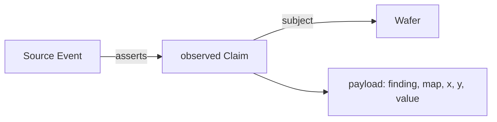
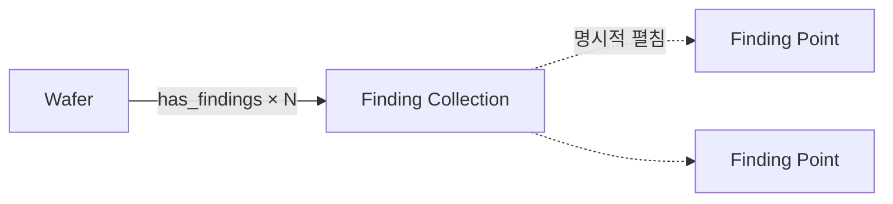
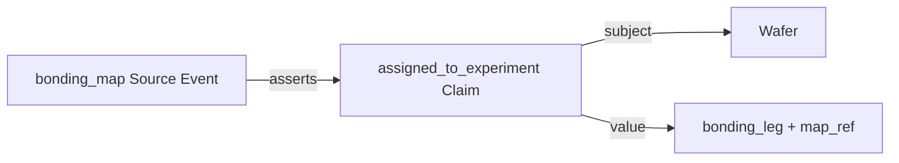

# R&D Ontology Referent Model

> **Status:** Living · **Last verified:** 2026-08-15
> **정본 코드:** 선언(`server/config/ontology/ledger_config.json`), `server/ledger_api/ledger_subgraph.py`,
> `server/ledger_identity.py`, `server/ledger_trends.py`, `server/ledger_selection.py`
> **목적:** 비정형 원천을 스키마 변경 없이 연결하되, 질문과 무관한 고카디널리티 노드를
> 자동 확장하지 않는 R&D 온톨로지 문법을 정한다.

## 0. 결론

Defect는 두 수준으로 표현한다.

1. **Finding Collection:** 같은 Wafer·종류·검사법·맵의 defect 집합. 개수, 평균, 범위,
   분포와 맵 참조를 가진 기본 분석 노드다.
2. **Finding Point:** 맵의 개별 defect 점. 좌표, 값, 원장 근거를 가진 상세 노드지만
   일반 Entity처럼 자동 순회하지 않는다.

기본 방향은 비대칭이다.

```text
Wafer에서 시작  → Finding Collection까지만 (개별 Point 자동 확장 금지)
Collection 열기 → Finding Point 목록 (명시적 상세)
Point에서 시작 → 소속 Wafer → 그 Wafer의 Collection까지만
```

따라서 “이 defect가 왜 났나?”에서는 점에서 Wafer를 찾을 수 있다. 반대로 “이 Wafer의
혈통·공정은?”에서는 수만 개 defect 점이 질문에 끼어들지 않는다.

## 1. 노드 범주

| 범주 | 역할 | 예 |
|---|---|---|
| **Entity** | 여러 사건을 지나도 같은 대상으로 추적 | Wafer, Lot, Core, Equipment, Recipe |
| **Source Event** | 한 소스가 한 번 발화한 기록 경계 | inspection row, run, transfer record |
| **Claim** | 누가 언제 무엇이라고 주장한 원장 원자 | observed, processed_with, measured |
| **Finding Collection** | 고카디널리티 finding의 집계 투영 | void·SAT·map A의 18,421건 |
| **Finding Point** | 맵 좌표의 개별 finding 투영 | void @ (17, 24) |
| **Value / Context** | Claim의 값이나 조건 | 0.55 MPa, bonding leg, recipe parameter |

Collection과 Point는 물류/공정 Entity가 아니다. 원장의 `observed` Claim을 분석과 시각화에
적합하게 투영한 노드다. 물리적 개체의 혈통 탐색 규칙을 그대로 적용하지 않는다.

## 2. 저장과 그래프의 분리

원장은 개별 관측을 Claim 행으로 보존한다.



그래프 기본 뷰는 Claim 행을 집계한다.



원장 정밀도는 그대로지만 기본 화면 노드 수는 finding 집합 수에 비례한다. Point는 원장 Claim의
불투명 ID와 발생시각을 앵커로 하므로 같은 좌표의 다른 검사 run을 임의로 동일시하지 않는다.

## 3. Collection 집계 특성

Collection 키는 다음과 같다.

```text
(subject_type, subject_keys, finding_kind, method, map_id)
```

현재 기본 집계 속성은 다음이다.

| 속성 | 의미 |
|---|---|
| `aggregates.count` | 관측 Claim 수 |
| `aggregates.run_count` | 서로 다른 검사 run 수 |
| `aggregates.value_count` | 수치값이 있는 점 수 |
| `aggregates.value_mean/min/max` | 수치 finding 값의 요약 |
| `spatial.map_id` | 원래 맵 참조 |
| `spatial.bbox` | 관측 점의 min/max x/y |
| `first_at`, `last_at` | 관측 기간 |

향후 면적 합, 분위수, 공간 군집도, edge/ring/center 비율도 Collection 집계 속성으로 추가한다.
동적 속성은 표 투영에서 typed property 행이 되므로 SQL 열을 매번 추가하지 않는다.

## 4. 방향별 탐색 문법

### 4.1 Wafer가 seed일 때

- `observed` Claim을 개별 노드로 자동 인출하지 않는다.
- finding은 Collection으로만 붙인다.
- 혈통, 이송, 공정, 계측 등 비-finding 관계는 일반 증거 그래프 규칙을 따른다.
- Collection은 자동으로 Point를 펼치지 않는다.

이 규칙 때문에 Wafer 혈통을 찾을 때 defect 수가 탐색 비용과 화면 복잡도를 지배하지 않는다.

### 4.2 Collection이 seed일 때

- 해당 Collection 키와 정확히 일치하는 observed Claim만 읽는다.
- 각 Claim을 Finding Point로 투영한다.
- `Collection → Point`까지만 만들고 Point에서 자동으로 더 걷지 않는다.
- node/edge/claim 상한에 닿으면 `truncated`를 명시한다.

### 4.3 Point가 seed일 때

- Point의 근거 Claim에서 subject Wafer 하나를 정확히 찾는다.
- `Point → Wafer → Finding Collection`까지만 걷는다.
- 그 경로에서 Claim/Event/공정/이송으로 자동 확장하지 않는다.

즉 Point는 소속을 찾을 수 있지만, 같은 Wafer의 다른 Point나 전체 공정망을 연쇄 호출하지 않는다.

### 4.4 원인 역추적은 별도 의도다

“이 defect가 왜 났나?”는 일반 서브그래프 탐색과 다른 액션이다. 사용자가 **원인 추적**을 명시하면
Point 또는 Collection의 Wafer·좌표·자재 영역을 시작으로 다음 경로를 제한적으로 계산한다.

```text
Finding Point/Collection
  → Wafer + map region
  → Bond layer / supplied DT
  → Core
  → upstream process / measurement / upstream finding collection
  → causal hypothesis
```

단순 경로 존재를 원인 확정으로 부르지 않는다. 결과는 `candidate`, `supported`, `confirmed`,
`rejected` 상태와 evidence를 가진 가설이어야 한다. 결측으로 판정할 수 없으면 필요한 검사/계측을
Meta Action으로 낸다.

## 5. 맵 동작

맵은 Collection과 Point를 함께 쓰는 주 소비자다.

1. metadata의 valid die를 그린다.
2. process/used 영역과 supply material을 겹친다.
3. Collection의 map/bbox/분포를 요약한다.
4. 확대 또는 Collection 선택 시 Point를 렌더한다.
5. Point 클릭 시 좌표·값·근거와 소속 Wafer를 보여 준다.
6. “원인 추적”을 눌렀을 때만 DT/Core/공정 경로를 연다.

맵은 모든 Point를 그래프 캔버스에 상시 배치하지 않는다. Point 데이터는 맵 레이어와 가상화된 표가
주로 소비하고, 그래프는 현재 선택/뷰포트의 Point만 표시한다.

## 6. Bonding leg 판정

`WaferLeg` Entity는 사용하지 않는다. 물리적으로 지속되는 것은 Wafer다. `leg`는 사람이
`bonding_map`에서 계획하고 주장한 본딩 실험 단위/조건이며 void 집계 차원이다.



정준 payload 예:

```json
{
  "experiment_type": "bonding_leg",
  "unit_id": "HBM-B_LOW-P",
  "map_ref": {"table": "bonding_map", "base": "SYN-CX-BW-001", "leg": "HBM-B_LOW-P"},
  "planned_by": "human_doe"
}
```

Trend 한 점의 신원은 `Wafer` Entity와 `planned_bonding_experiment_unit` context의 조합이다.
leg를 Wafer의 자식 Entity로 만들거나 기존 Wafer를 여러 leg로 추측 확장하지 않는다.

## 7. API

### Wafer에서 압축 조회

```http
GET /api/ledger/subgraph?id=<wafer-id>&hops=12&observations=summary
```

`observations=summary`가 기본이다. finding은 Collection만 반환한다.

### Collection에서 Point 조회

```http
GET /api/ledger/subgraph?id=<collection-id>&hops=1
```

Collection과 제한된 Point 목록을 반환한다. Point는 자동 확장되지 않는다.

### Point에서 소속 조회

```http
GET /api/ledger/subgraph?id=<point-id>&hops=2
```

Point, subject Wafer, 그 Wafer의 Finding Collection까지만 반환한다.

### 원시 Claim 감사

```http
GET /api/ledger/subgraph?id=<wafer-id>&observations=claims
```

명시적으로 요청한 감사 모드다. observed Claim과 Point를 보여 주지만 대용량 분석 기본값으로 쓰지 않는다.

### Spotfire/Excel

`shape=tables` 또는 `/subgraph/table`은 같은 snapshot을 `nodes`, `edges`, `properties` 세 장표로
반환한다. Collection 집계와 Point 좌표는 properties long table에서 pivot하며, 새 속성이 생겨도
고정 SQL/CSV 스키마를 바꾸지 않는다.

## 8. 불변식

1. 개별 관측은 원장 Claim으로 보존한다.
2. Wafer에서 finding을 찾을 때 Collection을 건너 Point로 자동 내려가지 않는다.
3. Point seed는 소속 Wafer를 찾을 수 있다.
4. Point에서 시작한 자동 경로는 Wafer의 Collection에서 멈춘다.
5. DT/Core/공정 원인 추적은 명시적 사용자 의도일 때만 수행한다.
6. Collection은 Entity가 아니라 집계 투영이다.
7. Point는 일반 혈통 Entity가 아니라 공간 상세 투영이다.
8. Collection의 집계값과 Point 근거는 같은 observed Claim 집합에서 계산한다.
9. 상한으로 잘린 결과는 `truncated` 없이 완전한 결과처럼 보이면 안 된다.
10. bonding leg는 Entity가 아니라 사람이 계획한 실험 context다.

## 9. 재적재 정책

구 `WaferLeg` 모델의 자동 호환/migration은 만들지 않는다. 원천을 새 문법으로 다시 번역해
`Wafer + assigned_to_experiment`와 observed Claim을 적재한다. 과거 데이터 유지를 위해 현재 모델을
오염시키지 않는다는 제품 소유자 판정을 따른다.

## 10. 일반화된 Context-sensitive Traversal Algorithm (제안)

### 10.1 핵심 함수

탐색 엔진은 모든 엣지를 무조건 BFS하지 않는다. 현재 질문의 문맥과 엣지 선언을 입력으로 받아
네 동작 중 하나를 결정한다.

```text
decision = POLICY(
  query_context,
  current_node_type,
  edge_class,
  direction,
  target_node_type,
  estimated_cardinality,
  evidence_state,
  depth,
  remaining_budget
)

decision ∈ { TRAVERSE, PROJECT, TERMINAL, BLOCK }
```

| 결정 | 의미 |
|---|---|
| `TRAVERSE` | target을 응답에 넣고 다음 frontier에도 넣는다 |
| `PROJECT` | 하위 노드 대신 선언된 Collection/통계/맵 투영을 넣는다 |
| `TERMINAL` | target은 보여 주지만 다음 frontier에는 넣지 않는다 |
| `BLOCK` | 응답 그래프에서 빼되 이유와 제외 건수를 회계한다 |

### 10.2 Query Context

문맥은 자유문장 자체가 아니라 검증 가능한 구조체다.

```json
{
  "intent": "wafer_lineage | defect_cause | process_compare | evidence_audit | spatial_review",
  "seed": {"node_type": "Wafer", "id": "..."},
  "targets": ["Lot", "Core", "Process"],
  "scope": {
    "time": null,
    "maps": [],
    "finding_kinds": ["void"],
    "groups": []
  },
  "budgets": {"hops": 12, "nodes": 400, "edges": 1200, "claims": 2400},
  "evidence_minimum": "raw | resolved | supported"
}
```

자연어 해석기나 UI는 이 객체를 **제안**할 수 있지만, 그래프 엔진은 반드시 확정된 `intent`와
구조화 파라미터만 받는다. LLM이 조용히 걷기 범위를 넓히는 구조는 금지한다. 응답은 실제 적용된
`resolved_context`를 돌려줘야 한다.

### 10.3 Edge Declaration

각 술어/파생 엣지는 다음 traversal metadata를 선언한다.

```json
{
  "edge_class": "identity | lineage | containment | transfer | process | measurement | finding | evidence | causal",
  "directions": ["forward", "reverse"],
  "cardinality": "one | few | many | massive",
  "default_action": "TRAVERSE | PROJECT | TERMINAL | BLOCK",
  "projection": "FindingCollection | SequenceSummary | MeasurementStats | null",
  "allowed_intents": ["defect_cause", "spatial_review"],
  "requires_explicit_action": false,
  "cost": 1
}
```

`cardinality`는 실제 집계를 대체하지 않는 힌트다. 실행 시 bounded count/probe로 다시 확인하며,
예상과 실제가 다르면 더 안전한 동작(`TRAVERSE → PROJECT → BLOCK`)으로만 강등한다.

### 10.4 정책 합성 순서

정책은 한 거대한 조건문으로 만들지 않고 네 층을 순서대로 합성한다.

1. **Safety policy:** 권한, tenant, 시간 범위, cycle, hard budget. 절대 override 불가.
2. **Ontology policy:** edge class, 허용 방향, 기본 cardinality/projection.
3. **Intent profile:** 현재 질문에서 필요한 엣지를 승격/강등.
4. **Explicit user action:** “Point 보기”, “원인 추적”, “원시 Claim 감사”처럼 좁은 범위만 개방.

우선순위는 `Safety > Explicit scope boundary > Intent > Ontology default`다. 사용자 액션도 hard budget과
권한은 넘지 못한다.

### 10.5 실행 알고리즘

```text
frontier = priority_queue(seed)
visited  = set(seed_state)

while frontier and budget remains:
  current = pop_lowest_cost(frontier)
  candidates = exact_batched_edges(current frontier by type)

  for edge in candidates:
    decision = policy(context, current, edge, runtime_stats)

    if decision == TRAVERSE:
      emit edge + target
      enqueue target if (target, context_state) not visited

    if decision == PROJECT:
      projection = aggregate(edge target set using declared projection)
      emit current -> projection

    if decision == TERMINAL:
      emit edge + target

    if decision == BLOCK:
      audit suppressed(edge_class, reason, count)

return graph + projections + walk_decisions + truncation
```

허용된 엣지 안의 우선순위만 cost로 정한다.

```text
cost = declared_edge_cost
     + log1p(estimated_cardinality)
     + evidence_uncertainty_penalty
     + depth
```

점수가 낮다는 이유로 금지 엣지를 걷거나, 높다는 이유로 허용 엣지를 조용히 버리면 안 된다.
점수는 budget 안에서 먼저 볼 순서만 정한다.

### 10.6 대표 Intent Profile

| 현재 노드/엣지 | `wafer_lineage` | `defect_cause` | `evidence_audit` | `process_compare` |
|---|---|---|---|---|
| Wafer → finding | `PROJECT` | `PROJECT` | `TRAVERSE`(bounded raw Claim) | `PROJECT` |
| Collection → Point | `BLOCK` | 명시 클릭 시 `TERMINAL` | `TERMINAL` | `BLOCK` |
| Point → Wafer | 해당 없음 | `TRAVERSE` | `TRAVERSE` | `BLOCK` |
| Wafer/Core → process | `TRAVERSE` | 명시 원인 추적 시 `TRAVERSE` | `TERMINAL` | `PROJECT`(sequence/facet) |
| process → measurement | `TERMINAL` | `TRAVERSE` | `TRAVERSE` | `PROJECT`(stats) |
| Claim → Source Event | `BLOCK` | evidence 요청 시 `TERMINAL` | `TRAVERSE` | `BLOCK` |

### 10.7 응답 회계

필터링은 정보를 숨기는 동작이므로 응답에 반드시 흔적을 남긴다.

```json
{
  "walk": {
    "intent": "wafer_lineage",
    "decisions": {
      "traversed": 18,
      "projected": 3,
      "terminal": 4,
      "blocked": 18241
    },
    "suppressed": [
      {"edge_class": "finding_point", "reason": "projected_as_collection", "count": 18241}
    ]
  }
}
```

이 회계가 있어야 “디펙이 없어서 안 보인다”와 “질문 문맥상 Collection으로 접혔다”를 구분할 수 있다.

### 10.8 결측과 Meta Action

필요한 엣지가 증거 부재로 생성되지 않으면 `BLOCK`으로 끝내지 않는다. `missing_evidence`를 별도
결정으로 기록하고, 어떤 source/field를 채우면 목표 경로가 열리는지 Meta Action으로 반환한다.

```text
원인 추적 필요 + DT→Core evidence 없음
  → 경로 발명 금지
  → missing_evidence(dt_output_lot, dt_output_slot)
  → action: 해당 job의 LOT/SLOT 확보
```

### 10.9 구현 단계

1. 현행 `observations=summary|claims`와 Point의 비대칭 탐색을 첫 reference policy로 유지한다.
2. vocabulary predicate에 `edge_class/cardinality/default_action/projection`을 추가한다.
3. `traversal_profiles.json`에 intent별 override만 선언한다.
4. 엔진을 `policy.decide()` + batched edge provider + projection provider로 분리한다.
5. 응답에 `resolved_context`, `walk.decisions`, `suppressed[]`를 추가한다.
6. 동일 seed가 intent에 따라 다른 그래프를 내되, 같은 intent에서는 완전히 결정적인지 테스트한다.

## 11. Spatial Causal Hypothesis Bot (제안)

> ⚠️ 이 절이 이름 대는 `frame_confirmed` 는 **선언에 없습니다**(2026-08-27 실측, 어휘 열 개).
> 이 절은 선언이 그 술어를 싣는 날 발화합니다. `observed` · `transfer` 는 선언에 있습니다.

### 11.1 가능한가

가능하다. 봇은 새 finding, frame 확정, transfer/lineage 근거가 들어올 때 증분 실행해 서로 다른
공정 단계의 공간 패턴을 비교할 수 있다. 단 공간 유사성만으로 `cause`를 쓰지 않는다.

```text
spatial similarity = 후보 생성 신호
lineage + time + contrast + mechanism = 원인 후보 관문
DOE/독립 검증 = confirmed 관문
```

봇의 첫 출력은 `candidate_cause_of` 또는 `spatially_correlated_with` Claim이다.

### 11.2 후보 생성

1. 새 observed Claim을 `(Wafer, map, finding_kind, run)` Collection에 반영한다.
2. 물질 혈통으로 연결된 upstream/downstream map 쌍만 고른다.
3. `frame_confirmed`와 transfer 좌표 변환을 이용해 공통 좌표계로 투영한다.
4. exact coordinate 또는 선언 반경의 이웃을 grid bucket으로 매칭한다.
5. Point 매칭을 cluster/Collection 수준 support로 집계한다.
6. 최소 support를 넘은 쌍만 다음 관문으로 보낸다.

전체 Point의 모든 쌍을 비교하는 `O(N²)`는 금지한다. 먼저 lineage/map/frame으로 파티션하고 정수
좌표 grid bucket 또는 공간 인덱스를 사용한다.

### 11.3 관문

| 관문 | 통과 조건 | 실패 시 |
|---|---|---|
| Identity | 같은 자재/다이 혈통으로 해소 | 후보 생성 안 함 |
| Frame | 좌표 변환이 명시적으로 확정 | `missing_frame` Meta Action |
| Time | 원인 후보 관측/공정이 결과보다 선행 | 인과 후보 제외 |
| Spatial | overlap/correlation이 선언 임계 이상 | 상관 Claim도 만들지 않음 |
| Contrast | 정상/비노출군보다 동반 비율이 높음 | 우연 공간 패턴으로 강등 |
| Mechanism | 물리 경로 방향이 pass | fail=제외, unknown=후보 유지 |

점수는 관문을 대신하지 않는다. 모든 필수 관문을 통과한 후보 사이의 우선순위만 정한다.

```text
priority = spatial_support
         × lineage_coverage
         × finite_sample_reliability
         × contrast_effect
```

### 11.4 Claim grain

기본은 **Collection/cluster → Collection/cluster** Claim이다. Point 쌍은 `evidence_point_pairs`에
bounded sample과 총 건수로 보존한다. 다음 경우에만 Point→Point Claim을 물질화한다.

- transfer/좌표 근거로 유일 대응이 증명됨
- 사용자가 특정 Point에 원인 추적을 명시함
- 사람 또는 DOE가 그 대응을 확인함

이 원칙이 없으면 웨이퍼당 수만 점이 공정 단계 수와 곱해져 cause Claim이 폭발한다.

### 11.5 Claim payload

현재 원장 스키마에서는 effect Wafer를 subject로 두고, projection 참조와 관문 근거를 value payload에
보존한다. 그래프 projector가 이 참조를 Collection/Point 엣지로 해석한다.

```json
{
  "relation": "candidate_cause_of",
  "cause_ref": {"kind": "finding_collection", "id": "ledger-finding-collection:v1:..."},
  "effect_ref": {"kind": "finding_collection", "id": "ledger-finding-collection:v1:..."},
  "basis": {
    "point_pairs": 183,
    "spatial_score": 0.82,
    "lineage_coverage": 0.97,
    "contrast_effect": 2.4,
    "frame_ids": ["..."],
    "evidence_ids": ["..."]
  },
  "mechanism": {"model": "void_formation", "state": "pass"},
  "state": "candidate",
  "algorithm": {"name": "spatial-cause-bot", "version": "1"}
}
```

`evidence_ids` 전체가 너무 크면 exact count + digest + 별도 유계 evidence page를 쓴다. 정답 태그나
사람이 모르는 숨은 oracle을 payload에 넣지 않는다.

### 11.6 지속 실행

봇은 주기적 전체 스캔보다 event-driven 증분 실행을 우선한다.

```text
new observed / frame_confirmed / transfer claim
  → 영향받은 lineage+map partition만 enqueue
  → 기존 hypothesis key 조회
  → 근거가 달라졌을 때만 새 append-only Claim
  → 이전 Claim은 supersedes로 연결
```

봇이 쓴 hypothesis Claim은 다음 후보 생성의 raw input에서 제외한다. 그렇지 않으면 자기 주장을 다시
근거로 삼아 confidence를 키우는 피드백 루프가 생긴다.

### 11.7 사람과 탐색 정책

- `wafer_lineage`: causal hypothesis는 기본 `BLOCK` 또는 요약 badge.
- `defect_cause`: supported/candidate 관계를 `TRAVERSE`하되 상태를 색으로 구분.
- `evidence_audit`: hypothesis Claim → bot Source Event → evidence를 연다.
- `process_compare`: cause 관계는 결과 설명에만 링크하고 비교 모집단을 바꾸지 않는다.

사람 또는 DOE 결과는 새 `supports`, `confirmed`, `rejected` Claim으로 남긴다. 기존 candidate를 UPDATE로
바꾸지 않는다. 승인 전 후보를 화면에서 “원인”이라고 축약하지 않는다.
