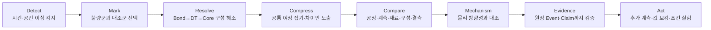
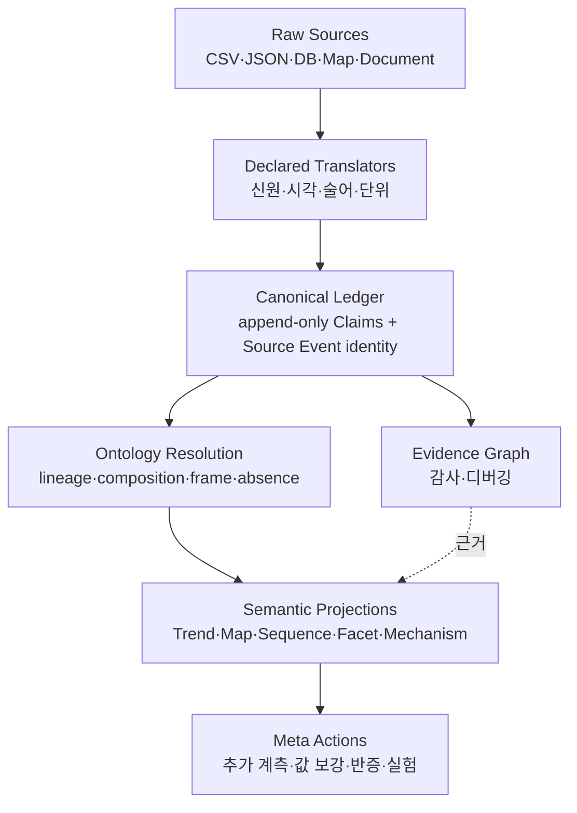

# R&D Ontology Use Cases — 원장 증거를 연구 판단으로 바꾸는 법

> **Status:** 🟠 Design Contract (부분 최신) · **Last-verified:** 2026-08-29
> **대상 독자:** 반도체 조립/본딩/DT/Core 불량 원인을 찾는 R&D 연구원, 온톨로지·분석 API 개발자
> **관련 구현:** `ledger_events`, **`GET /api/ledger/subgraph`**, `GET /api/ledger/declaration`
> **증거 그래프 상세:** [Ledger Evidence Subgraph](./LEDGER_EVIDENCE_SUBGRAPH_SPEC.md)
>
> 🔴 **[2026-08-29] 이 문서의 «질문»은 유효하고 «이름» 일부가 죽었습니다.** UC 별 추론·§2 선언
> 표·§5 후보 계약·§7 판정은 그대로 읽으십시오. 아래 낱말이 나오면 **그 문장만** 낡은 것입니다:
>
> | 문서의 낱말 | 실제 |
> |---|---|
> | `/api/ledger/trends` · `/composition` · `/selection/resolve` · `/subgraph/table` | **라우트 없음.** 데이터에 답하는 것은 `GET /api/ledger/subgraph` 하나 |
> | `Entity–Event–Claim 그래프` · 「Claim/Event 를 seed 로 연다」 · `event_id` | **Event 는 노드가 아니고 Claim 은 엣지다**(2026-08-25). 씨앗 접두어는 `ledger-entity:v1:` 하나이고 나머지 철자는 **422** |
> | `WaferLeg` | **선언된 엔터티가 아니다.** 마킹 단위는 «웨이퍼»이고 실험 구간은 `bonding_leg` «수식어» |
> | 술어 `transferred` | **선언에 없다.** 살아 있는 철자는 `transfer@1`(die → die) |
> | typed `properties` long table | **없다**(`shape=tables` · `/subgraph/table` 함께 은퇴) |
>
> 「P 의 Trend/Composition/Selection 이 착지했다」는 문장은 **착지했다가 은퇴했다**로 읽으십시오.

## 0. 결론

온톨로지의 성공 기준은 “그래프가 그려지는가”가 아니다.

> 연구원이 불량군을 한 번 마킹했을 때, 추가 SQL 없이 **어디서·언제·무엇이 달랐고,
> 그 차이가 어느 물리 기전과 맞으며, 다음에 무엇을 확인하면 놀라움이 가장 줄어드는지** 알 수 있어야 한다.

원장은 무한 확장 가능한 증거 기반이고, 그래프 뷰어는 그 기반을 감사하는 도구다. 실제 분석은 원장을
질문에 맞게 접는 **semantic projection**이 맡아야 한다. 원자 수만큼 노드를 늘어놓는 것은 저장 성공을
사용자에게 전가한 것이지 분석 성공이 아니다.

## 1. 연구원의 실제 분석 흐름

그래프 뷰어는 G다. A~F를 건너뛰고 G부터 보여 주면 연구원은 수백 노드 사이에서 이미 알고 있던
연결을 다시 읽어야 한다.

## 2. 온톨로지 확장의 정확한 뜻

### 2.1 “스키마 변경 없음”이 보장하는 것

새로운 계측 종류, 공정 단계, 재료 속성, 장비 상태, 조립 구성, 문서 주장 등이 들어와도
`ledger_events`에 물리 컬럼을 추가하지 않는다.

- 지속 신원은 `subject_type + subject_keys`에 둔다.
- 관계 의미는 `predicate`에 둔다.
- 비정형 속성은 타입을 보존한 `object_payload`에 둔다.
- 원천마다 다른 행 모양은 번역 선언이 표준 Claim으로 바꾼다.
- 새 분석 축은 코드의 컬럼 목록이 아니라 온톨로지 선언에서 발견한다.

따라서 `etched_cd`, `bond_pressure`, `plasma_power`, 새 VOID subtype이 늘 때마다 DB 컬럼과 전용 API를
하나씩 추가하는 방식에서 벗어난다.

### 2.2 그래도 필요한 통제

무한 확장은 무규칙 JSON 투입이 아니다. 물리 스키마는 고정해도 의미 계약은 선언해야 한다.

| 선언 | 없으면 생기는 거짓 |
|---|---|
| Entity key | 같은 웨이퍼/랏을 서로 다른 개체로 보거나 다른 것을 합침 |
| occurred_at basis/timezone | 도착시각을 공정시각으로 오인 |
| predicate signature | 같은 payload 키가 소스마다 다른 뜻을 가짐 |
| unit·value type | 0.55 MPa와 0.55 bar를 같은 수치로 비교 |
| direction/cardinality | parent/child, source/destination을 뒤집음 |
| denominator/coverage | 미검사를 양품 0건으로 계산 |
| absence state | 미실시·전산누락·미확인을 하나의 NULL로 접음 |
| raw provenance | 이상 후보를 원문 행으로 재검증할 수 없음 |

코드 변경 없이 늘릴 수 있다는 것은 “선언을 추가하면 공용 엔진이 따라온다”는 뜻이지,
“선언도 없이 아무 필드나 넣어도 분석된다”는 뜻이 아니다.

## 3. R&D 핵심 Use Cases

### UC-1. 시간 이상에서 원인 조사 시작

**상황:** VOID 종류별 트렌드 중 특정 subtype이 최근 3일간 급증한다.

**연구원이 하는 일:** 차트의 구간이나 웨이퍼 점들을 마킹한다. 별도 LOT 입력은 하지 않는다.

**온톨로지가 하는 일:** 마킹을 `WaferLeg` 분석 단위로 해소하고 같은 제품·기간의 명시적 검사 완료
정상군을 대조군으로 만든다. 검사 안 한 웨이퍼를 정상군에 넣지 않는다.

**필요 projection:** Trend → Cohort → Candidate Compare.

**결과:** 공정, actual/setpoint 계측, 장비·레시피, Core 구성, DT 경로, 공정순서, 결측 후보가 범주별로
전부 나오되 동일한 값은 접고 차이가 있는 항목을 위로 올린다.

### UC-2. 공간 패턴을 공급 재료까지 역추적

**상황:** Bond map의 VOID가 특정 사분면/링/edge에 집중된다.

**연구원이 하는 일:** 불량 영역을 직접 마킹한다.

**온톨로지가 하는 일:** 좌표 프레임·Y 방향·START offset을 보존한 채 Bond die → 해당 위치에 공급된
DT material → 그 DT가 가져온 Core material을 역추적한다. 맵은 다음 순서로 overlay한다.

1. map metadata가 선언한 valid die footprint
2. 해당 Bond/DT가 실제 사용한 영역
3. 상류 재료가 사용된 영역
4. 불량 발생 영역

**필요 projection:** Spatial Mark → Material Contribution → Process/Measurement Compare.

**결과:** “오른쪽 위 불량”이 단순 위치 상관인지, 특정 DT/Core 공급 ID와 함께 움직이는지 분리된다.

### UC-3. 이종 Core가 섞인 다층 본딩의 기여도 비교

**상황:** 한 Bond CHIP에 10~15층, 여러 DT, LOGIC/HBM 등 여러 Core 유형이 섞여 있다.

**잘못된 질문:** “이 CHIP의 Core 공정은 무엇인가?” — 하나가 아니다.

**올바른 질문:** “불량군 CHIP의 구성 component 중 어떤 유형·branch·층·DT 경로의 공정/계측 차이가
정상군에서 재현되지 않는가?”

**온톨로지가 하는 일:** final CHIP을 component DAG로 해소하고 component별 ordered transfer path를
보존한다. 대표 Core/대표 DT 하나로 접지 않는다.

**필요 projection:** Composition DAG → Component-aligned Compare.

**결과:** `HBM + branch B + low pressure`처럼 특정 구성 부분에만 있는 조합과, 다른 Core에도 널리 있는
혼동 요인을 분리한다.

### UC-4. 공정순서·반복·누락·스키마 차이 비교

**상황:** 불량군만 세정이 두 번이거나, ETCH와 CLEAN 순서가 바뀌거나, 다른 공정 schema/route를 탄다.

**온톨로지가 하는 일:** 공정명을 열로 고정하지 않고 ordered event sequence를 비교한다.

| 차이 | 표현 |
|---|---|
| 순서 변경 | `order` |
| 반복 횟수 차이 | `repeat` |
| 불량군에만 단계 있음 | `insert` |
| 불량군에 단계 없음 | `delete` |
| 같은 위치의 다른 단계/recipe | `substitution` |
| route 자체가 다름 | `schema_branch` |
| 시각 근거가 부족해 순서를 못 정함 | `ambiguous_order` |
| 기록 자체가 없음 | `record_absent` |

100개 단계 전체를 두 번 나열하지 않는다. 공통 run은 “동일 87단계”로 접고, 차이가 생긴 앞뒤 anchor와
변경 block만 펼친다.

### UC-5. Actual과 Setpoint 이탈 조사

**상황:** recipe setpoint는 양군이 같지만 불량군 actual pressure만 낮다.

**온톨로지가 하는 일:** recipe 선언값과 run actual을 서로 다른 Claim으로 보존하고 같은 metric/unit에
정렬한다. 평균 하나만 보여 주지 않고 분포·support·결측 상태를 같이 낸다.

**필요 projection:** Measurement Facet.

**결과:** `pressure 0.55 vs 0.90 MPa`, `A 6/6 vs B 0/6`처럼 효과 크기와 근거 수를 함께 본다.
Candidate %만 홀로 보여 주지 않는다.

### UC-6. LOT split/merge/rework를 지나간 재료 계보

**상황:** Core lot이 여러 번 split되고 일부가 rework/resort 뒤 merge되어 DT로 들어간다. LOT/SLOT이
바뀌고 CHIP이 transfer된다.

**온톨로지가 하는 일:** `derived_from`, `slot_map`, `transferred`, `has_wafer`를 따라 모든 분기를 보존한다.
대표 부모 하나를 고르지 않고 contested/unresolvable을 상태로 낸다.

**필요 projection:** Lineage/Composition Resolution.

**결과:** 불량군에만 공통인 rework branch나 두 번 이상 DT hop을 거친 component를 찾는다.

### UC-7. 결측을 원인 후보가 아니라 다음 행동으로 바꾸기

**상황:** DT output job의 LOT/SLOT, 특정 공정 actual, 검사 run이 비어 있다.

**구분해야 할 상태:**

- `missing_record`: 있어야 할 기록이 없음
- `not_performed`: 공정을/검사를 하지 않았다는 명시 근거
- `unknown`: 현재 증거로 모름
- `unresolvable`: 후보는 있으나 하나로 못 정함
- `conflict`: 서로 모순되는 값이 있음

**온톨로지가 하는 일:** 빈칸을 0이나 동일값으로 채우지 않는다. 그 값을 알았을 때 후보 순위가 얼마나
바뀌는지 정보이득을 계산한다.

**결과:** “DT output LOT을 확인하면 두 원인 가설 중 하나를 제거할 수 있음” 같은 메타 액션을 낸다.

### UC-8. 장비/레시피 drift와 교대 효과

**상황:** 장비는 같지만 chamber·recipe revision·maintenance 이후에만 이상이 생긴다.

**온톨로지가 하는 일:** Equipment, Recipe를 Entity로 두고 run Event의 Claim으로 연결한다. 시간 window와
생산 context를 함께 비교해 단순 생산량 증가를 이상으로 오인하지 않는다.

**결과:** 장비명 단일 상관보다 `EQP + recipe rev + post-maintenance window` 조합을 검증한다.

### UC-9. 새 비정형 데이터 소스를 코드 0줄에 가깝게 연결

**상황:** 새 검사 CSV에는 `wafer, defect_code, area, reviewed_at`, 장비 JSON에는 nested sensor snapshot이 있다.

**온톨로지가 하는 일:** 소스 선언이 identity, occurrence, predicate, payload path, unit, raw_ref를 매핑한다.
공용 번역기가 같은 원장 envelope을 낸다. 저장 컬럼·그래프 API·Candidate UI는 바뀌지 않는다.

**완료 조건:** 새 metric/관계가

1. Ontology 구조 화면에 선언으로 나타나고,
2. Entity/Event/Claim 증거 그래프에서 원문까지 추적되며,
3. 적합한 분석 범주에 자동 candidate로 들어오고,
4. coverage가 없으면 비교에서 제외된 이유를 말한다.

1~2만 되면 적재 성공이고, 3~4까지 되어야 분석 성공이다.

### UC-10. 가설을 다음 LOT/실험으로 검증

**상황:** low pressure → interface unfill → void 증가 가설이 상위다.

**온톨로지가 하는 일:** Candidate를 mechanism model의 방향성과 대조하고, 반증 표본을 먼저 찾는다.

- low pressure인데 정상인 unit
- nominal pressure인데 불량인 unit
- 같은 구성/장비에서 pressure만 다른 unit
- pressure 기록이 없는 중요 unit

**결과:** “압력을 올려 보자”가 아니라 예상 효과·반증 조건·필요 계측을 가진 실험/확인 action이 된다.

## 4. 화면은 목적별로 나뉘어야 한다

| 화면 | 연구 질문 | 기본 표현 |
|---|---|---|
| **Trend** | 언제 이상해졌나? | finding 종류별 차트 + WaferLeg 표, 상호 마킹 |
| **Maps** | 어디에서 생겼나? | Bond/DT/Core N개 맵 + 물리 overlay, 상호 마킹 |
| **Comparison** | 난 것과 안 난 것은 무엇이 다른가? | 동일 구간 접기, 차이 sequence/facet만 강조 |
| **Candidates** | 어떤 차이가 원인 가설 가치가 있나? | Process/Measurement/Material/Composition/Sequence/Missing 범주별 전 목록, 동일값 접기 |
| **Mechanism** | 물리 방향성과 맞는가? | 모델 경로·방향·통과/미상 근거 |
| **Evidence Graph** | 이 결론은 어느 원자와 사건에서 왔나? | Entity–Event–Claim 감사 그래프 |
| **Actions** | 다음에 무엇을 보면 놀라움이 줄어드나? | 값 보강·추가 계측·반증 표본·조건 실험 |

한 화면에 전부 펼치지 않는다. Trend/Maps의 마킹이 하나의 selection state를 만들고 아래 projection들이
그 선택을 소비한다. Evidence Graph는 Candidate의 “근거 보기”에서 해당 Claim/Event를 seed로 열어야 한다.

### 4.1 표가 기본이고 그래프는 배경 엔진이다

Spotfire와 Excel은 예외적 외부 도구가 아니라 연구 현장의 기본 소비자다. 따라서 분석 계약의 정본은
캔버스 픽셀이 아니라 join 가능한 표다.

| 엔진 내부 | 연구원에게 보이는 표 |
|---|---|
| Entity/Event/Claim 그래프 | `nodes`, `edges`, typed `properties` long table |
| Composition DAG | component 1개/행 + transfer hop 1개/행 |
| Process sequence | subject×occurrence 1개/행 + compressed difference block |
| Measurement Claims | subject×metric×run 1개/행, value/unit/state 분리 |
| Spatial ontology | map×x×y×layer 1개/행, material_id와 finding state 분리 |
| Candidate comparison | candidate×group 1개/행, numerator/denominator/effect/evidence IDs |

캔버스, Trend 차트, Map은 이 표들의 상호작용 표현이다. 표를 먼저 정의하면 다음이 가능하다.

- Spotfire가 시간 brushing과 공간 marking을 같은 `mark_key`로 주고받는다.
- Excel 사용자가 filter/pivot 후에도 `node_id`, `claim_id`, `event_id`로 원장 증거에 돌아온다.
- 새 속성은 wide 컬럼 추가가 아니라 typed property 행 추가로 나타난다.
- 웹 UI와 외부도구가 서로 다른 원인 계산을 구현하지 않고 서버 projection을 공유한다.

반대로 그래프 JSON만 정본으로 두고 각 도구가 flatten하게 하면 unit, NULL, list, nested key 해석이
도구마다 갈리고 온톨로지는 연결 엔진이 아니라 그림 전용 포맷이 된다.

## 5. Candidate가 갖춰야 할 최소 계약

연구원에게 `%` 하나는 의미가 없다. 모든 후보는 최소 다음을 함께 보여야 한다.

| 필드 | 이유 |
|---|---|
| `category` | 공정/계측/재료/구성/순서/결측 구분 |
| `feature` + typed value/unit | 무엇의 차이인지 |
| A/B numerator + denominator | 효과와 coverage 분리 |
| effect size + direction | 차이 크기와 어느 쪽인지 |
| support/reliability | 표본 1건의 100%를 거르기 위해 |
| marks | 후보 클릭 시 Trend/Map 역마킹 |
| evidence claim/event IDs | 증거 그래프로 내려가기 위해 |
| missing state counts | 빈 값을 정상으로 오인하지 않기 위해 |
| mechanism status | `pass`/`unknown`/`contradiction`을 점수와 분리 |

점수는 정렬 보조이지 “원인 확률”이 아니다. 화면 문구도 `% 확률`이 아니라 `차이 강도` 또는 구성 요소
별 효과/근거를 써야 한다.

## 6. 필요한 분석 계층

현재 시스템은 L이 강하고, O 일부와 P의 Trend/Composition/Selection이 착지했다. Evidence Graph는 L을
투명하게 보게 한다. 다음 가치가 큰 작업은 그래프 장식 추가가 아니라 다음 세 가지다.

1. 모든 Candidate가 Event/Claim evidence ID를 내도록 연결
2. 공통 sequence/facet을 서버에서 압축하고 실제 차이만 기본 펼침
3. Candidate 클릭 → Trend/Map 역마킹 → 해당 Event/Claim 증거 그래프 drill-down

## 7. 설계 판정

- 원장은 “무한히 늘어나는 필드를 저장하는 표”가 아니라 **새 관계를 기존 물리 스키마 안에서 발화하는
  증거 문법**이다.
- 온톨로지는 저장된 모든 관계를 보여 주는 그림이 아니라 **질문에 필요한 관계를 잃지 않고 접는 규칙**이다.
- 분석 UI는 그래프 전체가 아니라 cohort와 semantic projection이다.
- Graph Viewer는 개발자 전용이 아니라 연구원이 후보의 근거를 검증하는 마지막 drill-down이어야 한다.
- 놀라움을 줄이는 최종 출력은 후보 목록에서 끝나지 않고, 가장 정보가 큰 다음 확인/실험 action이어야 한다.
