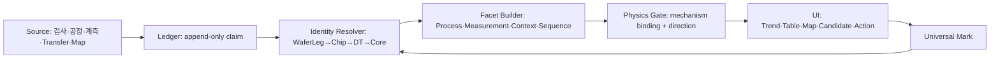

# R&D Surprise Investigation Algorithm

> **Status:** 구현 계약 · 2026-08-15 실데이터 인수 완료
> **목적:** 사용자가 Trend와 Map을 마킹하면 추가 쿼리 작성 없이 원장이 차이를 찾고, 물리 온톨로지가 원인 후보와 다음 행동을 제시한다.

## 1. 핵심 관점

이 시스템은 불량을 설명하는 정답표가 아니라 **놀라움 감쇄기**다.

```text
관측된 차이
  → 근거가 있는 가설로 압축
  → 가장 많이 불확실성을 줄이는 다음 확인 제안
  → 새 근거를 원장에 기록
  → 다시 비교
```

따라서 결과는 `원인 확정`이 아니라 다음 세 층으로 분리한다.

1. **차이:** 불량군과 정상군에서 실제로 다르게 관측된 것
2. **기전 후보:** 선언된 물리 경로와 방향이 맞는 차이
3. **Meta Action:** 결측 확보 또는 DOE 중 예상 정보이득이 큰 행동

## 2. 분석 단위와 신원

분석 단위는 Wafer 하나가 아니라 `Base Wafer × BONDING LEG`다.

```json
{
  "type": "WaferLeg",
  "keys": {
    "wafer": "SYN-CX-BW-001",
    "bonding_leg": "HBM-B_LOW-P"
  }
}
```

같은 Base Wafer 안에서도 LEG마다 Bond 조건과 공급 Core가 다르므로 합치지 않는다. 안정 마킹 키는 canonical JSON 배열 `['WaferLeg', wafer, bonding_leg]`을 UTF-8로 직렬화한 뒤 unpadded base64url로 인코딩한다. 구 `Wafer` 키를 여러 LEG로 추측 확장하는 것은 금지한다.

## 3. Source → Ledger → Ontology



원장은 사실을 `observed`, `processed_with`, `transferred`, `derived_from` 같은 claim으로 보존한다. 결측은 값을 만들지 않고 `missing`, `not_performed`, `unknown`, `contradiction`을 서로 다른 상태로 유지한다.

## 4. Trend 모집단

Trend 종류는 UI에 하드코딩하지 않는다. `finding_kinds.json` 선언이 검사 방법, subtype, 단위와 series를 정한다.

- 분자: 해당 WaferLeg에서 실제 관측된 finding
- 분모: `inspection_run(base_wafer_id, x, y)`와 `bonding_map(base, x, y, leg)`의 정확 결합
- `scanned_clean`: 분모가 있고 분자가 0인 경우만 0
- 검사 근거가 없으면 0이 아니라 `no_denominator`

차트는 DB에서 downsample하되 마킹 대상의 stable ID는 보존한다. 표는 keyset pagination을 사용한다.

## 5. Universal Mark 해소

시간, Trend 점, 표 셀, Map 좌표, 비교 facet을 모두 같은 Mark 스키마로 바꾼다. 하나의 화면 마킹이 여러 WaferLeg를 포함하면 resolver wire에서는 각 WaferLeg에 **고유한 원자 mark_id**를 부여한다. 같은 mark_id를 재사용하면 서버의 멱등 처리에서 모집단이 한 건으로 접히므로 금지한다.

해소기는 각 Mark에 대해 다음을 반환한다.

```text
WaferLeg → Final Chip → Bond layer → DT collection → Core → upstream process
```

LOT·SLOT·JOB이 바뀌거나 split/merge/rework가 있어도 `transferred` 근거를 따라간다. 후보가 여러 개면 `candidate`, 끊기면 `unresolvable`로 남긴다.

## 6. 차이 압축

### 6.1 값 Facet

공정·계측·맥락은 서로 다른 계약으로 묶는다.

```text
Process     = (subject_grain, core type/branch?, step, recipe, occurrence)
Measurement = (subject_grain, metric, unit, method, optional linkage)
```

`processed_with`는 STEP과 RCP 이름만 말한다. 장비·`step_family`·actual/setpoint·knob는
Process 후보가 아니며, 수치 비교는 canonical `measured` 원자만 담당한다. `FINAL_BOND`처럼
WaferLeg 자체에 걸린 조건은 `analysis_unit` grain으로 비교한다. Core 종류·분기·Core 공정은
`component` grain으로 비교한다. 두 grain을 교차 곱하지 않는다.

### 6.2 공정 순서

100개가 넘는 공정은 전부 나열하지 않는다.

1. 실제 이벤트를 `(step, recipe, occurrence)` token으로 만든다.
2. 동일 signature 경로를 군집화한다.
3. 공통 anchor span은 접는다.
4. 다른 window만 `order_change`, `repeat_change`, `insert`, `delete`, `substitution`, `schema_branch`로 표시한다.
5. 선후 근거가 부족하면 `ambiguous_order`, 기록이 없으면 `record_absent`다.

세부 계약은 [Process Sequence Comparison Algorithm](./PROCESS_SEQUENCE_COMPARISON_ALGORITHM.md)을 따른다.

### 6.3 Candidate 전체 목록과 접힘

`Candidates`는 서버가 돌려준 facet을 임의 상한으로 자르지 않고 `Process`와 `Measurement`로 나눠 전부 싣는다. 두 집단 이상에서 **모든 값이 기록됨(`recorded`)이고 값 또는 비율이 같은 행만** `동일 N개` 안에 기본 접힘한다. `missing`·`not_performed`·`unknown`·`contradiction`은 양쪽 철자가 같아도 정보 확보 대상이므로 접지 않는다. 별개 evidence가 같은 제목·상태·A/B 값·점수로 렌더되는 행도 `같은 기록 N건`으로 접되, 내부 행과 역마킹 근거는 모두 보존한다.

`measured` payload의 공통 필드는 `metric/unit/method/state`다. `state=recorded`만
`value/run_uid`를 요구하고, `missing/not_performed/unknown`은 `value` 키 자체를 금지한다.
응답은 값을 평균이나 sentinel로 만들지 않고 `groups[].values[]`와 `state_counts`를 그대로
내며, 해당 WaferLeg 역마킹 키와 atom evidence ID를 함께 보존한다. 선택 범위에 `measured`
원자가 하나도 없을 때만 `state=absent, reason=measured_evidence_absent` 한 행을 낸다.
`measured_as`는 UI category 이름일 뿐 원장 술어가 아니다.

## 7. Surprise 점수

두 집단 A/B에서 facet의 관측 수를 `a`, `b`, 분모를 `A`, `B`라 한다. 0 또는 100%에서도 무한대가 되지 않도록 0.5 smoothing을 쓴다.

```text
raw_effect = log((a + 0.5) / (A - a + 0.5))
           - log((b + 0.5) / (B - b + 0.5))

coverage    = min(coverage_A, coverage_B)
reliability = A/(A+1) × B/(B+1)
surprise    = |raw_effect| × coverage × reliability
```

작은 표본, 끊긴 추적, 빈 분모가 점수를 과장하지 못한다. 점수만으로 원인이라 부르지 않고 물리 관문을 별도로 통과시킨다.

## 8. 물리 온톨로지 관문

`mechanism_models.json`의 binding과 방향 경로를 사용한다.

- `pass`: 관측 parameter가 선언된 기전 경로로 finding에 연결됨
- `bias_candidate`: 발생 기전보다 관측 편향 후보
- `fail`: 선언된 경로와 불일치
- `unknown`: binding 또는 모델 부재

예시 인수 데이터에서는 다음 경로가 선택됐다.

```text
FINAL_BOND pressure_MPa
  0.55 (불량 6/6) ↔ 0.90 (정상 6/6)
  → bond_pressure ↓ → interface_unfill ↑ → void ↑
  → model: void_formation, binding: pass
```

정답 태그는 원장에 저장하지 않으며 알고리즘도 읽지 않는다.

## 9. Meta Action

DOE 후보의 정보이득은 두 집단 entropy 감소로 계산한다.

```text
IG = H(A,B)
   - P(hit)  × H(A_hit, B_hit)
   - P(miss) × H(A_miss, B_miss)
```

- 기전 binding이 있고 IG가 양수면 `doe`
- 결측 의미가 섞여 있으면 `collect_missing`
- 안전 범위가 선언되지 않은 측정 수치는 새 DOE 조건으로 발명하지 않는다.

즉 Action은 작업 목록이 아니라 **가설 공간을 가장 많이 줄이는 메타 액션**이다.

## 10. 공간 마킹

Map은 metadata의 `START_X=1`, `START_Y=1`, `Y_INVERT=false`를 그대로 쓴다.

```text
valid die
  → process/used area
  → supply material ID
  → defect
```

Bond/DT/Core 공급 관계는 다이별 Transfer 카드 대신 material ID 색상 layer로 보여준다. Map 응답은 반드시 원래 `WaferLeg identity/mark_key`를 포함해야 하며, 셀 클릭은 `(map, x, y, leg)`를 원장으로 다시 해소한다.

맵은 개수 상한이나 대표 맵 선택 없이 응답에 데이터가 있는 것을 전부 그린다. 계층은 `BONDING → DT → CORE` 순서의 세로 구획이고, 같은 계층의 서로 다른 WF 맵은 각 구획 안에서 가로 스트립으로 놓는다. 유효 다이 기준이 없는 맵은 좌표를 발명하지 않고 그 부재를 표시한다.

## 11. UI 출력 순서

1. Trend Chart: 시간축에서 모집단 선택
2. Trend Table: 열=WF·LEG, 행=선언 metric/Trace. metric 행 제목을 고르면 해당 series 한 장이 즉시 주 차트가 된다.
3. Source/Supply Maps: 공간축에서 좌표 선택
4. Group Comparison: 집단과 최상위 차이 요약
5. Candidates: `Process`·`Measurement` 전체 목록, 완전 동일 비교와 동일 표시 evidence만 기본 접힘
6. Next Best Action: DOE 또는 결측 확보
7. Evidence Details: 구성·공정열·이송 상세는 필요할 때 펼침

비교 facet을 클릭하면 그 근거의 WaferLeg가 Trend·Table·Map에 자동 색상으로 역마킹된다.

## 12. 구현 정본

- Trend/Selection: `server/ledger_trends.py`, `server/ledger_selection.py`
- Identity: `server/ledger_identity.py`
- Composition: `server/ledger_composition.py`
- Client state/API: `client2/src/rnd_console/state.js`, `api.js`, `main.js`
- Chart/Table: `client2/src/rnd_console/trend_workbench.js`
- Map/Comparison: `client2/src/rnd_console/investigation_workspace.js`
- 선언: [Trend Declaration Guide](./TREND_DECLARATION_GUIDE.md)
- 마킹: [Universal Marking Schema](./UNIVERSAL_MARKING_SCHEMA.md)
