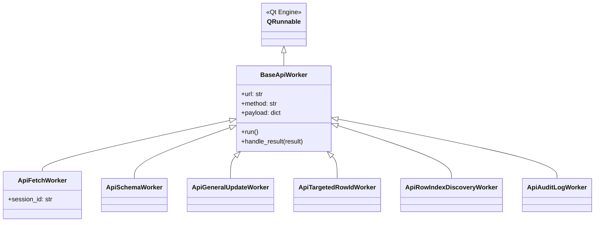
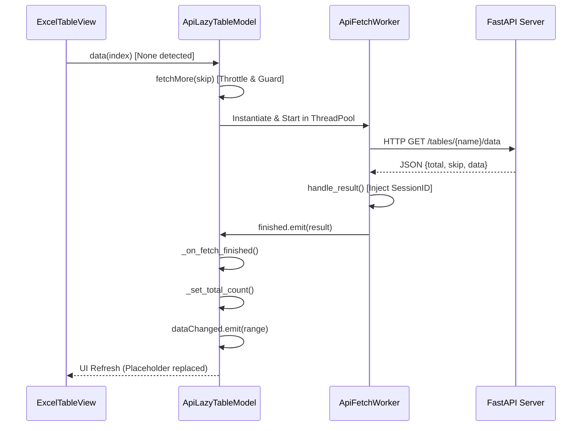

# 시스템 명세: 고성능 가상화 테이블 엔진 (Table Engine Specification)

이 문서는 `assyManager` 프로젝트의 핵심 뷰포트 관리 모델인 `ApiLazyTableModel`과 리팩토링된 비동기 백그라운드 워커 시스템의 아키텍처 및 동작 상세를 규정합니다.

---

## 1. 아키텍처 개요 (Architecture Overview)

`ApiLazyTableModel`은 수천만 건 이상의 대역폭을 메모리 부하 없이 처리하기 위해 **Adaptive Sparse Array** 및 **Base-Worker Inheritance** 패턴을 채택했습니다.

### 1.1 클래스 상속 구조 (Worker Hierarchy)
비동기 통신 로직의 무결성을 위해 모든 API 워커는 `BaseApiWorker`를 상속받아 추상화된 통신 로직을 공유합니다.



---

## 2. 데이터 페칭 시퀀스 (Signal & Flow)

데이터 요청부터 UI 반영까지의 연쇄 반응을 통해 비동기 무결성을 보장합니다.

### 2.1 연결 구조도 (Connection Diagram)



---

## 3. 핵심 코드 명세 (Core Logic Snippets)

### 3.1 공통 통신 엔진 (BaseApiWorker)
`urllib` 기반의 표준화된 비동기 요청을 수행하며, GUI 스레드와의 안전한 통신을 위해 `WorkerSignals`를 경유합니다.

```python
# [client/models/table_model.py]
class BaseApiWorker(QRunnable):
    def run(self):
        # ... 공통 Request 생성 로직
        with urllib.request.urlopen(req, timeout=10.0) as response:
            result = json.loads(response.read().decode("utf-8"))
            self.handle_result(result)
            
    def handle_result(self, result):
        # 결과를 시그널로 방출 (가비지 컬렉션 체크 포함)
        try: self.signals.finished.emit(result)
        except RuntimeError: pass
```

### 3.2 가변 청크 엔진 (Adaptive Chunking)
네트워크 응답 속도에 따라 로딩 단위를 동적으로 조절하여 병목을 자동 해소합니다.

```python
# [Adaptive Logic in ApiLazyTableModel]
duration = time.time() - self._fetch_start_time
if duration < 0.5: # 고속 구간
    self._chunk_size = min(3000, int(self._chunk_size * 1.1))
elif duration > 0.55: # 저속 구간
    self._chunk_size = max(50, int(self._chunk_size * 0.9))
```

---

## 4. 실시간 동기화 및 전파 (WS Dispatch)

서버의 상태 변화를 모든 활성 탭에 전파하고 히스토리 패널과의 트랜잭션 동기화를 수행합니다.

- **Broadcast Handler**: `MainWindow._dispatch_ws_message`에서 모든 `_active_models`에 이벤트를 전파.
- **Event Mapping**: 
    - `batch_row_create`: 데이터 삽입 및 `total_count` 갱신.
    - `batch_row_upsert`: 행/셀 변경 사항 통합 처리, 기존 데이터 수정 및 정렬 위치 재배치 (`beginMoveRows`).
    - `batch_row_delete`: 역순 인덱스 매핑을 통한 안전한 대량 행 삭제.

---
**Last Updated**: 2026-04-24 23:55 (After Refactoring)
**Maintainer**: Antigravity Lead PM
