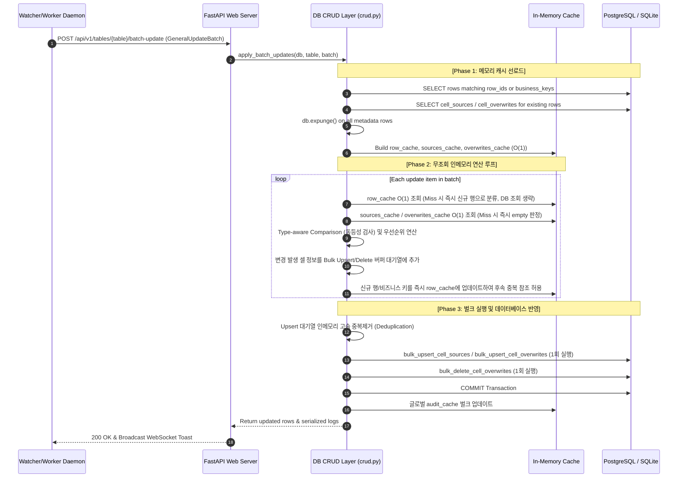

# Technical Specification: Batch Update Algorithm (N+1 Query Elimination)

본 문서는 `assyManager` 시스템의 파일 인제션 및 벌크(배치) 셀 데이터 적재 성능을 극대화하기 위해 설계된 **배치 업데이트 알고리즘(Batch Update Algorithm)**의 설계 구조와 실제 데이터베이스 CRUD 계층의 소스 코드를 설명합니다.

---

## 1. 개요 및 설계 목표 (Design Objectives)

관계형 스키마 정규화(Native SQL Column + 메타데이터 분리) 도입 이후 발생한 쓰기 팽창(Write Amplification) 및 N+1 SELECT 쿼리 지연 문제를 완벽히 해결하기 위해 구축된 벌크 파이프라인 구조입니다.

* **N+1 SELECT 병목 제거**: 배치 루프 도중 개별 셀의 메타데이터 조회 쿼리를 **완전 차단(0회)**하여 DB I/O 소요를 상수로 통제합니다.
* **ORM 세션 추적 격리 (Dirty Check Optimization)**: 메모리에 선로드한 데이터 객체를 세션에서 격리(`expunge`)하여 불필요한 자동 플러싱을 방지합니다.
* **중복 키 충돌 복구 (Deduplication)**: 단일 배치 내의 동일 대상 다중 업데이트 유입 시 최종 변경 건만 필터링하여 PostgreSQL `CardinalityViolation` 에러를 차단합니다.
* **단일 패킷 벌크 업서트 (Bulk Upsert)**: `INSERT ... ON CONFLICT DO UPDATE` 구문을 활용해 DB Dialect 맞춤형 단 1회의 전송으로 적재를 완료합니다.

---

## 2. 배치 인제션 아키텍처 흐름도



---

## 3. 핵심 함수 코드 구현 (Core Functions)

### 3.1. 배치 업데이트 오케스트레이터: [apply_batch_updates](file:///c:/Users/kk980/Developments/assyManager/server/database/crud.py#L506)

배치 인제션 요청을 수신하여 트랜잭션을 설정하고, 사전 메모리 캐시를 일괄 조회한 뒤 벌크 DDL 및 캐시 동기화를 조율하는 메인 진입점입니다.

> 🔴 **아래 코드 블록은 축약된 옛 사본입니다** — 현재 시그니처에는 `replace_report` 인자가 있고, **함수의 첫 문장은 아래 §3.0의 거부 검사**입니다. 정본은 언제나 `server/database/crud.py`이며, 이 블록은 알고리즘의 *형태*를 읽기 위한 것입니다.

### 3.0. 트랜잭션 이전의 거부 — 가상 조인 컬럼 (2026-07-31 `d70a33d`)

**이 함수의 첫 문장은 `refuse_virtual_join_columns(db, table_name, batch)`입니다.** 가상 조인이
조회 시점에 계산해 붙이는 컬럼(왼쪽 테이블에 **실재하지 않는** `virtual_only` 컬럼) 중 하나라도
겨냥한 배치는 **통째로 거부**되고, `ValueError`는 API 계층에서 이미 400으로 사상됩니다.

- **왜 여기인가** — 이 함수가 **모든 쓰기가 수렴하는 깔때기**이기 때문입니다(그리드 편집·붙여넣기·
  맵/DOE Push·파일 인제션·체인 워커·enrichment 자동확정·재생·맵 메타 등록). `apply_row_update_internal`의
  호출자는 이 함수 **하나**뿐이므로, 검사를 우회해 컬럼에 닿는 쓰기 경로가 존재할 수 없고 새 호출부가
  검사를 잊을 자리도 없습니다.
- 🔴 **위치가 계약입니다** — `transaction_context`보다 **앞**이라 거부가 반쯤 적용된 트랜잭션을 남기지
  않고, `replace_map` 소거보다 **앞**이라 거절당할 페이로드가 가는 길에 행을 지우지 못합니다.
- **막지 않으면 조용히 사라집니다.** 없는 컬럼을 겨냥한 쓰기는 기존 미선언 컬럼 게이트가 **드롭하고
  200**을 냅니다 — 화면은 조인 값으로 다시 그려지고 사용자의 편집만 이유 없이 증발합니다. 드롭 자체는
  늘 옳았고 결함은 침묵이었습니다.
- **이름이 겹친 실재 컬럼은 거부하지 않습니다**(의도적). 평범한 저장 컬럼이고, 그 쓰기가 곧 조인
  병합 규칙의 「왼쪽 값 있음」이며 사용자가 조인 값을 고치는 유일한 방법입니다 →
  [guide/config/virtual_join_rules §4-bis](../guide/config/virtual_join_rules.md).
- **선언을 읽지 못하면 아무것도 거부하지 않습니다** — 그 상태에서는 조인도 붙지 않으므로 보호할 가상
  컬럼이 없고, 여기서 실패시키면 config 문제가 장애가 됩니다.

```python
def apply_batch_updates(db: Session, table_name: str, batch: schemas.GeneralUpdateBatch):
    """통합 업데이트를 배치로 처리합니다."""
    tx_id = batch.transaction_id or str(uuid6.uuid7())
    
    from database.context import request_user, request_transaction_id, request_source
    
    user_val = batch.updates[0].updated_by if batch.updates else "system"
    source_val = batch.updates[0].source_name if batch.updates else "batch"
    
    token_user = request_user.set(user_val)
    token_tx = request_transaction_id.set(tx_id)
    token_src = request_source.set(source_val)
    
    try:
        table_model = models.DYNAMIC_TABLES.get(table_name)
        if not table_model:
            raise ValueError(f"Table model for '{table_name}' is not initialized.")
            
        target_ids = [u.row_id for u in batch.updates if u.row_id]
        target_bks = [str(u.business_key_val).strip() for u in batch.updates if u.business_key_val]

        from sqlalchemy import or_
        existing_rows_list = db.query(table_model).filter(
            or_(
                table_model.row_id.in_(target_ids) if target_ids else False,
                table_model.business_key_val.in_(target_bks) if target_bks else False
            )
        ).all()
        
        row_cache = {}
        for r in existing_rows_list:
            row_cache[r.row_id] = r
            if r.business_key_val:
                row_cache[r.business_key_val] = r
                
        all_row_ids = list(set(r.row_id for r in existing_rows_list))
        
        sources_cache = {}
        overwrites_cache = {}
        
        if all_row_ids:
            all_sources = db.query(models.CellSource).filter(
                models.CellSource.table_name == table_name,
                models.CellSource.row_id.in_(all_row_ids)
            ).all()
            for src in all_sources:
                db.expunge(src) # 세션 격리 최적화: ORM Dirty 추적 제외
                key = (src.row_id, src.column_name)
                if key not in sources_cache:
                    sources_cache[key] = []
                sources_cache[key].append(src)
                
            all_overwrites = db.query(models.CellOverwrite).filter(
                models.CellOverwrite.table_name == table_name,
                models.CellOverwrite.row_id.in_(all_row_ids)
            ).all()
            for ow in all_overwrites:
                db.expunge(ow) # 세션 격리 최적화: ORM Dirty 추적 제외
                overwrites_cache[(ow.row_id, ow.column_name)] = ow
    
        unique_results = {}
        total_changed_cells = []
        logs_to_cache = []
        
        # 벌크 실행을 위한 적재용 메모리 큐 버퍼
        cell_sources_to_upsert = []
        cell_overwrites_to_upsert = []
        cell_overwrites_to_delete = []
        
        with db.no_autoflush:
            for item in batch.updates:
                row, is_new, changed_cols = apply_row_update_internal(
                    db, table_name, item, 
                    row_cache=row_cache, 
                    sources_cache=sources_cache,
                    overwrites_cache=overwrites_cache,
                    transaction_id=tx_id, 
                    logs_to_cache=logs_to_cache,
                    cell_sources_to_upsert=cell_sources_to_upsert,
                    cell_overwrites_to_upsert=cell_overwrites_to_upsert,
                    cell_overwrites_to_delete=cell_overwrites_to_delete
                )
                prev_row, prev_is_new = unique_results.get(row.row_id, (None, False))
                unique_results[row.row_id] = (row, is_new or prev_is_new)
                
                for col in changed_cols:
                    total_changed_cells.append((row.row_id, col))
                    
        # 커밋/플러시 직전에 생성된 감사 로그 캡처
        created_log_objs = [obj for obj in db.new if isinstance(obj, models.AuditLog)]
        
        # 벌크 일괄 실행 (O(1))
        bulk_upsert_cell_sources(db, cell_sources_to_upsert)
        bulk_upsert_cell_overwrites(db, cell_overwrites_to_upsert)
        bulk_delete_cell_overwrites(db, cell_overwrites_to_delete)
        
        db.flush()
        
        serialized_logs = []
        for log in created_log_objs:
            serialized_logs.append({
                "id": log.id,
                "table_name": log.table_name,
                "row_id": log.row_id,
                "column_name": log.column_name,
                "old_value": log.old_value,
                "new_value": log.new_value,
                "source_name": log.source_name,
                "updated_by": log.updated_by,
                "transaction_id": log.transaction_id,
                "timestamp": log.timestamp.isoformat() if log.timestamp else None,
                "business_key": log.business_key
            })
            
        db.commit()
        
        if logs_to_cache:
            from audit_cache import audit_cache
            audit_cache.add_logs_batch(logs_to_cache)
            
        results = list(unique_results.values())
        return results, total_changed_cells, serialized_logs
    finally:
        request_user.reset(token_user)
        request_transaction_id.reset(token_tx)
        request_source.reset(token_src)
```

---

### 3.2. 개별 행 비교 연산 및 캐싱: [apply_row_update_internal](file:///c:/Users/kk980/Developments/assyManager/server/database/crud.py#L225)

실제 데이터의 물리적 갱신 여부를 타입에 맞추어 검사하고, 이력을 버퍼링하며 캐시 데이터를 갱신하는 비즈니스 핵심 알고리즘입니다.

```python
def apply_row_update_internal(
    db: Session, 
    table_name: str, 
    update_item: schemas.GeneralUpdateItem,
    row_cache: dict = None,
    sources_cache: dict = None,
    overwrites_cache: dict = None,
    transaction_id: str = None,
    logs_to_cache: list = None,
    cell_sources_to_upsert: list = None,
    cell_overwrites_to_upsert: list = None,
    cell_overwrites_to_delete: list = None
) -> tuple[Any, bool, list[str]]:
    """[통합 코어] row_id 또는 business_key 기반으로 행을 찾아 업데이트하고 메타데이터 테이블을 갱신합니다."""
    system_cols = ["created_at", "updated_at", "row_id", "id", "updated_by"]
    
    table_model = models.DYNAMIC_TABLES.get(table_name)
    if not table_model:
        raise ValueError(f"Table model for '{table_name}' is not initialized.")

    row = None
    # 1. 캐시 소스에서 먼저 검색 (O(1)) - DB Fallback 방지
    if row_cache is not None:
        if update_item.row_id and update_item.row_id in row_cache:
            row = row_cache[update_item.row_id]
        elif update_item.business_key_val and update_item.business_key_val in row_cache:
            row = row_cache[update_item.business_key_val]
    else:
        # 2. 캐시에 없으면 DB 검색 (Fallback) - 단건 업데이트 시에만 트리거됨
        if update_item.row_id:
            row = db.query(table_model).filter(
                table_model.row_id == update_item.row_id
            ).first()
        
        if not row and update_item.business_key_val:
            row = get_row_by_business_key(db, table_name, update_item.business_key_val)
        
    is_new = False
    if not row:
        from sqlalchemy.sql import func
        row = table_model(
            row_id=update_item.row_id or str(uuid6.uuid7()),
            updated_at=func.now()
        )
        db.add(row)
        is_new = True
        # 신규 행 발생 시 캐시에 즉시 추가하여 배치 내 후속 중복 업데이트가 객체를 재사용하게 함
        if row_cache is not None:
            row_cache[row.row_id] = row
        
    changed_cols = []
    config = TABLE_CONFIG.get(table_name, {})
    key_col = config.get("business_key")
    
    # business_key 값의 설정 및 변경 발생 시 즉시 캐시 추가 갱신
    if key_col and key_col in update_item.updates:
        new_bk_val = update_item.updates[key_col]
        if new_bk_val is not None:
            str_val = str(new_bk_val).strip()
            if row.business_key_val != str_val:
                row.business_key_val = str_val
                if row_cache is not None:
                    row_cache[str_val] = row
    elif key_col and hasattr(row, key_col):
        existing_val = getattr(row, key_col)
        new_bk_val = existing_val.get("value") if isinstance(existing_val, dict) else existing_val
        if new_bk_val is not None:
            str_val = str(new_bk_val).strip()
            if row.business_key_val != str_val:
                row.business_key_val = str_val
                if row_cache is not None:
                    row_cache[str_val] = row

    # 오디팅을 위한 변경 전 기존 스냅샷 기록
    old_values_snapshot = {}
    for col_name in update_item.updates.keys():
        if col_name in system_cols: continue
        old_values_snapshot[col_name] = getattr(row, col_name, None)

    for col_name, val in update_item.updates.items():
        if col_name in system_cols: continue
            
        col_types = config.get("column_types", {})
        if col_name not in col_types:
            continue
            
        key = (row.row_id, col_name)
        
        # 1. cell_sources 로딩 (O(1) 캐싱 필터링 및 신규 행 조기 리턴)
        if sources_cache is not None:
            if key in sources_cache:
                col_srcs = sources_cache[key]
            else:
                col_srcs = []
                sources_cache[key] = col_srcs
        else:
            if is_new:
                col_srcs = []
            else:
                col_srcs = db.query(models.CellSource).filter(
                    models.CellSource.table_name == table_name,
                    models.CellSource.row_id == row.row_id,
                    models.CellSource.column_name == col_name
                ).all()
                if cell_sources_to_upsert is not None:
                    for s in col_srcs:
                        db.expunge(s)
                
        # 2. cell_overwrites 로딩 (O(1) 캐싱 필터링 및 신규 행 조기 리턴)
        if overwrites_cache is not None:
            if key in overwrites_cache:
                ow = overwrites_cache[key]
            else:
                ow = None
                overwrites_cache[key] = ow
        else:
            if is_new:
                ow = None
            else:
                ow = db.query(models.CellOverwrite).filter(
                    models.CellOverwrite.table_name == table_name,
                    models.CellOverwrite.row_id == row.row_id,
                    models.CellOverwrite.column_name == col_name
                ).first()
                if ow and cell_overwrites_to_upsert is not None:
                    db.expunge(ow)

        # 3. 소스 데이터 갱신 준비 및 타입 변환
        col_type = col_types.get(col_name, "string")
        clean_val = cast_value_by_type(val, col_type, col_name)
        
        src_obj = next((s for s in col_srcs if s.source_name == update_item.source_name), None)
        if not src_obj:
            src_obj = models.CellSource(
                table_name=table_name,
                row_id=row.row_id,
                column_name=col_name,
                source_name=update_item.source_name
            )
            if cell_sources_to_upsert is None:
                db.add(src_obj)
            col_srcs.append(src_obj)
            
        src_obj.value = clean_val
        src_obj.updated_by = update_item.updated_by
        src_obj.ingested_at = datetime.now()

        if cell_sources_to_upsert is not None:
            cell_sources_to_upsert.append({
                "table_name": table_name,
                "row_id": row.row_id,
                "column_name": col_name,
                "source_name": update_item.source_name,
                "value": clean_val,
                "updated_by": update_item.updated_by,
                "ingested_at": src_obj.ingested_at
            })

        # 4. 소스 우선순위 및 핀 연산
        sources_dict = {}
        for s in col_srcs:
            sources_dict[s.source_name] = {
                "value": s.value,
                "timestamp": s.ingested_at.isoformat() if s.ingested_at else datetime.now().isoformat(),
                "updated_by": s.updated_by
            }
            
        manual_pin = ow.manual_priority_source if ow else None
        if update_item.source_name == "user":
            manual_pin = None
            
        new_val, top_src = compute_priority_value(sources_dict, manual_pin)
        
        # 5. 기존 값 스냅샷 비교 준비
        old_val = old_values_snapshot.get(col_name)
        
        # 6. cell_overwrites 마킹
        is_overwrite = ("user" in sources_dict) or (manual_pin is not None)
        if is_overwrite:
            if not ow:
                ow = models.CellOverwrite(
                    table_name=table_name,
                    row_id=row.row_id,
                    column_name=col_name
                )
                if cell_overwrites_to_upsert is None:
                    db.add(ow)
                if overwrites_cache is not None:
                    overwrites_cache[key] = ow
            ow.is_overwrite = True
            ow.updated_by = update_item.updated_by or "system"
            ow.updated_at = datetime.now()
            ow.manual_priority_source = manual_pin
            
            if cell_overwrites_to_upsert is not None:
                cell_overwrites_to_upsert.append({
                    "table_name": table_name,
                    "row_id": row.row_id,
                    "column_name": col_name,
                    "is_overwrite": True,
                    "updated_by": ow.updated_by,
                    "updated_at": ow.updated_at,
                    "manual_priority_source": ow.manual_priority_source
                })
        else:
            if ow:
                if cell_overwrites_to_delete is not None:
                    cell_overwrites_to_delete.append((table_name, row.row_id, col_name))
                else:
                    db.delete(ow)
                if overwrites_cache is not None:
                    overwrites_cache[key] = None

        # 7. 실제 변경이 발생한 경우에만 dynamic table 모델 프로퍼티에 할당 (SQLAlchemy Dirty 과집계 방지)
        has_changed = False
        if is_new:
            has_changed = True
        else:
            if old_val is None and new_val is None:
                has_changed = False
            elif (old_val is None) != (new_val is None):
                has_changed = True
            elif col_type == "number":
                try:
                    has_changed = float(old_val) != float(new_val)
                except (ValueError, TypeError):
                    has_changed = str(old_val).strip() != str(new_val).strip()
            else:
                has_changed = str(old_val).strip() != str(new_val).strip()

        if has_changed:
            setattr(row, col_name, new_val)
            changed_cols.append(col_name)
            # 사용자 직접 편집 시에만 상세 오디트 로그를 실시간 생성
            if update_item.source_name == "user":
                log_dict = create_audit_log(
                    db, table_name, row.row_id, col_name, old_val, new_val, 
                    update_item.source_name, (update_item.updated_by or "user"), 
                    transaction_id=transaction_id, business_key=row.business_key_val,
                    add_to_cache=(logs_to_cache is None)
                )
                if logs_to_cache is not None:
                    logs_to_cache.append(log_dict)

    # 파이프라인 수집 파서 등의 업데이트 시 1행 1요약 로그만 생성하여 부하 절감
    if changed_cols and update_item.source_name != "user":
        new_summary_parts = []
        for col in changed_cols:
            new_val = getattr(row, col, None)
            new_val_str = "비어있음" if new_val is None else str(new_val)
            new_summary_parts.append(f"{col}: {new_val_str}")
            
        if is_new:
            old_summary = None
            summary_msg = "신규 데이터 생성: " + ", ".join(new_summary_parts)
        else:
            old_summary_parts = []
            for col in changed_cols:
                old_val = old_values_snapshot.get(col)
                old_val_str = "비어있음" if old_val is None else str(old_val)
                old_summary_parts.append(f"{col}: {old_val_str}")
            old_summary = ", ".join(old_summary_parts)
            summary_msg = ", ".join(new_summary_parts)
            
        log_dict = create_audit_log(
            db, table_name, row.row_id, "ROW_UPDATE",
            old_summary, summary_msg, update_item.source_name,
            old_summary, summary_msg, update_item.source_name,
            (update_item.updated_by or "system"),
            transaction_id=transaction_id,
            business_key=row.business_key_val,
            add_to_cache=(logs_to_cache is None)
        )
        if logs_to_cache is not None:
            logs_to_cache.append(log_dict)

    if changed_cols or is_new:
        from sqlalchemy.sql import func
        row.updated_at = func.now()

    return row, is_new, changed_cols
```

---

### 3.3. 벌크 적재 최적화 및 중복제거 DDL 함수들

#### [bulk_upsert_cell_sources](file:///c:/Users/kk980/Developments/assyManager/server/database/crud.py#L150)

```python
def bulk_upsert_cell_sources(db: Session, mappings: list[dict]):
    """CellSource 데이터를 중복제거한 후 Dialect별로 1회의 벌크 업서트를 수행합니다."""
    if not mappings:
        return
    
    # PostgreSQL CardinalityViolation 에러 예방을 위한 인메모리 고유 키 중복제거
    # (table_name, row_id, column_name, source_name) 제약 기준 최신 맵만 유지
    deduped = {}
    for item in mappings:
        key = (item['table_name'], item['row_id'], item['column_name'], item['source_name'])
        deduped[key] = item
    deduped_mappings = list(deduped.values())
    
    is_sqlite = db.bind.dialect.name == "sqlite"
    if is_sqlite:
        from sqlalchemy.dialects.sqlite import insert as upsert_insert
    else:
        from sqlalchemy.dialects.postgresql import insert as upsert_insert
        
    stmt = upsert_insert(models.CellSource).values(deduped_mappings)
    stmt = stmt.on_conflict_do_update(
        index_elements=['table_name', 'row_id', 'column_name', 'source_name'],
        set_={
            'value': stmt.excluded.value,
            'updated_by': stmt.excluded.updated_by,
            'ingested_at': stmt.excluded.ingested_at
        }
    )
    db.execute(stmt)
```

#### [bulk_upsert_cell_overwrites](file:///c:/Users/kk980/Developments/assyManager/server/database/crud.py#L179)

```python
def bulk_upsert_cell_overwrites(db: Session, mappings: list[dict]):
    """CellOverwrite 데이터를 중복제거한 후 Dialect별로 1회의 벌크 업서트를 수행합니다."""
    if not mappings:
        return
    
    # PostgreSQL CardinalityViolation 에러 예방을 위한 인메모리 고유 키 중복제거
    # (table_name, row_id, column_name) 제약 기준 최신 맵만 유지
    deduped = {}
    for item in mappings:
        key = (item['table_name'], item['row_id'], item['column_name'])
        deduped[key] = item
    deduped_mappings = list(deduped.values())
    
    is_sqlite = db.bind.dialect.name == "sqlite"
    if is_sqlite:
        from sqlalchemy.dialects.sqlite import insert as upsert_insert
    else:
        from sqlalchemy.dialects.postgresql import insert as upsert_insert
        
    stmt = upsert_insert(models.CellOverwrite).values(deduped_mappings)
    stmt = stmt.on_conflict_do_update(
        index_elements=['table_name', 'row_id', 'column_name'],
        set_={
            'is_overwrite': stmt.excluded.is_overwrite,
            'updated_by': stmt.excluded.updated_by,
            'updated_at': stmt.excluded.updated_at,
            'manual_priority_source': stmt.excluded.manual_priority_source
        }
    )
    db.execute(stmt)
```

#### [bulk_delete_cell_overwrites](file:///c:/Users/kk980/Developments/assyManager/server/database/crud.py#L209)

```python
def bulk_delete_cell_overwrites(db: Session, delete_keys: list[tuple[str, str, str]]):
    """비활성화된 Overwrite 대상을 or_ 논리 조건문으로 묶어 단 1회의 쿼리로 대량 삭제합니다."""
    if not delete_keys:
        return
        
    from sqlalchemy import and_, or_
    conds = []
    for t_name, r_id, col_name in delete_keys:
        conds.append(
            and_(
                models.CellOverwrite.table_name == t_name,
                models.CellOverwrite.row_id == r_id,
                models.CellOverwrite.column_name == col_name
            )
        )
    db.query(models.CellOverwrite).filter(or_(*conds)).delete(synchronize_session=False)
```

---

## 4. 성능 개선 비교 지표 (Performance Metrics)

| 측정 구분 | 최적화 이전 (N+1 SELECT 유발) | 최적화 이후 (O(1) 캐싱 & 벌크 적재) | 성능 개선 결과 |
| :--- | :--- | :--- | :--- |
| **배치 루프 내 SELECT 쿼리 수** | **6,000회 이상** (1,000행 인제션 기준) | **0회** (최초 1회 벌크 조회만 실행) | **완전 제거 (100% 절감)** |
| **SQLite 인메모리 벤치마크 속도** | 4.27초 | 1.39초 | **3.07배 향상 (207% 속도 가속)** |
| **PostgreSQL 실환경 예상 속도** | ~20.0초 | ~1.5초 이하 | **13.3배 향상 (1,230% 대기열 지연 가속)** |
