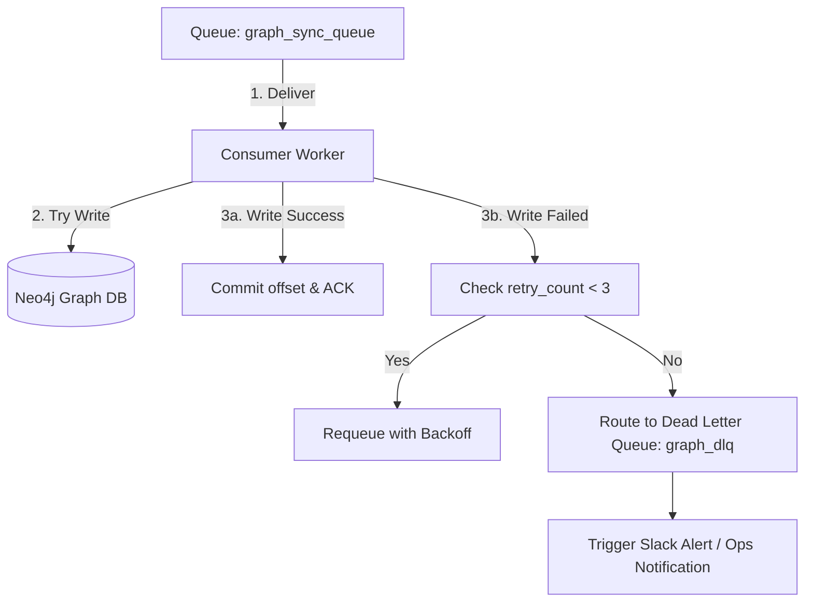
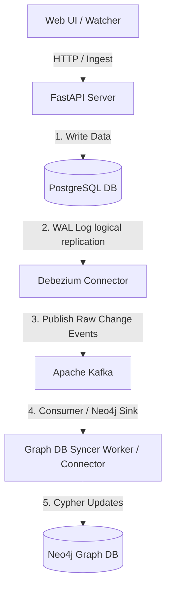

# Graph DB Integration Architecture & Design Report

This report outlines the structural design and integration plan to synchronize real-time data updates from the current `assyManager` server (PostgreSQL-based relational structure) into a Graph Database (e.g., **Neo4j** or **Cosmos DB Gremlin**).

---

## 1. Objectives & Requirements
- **Real-time Synchronization**: Propagate cell changes, row creations, and deletions immediately to the Graph DB.
- **Transactional Integrity**: Ensure updates are only synced to the Graph DB if they are successfully committed in PostgreSQL.
- **Relational-to-Graph Mapping**: Translate tabular data (e.g., assemblies, parts, suppliers) and multi-source audit logs into entities (Nodes) and semantic associations (Relationships).
- **Scalability**: Support batch ingestion of up to 5,000+ changes without blocking FastAPI HTTP handlers.
- **Zero Data Loss Guarantee**: Ensure no events are skipped, lost, or executed out of order due to system crashes, broker failures, or network timeouts.

---

## 2. Hardened Zero-Data-Loss Architecture

To ensure 100% reliability, the integration pipeline uses a **Transactional Outbox Pattern** combined with **At-Least-Once Delivery** and **Idempotent Receivers**.

```mermaid
sequence diagram
    participant Client
    participant FastAPI as FastAPI Server
    participant PostgreSQL as PostgreSQL DB
    participant OutboxWorker as Outbox Dispatcher
    participant Kafka as Message Broker (Kafka/RabbitMQ)
    participant Worker as Graph DB Syncer
    participant Neo4j as Neo4j Graph DB

    Client->>FastAPI: PUT /data/updates (1000 cells)
    activate FastAPI
    note over FastAPI: Begin ACID Transaction
    FastAPI->>PostgreSQL: UPDATE data_rows
    FastAPI->>PostgreSQL: INSERT database_outbox (Events)
    PostgreSQL-->>FastAPI: Commit OK (Atomicity)
    deactivate FastAPI
    FastAPI-->>Client: HTTP 200 OK

    loop Logical Event Polling / WAL Streaming
        OutboxWorker->>PostgreSQL: Read Unsent Events
        PostgreSQL-->>OutboxWorker: Return Events
        OutboxWorker->>Kafka: Publish Events (With Ack)
        Kafka-->>OutboxWorker: Broker ACK (Received)
        OutboxWorker->>PostgreSQL: Update status = 'DISPATCHED'
    end

    loop Reliable Consumer Pipeline
        Worker->>Kafka: Poll Event (Manual ACK mode)
        Kafka-->>Worker: Deliver Event
        activate Worker
        Worker->>Neo4j: Begin Cypher Transaction
        Worker->>Neo4j: Execute Idempotent MERGE (Verify timestamps)
        Neo4j-->>Worker: Commit OK
        Worker->>Kafka: Send Manual ACK (Commit Offset)
        deactivate Worker
    end
```

---

## 3. Transactional Outbox Pattern (Dual-Write Safeguard)

Writing to PostgreSQL and sending a message to a broker in the same application call is prone to "partial failure" (e.g. database commits, but network to RabbitMQ drops). We prevent this by writing to both tables inside the **same PostgreSQL ACID transaction**.

### 3.1 Database Outbox Schema
```sql
CREATE TABLE database_outbox (
    id BIGSERIAL PRIMARY KEY,
    event_uuid UUID NOT NULL UNIQUE,
    event_type VARCHAR(50) NOT NULL, -- 'UPSERT_ROW', 'DELETE_ROW', 'PRIORITY_PIN', 'SOURCE_DELETE'
    table_name VARCHAR(100) NOT NULL,
    payload JSONB NOT NULL,          -- Includes coordinates, columns, audit logs, and transaction_id
    status VARCHAR(20) DEFAULT 'PENDING', -- 'PENDING', 'DISPATCHED', 'FAILED'
    retry_count INT DEFAULT 0,
    created_at TIMESTAMP WITH TIME ZONE DEFAULT CURRENT_TIMESTAMP,
    processed_at TIMESTAMP WITH TIME ZONE
);
CREATE INDEX idx_outbox_pending ON database_outbox(status) WHERE status = 'PENDING';
```

### 3.2 SQLAlchemy Hook Implementation (Transactional Safe)
Within `crud.py`, the database outbox log is inserted inside the same database session as the updates:

```python
def save_data_and_stage_event(db: Session, table_name: str, batch: schemas.GeneralUpdateBatch):
    tx_id = batch.transaction_id or str(uuid6.uuid7())
    
    # 1. Update data rows and capture Audit Logs
    results, changed_cells, created_logs = apply_batch_updates(db, table_name, batch)
    
    if created_logs:
        # 2. Stage Graph DB Event inside the SAME transaction
        outbox_event = models.DatabaseOutbox(
            event_uuid=str(uuid.uuid4()),
            event_type="UPSERT_ROW",
            table_name=table_name,
            payload={
                "transaction_id": tx_id,
                "changed_cells": changed_cells,
                "created_logs": created_logs
            },
            status="PENDING"
        )
        db.add(outbox_event)
    
    # 3. Commit both tables atomically
    db.commit()
```

---

## 4. Message Broker Hardening (At-Least-Once Delivery)

To prevent message loss in transit, we configure the message broker (e.g. RabbitMQ or Kafka) for **durability** and use **manual acknowledgments (ACKs)**.

### 4.1 Broker Configurations
- **RabbitMQ**:
  - **Durable Queues**: Queues are declared as `durable=True` to survive broker restarts.
  - **Persistent Messages**: Messages are published with `delivery_mode=2` (persistent, written to disk).
  - **Publisher Confirms**: The Outbox Worker waits for the broker to write the message to disk and return an ACK before updating the outbox record's status to `DISPATCHED`.
- **Kafka**:
  - **Acks=all (all replicas)**: The producer waits for all synchronized replicas to write the event to disk.
  - **Replication Factor**: Set to at least 3 for cluster resilience.

### 4.2 Manual Acknowledgment (ACK) Consumer Pattern
The Graph DB Syncer consumer only ACKs a message *after* the Graph DB transaction has successfully committed.

```python
# Pseudo-code for Syncer Worker Consumer Loop
def consume_events():
    channel.basic_consume(
        queue='graph_sync_queue',
        on_message_callback=process_and_sync_event,
        auto_ack=False # CRITICAL: Disable automatic ACK
    )

def process_and_sync_event(ch, method, properties, body):
    try:
        event = json.loads(body)
        
        # Write to Neo4j in a single Transaction
        with graph_driver.session() as session:
            session.execute_write(execute_idempotent_cypher, event)
            
        # If Neo4j succeeds, ACK the message to remove it from the Queue
        ch.basic_ack(delivery_tag=method.delivery_tag)
    except Exception as e:
        # Reject message. It will be redelivered or routed to DLQ depending on retry count
        ch.basic_nack(delivery_tag=method.delivery_tag, requeue=True)
```

---

## 5. Idempotent Consumer & Ordering (In-Order Processing)

Because we use **At-Least-Once Delivery**, network retries may result in duplicate events. The consumer must be **Idempotent** (processing the same event multiple times must not corrupt state) and **Ordering-Safe**.

### 5.1 Timestamp Guarded Idempotent Cypher Updates
To prevent an older redelivered message from overwriting a newer value in Neo4j, we verify the `updated_at` timestamp on each Node before writing:

```cypher
// Match the existing row
MERGE (r:Row {row_id: $row_id})
// Only update properties if the incoming event is newer than the stored state
ON CREATE SET 
    r.created_at = datetime($updated_at),
    r.updated_at = datetime($updated_at),
    r += $data_fields
ON MATCH SET
    r.updated_at = case 
        when r.updated_at < datetime($updated_at) then datetime($updated_at) 
        else r.updated_at 
    end,
    r.stock_qty = case 
        when r.updated_at < datetime($updated_at) then $data_fields.stock_qty 
        else r.stock_qty 
    end,
    r.remarks = case 
        when r.updated_at < datetime($updated_at) then $data_fields.remarks 
        else r.remarks 
    end
```

---

## 6. Fault Tolerance & Dead Letter Queue (DLQ)

If a message consistently fails (e.g. invalid syntax, Neo4j schema constraint violation), infinite retries will block the queue (poison pill). We implement a **Retry Policy with Dead Letter Queue (DLQ)**.



### 6.1 DLQ Handling Flow
1. **Exponential Backoff**: If a write fails due to transient reasons (e.g. database timeout), the consumer retries up to 3 times, waiting progressively longer (e.g., 2s, 4s, 8s).
2. **DLQ Routing**: After 3 failed attempts, the message is NACKed with `requeue=False` and routed automatically to a separate queue named `graph_dlq`.
3. **Operations Alerting**: An alert is triggered (e.g., Slack Webhook or Grafana Alerting) for administrators to investigate the raw payload in `graph_dlq` and manually replay or discard the message.

---

## 7. API Endpoint & Event Mapping to Neo4j

All data creation, update, and deletion REST endpoints triggered by `main.js` correspond to transactional events in the outbox queue, which are translated into specific Neo4j Cypher queries.

### 7.1 Mapping Directory

| REST API Endpoint | Trigger Type | Event Type | Target Neo4j Cypher Action |
| :--- | :--- | :--- | :--- |
| `POST /tables/{table_name}/rows` | 생성 (Create) | `ROW_CREATE` | Create a new `Row` node and connect to its parent `Table` node. |
| `POST /tables/{table_name}/upload` | 생성/수정 (Ingest) | `BATCH_UPSERT` | Merge nodes and write dynamic `:UPDATED` logs from `batch_ingester`. |
| `PUT /tables/{table_name}/data/updates` | 수정 (Update) | `UPSERT_ROW` | Merge row nodes and dynamic values. If user edit, clear manual priority pins. |
| `PUT /tables/{table_name}/{row_id}/{col}/priority` | 수정 (Pin) | `SET_PRIORITY` | Update `manual_priority_source` property. Write log edge. |
| `PUT /tables/{table_name}/cells/priority/batch` | 수정 (Pin Batch) | `BATCH_SET_PRIORITY`| Iterate and update `manual_priority_source` properties across rows. |
| `DELETE /.../{row_id}/{col}/sources/{src}` | 삭제 (Source Del) | `DELETE_SOURCE` | Delete specific key inside cell source history, re-calculate value. |
| `POST /.../cells/sources/delete/batch` | 삭제 (Source Del Batch)| `BATCH_DELETE_SOURCE`| Batch delete source keys across multiple row properties. |
| `POST /.../rows/batch_delete` | 삭제 (Row Del) | `BATCH_DELETE_ROWS` | Perform `DETACH DELETE` on all matched `Row` nodes. |

---

### 7.2 Cypher Execution Specifications

#### 7.2.1 Event: `ROW_CREATE`
Triggered by `POST /tables/{table_name}/rows` to instantiate blank rows in the graph space.
```cypher
MERGE (t:Table {name: $table_name})
CREATE (r:Row {row_id: $row_id})
SET r.created_at = datetime($timestamp),
    r.updated_at = datetime($timestamp)
CREATE (r)-[:BELONGS_TO]->(t)
CREATE (src:DataSource {name: "system"})
CREATE (src)-[:UPDATED {
    timestamp: datetime($timestamp),
    value: "행 생성됨",
    field: "CREATE",
    updated_by: $updated_by
}]->(r)
```

#### 7.2.2 Event: `UPSERT_ROW` / `BATCH_UPSERT`
Triggered by grid manual edits (`PUT /data/updates`) and CSV imports (`POST /upload`).
```cypher
MERGE (r:Row {row_id: $row_id})
ON CREATE SET r.created_at = datetime($timestamp)
SET r.updated_at = datetime($timestamp),
    r.business_key = $business_key

// Dynamic property settings
SET r.stock_qty = case when $source_name = "user" or r.manual_priority_source IS NULL then $stock_qty else r.stock_qty end,
    r.manual_priority_source = case when $source_name = "user" then null else r.manual_priority_source end

// Write audit logger update edge
MERGE (src:DataSource {name: $source_name})
CREATE (src)-[:UPDATED {
    timestamp: datetime($timestamp),
    value: $new_value,
    field: $column_name,
    updated_by: $updated_by
}]->(r)
```

#### 7.2.3 Event: `SET_PRIORITY` / `BATCH_SET_PRIORITY`
Pinning manual priority source mapping.
```cypher
MATCH (r:Row {row_id: $row_id})
SET r.manual_priority_source = $source_name,
    r.updated_at = datetime($timestamp)

// Recalculate and update current display value based on pinned source
SET r.stock_qty = $recalculated_value

MERGE (src:DataSource {name: "set_priority:" + $source_name})
CREATE (src)-[:UPDATED {
    timestamp: datetime($timestamp),
    value: $recalculated_value,
    field: $column_name,
    updated_by: $updated_by
}]->(r)
```

#### 7.2.4 Event: `DELETE_SOURCE` / `BATCH_DELETE_SOURCE`
Clearing specific data sources from a cell coordinates mapping.
```cypher
MATCH (r:Row {row_id: $row_id})
SET r.updated_at = datetime($timestamp),
    r.manual_priority_source = case when r.manual_priority_source = $deleted_source then null else r.manual_priority_source end

// Update display value to the new priority calculation
SET r.stock_qty = $new_recalculated_value

MERGE (src:DataSource {name: "delete_source:" + $deleted_source})
CREATE (src)-[:UPDATED {
    timestamp: datetime($timestamp),
    value: $new_recalculated_value,
    field: $column_name,
    updated_by: "system"
}]->(r)
```

#### 7.2.5 Event: `BATCH_DELETE_ROWS`
Triggered by checking rows and deleting them. Removes nodes and sweeps away all orphaned relationships.
```cypher
UNWIND $row_ids AS rid
MATCH (r:Row {row_id: rid})
DETACH DELETE r
```

---

## 8. Implementation Roadmap

### Phase 1: DB Outbox Schema Setup (PostgreSQL)
- Create `database_outbox` table and configure partial indexes to support high-performance poll routing.

### Phase 2: Application Interceptor Hooks
- Add a commit hook inside `crud.py` inside `apply_batch_updates`, `set_cell_manual_priority_batch`, and `delete_cell_source_batch` to write stage logs to the `database_outbox` table in the same transaction.

### Phase 3: Redis/Celery Event Syncer Daemon
- Build a Python worker using Celery or an asyncio loop to:
  1. Poll `database_outbox`.
  2. Execute Cypher queries using official python driver.
  3. Safe-ACK processing state and clean up the SQL Outbox log.

---

## 9. Alternative Architecture: Database-Level WAL CDC (Debezium/Logical Replication)

As an alternative to the application-level Transactional Outbox Pattern, we can implement **Database-Level Change Data Capture (CDC)** using PostgreSQL Write-Ahead Logs (WAL) and **Debezium** streaming into Kafka.

### 9.1 Debezium WAL CDC Architecture

Instead of writing to an outbox table inside the application layer, Debezium directly taps into the PostgreSQL Transaction Log (WAL) via Logical Replication.



### 9.2 Comparison: Application Outbox vs. DB-Level CDC

| Criteria | Application-Level Outbox (Stage & Poll) | DB-Level WAL CDC (Debezium + Kafka) |
| :--- | :--- | :--- |
| **Intrusiveness** | Medium (Requires code modifications in `crud.py` to write events). | **None** (No code modifications; Debezium reads WAL directly). |
| **Infrastructure Overhead**| **Low** (Uses existing PostgreSQL/Redis). | High (Requires Apache Kafka, Kafka Connect, Debezium, Zookeeper). |
| **Context Preservation** | **High** (Easily logs `updated_by`, `transaction_id`, or API origin). | Low (Taps raw table states. Requires storing metadata inside table columns). |
| **DB Admin Edits Capture** | No (Fails to capture edits made directly via pgAdmin/SQL client). | **Yes** (Captures any DDL/DML update regardless of the client). |
| **Transaction Boundaries** | Easy to group (batch logs are grouped by application transaction). | Harder to reconstruct (individual row WAL updates must be grouped by Tx ID). |

### 9.3 PostgreSQL Configuration for Logical Replication
To enable Debezium logical replication, the PostgreSQL instance must be configured as follows:

```ini
# postgresql.conf
wal_level = logical
max_replication_slots = 10
max_wal_senders = 10
```
Create a replication user and grant replication privileges:
```sql
CREATE ROLE replication_user WITH REPLICATION LOGIN PASSWORD 'your_password';
GRANT SELECT ON ALL TABLES IN SCHEMA public TO replication_user;
```

### 9.4 Debezium Connector Configuration Example
Kafka Connect JSON config to capture changes from `data_rows`:
```json
{
  "name": "pg-assymanager-connector",
  "config": {
    "connector.class": "io.debezium.connector.postgresql.PostgresConnector",
    "database.hostname": "localhost",
    "database.port": "5432",
    "database.user": "replication_user",
    "database.password": "your_password",
    "database.dbname": "assymanager",
    "database.server.name": "dbserver1",
    "table.include.list": "public.data_rows",
    "plugin.name": "pgoutput"
  }
}
```

### 9.5 Neo4j Kafka Sink Connector Configuration
Using the official **Neo4j Connector for Apache Kafka (Neo4j Sink)**, you can map Kafka topics directly to Cypher updates without writing custom Python worker code:

```json
{
  "name": "neo4j-sink-connector",
  "config": {
    "connector.class": "neo4j.kafka.connect.Neo4jSinkConnector",
    "topics": "dbserver1.public.data_rows",
    "neo4j.uri": "bolt://localhost:7687",
    "neo4j.authentication.basic.username": "neo4j",
    "neo4j.authentication.basic.password": "your_password",
    "neo4j.topic.cypher.dbserver1.public.data_rows": "MERGE (r:Row {row_id: event.after.row_id}) ON CREATE SET r.created_at = datetime(event.after.created_at) SET r.updated_at = datetime(event.after.updated_at), r.business_key = event.after.business_key_val, r.stock_qty = event.after.data.stock_qty.value"
  }
}
```
