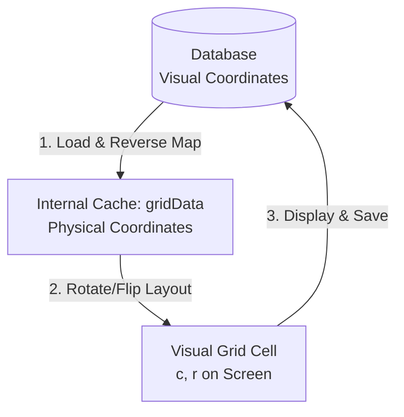

# wafer_map_philosophy.md - 격자 맵 에디터 좌표계 설계 철학 (Wafer Map Coordinate System Philosophy)

본 문서는 `assyManager` 프로젝트에 구축된 격자 맵 에디터(Grid Map Editor)의 **물리적 공간 표현(Physical Layout)**과 **화면 기준 좌표 매핑(Screen Visual Coordinates)** 설계 철학을 기록합니다. 

이 설계 방식은 웨이퍼 기판의 공간적 방향성과 공정 도메인 상의 데이터 관리 기준을 조화롭게 일치시키기 위해 고안되었습니다.

---

## 1. 핵심 철학 (Core Principles)

### 1) 눈에 보이는 대로 저장한다 (WYSIWYG: What You See Is What You Get)
* **원칙**: 회전 상태(0°, 90°, 180°, 270°) 및 앞/뒷면(FRONT, BACK) 상태에 관계없이, 사용자가 모니터 화면에서 보고 있는 격자 눈금의 X, Y 좌표는 **항상 화면 기준 좌표계**로 저장 및 기입됩니다.
* **이유**:
  * 설비 분석자 및 에디터 사용자는 물리적인 칩 내부의 기하학적 각도 회전과 별개로, **현재 눈에 보이는 좌표(예: 화면상의 좌상단이 0,0인지 아닌지)**를 보고 의사결정을 합니다.
  * 회전각 변경 시 X 좌표가 역방향으로 진행되거나 거꾸로 저장된다면, 사용자가 화면 눈금을 보고 인지한 값과 데이터베이스에 들어간 실제 값 사이에 불일치가 생겨 공정 사고(Wrong Coordinates)를 초래할 수 있습니다.
  * 따라서 화면 상에서 **가로는 항상 왼쪽에서 오른쪽으로 증가**하고, **세로는 위에서 아래(Y반전 시 아래에서 위)로 증가**하는 화면 직교 좌표계를 엄격하게 준수합니다.

### 2) 기판의 물리적 정렬 상태(Physical Alignment)는 유지되어 회전한다
* **원칙**: 맵을 90도 회전하거나 뒷면(BACK)으로 뒤집으면, 그려진 칩들의 상대적 배치 형태(Layout)는 3차원 기판의 공간적 변화 법칙에 따라 완벽하게 화면 상에서 회전 및 좌우/상하 대칭 미러링됩니다.
* **이유**:
  * Notch(노치)의 위치가 바뀔 때, 또는 웨이퍼를 뒤집었을 때 칩들의 형태적 분포(Pattern)도 당연히 그 각도만큼 따라서 회전해야 직관적인 기판 형상 분석이 가능합니다.
  * 만약 맵 회전 버튼을 눌렀는데 노치 아이콘만 움직이고 칩들의 패턴이 회전하지 않는다면 그것은 회전 맵이 아닙니다.

---

## 2. 좌표 관리의 이원화 구조 (Dual Coordinate Mapping)

위 두 가지 상충되는 듯한 요구사항(보이는 대로 저장하는 시각 좌표 vs 실제 형상이 회전하는 물리 좌표)을 완벽하게 만족시키기 위해 **이원화된 좌표 매핑 구조**를 도입했습니다.

### 1) 물리 좌표계 (Physical Coordinates)
* **정의**: 기판(Wafer)의 물리적 기준면에 고정된 절대 좌표계입니다. (Rotation 0, Side FRONT 상태의 좌표와 1:1 대응)
* **용도**: 자바스크립트 내부 캐시인 `gridData`의 Key(`"${xp}_${yp}"`)로 활용됩니다.
* **변환 함수**: `getPhysicalCoords(c, r, cols, rows, rotation, side)`
  * 화면 상의 셀 인덱스 `(c, r)`를 현재 회전각과 앞뒷면 상태를 반영하여 Wafer 기준의 고정 물리 위치 `(xp, yp)`로 변환합니다.
  * 이로 인해 `currentRotation` 등이 변경되어 캔버스가 다시 그려질 때(`renderGridCanvas`), 각 셀이 캔버스의 다른 위치(`c_new, r_new`)로 움직이더라도 고유한 물리 데이터 키를 그대로 들고 이동하므로 **화면상에서 칩 패턴이 자연스럽게 회전**하게 됩니다.

### 2) 시각 좌표계 (Visual Coordinates)
* **정의**: 브라우저 화면의 뷰포트에 완전히 고정된 직교 좌표계입니다.
* **용도**: 셀 내부의 텍스트 라벨 표시, 마우스 호버 가이드 문자열 표시, 그리고 **최종 데이터베이스 적재 페이로드**의 X, Y 좌표로 기입됩니다.
* **변환 함수**: `getVisualCoords(c, r, cols, rows, rotation, side, invertY, startX, startY)`
  * 기판의 회전과 뒤집힘으로 인해 발생하는 CSS 2D 반사(`flipped`, `flipped-vertical`)를 수학적으로 역계산하여, **화면 상에 비춰지는 순수한 공간적 컬럼/로우 위치**로 보정합니다.
  * 따라서 BACK(뒷면)이나 90°/270° 상태여도, 화면 기준의 X 좌표는 항상 왼쪽에서 오른쪽으로 1씩 단조 증가하고 Y 좌표 역시 반전 방향에 맞추어 완벽하게 눈에 보이는 대로 갱신됩니다.

---

## 3. 공정 데이터 통합성 (Data Integrity)

* **메타데이터 동기화 (`grid_metadata`)**:
  * 맵을 저장할 때, 각 데이터 행에는 저장 당시의 격자 설정 스냅샷(`grid_cols`, `grid_rows`, `grid_start_x`, `grid_start_y`, `grid_y_invert`, `rotation`, `side`)이 JSON 컬럼인 `grid_metadata` 형태로 함께 영속화됩니다.
* **무결한 복원 (Inverse Restore)**:
  * 저장된 데이터를 다시 로드할 때, 우선적으로 `grid_metadata`를 읽어 캔버스의 형상과 회전 슬롯을 세팅합니다.
  * 그리고 데이터베이스에 시각 좌표로 기록되어 있던 `(x, y)` 값들을 저장 당시의 회전/반전 메타데이터를 역으로 적용하여 **물리 좌표 `(xp, yp)`로 디코딩**한 뒤 `gridData`에 안전하게 배치합니다.
  * 이 방식 덕분에 맵이 어떤 각도로 저장되었더라도, 로드되는 순간 기판의 오리지널 물리 형상과 화면의 시각 눈금이 언제나 조화롭게 동기화되어 깨끗한 화면을 보증합니다.
